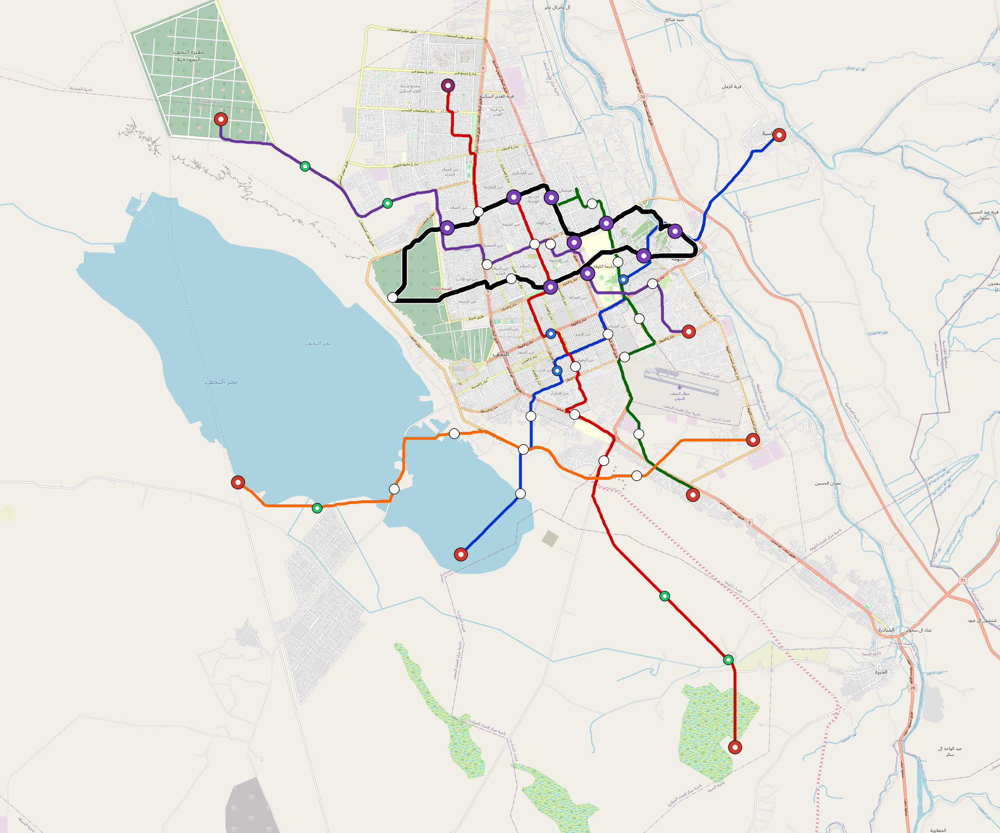

# Najaf — Urban Rail Network

**Country:** IQ · **Population:** 1,540,000 · [National brief](../NATIONAL-BRIEF.md)

This page contains only Najaf-specific results. Shared routing, service, energy, civil, cost, finance, QA and validation methods are defined once in the [deployment planning reference](../../../../../docs/deployment-planning-reference.md).

> [!IMPORTANT]
> **Foreign-capital advantage:** against the default equivalent foreign-turnkey sensitivity, this local plan avoids **$2.38 bn (87.1%) of external capital** and **$2.93 bn of external interest**. Capital plus saved interest totals **$5.31 bn**. See the common reference for interpretation and limitations.

Auto-planned by the OpenSourceRail design pipeline from the controlled city catalogue, source-locked geospatial inputs and shared templates.

## Network



| Local measure | Value |
|---|---:|
| Lines / unique stations / interchanges | 6 / 59 / 9 |
| Route length | 165.1 km double track |
| Coverage / transfer reachability | 52.0% / 27% |
| Estimated station catchment | 800,800 residents |
| Service span / peak headway | 05:30–02:00 / 3 min |
| Fleet | 229 × 4-car `metro-4car` trainsets (205 peak revenue) |
| Peak network throughput | 115,200 passengers/hour |
| Practical service capacity | 982,080 passenger-trips/day |
| Annual paid-trip planning range | 179.2–286.8 M |

### Lines

| Line | Length | Stations | Trainsets | Termini |
|---|---:|---:|---:|---|
| line-1 | 26.0 km | 10 | 42 | SW Mid ↔ NE Mid |
| line-2 | 36.7 km | 12 | 58 | SE Outer ↔ NW Mid |
| line-3 | 18.5 km | 8 | 32 | N Inner ↔ SE Mid |
| line-4 | 28.0 km | 10 | 46 | E Inner ↔ NW Outer |
| line-5 | 24.4 km | 7 | 37 | SW Outer ↔ SE Mid |
| line-6 | 31.5 km | 12 | 14 | W Mid ↔ NW Inner |
| **Total** | **165.1 km** | **59 unique** | **229** | |

## Energy

| Local measure | Value |
|---|---:|
| Scheduled service | 2,558 one-way journeys / 69,469 train-km/day |
| Annual traction demand | 438.2 GWh |
| Station/depot PV / storage | 20.9 MW / 119.5 MWh |
| Aggregate charging power | 81.0 MW |
| Dedicated solar plant | 206.0 MW |
| Residual grid/PPA import | 0.0 GWh/yr |
| Worst powered-stop gap | line-2: 13.6 km / 146 kWh |
| Lowest traversal charging margin | line-5: 103 kWh |

## Capital And Funding

| Local CAPEX bucket | Planning value |
|---|---:|
| Civil works | $632 M |
| Stations | $345 M |
| Depots | $8.0 M |
| Rolling stock | $256 M |
| Dedicated solar plant | $165 M |
| Residual train control | $8.3 M |
| Charging microgrids | $18 M |
| EPC / project services | $89 M |
| **Total city programme** | **$1.52 bn** |

| Local funding measure | Planning value |
|---|---:|
| Imported / external capital | $354 M (23.3%) |
| Domestic / local capital | $1.17 bn (76.7%) |
| Annual public construction commitment | $142 M / yr for 5 years |
| Annual post-grace debt service | $104 M / yr |
| External capital saved vs default turnkey sensitivity | $2.38 bn |
| Capital + lifetime external interest saved | $5.31 bn |
| Annual OPEX | $38 M / yr |

## Local Evidence

| Package | Current status | Evidence |
|---|---|---|
| Finance | pass | [`summary.json`](engineering/finance/summary.json) |
| Native simulation + degraded cases | pass | [`validation-summary.json`](engineering/simulation/validation-summary.json) |
| SUMO timetable | pass | [`summary.json`](engineering/sumo/summary.json) |
| GIS package | pass | [`summary.json`](engineering/gis/summary.json) |
| Grid/charging/solar | pass | [`summary.json`](engineering/energy/summary.json) |
| Operations, QA and maintenance | 564 assets / 2,498 tasks | [`najaf-operations-manifest.json`](operations/najaf-operations-manifest.json) |

## Local Files And Regeneration

| File | Local role |
|---|---|
| [`design.toml`](design.toml) | Authoritative generated city design |
| [`najaf.toml`](najaf.toml) | Expanded simulator scenario |
| [`najaf.corridor.geojson`](najaf.corridor.geojson) | GIS corridor and stations |
| [`najaf.design-quality.yaml`](najaf.design-quality.yaml) | Coverage, source and civil-quality gates |

```bash
tools/automation/regenerate-city.sh najaf
```
