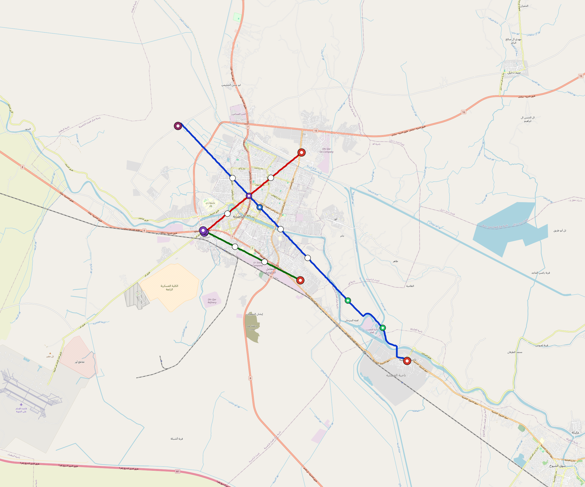

# Nasiriyah — Urban Rail Network

**Country:** IQ · **Population:** 705,000 · [National brief](../NATIONAL-BRIEF.md)

This page contains only Nasiriyah-specific results. Shared routing, service, energy, civil, cost, finance, QA and validation methods are defined once in the [deployment planning reference](../../../../../docs/deployment-planning-reference.md).

> [!IMPORTANT]
> **Foreign-capital advantage:** against the default equivalent foreign-turnkey sensitivity, this local plan avoids **$844 M (87.0%) of external capital** and **$1.04 bn of external interest**. Capital plus saved interest totals **$1.88 bn**. See the common reference for interpretation and limitations.

Auto-planned by the OpenSourceRail design pipeline from the controlled city catalogue, source-locked geospatial inputs and shared templates.

## Network



| Local measure | Value |
|---|---:|
| Lines / unique stations / interchanges | 3 / 20 / 3 |
| Route length | 51.1 km double track |
| Coverage / transfer reachability | 58.9% / 67% |
| Estimated station catchment | 415,245 residents |
| Service span / peak headway | 05:30–02:00 / 3 min |
| Fleet | 147 × 3-car `light-metro-3car` trainsets (132 peak revenue) |
| Peak network throughput | 43,200 passengers/hour |
| Practical service capacity | 401,760 passenger-trips/day |
| Annual paid-trip planning range | 73.3–117.3 M |

### Lines

| Line | Length | Stations | Trainsets | Termini |
|---|---:|---:|---:|---|
| line-1 | 29.2 km | 9 | 82 | SE Outer ↔ NW Outer |
| line-2 | 14.0 km | 7 | 41 | N Mid ↔ W Mid |
| line-3 |  7.9 km | 4 | 24 | SE Inner ↔ W Mid |
| **Total** | **51.1 km** | **20 unique** | **147** | |

## Energy

| Local measure | Value |
|---|---:|
| Scheduled service | 1,395 one-way journeys / 23,770 train-km/day |
| Annual traction demand | 112.4 GWh |
| Station/depot PV / storage | 10.1 MW / 48.5 MWh |
| Aggregate charging power | 9.0 MW |
| Dedicated solar plant | 47.4 MW |
| Residual grid/PPA import | 0.0 GWh/yr |
| Worst powered-stop gap | line-1: 13.2 km / 106 kWh |
| Lowest traversal charging margin | line-3: 28 kWh |

## Capital And Funding

| Local CAPEX bucket | Planning value |
|---|---:|
| Civil works | $226 M |
| Stations | $97 M |
| Depots | $8.0 M |
| Rolling stock | $132 M |
| Dedicated solar plant | $38 M |
| Residual train control | $2.6 M |
| Charging microgrids | $2.0 M |
| EPC / project services | $33 M |
| **Total city programme** | **$539 M** |

## Iraq funding

Proposed facilities and appropriations remain uncommitted. The conditional ledger calculates government capital and the extra support required for fees, interest, reserves and cash shortfalls; additional support is not a funding commitment.

| Capital source | Planning USD equivalent |
|---|---:|
| bank credit | $49 M |
| chinese export credit | $48 M |
| domestic bonds | $147 M |
| government | $294 M |

The procurement schedule requires **63 calendar months** of capital cash under an assumed 260-working-day year. The resource-constrained full-network rollout needs review before a construction commitment.

Peak annual government cash: **$249 M**. This includes support required under the low capacity-use case; it is not a funded appropriation.

Chinese export buyer credit is allocated within existing imported budgets for solar equipment, bogies, batteries, windows and doors. City CAPEX excludes manufacturing tooling; the Baghdad-only programme separately funds one plant for Baghdad. IQD bonds assume a proposed Ministry of Finance programme; municipal borrowing authority is pending legal review.

The model includes actual scheduled draws, native-currency principal/interest, fees, revenue ramps, operating/debt support, reserve movements and downside cases. Short bullet bonds have explicit redemptions without assumed refinancing.

See [funding model](engineering/finance/FUNDING-MODEL.md), [monthly cashflow](engineering/finance/funding-monthly-cashflow.csv), [annual cashflow](engineering/finance/funding-annual-cashflow.csv) . This standalone city appraisal is outside the Baghdad-only funding programme.

Annual operating allowance: $15 M; demand remains capacity-led.

## Local Evidence

**Evidence refresh required.** Retained passing results below are unverified.
The strict README generator rejected the evidence: engineering/simulation/validation-summary.json describes scenario SHA-256 34965111d803a80c3fb392c54d26c5cca4bfd6d26c18ff088bb1e10bf34180cf, but nasiriyah.toml is 5a3ab76f7d85ded381504c087eaf31bdf6fae160fb1e7429688bca92f6f3ce44; rerun and update the validation evidence. This audit view does not accept or replace the retained solver results.

| Package | Current status | Evidence |
|---|---|---|
| Finance | unverified | [`summary.json`](engineering/finance/summary.json) |
| Native simulation + degraded cases | unverified | [`validation-summary.json`](engineering/simulation/validation-summary.json) |
| SUMO timetable | unverified | [`summary.json`](engineering/sumo/summary.json) |
| Independent OSR/SUMO running-time cross-check | unverified; junction/authority gate open | [`operations-crosscheck.md`](engineering/simulation/operations-crosscheck.md) |
| GIS package | unverified | [`summary.json`](engineering/gis/summary.json) |
| Solar/storage snapshot (operating duty unverified) | unverified; 0 findings; 8 grid-only diagnostics | [`summary.json`](engineering/energy/summary.json) |
| Operations, QA and maintenance | 273 assets / 1,691 tasks | [`nasiriyah-operations-manifest.json`](operations/nasiriyah-operations-manifest.json) |

## Local Files And Regeneration

| File | Local role |
|---|---|
| [`design.toml`](design.toml) | Authoritative generated city design |
| [`nasiriyah.toml`](nasiriyah.toml) | Expanded simulator scenario |
| [`nasiriyah.corridor.geojson`](nasiriyah.corridor.geojson) | GIS corridor and stations |
| [`nasiriyah.design-quality.yaml`](nasiriyah.design-quality.yaml) | Coverage, source and civil-quality gates |

```bash
tools/automation/regenerate-city.sh nasiriyah
```
