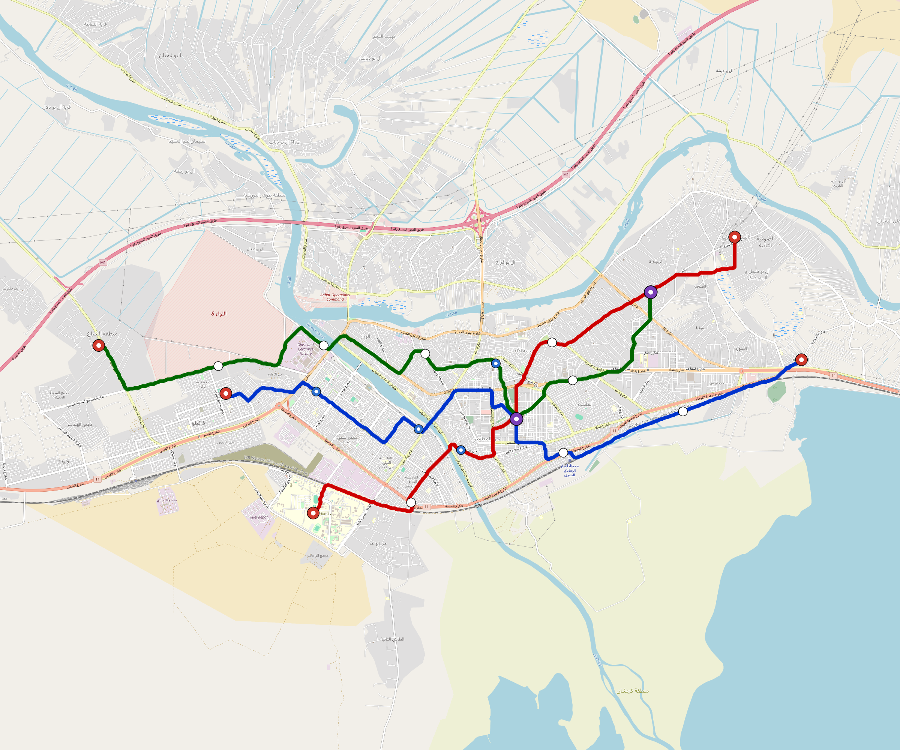

# Ramadi — Urban Rail Network

**Country:** IQ · **Population:** 525,000 · [National brief](../NATIONAL-BRIEF.md)

This page contains only Ramadi-specific results. Shared routing, service, energy, civil, cost, finance, QA and validation methods are defined once in the [deployment planning reference](../../../../../docs/deployment-planning-reference.md).

> [!IMPORTANT]
> **Foreign-capital advantage:** against the default equivalent foreign-turnkey sensitivity, this local plan avoids **$673 M (86.9%) of external capital** and **$828 M of external interest**. Capital plus saved interest totals **$1.50 bn**. See the common reference for interpretation and limitations.

Auto-planned by the OpenSourceRail design pipeline from the controlled city catalogue, source-locked geospatial inputs and shared templates.

## Network



| Local measure | Value |
|---|---:|
| Lines / unique stations / interchanges | 3 / 22 / 2 |
| Route length | 48.0 km double track |
| Coverage / transfer reachability | 70.1% / 100% |
| Estimated station catchment | 368,025 residents |
| Service span / peak headway | 05:30–02:00 / 3 min |
| Fleet | 104 × 3-car `light-metro-3car` trainsets (93 peak revenue) |
| Peak network throughput | 43,200 passengers/hour |
| Practical service capacity | 401,760 passenger-trips/day |
| Annual paid-trip planning range | 73.3–117.3 M |

### Lines

| Line | Length | Stations | Trainsets | Termini |
|---|---:|---:|---:|---|
| line-1 | 16.4 km | 7 | 36 | E Outer ↔ W Mid |
| line-2 | 14.3 km | 7 | 31 | SW Mid ↔ NE Outer |
| line-3 | 17.3 km | 8 | 37 | W Outer ↔ NE Mid |
| **Total** | **48.0 km** | **22 unique** | **104** | |

## Energy

| Local measure | Value |
|---|---:|
| Scheduled service | 1,395 one-way journeys / 22,323 train-km/day |
| Annual traction demand | 105.6 GWh |
| Station/depot PV / storage | 11.3 MW / 50.5 MWh |
| Aggregate charging power | 11.0 MW |
| Dedicated solar plant | 42.5 MW |
| Residual grid/PPA import | 0.0 GWh/yr |
| Worst powered-stop gap | line-3: 3.4 km / 27 kWh |
| Lowest traversal charging margin | line-2: 44 kWh |

## Capital And Funding

| Local CAPEX bucket | Planning value |
|---|---:|
| Civil works | $150 M |
| Stations | $114 M |
| Depots | $8.0 M |
| Rolling stock | $94 M |
| Dedicated solar plant | $34 M |
| Residual train control | $2.4 M |
| Charging microgrids | $2.5 M |
| EPC / project services | $26 M |
| **Total city programme** | **$430 M** |

| Local funding measure | Planning value |
|---|---:|
| Imported / external capital | $101 M (23.6%) |
| Domestic / local capital | $329 M (76.4%) |
| Annual public construction commitment | $40 M / yr for 5 years |
| Annual post-grace debt service | $30 M / yr |
| External capital saved vs default turnkey sensitivity | $673 M |
| Capital + lifetime external interest saved | $1.50 bn |
| Annual OPEX | $12 M / yr |

## Local Evidence

| Package | Current status | Evidence |
|---|---|---|
| Finance | pass | [`summary.json`](engineering/finance/summary.json) |
| Native simulation + degraded cases | pass | [`validation-summary.json`](engineering/simulation/validation-summary.json) |
| SUMO timetable | pass | [`summary.json`](engineering/sumo/summary.json) |
| GIS package | pass | [`summary.json`](engineering/gis/summary.json) |
| Grid/charging/solar | pass | [`summary.json`](engineering/energy/summary.json) |
| Operations, QA and maintenance | 235 assets / 1,068 tasks | [`ramadi-operations-manifest.json`](operations/ramadi-operations-manifest.json) |

## Local Files And Regeneration

| File | Local role |
|---|---|
| [`design.toml`](design.toml) | Authoritative generated city design |
| [`ramadi.toml`](ramadi.toml) | Expanded simulator scenario |
| [`ramadi.corridor.geojson`](ramadi.corridor.geojson) | GIS corridor and stations |
| [`ramadi.design-quality.yaml`](ramadi.design-quality.yaml) | Coverage, source and civil-quality gates |

```bash
tools/automation/regenerate-city.sh ramadi
```
