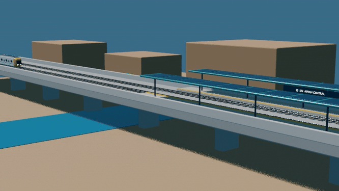

# Samawah Line 1 Digital Twin

This is the complete source-linked planning and operational twin for Samawah
Line 1. The FreeCAD model and JSON register cover the full 22,385.8 m radial
alignment. The embedded Blender animation is a source-linked S5 operations
view chosen to show the infrastructure and refined rolling stock at readable
real scale rather than reducing the complete line to a map.



## Included systems

| System | Twin content |
|---|---|
| Alignment and civil works | All 218 EPSG:32638 control points and 36 contiguous civil segments from the current elevated-core design |
| Track and signalling | Complete double-track route and 12 directional movement-authority blocks between seven stations |
| Stations | All seven controlled platform records; every platform must fit the actual consist |
| Energy | All five powered station/depot PV, storage and charging sites; unpowered platform records remain explicit |
| Depot | Full-fleet planning requirement: 71 storage slots on 24 roads, separate from ten workshop bays; 50,206 m² land screen, with site/layout acceptance open |
| Rolling stock | Registry for all 71 three-car LM3 trainsets: 64 peak-service, six spare, and one cold reserve |
| Operations | Source 3-minute peak plan, checked service windows, battery/SoC state, and eight moving representative trainsets |

The native FreeCAD overview uses a declared 1:1000 horizontal representation
and a 118° display rotation so the entire mostly north–south route is readable
on a landscape page. Station, train, energy, signalling, and depot symbols are
deliberately exaggerated. The JSON retains the real UTM coordinates,
chainages, source hashes, asset relationships, and fleet states.

The Blender scene is an S5 elevated-station product demonstrator in metres,
separate from the surveyed placement and current Line 1 platform inventory. Its
LM3 doorway sill and platform edge share the controlled 350 mm-above-rail
datum for level boarding, and the panoramic end glass uses an inward rake. It
uses the promoted 49.5 m LM3 consist and symmetric driverless end-cowl design:
sculpted cheek/brow surfaces, large panoramic passenger/sensor glass, LED
head/marker lamps, anti-climbers, side glazing and doors, inter-car bellows,
bogies, and roof PV. Its 46-second motion is physically timed: 36 km/h
approach, 1.0 m/s² service braking, exact stop, five-second demonstration
dwell with open doors, 1.0 m/s² acceleration, and departure cruise.

This remains a planning twin: the OSR-ALN source is explicitly unsurveyed,
vertical geometry is a zero-datum placeholder, and the animation is a
deterministic operational example—not live telemetry or a construction model.

## Artifacts

| File | Purpose |
|---|---|
| [`samawah-line1-digital-twin.FCStd`](samawah-line1-digital-twin.FCStd) | Native FreeCAD model with selectable civil, station, energy, depot, signalling, and rolling-stock groups |
| [`samawah-line1-digital-twin.json`](samawah-line1-digital-twin.json) | Full asset/state/relationship register, validation results, operational evidence, and source/model hashes |
| [`samawah-line1-digital-twin.blend`](samawah-line1-digital-twin.blend) | Blender source scene with the refined symmetric LM3 end cowls, materials, lights, station context, camera, and real-time motion |
| [`samawah-line1-digital-twin.gif`](samawah-line1-digital-twin.gif) | README-ready Blender animation: 1:1 time, 36 km/h approach, service braking, stop, doors, dwell, start, acceleration, and departure |
| [`samawah-line1-digital-twin.mp4`](samawah-line1-digital-twin.mp4) | Matching 46-second video from the same 230 rendered frames |

## Regenerate

From the repository root:

```bash
tools/automation/freecad-generate.sh --samawah-line-twin
```

The generator fails if the source alignment is incomplete, civil segments are
not contiguous, station platforms do not fit the LM3 consist, the fleet split
does not match the controlled order, required energy/depot assets are absent, native FreeCAD
shapes are invalid, the render frame count is wrong, or the GIF reaches 20 MB.
