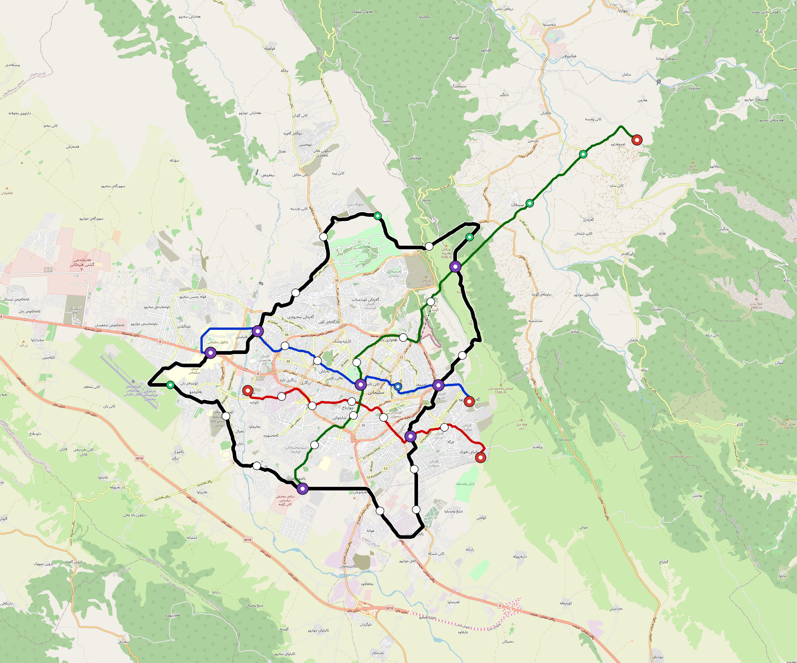

# Sulaymaniyah — Urban Rail Network

**Country:** IQ · **Population:** 2,150,000 · [National brief](../NATIONAL-BRIEF.md)

This page contains only Sulaymaniyah-specific results. Shared routing, service, energy, civil, cost, finance, QA and validation methods are defined once in the [deployment planning reference](../../../../../docs/deployment-planning-reference.md).

> [!IMPORTANT]
> **Foreign-capital advantage:** against the default equivalent foreign-turnkey sensitivity, this local plan avoids **$1.60 bn (86.8%) of external capital** and **$1.97 bn of external interest**. Capital plus saved interest totals **$3.58 bn**. See the common reference for interpretation and limitations.

Auto-planned by the OpenSourceRail design pipeline from the controlled city catalogue, source-locked geospatial inputs and shared templates.

## Network



| Local measure | Value |
|---|---:|
| Lines / unique stations / interchanges | 4 / 45 / 7 |
| Route length | 119.8 km double track |
| Coverage / transfer reachability | 67.1% / 67% |
| Estimated station catchment | 1,442,650 residents |
| Service span / peak headway | 05:30–02:00 / 3 min |
| Fleet | 129 × 4-car `metro-4car` trainsets (115 peak revenue) |
| Peak network throughput | 76,800 passengers/hour |
| Practical service capacity | 624,960 passenger-trips/day |
| Annual paid-trip planning range | 114.1–182.5 M |

### Lines

| Line | Length | Stations | Trainsets | Termini |
|---|---:|---:|---:|---|
| line-1 | 17.3 km | 8 | 31 | W Mid ↔ E Inner |
| line-2 | 15.1 km | 8 | 30 | SE Mid ↔ W Mid |
| line-3 | 28.3 km | 11 | 45 | NE Outer ↔ SW Mid |
| line-4 | 59.1 km | 18 | 23 | W Mid ↔ W Mid |
| **Total** | **119.8 km** | **45 unique** | **129** | |

## Energy

| Local measure | Value |
|---|---:|
| Scheduled service | 1,628 one-way journeys / 41,978 train-km/day |
| Annual traction demand | 264.8 GWh |
| Station/depot PV / storage | 16.7 MW / 98.5 MWh |
| Aggregate charging power | 60.0 MW |
| Dedicated solar plant | 179.4 MW |
| Residual grid/PPA import | 0.0 GWh/yr |
| Worst powered-stop gap | line-3: 11.8 km / 113 kWh |
| Lowest traversal charging margin | line-3: 216 kWh |

## Capital And Funding

| Local CAPEX bucket | Planning value |
|---|---:|
| Civil works | $426 M |
| Stations | $228 M |
| Depots | $8.0 M |
| Rolling stock | $144 M |
| Dedicated solar plant | $144 M |
| Residual train control | $6.0 M |
| Charging microgrids | $13 M |
| EPC / project services | $58 M |
| **Total city programme** | **$1.03 bn** |

| Local funding measure | Planning value |
|---|---:|
| Imported / external capital | $244 M (23.7%) |
| Domestic / local capital | $783 M (76.3%) |
| Annual public construction commitment | $96 M / yr for 5 years |
| Annual post-grace debt service | $70 M / yr |
| External capital saved vs default turnkey sensitivity | $1.60 bn |
| Capital + lifetime external interest saved | $3.58 bn |
| Annual OPEX | $25 M / yr |

## Local Evidence

| Package | Current status | Evidence |
|---|---|---|
| Finance | pass | [`summary.json`](engineering/finance/summary.json) |
| Native simulation + degraded cases | pass | [`validation-summary.json`](engineering/simulation/validation-summary.json) |
| SUMO timetable | pass | [`summary.json`](engineering/sumo/summary.json) |
| GIS package | pass | [`summary.json`](engineering/gis/summary.json) |
| Grid/charging/solar | pass | [`summary.json`](engineering/energy/summary.json) |
| Operations, QA and maintenance | 376 assets / 1,576 tasks | [`sulaymaniyah-operations-manifest.json`](operations/sulaymaniyah-operations-manifest.json) |

## Local Files And Regeneration

| File | Local role |
|---|---|
| [`design.toml`](design.toml) | Authoritative generated city design |
| [`sulaymaniyah.toml`](sulaymaniyah.toml) | Expanded simulator scenario |
| [`sulaymaniyah.corridor.geojson`](sulaymaniyah.corridor.geojson) | GIS corridor and stations |
| [`sulaymaniyah.design-quality.yaml`](sulaymaniyah.design-quality.yaml) | Coverage, source and civil-quality gates |

```bash
tools/automation/regenerate-city.sh sulaymaniyah
```
