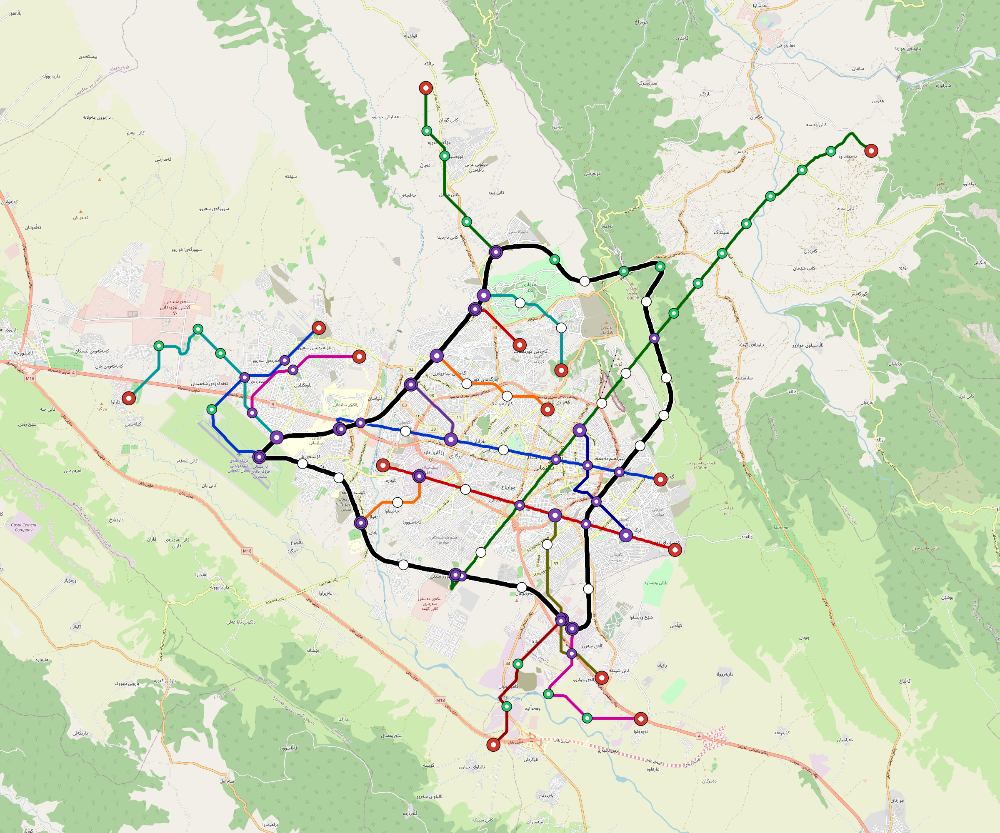

# Sulaymaniyah — Urban Rail Network

**Country:** IQ · **Population:** 2,150,000 · [National brief](../NATIONAL-BRIEF.md)

This page contains only Sulaymaniyah-specific results. Shared routing, service, energy, civil, cost, finance, QA and validation methods are defined once in the [deployment planning reference](../../../../../docs/deployment-planning-reference.md).

> [!IMPORTANT]
> **Foreign-capital advantage:** against the default equivalent foreign-turnkey sensitivity, this local plan avoids **$2.61 bn (88.9%) of external capital** and **$3.21 bn of external interest**. Capital plus saved interest totals **$5.82 bn**. See the common reference for interpretation and limitations.

**Current alignment, depot and production basis.** Core corridors change from **107.875 km to 88.724 km**, with elevated land sections, straight radial tangents and bridges at water crossings. 0 core fragments retain raster geometry for further curve review. The centre is a design-centroid screen; survey, property, obstacles, foundations and geometry releases remain open. All **39 platform points** pass the retained water-mask screen; footprints, bank stability and access remain open. [Alignment controls](engineering/alignment/core-realignment.json) · [Before/after map](engineering/alignment/core-alignment-comparison.png) · [Water screen](engineering/alignment/station-water-screen.json).

**4 line-local depots** provide **121 full-fleet storage slots**, separate from workshop bays. Fleet length and workload set quantities; PV/storage is included once in depot capital. Site acceptance and installed/land/utility quotations remain open. [Depot costs](engineering/line-depots/README.md). The factory requires **121 metro-4car trainsets / 484 cars**, with **18-month facility readiness**, then qualification and manufacture. Integrated openings wait for fleet readiness where production or test paths constrain them. Shared factory capital is counted once; concurrent national loading and supplier commitments remain open. [Factory and dates](engineering/factory/README.md).

Station staffing uses two posts, two normal eight-hour shifts, plus service-window, leave and training cover. Basic wages start at 1.5 times the retained country income proxy, with higher technical/management grades and employer allowances. [Staff](engineering/delivery/README.md) · [Finance](engineering/finance/summary.json). Finance retains country-specific fixed-price, steady-state assumptions; Baghdad’s indexed cashflows are separate.

Auto-planned by the OpenSourceRail design pipeline from the controlled city catalogue, source-locked geospatial inputs and shared templates.

## Network



| Local measure | Value |
|---|---:|
| Lines / unique stations / interchanges | 4 / 39 / 7 |
| Route length | 106.0 km double track |
| Coverage / transfer reachability | 48.1% / 83% |
| Estimated station catchment | 1,034,150 residents |
| Service span / peak headway | 05:30–02:00 / 3 min |
| Fleet | 121 × 4-car `metro-4car` trainsets (108 peak revenue) |
| Peak network throughput | 76,800 passengers/hour |
| Practical service capacity | 624,960 passenger-trips/day |
| Annual paid-trip planning range | 114.1–182.5 M |

### Lines

| Line | Length | Stations | Trainsets | Termini |
|---|---:|---:|---:|---|
| line-1 | 13.7 km | 7 | 28 | W Mid ↔ E Inner |
| line-2 | 12.3 km | 6 | 25 | SE Mid ↔ W Mid |
| line-3 | 26.7 km | 10 | 47 | NE Outer ↔ SW Mid |
| line-4 | 53.3 km | 16 | 21 | W Mid ↔ W Mid |
| **Total** | **106.0 km** | **39 unique** | **121** | |

## Energy

| Local measure | Value |
|---|---:|
| Scheduled service | 1,628 one-way journeys / 36,887 train-km/day |
| Annual traction demand | 232.7 GWh |
| Station/depot PV / storage | 29.3 MW / 206.5 MWh |
| Aggregate charging power | 52.5 MW |
| Dedicated solar plant | 140.8 MW |
| Residual grid/PPA import | 0.0 GWh/yr |
| Worst powered-stop gap | line-3: 12.6 km / 121 kWh |
| Lowest traversal charging margin | line-2: 213 kWh |

## Capital And Funding

| Local CAPEX bucket | Planning value |
|---|---:|
| Civil works | $1.03 bn |
| Stations | $170 M |
| Depots | $69 M |
| Rolling stock | $136 M |
| Dedicated solar plant | $113 M |
| Residual train control | $5.3 M |
| Charging microgrids | $11 M |
| EPC / project services | $99 M |
| **Total city programme** | **$1.63 bn** |

## Iraq funding

Proposed facilities and appropriations remain uncommitted. The conditional ledger calculates government capital and the extra support required for fees, interest, reserves and cash shortfalls; additional support is not a funding commitment.

| Capital source | Planning USD equivalent |
|---|---:|
| bank credit | $155 M |
| chinese export credit | $80 M |
| domestic bonds | $465 M |
| government | $931 M |

The procurement schedule requires **41 calendar months** of capital cash under an assumed 260-working-day year. The resource-constrained full-network rollout needs review before a construction commitment.

Peak annual government cash: **$604 M**. This includes support required under the low capacity-use case; it is not a funded appropriation.

Chinese export buyer credit is allocated within existing imported budgets for solar equipment, bogies, batteries, windows and doors. City CAPEX excludes manufacturing tooling; the Baghdad-only programme separately funds one plant for Baghdad. IQD bonds assume a proposed Ministry of Finance programme; municipal borrowing authority is pending legal review.

The model includes actual scheduled draws, native-currency principal/interest, fees, revenue ramps, operating/debt support, reserve movements and downside cases. Short bullet bonds have explicit redemptions without assumed refinancing.

See [funding model](engineering/finance/FUNDING-MODEL.md), [monthly cashflow](engineering/finance/funding-monthly-cashflow.csv), [annual cashflow](engineering/finance/funding-annual-cashflow.csv) . This standalone city appraisal is outside the Baghdad-only funding programme.

Annual operating allowance: $41 M; demand remains capacity-led.

## Local Evidence

| Package | Current status | Evidence |
|---|---|---|
| Finance | pass | [`summary.json`](engineering/finance/summary.json) |
| Native simulation + degraded cases | pass | [`validation-summary.json`](engineering/simulation/validation-summary.json) |
| SUMO timetable | pass | [`summary.json`](engineering/sumo/summary.json) |
| Independent OSR/SUMO running-time cross-check | pass; junction/authority gate open | [`operations-crosscheck.md`](engineering/simulation/operations-crosscheck.md) |
| GIS package | pass | [`summary.json`](engineering/gis/summary.json) |
| Solar/storage snapshot (operating duty unverified) | pass; 0 findings; 16 grid-only diagnostics | [`summary.json`](engineering/energy/summary.json) |
| Operations, QA and maintenance | 338 assets / 1,780 tasks | [`sulaymaniyah-operations-manifest.json`](operations/sulaymaniyah-operations-manifest.json) |

## Local Files And Regeneration

| File | Local role |
|---|---|
| [`design.toml`](design.toml) | Authoritative generated city design |
| [`sulaymaniyah.toml`](sulaymaniyah.toml) | Expanded simulator scenario |
| [`sulaymaniyah.corridor.geojson`](sulaymaniyah.corridor.geojson) | GIS corridor and stations |
| [`sulaymaniyah.design-quality.yaml`](sulaymaniyah.design-quality.yaml) | Coverage, source and civil-quality gates |

```bash
tools/automation/regenerate-city.sh sulaymaniyah
```
