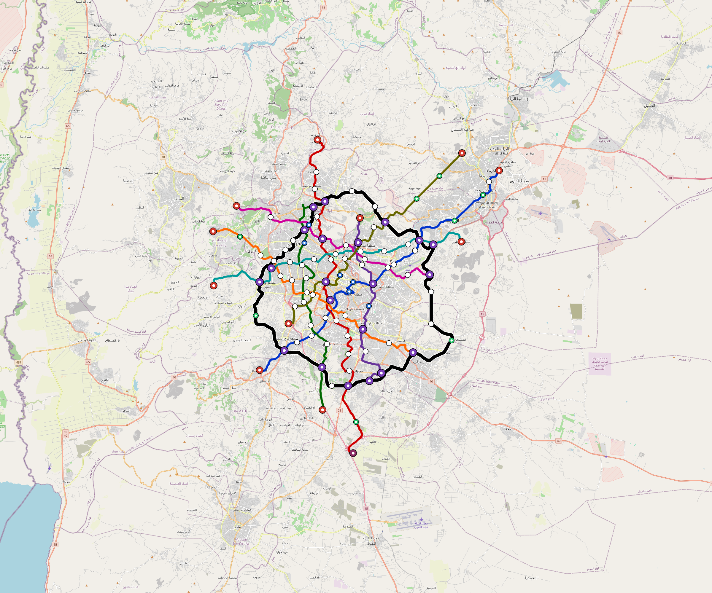

# Amman — Urban Rail Network

**Country:** JO · **Population:** 4,007,000 · [National brief](../NATIONAL-BRIEF.md)

This page contains only Amman-specific results. Shared routing, service, energy, civil, cost, finance, QA and validation methods are defined once in the [deployment planning reference](../../../../../docs/deployment-planning-reference.md).

> [!IMPORTANT]
> **Foreign-capital advantage:** against the default equivalent foreign-turnkey sensitivity, this local plan avoids **$5.82 bn (85.7%) of external capital** and **$7.16 bn of external interest**. Capital plus saved interest totals **$12.98 bn**. See the common reference for interpretation and limitations.

Auto-planned by the OpenSourceRail design pipeline from the controlled city catalogue, source-locked geospatial inputs and shared templates.

## Network



| Local measure | Value |
|---|---:|
| Lines / unique stations / interchanges | 9 / 120 / 21 |
| Route length | 358.4 km double track |
| Coverage / transfer reachability | 66.9% / 47% |
| Estimated station catchment | 2,680,683 residents |
| Service span / peak headway | 05:30–02:00 / 3 min |
| Fleet | 555 × 6-car `metro-6car` trainsets (500 peak revenue) |
| Peak network throughput | 259,200 passengers/hour |
| Practical service capacity | 2,276,640 passenger-trips/day |
| Annual paid-trip planning range | 415.5–664.8 M |

### Lines

| Line | Length | Stations | Trainsets | Termini |
|---|---:|---:|---:|---|
| line-1 | 44.0 km | 16 | 85 | SW Outer ↔ NE Outer |
| line-2 | 48.0 km | 16 | 90 | N Outer ↔ S Outer |
| line-3 | 30.3 km | 10 | 58 | S Outer ↔ NW Mid |
| line-4 | 24.0 km | 9 | 45 | N Mid ↔ S Mid |
| line-5 | 32.4 km | 12 | 59 | W Outer ↔ SE Mid |
| line-6 | 34.9 km | 12 | 62 | E Mid ↔ W Outer |
| line-7 | 28.4 km | 9 | 53 | E Mid ↔ NW Outer |
| line-8 | 34.3 km | 12 | 64 | NE Outer ↔ SW Mid |
| line-9 | 82.1 km | 24 | 39 | W Mid ↔ W Mid |
| **Total** | **358.4 km** | **120 unique** | **555** | |

## Energy

| Local measure | Value |
|---|---:|
| Scheduled service | 3,952 one-way journeys / 147,553 train-km/day |
| Annual traction demand | 1,396.0 GWh |
| Station/depot PV / storage | 38.3 MW / 262.0 MWh |
| Aggregate charging power | 224.0 MW |
| Dedicated solar plant | 689.0 MW |
| Residual grid/PPA import | 0.0 GWh/yr |
| Worst powered-stop gap | line-1: 12.1 km / 196 kWh |
| Lowest traversal charging margin | line-5: 210 kWh |

## Capital And Funding

| Local CAPEX bucket | Planning value |
|---|---:|
| Civil works | $1.29 bn |
| Stations | $709 M |
| Depots | $8.0 M |
| Rolling stock | $932 M |
| Dedicated solar plant | $551 M |
| Residual train control | $18 M |
| Charging microgrids | $49 M |
| EPC / project services | $211 M |
| **Total city programme** | **$3.77 bn** |

| Local funding measure | Planning value |
|---|---:|
| Imported / external capital | $973 M (25.8%) |
| Domestic / local capital | $2.80 bn (74.2%) |
| Annual public construction commitment | $324 M / yr for 5 years |
| Annual post-grace debt service | $238 M / yr |
| External capital saved vs default turnkey sensitivity | $5.82 bn |
| Capital + lifetime external interest saved | $12.98 bn |
| Annual OPEX | $104 M / yr |

## Local Evidence

| Package | Current status | Evidence |
|---|---|---|
| Finance | pass | [`summary.json`](engineering/finance/summary.json) |
| Native simulation + degraded cases | pass | [`validation-summary.json`](engineering/simulation/validation-summary.json) |
| SUMO timetable | pass | [`summary.json`](engineering/sumo/summary.json) |
| GIS package | pass | [`summary.json`](engineering/gis/summary.json) |
| Grid/charging/solar | pass | [`summary.json`](engineering/energy/summary.json) |
| Operations, QA and maintenance | 1,253 assets / 5,738 tasks | [`amman-operations-manifest.json`](operations/amman-operations-manifest.json) |

## Local Files And Regeneration

| File | Local role |
|---|---|
| [`design.toml`](design.toml) | Authoritative generated city design |
| [`amman.toml`](amman.toml) | Expanded simulator scenario |
| [`amman.corridor.geojson`](amman.corridor.geojson) | GIS corridor and stations |
| [`amman.design-quality.yaml`](amman.design-quality.yaml) | Coverage, source and civil-quality gates |

```bash
tools/automation/regenerate-city.sh amman
```
