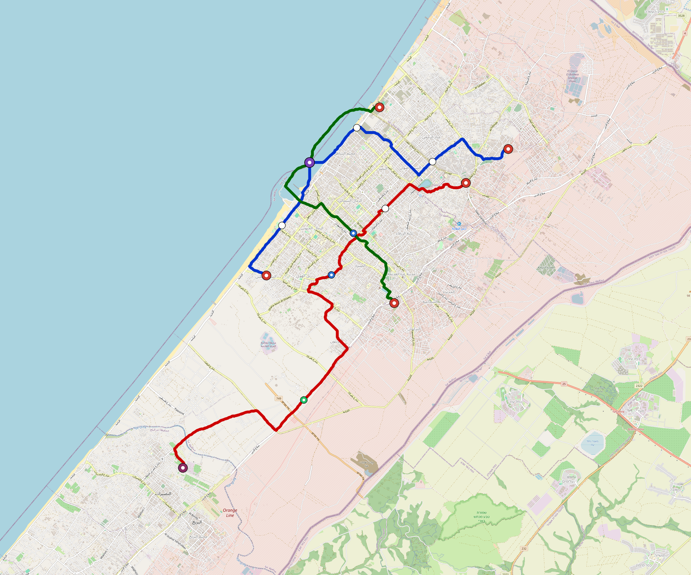

# Gaza-City — Urban Rail Network

**Country:** PS · **Population:** 600,000 · [National brief](../NATIONAL-BRIEF.md)

This page contains only Gaza-City-specific results. Shared routing, service, energy, civil, cost, finance, QA and validation methods are defined once in the [deployment planning reference](../../../../../docs/deployment-planning-reference.md).

> [!IMPORTANT]
> **Foreign-capital advantage:** against the default equivalent foreign-turnkey sensitivity, this local plan avoids **$517 M (86.7%) of external capital** and **$648 M of external interest**. Capital plus saved interest totals **$1.17 bn**. See the common reference for interpretation and limitations.

Auto-planned by the OpenSourceRail design pipeline from the controlled city catalogue, source-locked geospatial inputs and shared templates.

## Network



| Local measure | Value |
|---|---:|
| Lines / unique stations / interchanges | 3 / 15 / 1 |
| Route length | 38.8 km double track |
| Coverage / transfer reachability | 61.7% / 33% |
| Estimated station catchment | 370,200 residents |
| Service span / peak headway | 05:30–02:00 / 3 min |
| Fleet | 84 × 3-car `light-metro-3car` trainsets (75 peak revenue) |
| Peak network throughput | 43,200 passengers/hour |
| Practical service capacity | 401,760 passenger-trips/day |
| Annual paid-trip planning range | 73.3–117.3 M |

### Lines

| Line | Length | Stations | Trainsets | Termini |
|---|---:|---:|---:|---|
| line-1 | 12.1 km | 6 | 27 | NE Mid ↔ SW Inner |
| line-2 | 17.0 km | 5 | 36 | E Mid ↔ SW Outer |
| line-3 |  9.7 km | 4 | 21 | SE Inner ↔ N Mid |
| **Total** | **38.8 km** | **15 unique** | **84** | |

## Energy

| Local measure | Value |
|---|---:|
| Scheduled service | 1,395 one-way journeys / 18,058 train-km/day |
| Annual traction demand | 85.4 GWh |
| Station/depot PV / storage | 8.9 MW / 46.5 MWh |
| Aggregate charging power | 7.0 MW |
| Dedicated solar plant | 38.7 MW |
| Residual grid/PPA import | 0.0 GWh/yr |
| Worst powered-stop gap | line-2: 10.9 km / 79 kWh |
| Lowest traversal charging margin | line-3: 37 kWh |

## Capital And Funding

| Local CAPEX bucket | Planning value |
|---|---:|
| Civil works | $123 M |
| Stations | $71 M |
| Depots | $8.0 M |
| Rolling stock | $76 M |
| Dedicated solar plant | $31 M |
| Residual train control | $1.9 M |
| Charging microgrids | $1.6 M |
| EPC / project services | $20 M |
| **Total city programme** | **$332 M** |

| Local funding measure | Planning value |
|---|---:|
| Imported / external capital | $80 M (24.0%) |
| Domestic / local capital | $252 M (76.0%) |
| Annual public construction commitment | $28 M / yr for 7 years |
| Annual post-grace debt service | $23 M / yr |
| External capital saved vs default turnkey sensitivity | $517 M |
| Capital + lifetime external interest saved | $1.17 bn |
| Annual OPEX | $9.3 M / yr |

## Local Evidence

**Evidence refresh required.** Retained passing results below are unverified.
The strict README generator rejected the evidence: engineering/simulation/validation-summary.json describes scenario SHA-256 1d37215720a24ea02b0b445492e6f43608ca5a5328d20487c3bc2abbbf3f5c44, but gaza-city.toml is 5086d34a2b2659994efbc0386a10e4f37bf0274ed03ee44d36c6e0bb2a0fb997; rerun and update the validation evidence. This audit view does not accept or replace the retained solver results.

| Package | Current status | Evidence |
|---|---|---|
| Finance | unverified | [`summary.json`](engineering/finance/summary.json) |
| Native simulation + degraded cases | unverified | [`validation-summary.json`](engineering/simulation/validation-summary.json) |
| SUMO timetable | unverified | [`summary.json`](engineering/sumo/summary.json) |
| Independent OSR/SUMO running-time cross-check | unverified; junction/authority gate open | [`operations-crosscheck.md`](engineering/simulation/operations-crosscheck.md) |
| GIS package | unverified | [`summary.json`](engineering/gis/summary.json) |
| Solar/storage snapshot (operating duty unverified) | unverified; 0 findings; 4 grid-only diagnostics | [`summary.json`](engineering/energy/summary.json) |
| Operations, QA and maintenance | 175 assets / 1,026 tasks | [`gaza-city-operations-manifest.json`](operations/gaza-city-operations-manifest.json) |

## Local Files And Regeneration

| File | Local role |
|---|---|
| [`design.toml`](design.toml) | Authoritative generated city design |
| [`gaza-city.toml`](gaza-city.toml) | Expanded simulator scenario |
| [`gaza-city.corridor.geojson`](gaza-city.corridor.geojson) | GIS corridor and stations |
| [`gaza-city.design-quality.yaml`](gaza-city.design-quality.yaml) | Coverage, source and civil-quality gates |

```bash
tools/automation/regenerate-city.sh gaza-city
```
