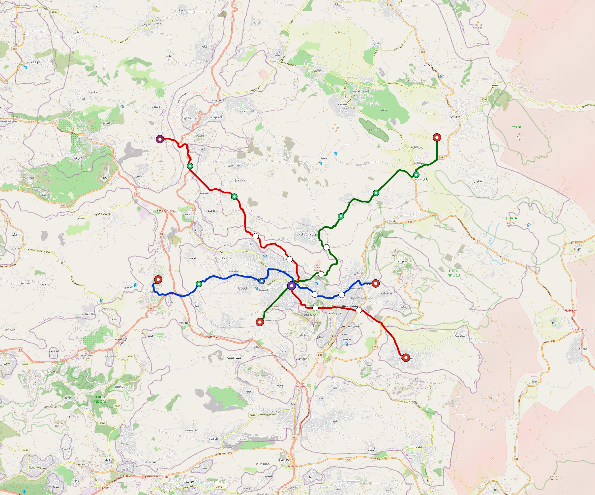

# Nablus — Urban Rail Network

**Country:** PS · **Population:** 450,000 · [National brief](../NATIONAL-BRIEF.md)

This page contains only Nablus-specific results. Shared routing, service, energy, civil, cost, finance, QA and validation methods are defined once in the [deployment planning reference](../../../../../docs/deployment-planning-reference.md).

> [!IMPORTANT]
> **Foreign-capital advantage:** against the default equivalent foreign-turnkey sensitivity, this local plan avoids **$861 M (85.9%) of external capital** and **$1.08 bn of external interest**. Capital plus saved interest totals **$1.94 bn**. See the common reference for interpretation and limitations.

Auto-planned by the OpenSourceRail design pipeline from the controlled city catalogue, source-locked geospatial inputs and shared templates.

## Network



| Local measure | Value |
|---|---:|
| Lines / unique stations / interchanges | 3 / 24 / 1 |
| Route length | 71.7 km double track |
| Coverage / transfer reachability | 71.4% / 100% |
| Estimated station catchment | 321,300 residents |
| Service span / peak headway | 05:30–02:00 / 3 min |
| Fleet | 174 × 3-car `light-metro-3car` trainsets (156 peak revenue) |
| Peak network throughput | 43,200 passengers/hour |
| Practical service capacity | 401,760 passenger-trips/day |
| Annual paid-trip planning range | 73.3–117.3 M |

### Lines

| Line | Length | Stations | Trainsets | Termini |
|---|---:|---:|---:|---|
| line-1 | 20.5 km | 7 | 50 | E Mid ↔ W Outer |
| line-2 | 28.3 km | 9 | 67 | SE Outer ↔ NW Outer |
| line-3 | 23.0 km | 8 | 57 | NE Outer ↔ SW Mid |
| **Total** | **71.7 km** | **24 unique** | **174** | |

## Energy

| Local measure | Value |
|---|---:|
| Scheduled service | 1,395 one-way journeys / 33,353 train-km/day |
| Annual traction demand | 157.8 GWh |
| Station/depot PV / storage | 10.1 MW / 48.5 MWh |
| Aggregate charging power | 9.0 MW |
| Dedicated solar plant | 78.8 MW |
| Residual grid/PPA import | 0.0 GWh/yr |
| Worst powered-stop gap | line-3: 14.0 km / 101 kWh |
| Lowest traversal charging margin | line-1: 83 kWh |

## Capital And Funding

| Local CAPEX bucket | Planning value |
|---|---:|
| Civil works | $199 M |
| Stations | $92 M |
| Depots | $8.0 M |
| Rolling stock | $157 M |
| Dedicated solar plant | $63 M |
| Residual train control | $3.6 M |
| Charging microgrids | $2.0 M |
| EPC / project services | $32 M |
| **Total city programme** | **$556 M** |

| Local funding measure | Planning value |
|---|---:|
| Imported / external capital | $141 M (25.3%) |
| Domestic / local capital | $416 M (74.7%) |
| Annual public construction commitment | $46 M / yr for 7 years |
| Annual post-grace debt service | $39 M / yr |
| External capital saved vs default turnkey sensitivity | $861 M |
| Capital + lifetime external interest saved | $1.94 bn |
| Annual OPEX | $16 M / yr |

## Local Evidence

**Evidence refresh required.** Retained passing results below are unverified.
The strict README generator rejected the evidence: engineering/simulation/validation-summary.json describes scenario SHA-256 25ff5eb02ea2b3978b7bbebec758c76b4bb7bcf1a0ae838feb2e599ec61afffb, but nablus.toml is aa70a5cd3f861fb804d5cc5a3201e61abc494a003945ba7c58ade34175443b08; rerun and update the validation evidence. This audit view does not accept or replace the retained solver results.

| Package | Current status | Evidence |
|---|---|---|
| Finance | unverified | [`summary.json`](engineering/finance/summary.json) |
| Native simulation + degraded cases | unverified | [`validation-summary.json`](engineering/simulation/validation-summary.json) |
| SUMO timetable | unverified | [`summary.json`](engineering/sumo/summary.json) |
| Independent OSR/SUMO running-time cross-check | missing/fail; junction/authority gate open | not generated |
| GIS package | unverified | [`summary.json`](engineering/gis/summary.json) |
| Solar/storage snapshot (operating duty unverified) | unverified; 0 findings; 8 grid-only diagnostics | [`summary.json`](engineering/energy/summary.json) |
| Operations, QA and maintenance | 319 assets / 1,580 tasks | [`nablus-operations-manifest.json`](operations/nablus-operations-manifest.json) |

## Local Files And Regeneration

| File | Local role |
|---|---|
| [`design.toml`](design.toml) | Authoritative generated city design |
| [`nablus.toml`](nablus.toml) | Expanded simulator scenario |
| [`nablus.corridor.geojson`](nablus.corridor.geojson) | GIS corridor and stations |
| [`nablus.design-quality.yaml`](nablus.design-quality.yaml) | Coverage, source and civil-quality gates |

```bash
tools/automation/regenerate-city.sh nablus
```
