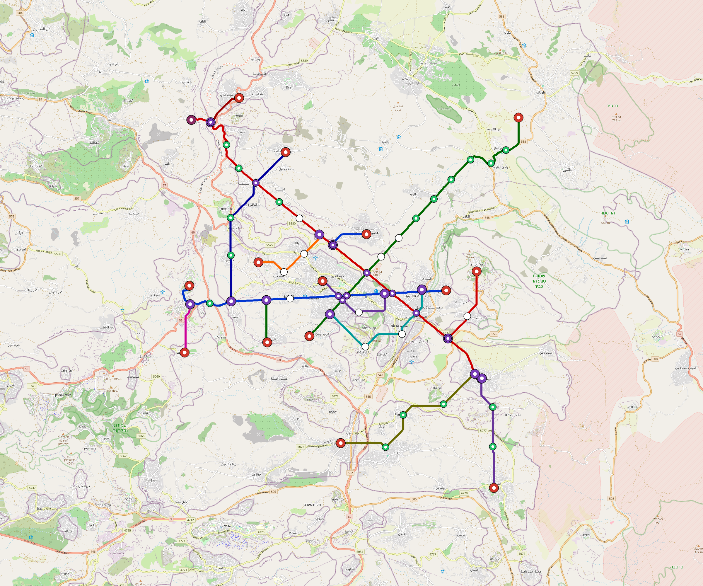

# Nablus — Urban Rail Network

**Country:** PS · **Population:** 450,000 · [National brief](../NATIONAL-BRIEF.md)

This page contains only Nablus-specific results. Shared routing, service, energy, civil, cost, finance, QA and validation methods are defined once in the [deployment planning reference](../../../../../docs/deployment-planning-reference.md).

> [!IMPORTANT]
> **Foreign-capital advantage:** against the default equivalent foreign-turnkey sensitivity, this local plan avoids **$1.46 bn (88.0%) of external capital** and **$1.83 bn of external interest**. Capital plus saved interest totals **$3.29 bn**. See the common reference for interpretation and limitations.

**Current alignment, depot and production basis.** Core corridors change from **51.919 km to 43.658 km**, with elevated land sections, water-aware radial routes and separately engineered bridge candidates at short water crossings. 0 core fragments retain raster geometry for further curve review. The centre is a design-centroid screen; survey, property, obstacles, foundations and geometry releases remain open. All **22 platform points** pass the retained water-mask screen; footprints, bank stability and access remain open. [Alignment controls](engineering/alignment/core-realignment.json) · [Before/after map](engineering/alignment/core-alignment-comparison.png) · [Water screen](engineering/alignment/station-water-screen.json).

**3 line-local depots** provide **195 full-fleet storage slots**, separate from workshop bays. Fleet length and workload set quantities; PV/storage is included once in depot capital. Site acceptance and installed/land/utility quotations remain open. [Depot costs](engineering/line-depots/README.md). The factory requires **195 light-metro-3car trainsets / 585 cars**, with **18-month facility readiness**, then qualification and manufacture. Integrated openings wait for fleet readiness where production or test paths constrain them. Shared factory capital is counted once; concurrent national loading and supplier commitments remain open. [Factory and dates](engineering/factory/README.md).

Station staffing uses two posts, two normal eight-hour shifts, plus service-window, leave and training cover. Basic wages start at 1.5 times the retained country income proxy, with higher technical/management grades and employer allowances. [Staff](engineering/delivery/README.md) · [Finance](engineering/finance/summary.json). Finance retains country-specific fixed-price, steady-state assumptions; Baghdad’s indexed cashflows are separate.

Auto-planned by the OpenSourceRail design pipeline from the controlled city catalogue, source-locked geospatial inputs and shared templates.

## Network



| Local measure | Value |
|---|---:|
| Lines / unique stations / interchanges | 3 / 22 / 3 |
| Route length | 62.3 km double track |
| Coverage / transfer reachability | 41.1% / 100% |
| Estimated station catchment | 184,950 residents |
| Service span / peak headway | 05:30–02:00 / 3 min |
| Fleet | 195 × 3-car `light-metro-3car` trainsets (176 peak revenue) |
| Peak network throughput | 43,200 passengers/hour |
| Practical service capacity | 401,760 passenger-trips/day |
| Annual paid-trip planning range | 73.3–117.3 M |

### Lines

| Line | Length | Stations | Trainsets | Termini |
|---|---:|---:|---:|---|
| line-1 | 16.8 km | 6 | 54 | SE Mid ↔ W Outer |
| line-2 | 25.3 km | 9 | 79 | SE Outer ↔ NW Outer |
| line-3 | 20.2 km | 7 | 62 | NE Outer ↔ SW Mid |
| **Total** | **62.3 km** | **22 unique** | **195** | |

## Energy

| Local measure | Value |
|---|---:|
| Scheduled service | 1,395 one-way journeys / 28,990 train-km/day |
| Annual traction demand | 137.1 GWh |
| Station/depot PV / storage | 19.2 MW / 127.0 MWh |
| Aggregate charging power | 8.5 MW |
| Dedicated solar plant | 56.5 MW |
| Residual grid/PPA import | 0.0 GWh/yr |
| Worst powered-stop gap | line-3: 11.0 km / 79 kWh |
| Lowest traversal charging margin | line-3: 65 kWh |

## Capital And Funding

| Local CAPEX bucket | Planning value |
|---|---:|
| Civil works | $483 M |
| Stations | $91 M |
| Depots | $63 M |
| Rolling stock | $176 M |
| Dedicated solar plant | $45 M |
| Residual train control | $3.1 M |
| Charging microgrids | $1.9 M |
| EPC / project services | $57 M |
| **Total city programme** | **$921 M** |

| Local funding measure | Planning value |
|---|---:|
| Imported / external capital | $199 M (21.6%) |
| Domestic / local capital | $721 M (78.4%) |
| Annual public construction commitment | $79 M / yr for 7 years |
| Annual post-grace debt service | $64 M / yr |
| External capital saved vs default turnkey sensitivity | $1.46 bn |
| Capital + lifetime external interest saved | $3.29 bn |
| Annual OPEX | $27 M / yr |

## Local Evidence

| Package | Current status | Evidence |
|---|---|---|
| Finance | pass | [`summary.json`](engineering/finance/summary.json) |
| Native simulation + degraded cases | pass | [`validation-summary.json`](engineering/simulation/validation-summary.json) |
| SUMO timetable | pass | [`summary.json`](engineering/sumo/summary.json) |
| Independent OSR/SUMO running-time cross-check | pass; junction/authority gate open | [`operations-crosscheck.md`](engineering/simulation/operations-crosscheck.md) |
| GIS package | pass | [`summary.json`](engineering/gis/summary.json) |
| Solar/storage snapshot (operating duty unverified) | pass; 0 findings; 5 grid-only diagnostics | [`summary.json`](engineering/energy/summary.json) |
| Operations, QA and maintenance | 337 assets / 2,152 tasks | [`nablus-operations-manifest.json`](operations/nablus-operations-manifest.json) |

## Local Files And Regeneration

| File | Local role |
|---|---|
| [`design.toml`](design.toml) | Authoritative generated city design |
| [`nablus.toml`](nablus.toml) | Expanded simulator scenario |
| [`nablus.corridor.geojson`](nablus.corridor.geojson) | GIS corridor and stations |
| [`nablus.design-quality.yaml`](nablus.design-quality.yaml) | Coverage, source and civil-quality gates |

```bash
tools/automation/regenerate-city.sh nablus
```
