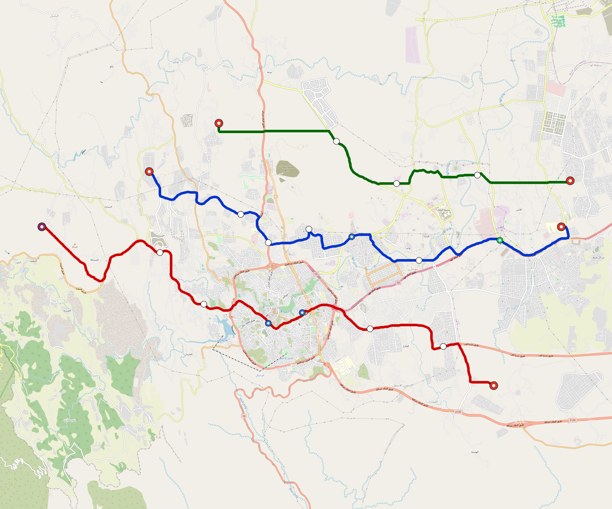

# Abha — Urban Rail Network

**Country:** SA · **Population:** 450,000 · [National brief](../NATIONAL-BRIEF.md)

This page contains only Abha-specific results. Shared routing, service, energy, civil, cost, finance, QA and validation methods are defined once in the [deployment planning reference](../../../../../docs/deployment-planning-reference.md).

> [!IMPORTANT]
> **Foreign-capital advantage:** against the default equivalent foreign-turnkey sensitivity, this local plan avoids **$658 M (86.2%) of external capital** and **$809 M of external interest**. Capital plus saved interest totals **$1.47 bn**. See the common reference for interpretation and limitations.

Auto-planned by the OpenSourceRail design pipeline from the controlled city catalogue, source-locked geospatial inputs and shared templates.

## Network



| Local measure | Value |
|---|---:|
| Lines / unique stations / interchanges | 3 / 21 / 0 |
| Route length | 59.1 km double track |
| Coverage / transfer reachability | 29.3% / 0% |
| Estimated station catchment | 131,850 residents |
| Service span / peak headway | 05:30–02:00 / 3 min |
| Fleet | 126 × 3-car `light-metro-3car` trainsets (113 peak revenue) |
| Peak network throughput | 43,200 passengers/hour |
| Practical service capacity | 401,760 passenger-trips/day |
| Annual paid-trip planning range | 73.3–117.3 M |

### Lines

| Line | Length | Stations | Trainsets | Termini |
|---|---:|---:|---:|---|
| line-1 | 20.9 km | 8 | 46 | E Outer ↔ W Outer |
| line-2 | 23.3 km | 8 | 48 | SE Outer ↔ W Outer |
| line-3 | 14.8 km | 5 | 32 | E Outer ↔ NW Mid |
| **Total** | **59.1 km** | **21 unique** | **126** | |

## Energy

| Local measure | Value |
|---|---:|
| Scheduled service | 1,395 one-way journeys / 27,474 train-km/day |
| Annual traction demand | 130.0 GWh |
| Station/depot PV / storage | 10.7 MW / 49.5 MWh |
| Aggregate charging power | 10.0 MW |
| Dedicated solar plant | 53.7 MW |
| Residual grid/PPA import | 0.0 GWh/yr |
| Worst powered-stop gap | line-1: 7.0 km / 50 kWh |
| Lowest traversal charging margin | line-3: 66 kWh |

## Capital And Funding

| Local CAPEX bucket | Planning value |
|---|---:|
| Civil works | $160 M |
| Stations | $69 M |
| Depots | $8.0 M |
| Rolling stock | $113 M |
| Dedicated solar plant | $43 M |
| Residual train control | $3.0 M |
| Charging microgrids | $2.1 M |
| EPC / project services | $25 M |
| **Total city programme** | **$424 M** |

| Local funding measure | Planning value |
|---|---:|
| Imported / external capital | $105 M (24.8%) |
| Domestic / local capital | $319 M (75.2%) |
| Annual public construction commitment | $29 M / yr for 5 years |
| Annual post-grace debt service | $21 M / yr |
| External capital saved vs default turnkey sensitivity | $658 M |
| Capital + lifetime external interest saved | $1.47 bn |
| Annual OPEX | $20 M / yr |

## Local Evidence

| Package | Current status | Evidence |
|---|---|---|
| Finance | pass | [`summary.json`](engineering/finance/summary.json) |
| Native simulation + degraded cases | pass | [`validation-summary.json`](engineering/simulation/validation-summary.json) |
| SUMO timetable | pass | [`summary.json`](engineering/sumo/summary.json) |
| GIS package | pass | [`summary.json`](engineering/gis/summary.json) |
| Grid/charging/solar | pass | [`summary.json`](engineering/energy/summary.json) |
| Operations, QA and maintenance | 252 assets / 1,205 tasks | [`abha-operations-manifest.json`](operations/abha-operations-manifest.json) |

## Local Files And Regeneration

| File | Local role |
|---|---|
| [`design.toml`](design.toml) | Authoritative generated city design |
| [`abha.toml`](abha.toml) | Expanded simulator scenario |
| [`abha.corridor.geojson`](abha.corridor.geojson) | GIS corridor and stations |
| [`abha.design-quality.yaml`](abha.design-quality.yaml) | Coverage, source and civil-quality gates |

```bash
tools/automation/regenerate-city.sh abha
```
