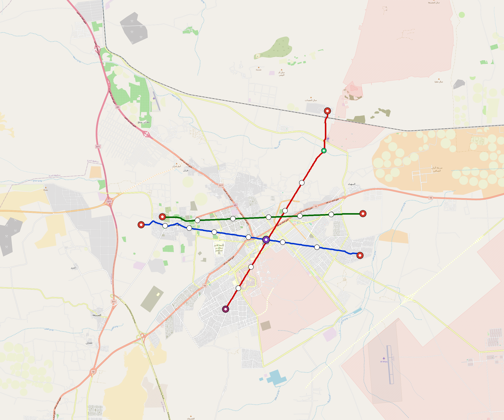

# Al-Kharj — Urban Rail Network

**Country:** SA · **Population:** 400,000 · [National brief](../NATIONAL-BRIEF.md)

This page contains only Al-Kharj-specific results. Shared routing, service, energy, civil, cost, finance, QA and validation methods are defined once in the [deployment planning reference](../../../../../docs/deployment-planning-reference.md).

> [!IMPORTANT]
> **Foreign-capital advantage:** against the default equivalent foreign-turnkey sensitivity, this local plan avoids **$3.28 bn (88.3%) of external capital** and **$4.03 bn of external interest**. Capital plus saved interest totals **$7.32 bn**. See the common reference for interpretation and limitations.

**Population-led network revision (2026-10-09).** The controlled planning inventory contains **13 lines**, including **10 additional residential lines**. **75.4%** of retained 2020 bbox residents are within a 1 km circle of the actual emitted station coordinates. The working target is 80%; remaining areas and station/access alternatives remain in the review. These are distance screens, not current census, surveyed walksheds or fare demand. New common corridor cells have identified junction/structure and access design requirements; no track switch or site approval is inferred. Country fleet, depot, civil, energy, staffing and financing models use the regenerated inventory, with installed quotations and operating acceptance still open. [Line additions and priorities](engineering/alignment/residential-line-expansion.json) · [Actual station coverage and source receipts](engineering/alignment/residential-expansion-evaluation.json).

**Current alignment, depot and production basis.** Core corridors change from **52.183 km to 85.689 km**, with elevated land sections, water-aware radial routes and separately engineered bridge candidates at short water crossings. 0 core fragments retain raster geometry for further curve review. The centre is a design-centroid screen; survey, property, obstacles, foundations and geometry releases remain open. All **81 platform points** pass the retained water-mask screen; footprints, bank stability and access remain open. [Alignment controls](engineering/alignment/core-realignment.json) · [Before/after map](engineering/alignment/core-alignment-comparison.png) · [Water screen](engineering/alignment/station-water-screen.json).

**13 line-local depots** provide **402 full-fleet storage slots**, separate from workshop bays. Fleet length and workload set quantities; PV/storage is included once in depot capital. Site acceptance and installed/land/utility quotations remain open. [Depot costs](engineering/line-depots/README.md). The factory requires **402 light-metro-3car trainsets / 1206 cars**, with **18-month facility readiness**, then qualification and manufacture. Integrated openings wait for fleet readiness where production or test paths constrain them. Shared factory capital is counted once; concurrent national loading and supplier commitments remain open. [Factory and dates](engineering/factory/README.md).

Station staffing uses two posts, two normal eight-hour shifts, plus service-window, leave and training cover. Basic wages start at 1.5 times the retained country income proxy, with higher technical/management grades and employer allowances. [Staff](engineering/delivery/README.md) · [Finance](engineering/finance/summary.json). Finance retains country-specific fixed-price, steady-state assumptions; Baghdad’s indexed cashflows are separate.

Auto-planned by the OpenSourceRail design pipeline from the controlled city catalogue, source-locked geospatial inputs and shared templates. Population is counted once within the union of station circles; this is potential radial access, not a verified walkshed or fare-demand estimate. Reachable line pairs include transfers through intermediate lines. [Population radii, denominator and transfer paths](engineering/access/README.md) · [Viaduct beam, foundation and terrain checks](engineering/clearance/README.md). Capital figures are base planning allowances: route-search scores are excluded from money, while special structures and installed-price gaps remain open. [Cost boundary](../../../../../docs/finance/civil-allowance-boundary.md).

## Network



| Local measure | Value |
|---|---:|
| Lines / unique stations / interchanges | 13 / 81 / 13 |
| Route length | 116.0 km double track |
| Direct transfers / reachable line pairs | 20.5% / 100.0% |
| Residents within 800 m radial station catchments | 174,450 (2020 raster; 58.0% of bbox) |
| Service span / peak headway | 05:30–02:00 / 3 min |
| Fleet | 402 × 3-car `light-metro-3car` trainsets (357 peak revenue) |
| Peak network throughput | 187,200 passengers/hour |
| Practical service capacity | 1,740,960 passenger-trips/day |
| Annual paid-trip planning range | 317.7–508.4 M |

### Lines

| Line | Length | Stations | Trainsets | Termini |
|---|---:|---:|---:|---|
| line-1 | 20.4 km | 12 | 65 | E Outer ↔ W Outer |
| line-2 | 20.8 km | 15 | 68 | NE Outer ↔ S Mid |
| line-3 | 17.2 km | 12 | 54 | W Mid ↔ E Outer |
| line-4 |  5.0 km | 4 | 18 | S Mid ↔ SW Inner |
| line-5 |  4.0 km | 3 | 15 | NW Inner ↔ NW Mid |
| line-6 |  2.6 km | 2 | 11 | E Mid ↔ E Mid |
| line-7 |  2.9 km | 2 | 11 | E Mid ↔ SE Mid |
| line-8 |  4.2 km | 3 | 15 | E Mid ↔ E Outer |
| line-9 |  8.1 km | 5 | 28 | NE Inner ↔ N Outer |
| line-10 |  9.0 km | 6 | 34 | S Mid ↔ SW Outer |
| line-11 | 10.2 km | 7 | 37 | W Mid ↔ NW Outer |
| line-12 |  9.0 km | 8 | 35 | W Mid ↔ S Mid |
| line-13 |  2.6 km | 2 | 11 | NE Outer ↔ NE Outer |
| **Total** | **116.0 km** | **81 unique** | **402** | |

## Energy

| Local measure | Value |
|---|---:|
| Scheduled service | 6,045 one-way journeys / 53,953 train-km/day |
| Annual traction demand | 255.2 GWh |
| Station/depot PV / storage | 83.6 MW / 551.0 MWh |
| Aggregate charging power | 37.5 MW |
| Dedicated solar plant | 37.9 MW |
| Residual grid/PPA import | 0.0 GWh/yr |
| Worst powered-stop gap | line-11: 6.5 km / 52 kWh |
| Lowest traversal charging margin | line-11: 23 kWh |

## Capital And Funding

| Local CAPEX bucket | Planning value |
|---|---:|
| Civil works | $940 M |
| Stations | $376 M |
| Depots | $209 M |
| Rolling stock | $362 M |
| Dedicated solar plant | $30 M |
| Residual train control | $5.8 M |
| Charging microgrids | $7.7 M |
| EPC / project services | $133 M |
| **Total city programme** | **$2.06 bn** |

| Local funding measure | Planning value |
|---|---:|
| Imported / external capital | $435 M (21.1%) |
| Domestic / local capital | $1.63 bn (78.9%) |
| Annual public construction commitment | $143 M / yr for 5 years |
| Annual post-grace debt service | $100 M / yr |
| External capital saved vs default turnkey sensitivity | $3.28 bn |
| Capital + lifetime external interest saved | $7.32 bn |
| Annual OPEX | $134 M / yr |

## Local Evidence

| Package | Current status | Evidence |
|---|---|---|
| Finance | pass | [`summary.json`](engineering/finance/summary.json) |
| Native simulation + degraded cases | pass | [`validation-summary.json`](engineering/simulation/validation-summary.json) |
| SUMO timetable | pass | [`summary.json`](engineering/sumo/summary.json) |
| Independent OSR/SUMO running-time cross-check | pass; junction/authority gate open | [`operations-crosscheck.md`](engineering/simulation/operations-crosscheck.md) |
| GIS package | pass | [`summary.json`](engineering/gis/summary.json) |
| Solar/storage snapshot (operating duty unverified) | pass; 0 findings; 25 grid-only diagnostics | [`summary.json`](engineering/energy/summary.json) |
| Operations, QA and maintenance | 889 assets / 5,074 tasks | [`al-kharj-operations-manifest.json`](operations/al-kharj-operations-manifest.json) |

## Local Files And Regeneration

| File | Local role |
|---|---|
| [`design.toml`](design.toml) | Authoritative generated city design |
| [`al-kharj.toml`](al-kharj.toml) | Expanded simulator scenario |
| [`al-kharj.corridor.geojson`](al-kharj.corridor.geojson) | GIS corridor and stations |
| [`al-kharj.design-quality.yaml`](al-kharj.design-quality.yaml) | Coverage, source and civil-quality gates |

```bash
tools/automation/regenerate-city.sh al-kharj
```
