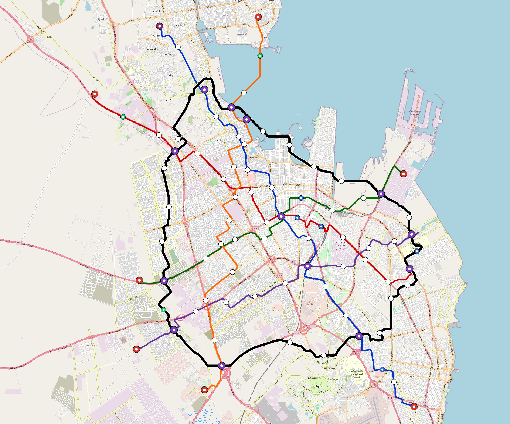

# Dammam — Urban Rail Network

**Country:** SA · **Population:** 1,500,000 · [National brief](../NATIONAL-BRIEF.md)

This page contains only Dammam-specific results. Shared routing, service, energy, civil, cost, finance, QA and validation methods are defined once in the [deployment planning reference](../../../../../docs/deployment-planning-reference.md).

> [!IMPORTANT]
> **Foreign-capital advantage:** against the default equivalent foreign-turnkey sensitivity, this local plan avoids **$3.44 bn (86.9%) of external capital** and **$4.23 bn of external interest**. Capital plus saved interest totals **$7.66 bn**. See the common reference for interpretation and limitations.

Auto-planned by the OpenSourceRail design pipeline from the controlled city catalogue, source-locked geospatial inputs and shared templates.

## Network



| Local measure | Value |
|---|---:|
| Lines / unique stations / interchanges | 6 / 97 / 13 |
| Route length | 272.9 km double track |
| Coverage / transfer reachability | 48.9% / 60% |
| Estimated station catchment | 733,500 residents |
| Service span / peak headway | 05:30–02:00 / 3 min |
| Fleet | 325 × 4-car `metro-4car` trainsets (293 peak revenue) |
| Peak network throughput | 115,200 passengers/hour |
| Practical service capacity | 982,080 passenger-trips/day |
| Annual paid-trip planning range | 179.2–286.8 M |

### Lines

| Line | Length | Stations | Trainsets | Termini |
|---|---:|---:|---:|---|
| line-1 | 45.8 km | 17 | 72 | SE Outer ↔ NW Outer |
| line-2 | 37.7 km | 15 | 61 | NW Outer ↔ E Mid |
| line-3 | 29.8 km | 11 | 48 | E Mid ↔ SW Mid |
| line-4 | 31.9 km | 11 | 49 | SW Outer ↔ E Mid |
| line-5 | 40.5 km | 15 | 63 | N Outer ↔ S Outer |
| line-6 | 87.2 km | 28 | 32 | NW Mid ↔ NW Mid |
| **Total** | **272.9 km** | **97 unique** | **325** | |

## Energy

| Local measure | Value |
|---|---:|
| Scheduled service | 2,558 one-way journeys / 106,632 train-km/day |
| Annual traction demand | 672.5 GWh |
| Station/depot PV / storage | 32.9 MW / 179.5 MWh |
| Aggregate charging power | 141.0 MW |
| Dedicated solar plant | 315.3 MW |
| Residual grid/PPA import | 0.0 GWh/yr |
| Worst powered-stop gap | line-2: 7.0 km / 75 kWh |
| Lowest traversal charging margin | line-4: 211 kWh |

## Capital And Funding

| Local CAPEX bucket | Planning value |
|---|---:|
| Civil works | $878 M |
| Stations | $524 M |
| Depots | $8.0 M |
| Rolling stock | $364 M |
| Dedicated solar plant | $252 M |
| Residual train control | $14 M |
| Charging microgrids | $31 M |
| EPC / project services | $127 M |
| **Total city programme** | **$2.20 bn** |

| Local funding measure | Planning value |
|---|---:|
| Imported / external capital | $518 M (23.6%) |
| Domestic / local capital | $1.68 bn (76.4%) |
| Annual public construction commitment | $151 M / yr for 5 years |
| Annual post-grace debt service | $107 M / yr |
| External capital saved vs default turnkey sensitivity | $3.44 bn |
| Capital + lifetime external interest saved | $7.66 bn |
| Annual OPEX | $80 M / yr |

## Local Evidence

**Evidence refresh required.** Retained passing results below are unverified.
The strict README generator rejected the evidence: engineering/simulation/validation-summary.json describes scenario SHA-256 6b739f52972f2c2e5811bfaee62632cb6022f4e446766626dda0661525e8a51d, but dammam.toml is dcaa1e5f2460aacd1e67f96c5deec9a0e748e3d20e6f8363c35aec541b0c3a51; rerun and update the validation evidence. This audit view does not accept or replace the retained solver results.

| Package | Current status | Evidence |
|---|---|---|
| Finance | unverified | [`summary.json`](engineering/finance/summary.json) |
| Native simulation + degraded cases | unverified | [`validation-summary.json`](engineering/simulation/validation-summary.json) |
| SUMO timetable | unverified | [`summary.json`](engineering/sumo/summary.json) |
| Independent OSR/SUMO running-time cross-check | missing/fail; junction/authority gate open | not generated |
| GIS package | unverified | [`summary.json`](engineering/gis/summary.json) |
| Solar/storage snapshot (operating duty unverified) | unverified; 0 findings; 52 grid-only diagnostics | [`summary.json`](engineering/energy/summary.json) |
| Operations, QA and maintenance | 870 assets / 3,764 tasks | [`dammam-operations-manifest.json`](operations/dammam-operations-manifest.json) |

## Local Files And Regeneration

| File | Local role |
|---|---|
| [`design.toml`](design.toml) | Authoritative generated city design |
| [`dammam.toml`](dammam.toml) | Expanded simulator scenario |
| [`dammam.corridor.geojson`](dammam.corridor.geojson) | GIS corridor and stations |
| [`dammam.design-quality.yaml`](dammam.design-quality.yaml) | Coverage, source and civil-quality gates |

```bash
tools/automation/regenerate-city.sh dammam
```
