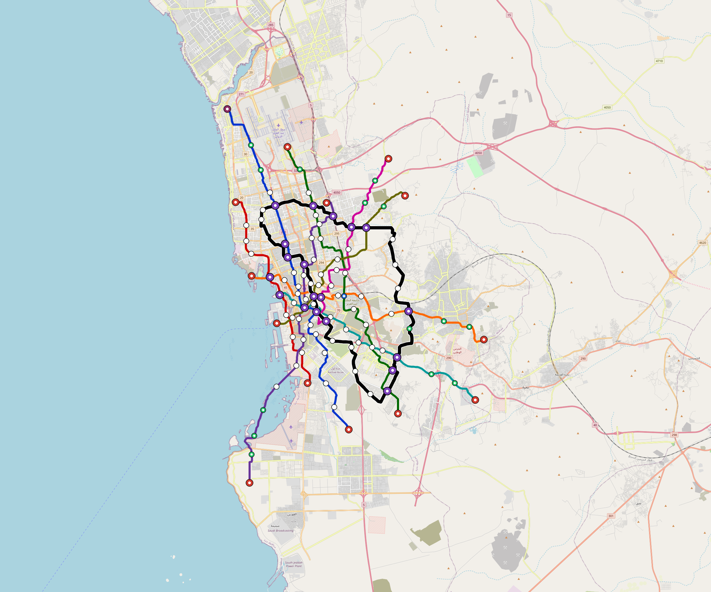

# Jeddah — Urban Rail Network

**Country:** SA · **Population:** 4,700,000 · [National brief](../NATIONAL-BRIEF.md)

This page contains only Jeddah-specific results. Shared routing, service, energy, civil, cost, finance, QA and validation methods are defined once in the [deployment planning reference](../../../../../docs/deployment-planning-reference.md).

> [!IMPORTANT]
> **Foreign-capital advantage:** against the default equivalent foreign-turnkey sensitivity, this local plan avoids **$5.78 bn (85.4%) of external capital** and **$7.11 bn of external interest**. Capital plus saved interest totals **$12.90 bn**. See the common reference for interpretation and limitations.

Auto-planned by the OpenSourceRail design pipeline from the controlled city catalogue, source-locked geospatial inputs and shared templates.

## Network



| Local measure | Value |
|---|---:|
| Lines / unique stations / interchanges | 9 / 127 / 19 |
| Route length | 375.4 km double track |
| Coverage / transfer reachability | 69.3% / 44% |
| Estimated station catchment | 3,257,099 residents |
| Service span / peak headway | 05:30–02:00 / 3 min |
| Fleet | 592 × 6-car `metro-6car` trainsets (535 peak revenue) |
| Peak network throughput | 259,200 passengers/hour |
| Practical service capacity | 2,276,640 passenger-trips/day |
| Annual paid-trip planning range | 415.5–664.8 M |

### Lines

| Line | Length | Stations | Trainsets | Termini |
|---|---:|---:|---:|---|
| line-1 | 50.2 km | 17 | 93 | S Mid ↔ NW Outer |
| line-2 | 28.7 km | 10 | 51 | S Mid ↔ NW Mid |
| line-3 | 44.4 km | 14 | 81 | N Outer ↔ SE Outer |
| line-4 | 43.6 km | 17 | 86 | N Mid ↔ S Outer |
| line-5 | 37.1 km | 12 | 72 | E Outer ↔ W Mid |
| line-6 | 32.4 km | 12 | 63 | SE Outer ↔ W Inner |
| line-7 | 29.0 km | 9 | 54 | NE Outer ↔ S Inner |
| line-8 | 27.4 km | 10 | 54 | NE Mid ↔ SW Inner |
| line-9 | 82.5 km | 26 | 38 | NW Mid ↔ NW Mid |
| **Total** | **375.4 km** | **127 unique** | **592** | |

## Energy

| Local measure | Value |
|---|---:|
| Scheduled service | 3,952 one-way journeys / 155,381 train-km/day |
| Annual traction demand | 1,470.0 GWh |
| Station/depot PV / storage | 38.6 MW / 264.0 MWh |
| Aggregate charging power | 226.0 MW |
| Dedicated solar plant | 727.5 MW |
| Residual grid/PPA import | 0.0 GWh/yr |
| Worst powered-stop gap | line-4: 14.4 km / 232 kWh |
| Lowest traversal charging margin | line-7: 172 kWh |

## Capital And Funding

| Local CAPEX bucket | Planning value |
|---|---:|
| Civil works | $1.22 bn |
| Stations | $686 M |
| Depots | $8.0 M |
| Rolling stock | $995 M |
| Dedicated solar plant | $582 M |
| Residual train control | $19 M |
| Charging microgrids | $50 M |
| EPC / project services | $208 M |
| **Total city programme** | **$3.76 bn** |

| Local funding measure | Planning value |
|---|---:|
| Imported / external capital | $992 M (26.4%) |
| Domestic / local capital | $2.77 bn (73.6%) |
| Annual public construction commitment | $255 M / yr for 5 years |
| Annual post-grace debt service | $184 M / yr |
| External capital saved vs default turnkey sensitivity | $5.78 bn |
| Capital + lifetime external interest saved | $12.90 bn |
| Annual OPEX | $138 M / yr |

## Local Evidence

**Evidence refresh required.** Retained passing results below are unverified.
The strict README generator rejected the evidence: engineering/simulation/validation-summary.json describes scenario SHA-256 d72f7ff4554d888588bbac8435bf6419b6ff89be55af8757313992e85f7114bb, but jeddah.toml is 9117fa3076e3f256081689045cf45e9b65e76ef1342ed0ad35d2de8ec948e828; rerun and update the validation evidence. This audit view does not accept or replace the retained solver results.

| Package | Current status | Evidence |
|---|---|---|
| Finance | unverified | [`summary.json`](engineering/finance/summary.json) |
| Native simulation + degraded cases | unverified | [`validation-summary.json`](engineering/simulation/validation-summary.json) |
| SUMO timetable | unverified | [`summary.json`](engineering/sumo/summary.json) |
| Independent OSR/SUMO running-time cross-check | unverified; junction/authority gate open | [`operations-crosscheck.md`](engineering/simulation/operations-crosscheck.md) |
| GIS package | unverified | [`summary.json`](engineering/gis/summary.json) |
| Solar/storage snapshot (operating duty unverified) | unverified; 0 findings; 58 grid-only diagnostics | [`summary.json`](engineering/energy/summary.json) |
| Operations, QA and maintenance | 1,322 assets / 7,648 tasks | [`jeddah-operations-manifest.json`](operations/jeddah-operations-manifest.json) |

## Local Files And Regeneration

| File | Local role |
|---|---|
| [`design.toml`](design.toml) | Authoritative generated city design |
| [`jeddah.toml`](jeddah.toml) | Expanded simulator scenario |
| [`jeddah.corridor.geojson`](jeddah.corridor.geojson) | GIS corridor and stations |
| [`jeddah.design-quality.yaml`](jeddah.design-quality.yaml) | Coverage, source and civil-quality gates |

```bash
tools/automation/regenerate-city.sh jeddah
```
