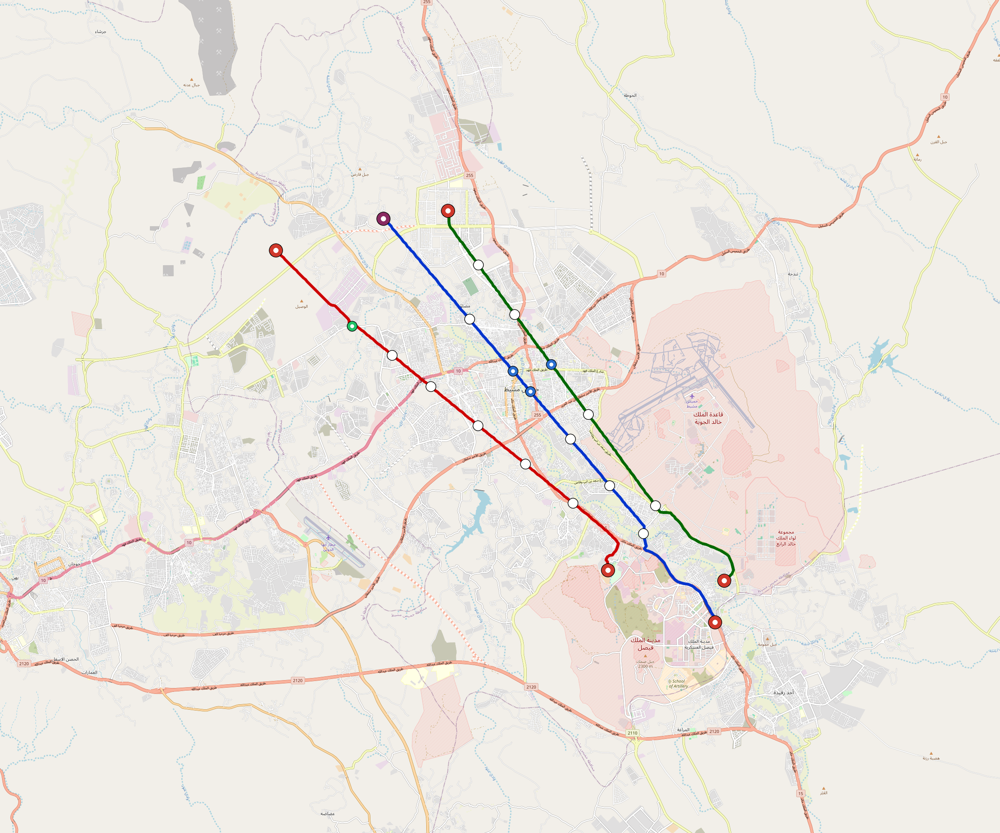

# Khamis-Mushait — Urban Rail Network

**Country:** SA · **Population:** 600,000 · [National brief](../NATIONAL-BRIEF.md)

This page contains only Khamis-Mushait-specific results. Shared routing, service, energy, civil, cost, finance, QA and validation methods are defined once in the [deployment planning reference](../../../../../docs/deployment-planning-reference.md).

> [!IMPORTANT]
> **Foreign-capital advantage:** against the default equivalent foreign-turnkey sensitivity, this local plan avoids **$4.35 bn (88.4%) of external capital** and **$5.35 bn of external interest**. Capital plus saved interest totals **$9.70 bn**. See the common reference for interpretation and limitations.

**Population-led network revision (2026-10-09).** The controlled planning inventory contains **17 lines**, including **14 additional residential lines**. **68.0%** of retained 2020 bbox residents are within a 1 km circle of the actual emitted station coordinates. The working target is 80%; remaining areas and station/access alternatives remain in the review. These are distance screens, not current census, surveyed walksheds or fare demand. New common corridor cells have identified junction/structure and access design requirements; no track switch or site approval is inferred. Country fleet, depot, civil, energy, staffing and financing models use the regenerated inventory, with installed quotations and operating acceptance still open. [Line additions and priorities](engineering/alignment/residential-line-expansion.json) · [Actual station coverage and source receipts](engineering/alignment/residential-expansion-evaluation.json).

**Current alignment, depot and production basis.** Core corridors change from **59.360 km to 103.596 km**, with elevated land sections, water-aware radial routes and separately engineered bridge candidates at short water crossings. 0 core fragments retain raster geometry for further curve review. The centre is a design-centroid screen; survey, property, obstacles, foundations and geometry releases remain open. All **95 platform points** pass the retained water-mask screen; footprints, bank stability and access remain open. [Alignment controls](engineering/alignment/core-realignment.json) · [Before/after map](engineering/alignment/core-alignment-comparison.png) · [Water screen](engineering/alignment/station-water-screen.json).

**17 line-local depots** provide **510 full-fleet storage slots**, separate from workshop bays. Fleet length and workload set quantities; PV/storage is included once in depot capital. Site acceptance and installed/land/utility quotations remain open. [Depot costs](engineering/line-depots/README.md). The factory requires **510 light-metro-3car trainsets / 1530 cars**, with **18-month facility readiness**, then qualification and manufacture. Integrated openings wait for fleet readiness where production or test paths constrain them. Shared factory capital is counted once; concurrent national loading and supplier commitments remain open. [Factory and dates](engineering/factory/README.md).

Station staffing uses two posts, two normal eight-hour shifts, plus service-window, leave and training cover. Basic wages start at 1.5 times the retained country income proxy, with higher technical/management grades and employer allowances. [Staff](engineering/delivery/README.md) · [Finance](engineering/finance/summary.json). Finance retains country-specific fixed-price, steady-state assumptions; Baghdad’s indexed cashflows are separate.

Auto-planned by the OpenSourceRail design pipeline from the controlled city catalogue, source-locked geospatial inputs and shared templates. Population is counted once within the union of station circles; this is potential radial access, not a verified walkshed or fare-demand estimate. Reachable line pairs include transfers through intermediate lines. [Population radii, denominator and transfer paths](engineering/access/README.md) · [Viaduct beam, foundation and terrain checks](engineering/clearance/README.md). Capital figures are base planning allowances: route-search scores are excluded from money, while special structures and installed-price gaps remain open. [Cost boundary](../../../../../docs/finance/civil-allowance-boundary.md).

## Network



| Local measure | Value |
|---|---:|
| Lines / unique stations / interchanges | 17 / 95 / 24 |
| Route length | 147.2 km double track |
| Direct transfers / reachable line pairs | 17.6% / 61.8% |
| Residents within 800 m radial station catchments | 268,970 (2020 raster; 51.3% of bbox) |
| Service span / peak headway | 05:30–02:00 / 3 min |
| Fleet | 510 × 3-car `light-metro-3car` trainsets (453 peak revenue) |
| Peak network throughput | 244,800 passengers/hour |
| Practical service capacity | 2,276,640 passenger-trips/day |
| Annual paid-trip planning range | 415.5–664.8 M |

### Lines

| Line | Length | Stations | Trainsets | Termini |
|---|---:|---:|---:|---|
| line-1 | 26.4 km | 13 | 81 | SE Outer ↔ NW Outer |
| line-2 | 23.4 km | 15 | 78 | SE Mid ↔ NW Outer |
| line-3 | 23.9 km | 14 | 81 | NW Mid ↔ SE Outer |
| line-4 |  3.6 km | 3 | 14 | NW Inner ↔ NW Mid |
| line-5 |  6.0 km | 4 | 21 | E Inner ↔ N Mid |
| line-6 |  4.3 km | 3 | 15 | SW Inner ↔ SW Mid |
| line-7 |  5.6 km | 5 | 21 | SE Outer ↔ SE Mid |
| line-8 |  5.8 km | 5 | 23 | N Inner ↔ NE Mid |
| line-9 |  5.2 km | 3 | 18 | NW Mid ↔ N Outer |
| line-10 |  5.3 km | 4 | 19 | NW Outer ↔ NW Mid |
| line-11 |  2.4 km | 2 | 10 | SE Inner ↔ S Inner |
| line-12 | 12.4 km | 8 | 43 | N Inner ↔ NE Outer |
| line-13 |  2.7 km | 2 | 11 | SW Inner ↔ N Inner |
| line-14 |  2.0 km | 2 | 10 | S Inner ↔ SE Inner |
| line-15 | 11.8 km | 7 | 39 | W Inner ↔ SE Mid |
| line-16 |  4.2 km | 3 | 16 | W Mid ↔ W Outer |
| line-17 |  2.2 km | 2 | 10 | W Mid ↔ W Mid |
| **Total** | **147.2 km** | **95 unique** | **510** | |

## Energy

| Local measure | Value |
|---|---:|
| Scheduled service | 7,905 one-way journeys / 68,425 train-km/day |
| Annual traction demand | 323.7 GWh |
| Station/depot PV / storage | 104.8 MW / 746.0 MWh |
| Aggregate charging power | 83.0 MW |
| Dedicated solar plant | 49.4 MW |
| Residual grid/PPA import | 0.0 GWh/yr |
| Worst powered-stop gap | line-12: 7.3 km / 59 kWh |
| Lowest traversal charging margin | line-16: 61 kWh |

## Capital And Funding

| Local CAPEX bucket | Planning value |
|---|---:|
| Civil works | $1.28 bn |
| Stations | $484 M |
| Depots | $271 M |
| Rolling stock | $459 M |
| Dedicated solar plant | $40 M |
| Residual train control | $7.4 M |
| Charging microgrids | $17 M |
| EPC / project services | $176 M |
| **Total city programme** | **$2.73 bn** |

| Local funding measure | Planning value |
|---|---:|
| Imported / external capital | $572 M (20.9%) |
| Domestic / local capital | $2.16 bn (79.1%) |
| Annual public construction commitment | $190 M / yr for 5 years |
| Annual post-grace debt service | $132 M / yr |
| External capital saved vs default turnkey sensitivity | $4.35 bn |
| Capital + lifetime external interest saved | $9.70 bn |
| Annual OPEX | $169 M / yr |

## Local Evidence

| Package | Current status | Evidence |
|---|---|---|
| Finance | pass | [`summary.json`](engineering/finance/summary.json) |
| Native simulation + degraded cases | pass | [`validation-summary.json`](engineering/simulation/validation-summary.json) |
| SUMO timetable | pass | [`summary.json`](engineering/sumo/summary.json) |
| Independent OSR/SUMO running-time cross-check | pass; junction/authority gate open | [`operations-crosscheck.md`](engineering/simulation/operations-crosscheck.md) |
| GIS package | pass | [`summary.json`](engineering/gis/summary.json) |
| Solar/storage snapshot (operating duty unverified) | pass; 0 findings; 17 grid-only diagnostics | [`summary.json`](engineering/energy/summary.json) |
| Operations, QA and maintenance | 1,085 assets / 6,278 tasks | [`khamis-mushait-operations-manifest.json`](operations/khamis-mushait-operations-manifest.json) |

## Local Files And Regeneration

| File | Local role |
|---|---|
| [`design.toml`](design.toml) | Authoritative generated city design |
| [`khamis-mushait.toml`](khamis-mushait.toml) | Expanded simulator scenario |
| [`khamis-mushait.corridor.geojson`](khamis-mushait.corridor.geojson) | GIS corridor and stations |
| [`khamis-mushait.design-quality.yaml`](khamis-mushait.design-quality.yaml) | Coverage, source and civil-quality gates |

```bash
tools/automation/regenerate-city.sh khamis-mushait
```
