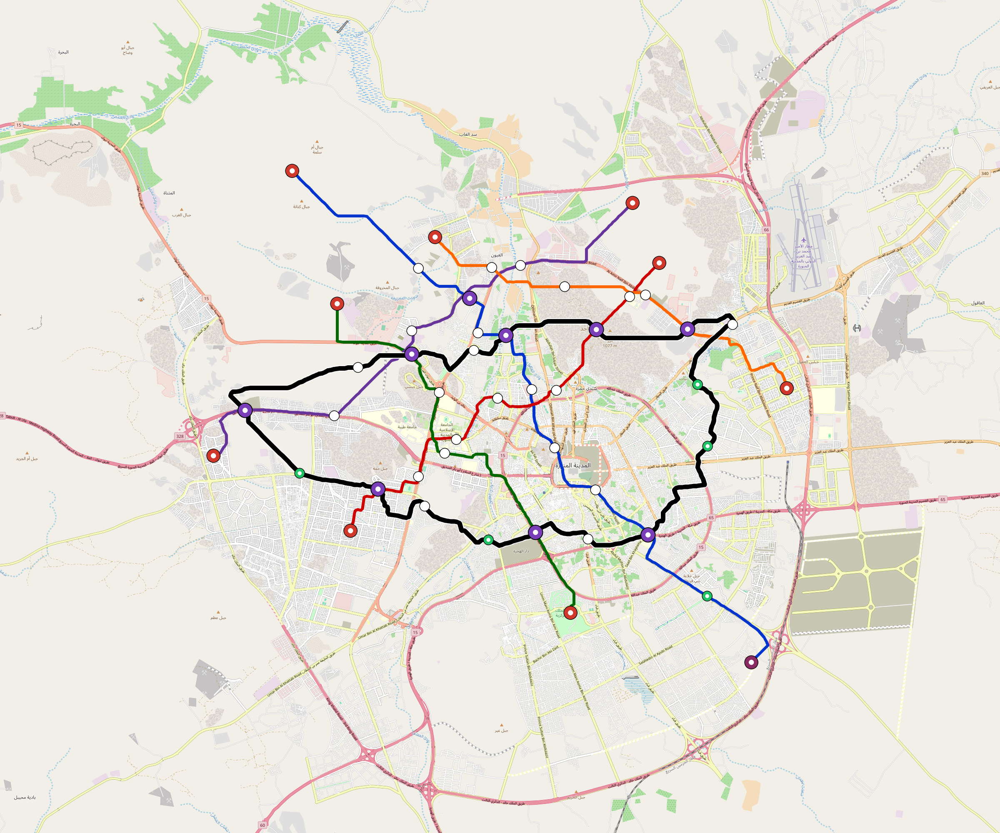

# Medina — Urban Rail Network

**Country:** SA · **Population:** 1,500,000 · [National brief](../NATIONAL-BRIEF.md)

This page contains only Medina-specific results. Shared routing, service, energy, civil, cost, finance, QA and validation methods are defined once in the [deployment planning reference](../../../../../docs/deployment-planning-reference.md).

> [!IMPORTANT]
> **Foreign-capital advantage:** against the default equivalent foreign-turnkey sensitivity, this local plan avoids **$2.36 bn (87.1%) of external capital** and **$2.90 bn of external interest**. Capital plus saved interest totals **$5.25 bn**. See the common reference for interpretation and limitations.

Auto-planned by the OpenSourceRail design pipeline from the controlled city catalogue, source-locked geospatial inputs and shared templates.

## Network



| Local measure | Value |
|---|---:|
| Lines / unique stations / interchanges | 6 / 57 / 9 |
| Route length | 179.8 km double track |
| Coverage / transfer reachability | 50.8% / 47% |
| Estimated station catchment | 762,000 residents |
| Service span / peak headway | 05:30–02:00 / 3 min |
| Fleet | 212 × 4-car `metro-4car` trainsets (190 peak revenue) |
| Peak network throughput | 115,200 passengers/hour |
| Practical service capacity | 982,080 passenger-trips/day |
| Annual paid-trip planning range | 179.2–286.8 M |

### Lines

| Line | Length | Stations | Trainsets | Termini |
|---|---:|---:|---:|---|
| line-1 | 34.2 km | 11 | 54 | NW Outer ↔ SE Outer |
| line-2 | 21.3 km | 9 | 37 | SW Mid ↔ NE Mid |
| line-3 | 20.7 km | 6 | 32 | NW Mid ↔ S Mid |
| line-4 | 24.2 km | 8 | 37 | NE Mid ↔ W Outer |
| line-5 | 18.7 km | 6 | 28 | NW Mid ↔ E Outer |
| line-6 | 60.8 km | 17 | 24 | E Mid ↔ E Mid |
| **Total** | **179.8 km** | **57 unique** | **212** | |

## Energy

| Local measure | Value |
|---|---:|
| Scheduled service | 2,558 one-way journeys / 69,475 train-km/day |
| Annual traction demand | 438.2 GWh |
| Station/depot PV / storage | 20.3 MW / 116.5 MWh |
| Aggregate charging power | 78.0 MW |
| Dedicated solar plant | 206.8 MW |
| Residual grid/PPA import | 0.0 GWh/yr |
| Worst powered-stop gap | line-6: 13.1 km / 141 kWh |
| Lowest traversal charging margin | line-5: 121 kWh |

## Capital And Funding

| Local CAPEX bucket | Planning value |
|---|---:|
| Civil works | $643 M |
| Stations | $334 M |
| Depots | $8.0 M |
| Rolling stock | $237 M |
| Dedicated solar plant | $165 M |
| Residual train control | $9.0 M |
| Charging microgrids | $17 M |
| EPC / project services | $87 M |
| **Total city programme** | **$1.50 bn** |

| Local funding measure | Planning value |
|---|---:|
| Imported / external capital | $347 M (23.1%) |
| Domestic / local capital | $1.15 bn (76.9%) |
| Annual public construction commitment | $103 M / yr for 5 years |
| Annual post-grace debt service | $73 M / yr |
| External capital saved vs default turnkey sensitivity | $2.36 bn |
| Capital + lifetime external interest saved | $5.25 bn |
| Annual OPEX | $55 M / yr |

## Local Evidence

| Package | Current status | Evidence |
|---|---|---|
| Finance | pass | [`summary.json`](engineering/finance/summary.json) |
| Native simulation + degraded cases | pass | [`validation-summary.json`](engineering/simulation/validation-summary.json) |
| SUMO timetable | pass | [`summary.json`](engineering/sumo/summary.json) |
| GIS package | pass | [`summary.json`](engineering/gis/summary.json) |
| Grid/charging/solar | pass | [`summary.json`](engineering/energy/summary.json) |
| Operations, QA and maintenance | 534 assets / 2,346 tasks | [`medina-operations-manifest.json`](operations/medina-operations-manifest.json) |

## Local Files And Regeneration

| File | Local role |
|---|---|
| [`design.toml`](design.toml) | Authoritative generated city design |
| [`medina.toml`](medina.toml) | Expanded simulator scenario |
| [`medina.corridor.geojson`](medina.corridor.geojson) | GIS corridor and stations |
| [`medina.design-quality.yaml`](medina.design-quality.yaml) | Coverage, source and civil-quality gates |

```bash
tools/automation/regenerate-city.sh medina
```
