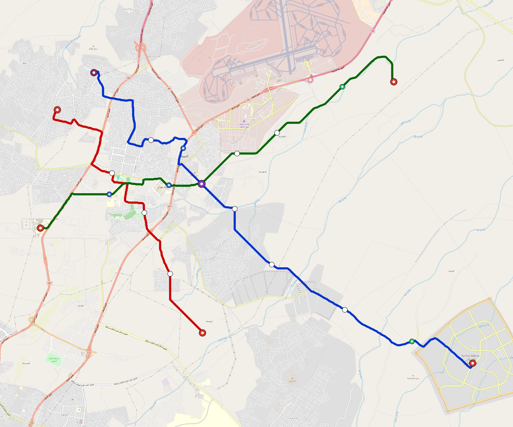

# Taif — Urban Rail Network

**Country:** SA · **Population:** 700,000 · [National brief](../NATIONAL-BRIEF.md)

This page contains only Taif-specific results. Shared routing, service, energy, civil, cost, finance, QA and validation methods are defined once in the [deployment planning reference](../../../../../docs/deployment-planning-reference.md).

> [!IMPORTANT]
> **Foreign-capital advantage:** against the default equivalent foreign-turnkey sensitivity, this local plan avoids **$723 M (86.5%) of external capital** and **$889 M of external interest**. Capital plus saved interest totals **$1.61 bn**. See the common reference for interpretation and limitations.

Auto-planned by the OpenSourceRail design pipeline from the controlled city catalogue, source-locked geospatial inputs and shared templates.

## Network



| Local measure | Value |
|---|---:|
| Lines / unique stations / interchanges | 3 / 22 / 1 |
| Route length | 59.5 km double track |
| Coverage / transfer reachability | 69.3% / 33% |
| Estimated station catchment | 485,099 residents |
| Service span / peak headway | 05:30–02:00 / 3 min |
| Fleet | 125 × 3-car `light-metro-3car` trainsets (113 peak revenue) |
| Peak network throughput | 43,200 passengers/hour |
| Practical service capacity | 401,760 passenger-trips/day |
| Annual paid-trip planning range | 73.3–117.3 M |

### Lines

| Line | Length | Stations | Trainsets | Termini |
|---|---:|---:|---:|---|
| line-1 | 25.7 km | 9 | 53 | SE Outer ↔ NW Mid |
| line-2 | 14.5 km | 5 | 30 | S Mid ↔ NW Mid |
| line-3 | 19.2 km | 8 | 42 | NE Outer ↔ W Mid |
| **Total** | **59.5 km** | **22 unique** | **125** | |

## Energy

| Local measure | Value |
|---|---:|
| Scheduled service | 1,395 one-way journeys / 27,665 train-km/day |
| Annual traction demand | 130.9 GWh |
| Station/depot PV / storage | 10.7 MW / 49.5 MWh |
| Aggregate charging power | 10.0 MW |
| Dedicated solar plant | 56.4 MW |
| Residual grid/PPA import | 0.0 GWh/yr |
| Worst powered-stop gap | line-3: 7.0 km / 57 kWh |
| Lowest traversal charging margin | line-2: 35 kWh |

## Capital And Funding

| Local CAPEX bucket | Planning value |
|---|---:|
| Civil works | $177 M |
| Stations | $89 M |
| Depots | $8.0 M |
| Rolling stock | $112 M |
| Dedicated solar plant | $45 M |
| Residual train control | $3.0 M |
| Charging microgrids | $2.2 M |
| EPC / project services | $27 M |
| **Total city programme** | **$464 M** |

| Local funding measure | Planning value |
|---|---:|
| Imported / external capital | $113 M (24.2%) |
| Domestic / local capital | $352 M (75.8%) |
| Annual public construction commitment | $32 M / yr for 5 years |
| Annual post-grace debt service | $23 M / yr |
| External capital saved vs default turnkey sensitivity | $723 M |
| Capital + lifetime external interest saved | $1.61 bn |
| Annual OPEX | $21 M / yr |

## Local Evidence

**Evidence refresh required.** Retained passing results below are unverified.
The strict README generator rejected the evidence: engineering/simulation/validation-summary.json describes scenario SHA-256 6cd0a702f74a7f385df5dc7b428498513b4b4f9dbca79ce0237b1f13149a95c9, but taif.toml is 671efc27766a9782b604d7daaeef9a39174d91f2a2da8e3dfa0cec6b7bc3b5b1; rerun and update the validation evidence. This audit view does not accept or replace the retained solver results.

| Package | Current status | Evidence |
|---|---|---|
| Finance | unverified | [`summary.json`](engineering/finance/summary.json) |
| Native simulation + degraded cases | unverified | [`validation-summary.json`](engineering/simulation/validation-summary.json) |
| SUMO timetable | unverified | [`summary.json`](engineering/sumo/summary.json) |
| Independent OSR/SUMO running-time cross-check | missing/fail; junction/authority gate open | not generated |
| GIS package | unverified | [`summary.json`](engineering/gis/summary.json) |
| Solar/storage snapshot (operating duty unverified) | unverified; 0 findings; 9 grid-only diagnostics | [`summary.json`](engineering/energy/summary.json) |
| Operations, QA and maintenance | 256 assets / 1,211 tasks | [`taif-operations-manifest.json`](operations/taif-operations-manifest.json) |

## Local Files And Regeneration

| File | Local role |
|---|---|
| [`design.toml`](design.toml) | Authoritative generated city design |
| [`taif.toml`](taif.toml) | Expanded simulator scenario |
| [`taif.corridor.geojson`](taif.corridor.geojson) | GIS corridor and stations |
| [`taif.design-quality.yaml`](taif.design-quality.yaml) | Coverage, source and civil-quality gates |

```bash
tools/automation/regenerate-city.sh taif
```
