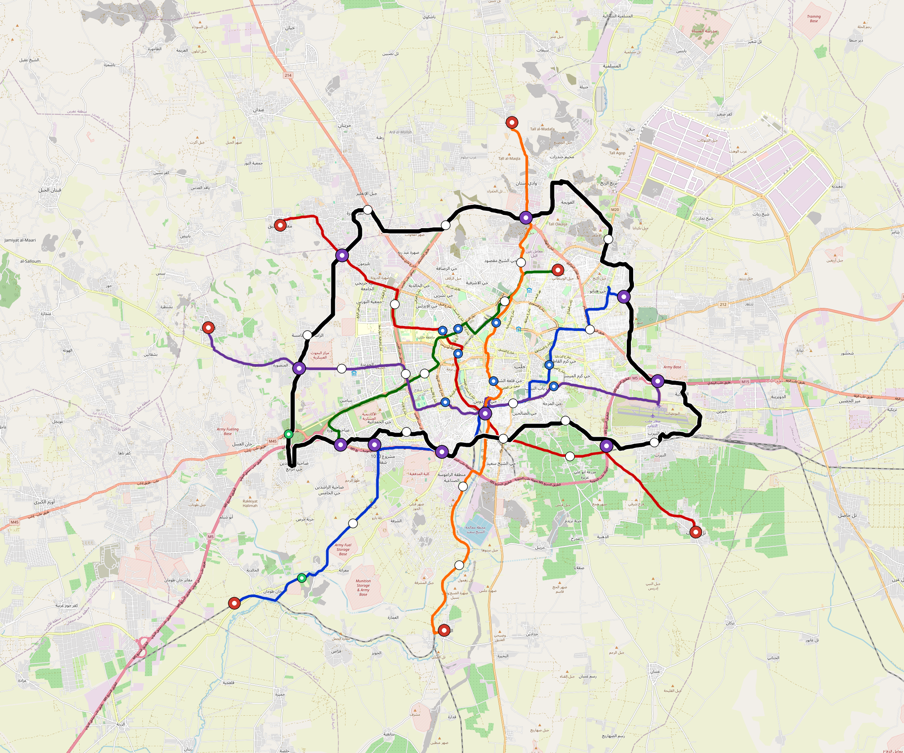

# Aleppo — Urban Rail Network

**Country:** SY · **Population:** 1,639,000 · [National brief](../NATIONAL-BRIEF.md)

This page contains only Aleppo-specific results. Shared routing, service, energy, civil, cost, finance, QA and validation methods are defined once in the [deployment planning reference](../../../../../docs/deployment-planning-reference.md).

> [!IMPORTANT]
> **Foreign-capital advantage:** against the default equivalent foreign-turnkey sensitivity, this local plan avoids **$2.46 bn (86.9%) of external capital** and **$3.17 bn of external interest**. Capital plus saved interest totals **$5.63 bn**. See the common reference for interpretation and limitations.

Auto-planned by the OpenSourceRail design pipeline from the controlled city catalogue, source-locked geospatial inputs and shared templates.

## Network



| Local measure | Value |
|---|---:|
| Lines / unique stations / interchanges | 6 / 62 / 10 |
| Route length | 183.9 km double track |
| Coverage / transfer reachability | 60.8% / 73% |
| Estimated station catchment | 996,512 residents |
| Service span / peak headway | 05:30–02:00 / 3 min |
| Fleet | 219 × 4-car `metro-4car` trainsets (195 peak revenue) |
| Peak network throughput | 115,200 passengers/hour |
| Practical service capacity | 982,080 passenger-trips/day |
| Annual paid-trip planning range | 179.2–286.8 M |

### Lines

| Line | Length | Stations | Trainsets | Termini |
|---|---:|---:|---:|---|
| line-1 | 29.1 km | 11 | 46 | SW Outer ↔ NE Mid |
| line-2 | 28.1 km | 10 | 45 | SE Outer ↔ NW Outer |
| line-3 | 15.2 km | 5 | 24 | NE Mid ↔ SW Mid |
| line-4 | 25.0 km | 8 | 38 | W Outer ↔ E Mid |
| line-5 | 26.6 km | 10 | 42 | N Outer ↔ S Outer |
| line-6 | 59.9 km | 18 | 24 | W Mid ↔ W Mid |
| **Total** | **183.9 km** | **62 unique** | **219** | |

## Energy

| Local measure | Value |
|---|---:|
| Scheduled service | 2,558 one-way journeys / 71,607 train-km/day |
| Annual traction demand | 451.6 GWh |
| Station/depot PV / storage | 22.7 MW / 128.5 MWh |
| Aggregate charging power | 90.0 MW |
| Dedicated solar plant | 232.6 MW |
| Residual grid/PPA import | 0.0 GWh/yr |
| Worst powered-stop gap | line-6: 7.5 km / 72 kWh |
| Lowest traversal charging margin | line-3: 133 kWh |

## Capital And Funding

| Local CAPEX bucket | Planning value |
|---|---:|
| Civil works | $614 M |
| Stations | $397 M |
| Depots | $8.0 M |
| Rolling stock | $245 M |
| Dedicated solar plant | $186 M |
| Residual train control | $9.2 M |
| Charging microgrids | $20 M |
| EPC / project services | $91 M |
| **Total city programme** | **$1.57 bn** |

| Local funding measure | Planning value |
|---|---:|
| Imported / external capital | $369 M (23.5%) |
| Domestic / local capital | $1.20 bn (76.5%) |
| Annual public construction commitment | $233 M / yr for 10 years |
| Annual post-grace debt service | $216 M / yr |
| External capital saved vs default turnkey sensitivity | $2.46 bn |
| Capital + lifetime external interest saved | $5.63 bn |
| Annual OPEX | $34 M / yr |

## Local Evidence

| Package | Current status | Evidence |
|---|---|---|
| Finance | pass | [`summary.json`](engineering/finance/summary.json) |
| Native simulation + degraded cases | pass | [`validation-summary.json`](engineering/simulation/validation-summary.json) |
| SUMO timetable | pass | [`summary.json`](engineering/sumo/summary.json) |
| GIS package | pass | [`summary.json`](engineering/gis/summary.json) |
| Grid/charging/solar | pass | [`summary.json`](engineering/energy/summary.json) |
| Operations, QA and maintenance | 571 assets / 2,481 tasks | [`aleppo-operations-manifest.json`](operations/aleppo-operations-manifest.json) |

## Local Files And Regeneration

| File | Local role |
|---|---|
| [`design.toml`](design.toml) | Authoritative generated city design |
| [`aleppo.toml`](aleppo.toml) | Expanded simulator scenario |
| [`aleppo.corridor.geojson`](aleppo.corridor.geojson) | GIS corridor and stations |
| [`aleppo.design-quality.yaml`](aleppo.design-quality.yaml) | Coverage, source and civil-quality gates |

```bash
tools/automation/regenerate-city.sh aleppo
```
