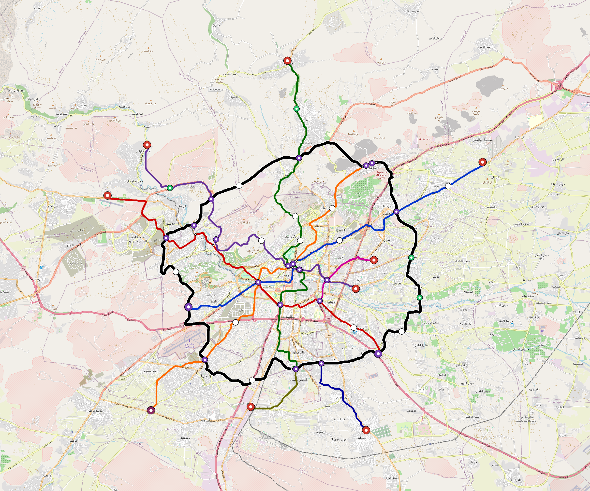

<!-- osr-maglev-primary:start -->
> **Primary v0.5 ferrite-maglev planning:** [Open the current city planning package](engineering/maglev/README.md). Formation, duty, fleet, charging, depot quantities and partial cost allowances are recomputed; physical acceptance remains open.
>
> The material below this notice is the retained v0.4 wheel/rail comparator. Its costs, fleet, geometry and acceptance do not transfer to maglev.
<!-- osr-maglev-primary:end -->

# Damascus — Urban Rail Network

**Country:** SY · **Population:** 2,503,000 · [National brief](../NATIONAL-BRIEF.md)

This page contains only Damascus-specific results. Shared routing, service, energy, civil, cost, finance, QA and validation methods are defined once in the [deployment planning reference](../../../../../docs/deployment-planning-reference.md).

> [!IMPORTANT]
> **Foreign-capital advantage:** against the default equivalent foreign-turnkey sensitivity, this local plan avoids **$6.20 bn (88.9%) of external capital** and **$8.01 bn of external interest**. Capital plus saved interest totals **$14.22 bn**. See the common reference for interpretation and limitations.

**Population-led network revision (2026-10-12).** The controlled planning inventory contains **9 lines**, including **3 additional residential lines**. **41.2%** of retained 2020 bbox residents are within a 1 km circle of the actual emitted station coordinates. The working target is 80%; remaining areas and station/access alternatives remain in the review. These are distance screens, not current census, surveyed walksheds or fare demand. New common corridor cells have identified junction/structure and access design requirements; no track switch or site approval is inferred. Country fleet, depot, civil, energy, staffing and financing models use the regenerated inventory, with installed quotations and operating acceptance still open. [Line additions and priorities](engineering/alignment/residential-line-expansion.json) · [Actual station coverage and source receipts](engineering/alignment/residential-expansion-evaluation.json).

**Current alignment, depot and production basis.** Core corridors change from **165.310 km to 196.698 km**, with elevated land sections, water-aware radial routes and separately engineered bridge candidates at short water crossings. 0 core fragments retain raster geometry for further curve review. The centre is a design-centroid screen; survey, property, obstacles, foundations and geometry releases remain open. All **111 platform points** pass the retained water-mask screen; footprints, bank stability and access remain open. [Alignment controls](engineering/alignment/core-realignment.json) · [Before/after map](engineering/alignment/core-alignment-comparison.png) · [Water screen](engineering/alignment/station-water-screen.json).

**9 line-local depots** provide **348 full-fleet storage slots**, separate from workshop bays. Fleet length and workload set quantities; PV/storage is included once in depot capital. Site acceptance and installed/land/utility quotations remain open. [Depot costs](engineering/line-depots/README.md). The factory requires **348 metro-4car trainsets / 1392 cars**, with **18-month facility readiness**, then qualification and manufacture. Integrated openings wait for fleet readiness where production or test paths constrain them. Shared factory capital is counted once; concurrent national loading and supplier commitments remain open. [Factory and dates](engineering/factory/README.md).

Station staffing uses two posts, two normal eight-hour shifts, plus service-window, leave and training cover. Basic wages start at 1.5 times the retained country income proxy, with higher technical/management grades and employer allowances. [Staff](engineering/delivery/README.md) · [Finance](engineering/finance/summary.json). Finance retains country-specific fixed-price, steady-state assumptions; Baghdad’s indexed cashflows are separate.

Auto-planned by the OpenSourceRail design pipeline from the controlled city catalogue, source-locked geospatial inputs and shared templates. Population is counted once within the union of station circles; this is potential radial access, not a verified walkshed or fare-demand estimate. Reachable line pairs include transfers through intermediate lines. [Population radii, denominator and transfer paths](engineering/access/README.md) · [Viaduct beam, foundation and terrain checks](engineering/clearance/README.md). Capital figures are base planning allowances: route-search scores are excluded from money, while special structures and installed-price gaps remain open. [Cost boundary](../../../../../docs/finance/civil-allowance-boundary.md).

## Network



| Local measure | Value |
|---|---:|
| Lines / unique stations / interchanges | 9 / 111 / 20 |
| Route length | 228.2 km double track |
| Direct transfers / reachable line pairs | 55.6% / 100.0% |
| Residents within 800 m radial station catchments | 1,220,380 (2020 raster; 28.6% of bbox) |
| Service span / peak headway | 05:30–02:00 / 3 min |
| Fleet | 348 × 4-car `metro-4car` trainsets (310 peak revenue) |
| Peak network throughput | 172,800 passengers/hour |
| Practical service capacity | 1,517,760 passenger-trips/day |
| Annual paid-trip planning range | 277.0–443.2 M |

### Lines

| Line | Length | Stations | Trainsets | Termini |
|---|---:|---:|---:|---|
| line-1 | 28.5 km | 17 | 61 | NE Outer ↔ SW Mid |
| line-2 | 28.9 km | 10 | 47 | SE Mid ↔ W Outer |
| line-3 | 29.4 km | 10 | 46 | S Mid ↔ N Outer |
| line-4 | 26.7 km | 13 | 50 | NW Outer ↔ SE Inner |
| line-5 | 30.1 km | 24 | 78 | NE Mid ↔ SW Outer |
| line-6 | 67.7 km | 29 | 30 | W Mid ↔ W Mid |
| line-7 |  5.5 km | 3 | 13 | SE Inner ↔ E Mid |
| line-8 |  4.9 km | 3 | 12 | S Mid ↔ S Outer |
| line-9 |  6.3 km | 2 | 11 | S Mid ↔ S Outer |
| **Total** | **228.2 km** | **111 unique** | **348** | |

## Energy

| Local measure | Value |
|---|---:|
| Scheduled service | 3,952 one-way journeys / 90,343 train-km/day |
| Annual traction demand | 569.8 GWh |
| Station/depot PV / storage | 74.4 MW / 507.0 MWh |
| Aggregate charging power | 160.5 MW |
| Dedicated solar plant | 213.7 MW |
| Residual grid/PPA import | 0.0 GWh/yr |
| Worst powered-stop gap | line-6: 11.3 km / 122 kWh |
| Lowest traversal charging margin | line-9: 73 kWh |

## Capital And Funding

| Local CAPEX bucket | Planning value |
|---|---:|
| Civil works | $2.12 bn |
| Stations | $737 M |
| Depots | $172 M |
| Rolling stock | $390 M |
| Dedicated solar plant | $171 M |
| Residual train control | $11 M |
| Charging microgrids | $33 M |
| EPC / project services | $243 M |
| **Total city programme** | **$3.88 bn** |

| Local funding measure | Planning value |
|---|---:|
| Imported / external capital | $777 M (20.0%) |
| Domestic / local capital | $3.10 bn (80.0%) |
| Annual public construction commitment | $593 M / yr for 10 years |
| Annual post-grace debt service | $546 M / yr |
| External capital saved vs default turnkey sensitivity | $6.20 bn |
| Capital + lifetime external interest saved | $14.22 bn |
| Annual OPEX | $83 M / yr |

## Local Evidence

| Package | Current status | Evidence |
|---|---|---|
| Finance | pass | [`summary.json`](engineering/finance/summary.json) |
| Native simulation + degraded cases | pass | [`validation-summary.json`](engineering/simulation/validation-summary.json) |
| SUMO timetable | pass | [`summary.json`](engineering/sumo/summary.json) |
| Independent OSR/SUMO running-time cross-check | pass; junction/authority gate open | [`operations-crosscheck.md`](engineering/simulation/operations-crosscheck.md) |
| GIS package | pass | [`summary.json`](engineering/gis/summary.json) |
| Solar/storage snapshot (operating duty unverified) | pass; 0 findings; 12 grid-only diagnostics | [`summary.json`](engineering/energy/summary.json) |
| Operations, QA and maintenance | 969 assets / 5,138 tasks | [`damascus-operations-manifest.json`](operations/damascus-operations-manifest.json) |

## Local Files And Regeneration

| File | Local role |
|---|---|
| [`design.toml`](design.toml) | Authoritative generated city design |
| [`damascus.toml`](damascus.toml) | Expanded simulator scenario |
| [`damascus.corridor.geojson`](damascus.corridor.geojson) | GIS corridor and stations |
| [`damascus.design-quality.yaml`](damascus.design-quality.yaml) | Coverage, source and civil-quality gates |

```bash
tools/automation/regenerate-city.sh damascus
```
