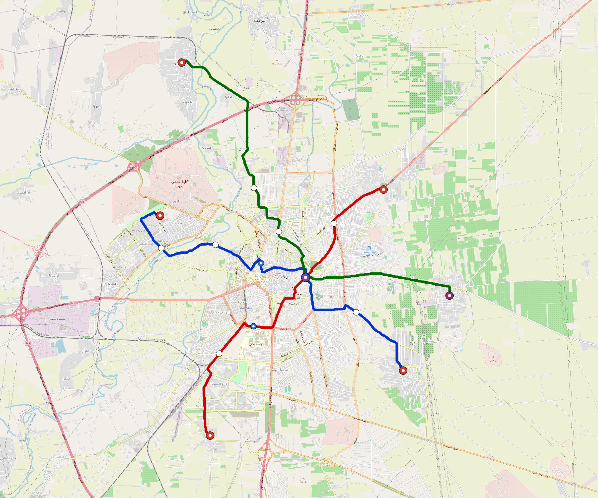

# Homs — Urban Rail Network

**Country:** SY · **Population:** 775,000 · [National brief](../NATIONAL-BRIEF.md)

This page contains only Homs-specific results. Shared routing, service, energy, civil, cost, finance, QA and validation methods are defined once in the [deployment planning reference](../../../../../docs/deployment-planning-reference.md).

> [!IMPORTANT]
> **Foreign-capital advantage:** against the default equivalent foreign-turnkey sensitivity, this local plan avoids **$559 M (86.8%) of external capital** and **$722 M of external interest**. Capital plus saved interest totals **$1.28 bn**. See the common reference for interpretation and limitations.

Auto-planned by the OpenSourceRail design pipeline from the controlled city catalogue, source-locked geospatial inputs and shared templates.

## Network



| Local measure | Value |
|---|---:|
| Lines / unique stations / interchanges | 3 / 18 / 1 |
| Route length | 40.0 km double track |
| Coverage / transfer reachability | 48.1% / 100% |
| Estimated station catchment | 372,775 residents |
| Service span / peak headway | 05:30–02:00 / 3 min |
| Fleet | 87 × 3-car `light-metro-3car` trainsets (78 peak revenue) |
| Peak network throughput | 43,200 passengers/hour |
| Practical service capacity | 401,760 passenger-trips/day |
| Annual paid-trip planning range | 73.3–117.3 M |

### Lines

| Line | Length | Stations | Trainsets | Termini |
|---|---:|---:|---:|---|
| line-1 | 13.4 km | 7 | 30 | NW Mid ↔ SE Outer |
| line-2 | 11.8 km | 6 | 27 | S Outer ↔ NE Mid |
| line-3 | 14.8 km | 5 | 30 | NW Outer ↔ E Outer |
| **Total** | **40.0 km** | **18 unique** | **87** | |

## Energy

| Local measure | Value |
|---|---:|
| Scheduled service | 1,395 one-way journeys / 18,583 train-km/day |
| Annual traction demand | 87.9 GWh |
| Station/depot PV / storage | 10.1 MW / 48.5 MWh |
| Aggregate charging power | 9.0 MW |
| Dedicated solar plant | 38.7 MW |
| Residual grid/PPA import | 0.0 GWh/yr |
| Worst powered-stop gap | line-3: 5.7 km / 41 kWh |
| Lowest traversal charging margin | line-3: 46 kWh |

## Capital And Funding

| Local CAPEX bucket | Planning value |
|---|---:|
| Civil works | $125 M |
| Stations | $90 M |
| Depots | $8.0 M |
| Rolling stock | $78 M |
| Dedicated solar plant | $31 M |
| Residual train control | $2.0 M |
| Charging microgrids | $2.0 M |
| EPC / project services | $21 M |
| **Total city programme** | **$358 M** |

| Local funding measure | Planning value |
|---|---:|
| Imported / external capital | $85 M (23.8%) |
| Domestic / local capital | $272 M (76.2%) |
| Annual public construction commitment | $53 M / yr for 10 years |
| Annual post-grace debt service | $49 M / yr |
| External capital saved vs default turnkey sensitivity | $559 M |
| Capital + lifetime external interest saved | $1.28 bn |
| Annual OPEX | $8.5 M / yr |

## Local Evidence

**Evidence refresh required.** Retained passing results below are unverified.
The strict README generator rejected the evidence: engineering/simulation/validation-summary.json describes scenario SHA-256 40bbbd475ed150bb1157652148599e820ce7d976e7e196f08163734b405e20fe, but homs.toml is 3c9e9f346e3f0575bcdeadfe1c632534e7e398b76346c7e637b72493828406b9; rerun and update the validation evidence. This audit view does not accept or replace the retained solver results.

| Package | Current status | Evidence |
|---|---|---|
| Finance | unverified | [`summary.json`](engineering/finance/summary.json) |
| Native simulation + degraded cases | unverified | [`validation-summary.json`](engineering/simulation/validation-summary.json) |
| SUMO timetable | unverified | [`summary.json`](engineering/sumo/summary.json) |
| Independent OSR/SUMO running-time cross-check | unverified; junction/authority gate open | [`operations-crosscheck.md`](engineering/simulation/operations-crosscheck.md) |
| GIS package | unverified | [`summary.json`](engineering/gis/summary.json) |
| Solar/storage snapshot (operating duty unverified) | unverified; 0 findings; 7 grid-only diagnostics | [`summary.json`](engineering/energy/summary.json) |
| Operations, QA and maintenance | 195 assets / 886 tasks | [`homs-operations-manifest.json`](operations/homs-operations-manifest.json) |

## Local Files And Regeneration

| File | Local role |
|---|---|
| [`design.toml`](design.toml) | Authoritative generated city design |
| [`homs.toml`](homs.toml) | Expanded simulator scenario |
| [`homs.corridor.geojson`](homs.corridor.geojson) | GIS corridor and stations |
| [`homs.design-quality.yaml`](homs.design-quality.yaml) | Coverage, source and civil-quality gates |

```bash
tools/automation/regenerate-city.sh homs
```
