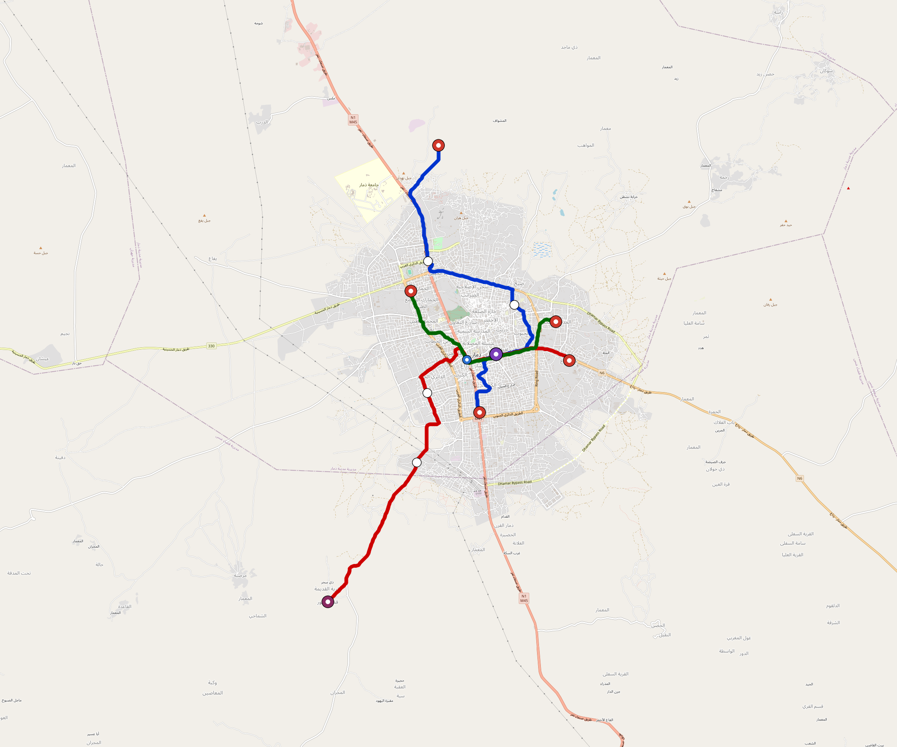

# Dhamar — Urban Rail Network

**Country:** YE · **Population:** 300,000 · [National brief](../NATIONAL-BRIEF.md)

This page contains only Dhamar-specific results. Shared routing, service, energy, civil, cost, finance, QA and validation methods are defined once in the [deployment planning reference](../../../../../docs/deployment-planning-reference.md).

> [!IMPORTANT]
> **Foreign-capital advantage:** against the default equivalent foreign-turnkey sensitivity, this local plan avoids **$323 M (87.7%) of external capital** and **$417 M of external interest**. Capital plus saved interest totals **$740 M**. See the common reference for interpretation and limitations.

Auto-planned by the OpenSourceRail design pipeline from the controlled city catalogue, source-locked geospatial inputs and shared templates.

## Network



| Local measure | Value |
|---|---:|
| Lines / unique stations / interchanges | 3 / 13 / 1 |
| Route length | 29.1 km double track |
| Coverage / transfer reachability | 71.6% / 33% |
| Estimated station catchment | 214,800 residents |
| Service span / peak headway | 05:30–02:00 / 3 min |
| Fleet | 63 × 2-car `tram-2car` trainsets (55 peak revenue) |
| Peak network throughput | 28,800 passengers/hour |
| Practical service capacity | 267,840 passenger-trips/day |
| Annual paid-trip planning range | 48.9–78.2 M |

### Lines

| Line | Length | Stations | Trainsets | Termini |
|---|---:|---:|---:|---|
| line-1 | 11.2 km | 5 | 25 | N Outer ↔ S Inner |
| line-2 | 12.0 km | 5 | 25 | E Mid ↔ SW Outer |
| line-3 |  6.0 km | 3 | 13 | E Mid ↔ NW Inner |
| **Total** | **29.1 km** | **13 unique** | **63** | |

## Energy

| Local measure | Value |
|---|---:|
| Scheduled service | 1,395 one-way journeys / 13,525 train-km/day |
| Annual traction demand | 42.7 GWh |
| Station/depot PV / storage | 8.6 MW / 46.0 MWh |
| Aggregate charging power | 6.5 MW |
| Dedicated solar plant | 12.5 MW |
| Residual grid/PPA import | 0.0 GWh/yr |
| Worst powered-stop gap | line-2: 4.5 km / 24 kWh |
| Lowest traversal charging margin | line-3: 30 kWh |

## Capital And Funding

| Local CAPEX bucket | Planning value |
|---|---:|
| Civil works | $78 M |
| Stations | $58 M |
| Depots | $8.0 M |
| Rolling stock | $35 M |
| Dedicated solar plant | $10 M |
| Residual train control | $1.5 M |
| Charging microgrids | $1.4 M |
| EPC / project services | $13 M |
| **Total city programme** | **$205 M** |

| Local funding measure | Planning value |
|---|---:|
| Imported / external capital | $45 M (22.1%) |
| Domestic / local capital | $159 M (77.9%) |
| Annual public construction commitment | $28 M / yr for 10 years |
| Annual post-grace debt service | $26 M / yr |
| External capital saved vs default turnkey sensitivity | $323 M |
| Capital + lifetime external interest saved | $740 M |
| Annual OPEX | $4.8 M / yr |

## Local Evidence

| Package | Current status | Evidence |
|---|---|---|
| Finance | pass | [`summary.json`](engineering/finance/summary.json) |
| Native simulation + degraded cases | pass | [`validation-summary.json`](engineering/simulation/validation-summary.json) |
| SUMO timetable | pass | [`summary.json`](engineering/sumo/summary.json) |
| GIS package | pass | [`summary.json`](engineering/gis/summary.json) |
| Grid/charging/solar | pass | [`summary.json`](engineering/energy/summary.json) |
| Operations, QA and maintenance | 141 assets / 638 tasks | [`dhamar-operations-manifest.json`](operations/dhamar-operations-manifest.json) |

## Local Files And Regeneration

| File | Local role |
|---|---|
| [`design.toml`](design.toml) | Authoritative generated city design |
| [`dhamar.toml`](dhamar.toml) | Expanded simulator scenario |
| [`dhamar.corridor.geojson`](dhamar.corridor.geojson) | GIS corridor and stations |
| [`dhamar.design-quality.yaml`](dhamar.design-quality.yaml) | Coverage, source and civil-quality gates |

```bash
tools/automation/regenerate-city.sh dhamar
```
