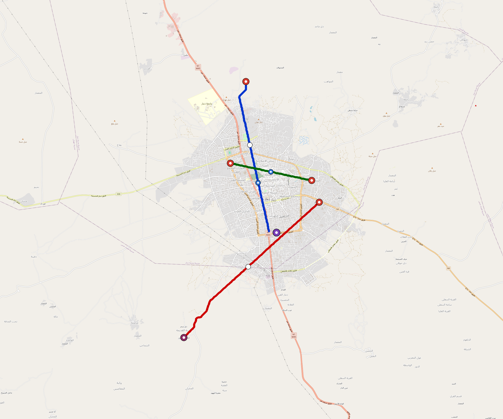

# Dhamar — Urban Rail Network

**Country:** YE · **Population:** 300,000 · [National brief](../NATIONAL-BRIEF.md)

This page contains only Dhamar-specific results. Shared routing, service, energy, civil, cost, finance, QA and validation methods are defined once in the [deployment planning reference](../../../../../docs/deployment-planning-reference.md).

> [!IMPORTANT]
> **Foreign-capital advantage:** against the default equivalent foreign-turnkey sensitivity, this local plan avoids **$1.08 bn (89.1%) of external capital** and **$1.40 bn of external interest**. Capital plus saved interest totals **$2.49 bn**. See the common reference for interpretation and limitations.

**Population-led network revision (2026-10-09).** The controlled planning inventory contains **8 lines**, including **5 additional residential lines**. **71.1%** of retained 2020 bbox residents are within a 1 km circle of the actual emitted station coordinates. The working target is 80%; remaining areas and station/access alternatives remain in the review. These are distance screens, not current census, surveyed walksheds or fare demand. New common corridor cells have identified junction/structure and access design requirements; no track switch or site approval is inferred. Country fleet, depot, civil, energy, staffing and financing models use the regenerated inventory, with installed quotations and operating acceptance still open. [Line additions and priorities](engineering/alignment/residential-line-expansion.json) · [Actual station coverage and source receipts](engineering/alignment/residential-expansion-evaluation.json).

**Current alignment, depot and production basis.** Core corridors change from **26.174 km to 30.498 km**, with elevated land sections, water-aware radial routes and separately engineered bridge candidates at short water crossings. 0 core fragments retain raster geometry for further curve review. The centre is a design-centroid screen; survey, property, obstacles, foundations and geometry releases remain open. All **30 platform points** pass the retained water-mask screen; footprints, bank stability and access remain open. [Alignment controls](engineering/alignment/core-realignment.json) · [Before/after map](engineering/alignment/core-alignment-comparison.png) · [Water screen](engineering/alignment/station-water-screen.json).

**8 line-local depots** provide **110 full-fleet storage slots**, separate from workshop bays. Fleet length and workload set quantities; PV/storage is included once in depot capital. Site acceptance and installed/land/utility quotations remain open. [Depot costs](engineering/line-depots/README.md). The factory requires **110 tram-2car trainsets / 220 cars**, with **18-month facility readiness**, then qualification and manufacture. Integrated openings wait for fleet readiness where production or test paths constrain them. Shared factory capital is counted once; concurrent national loading and supplier commitments remain open. [Factory and dates](engineering/factory/README.md).

Station staffing uses two posts, two normal eight-hour shifts, plus service-window, leave and training cover. Basic wages start at 1.5 times the retained country income proxy, with higher technical/management grades and employer allowances. [Staff](engineering/delivery/README.md) · [Finance](engineering/finance/summary.json). Finance retains country-specific fixed-price, steady-state assumptions; Baghdad’s indexed cashflows are separate.

Auto-planned by the OpenSourceRail design pipeline from the controlled city catalogue, source-locked geospatial inputs and shared templates. Population is counted once within the union of station circles; this is potential radial access, not a verified walkshed or fare-demand estimate. Reachable line pairs include transfers through intermediate lines. [Population radii, denominator and transfer paths](engineering/access/README.md) · [Viaduct beam, foundation and terrain checks](engineering/clearance/README.md). Capital figures are base planning allowances: route-search scores are excluded from money, while special structures and installed-price gaps remain open. [Cost boundary](../../../../../docs/finance/civil-allowance-boundary.md).

## Network



| Local measure | Value |
|---|---:|
| Lines / unique stations / interchanges | 8 / 30 / 6 |
| Route length | 40.2 km double track |
| Direct transfers / reachable line pairs | 28.6% / 46.4% |
| Residents within 800 m radial station catchments | 118,688 (2020 raster; 58.3% of bbox) |
| Service span / peak headway | 05:30–02:00 / 3 min |
| Fleet | 110 × 2-car `tram-2car` trainsets (93 peak revenue) |
| Peak network throughput | 76,800 passengers/hour |
| Practical service capacity | 714,240 passenger-trips/day |
| Annual paid-trip planning range | 130.3–208.6 M |

### Lines

| Line | Length | Stations | Trainsets | Termini |
|---|---:|---:|---:|---|
| line-1 |  7.3 km | 5 | 18 | N Outer ↔ S Inner |
| line-2 |  9.4 km | 6 | 23 | E Mid ↔ SW Outer |
| line-3 |  3.9 km | 4 | 13 | E Mid ↔ NW Inner |
| line-4 |  2.3 km | 3 | 10 | N Inner ↔ NE Inner |
| line-5 |  2.4 km | 2 | 8 | E Mid ↔ E Outer |
| line-6 |  4.2 km | 3 | 11 | N Mid ↔ N Outer |
| line-7 |  6.2 km | 4 | 15 | N Inner ↔ W Outer |
| line-8 |  4.5 km | 3 | 12 | S Mid ↔ S Outer |
| **Total** | **40.2 km** | **30 unique** | **110** | |

## Energy

| Local measure | Value |
|---|---:|
| Scheduled service | 3,720 one-way journeys / 18,700 train-km/day |
| Annual traction demand | 59.0 GWh |
| Station/depot PV / storage | 45.1 MW / 328.5 MWh |
| Aggregate charging power | 12.5 MW |
| Dedicated solar plant | 0.0 MW |
| Residual grid/PPA import | 0.0 GWh/yr |
| Worst powered-stop gap | line-2: 5.6 km / 30 kWh |
| Lowest traversal charging margin | line-8: 23 kWh |

## Capital And Funding

| Local CAPEX bucket | Planning value |
|---|---:|
| Civil works | $323 M |
| Stations | $136 M |
| Depots | $106 M |
| Rolling stock | $62 M |
| Residual train control | $2.0 M |
| Charging microgrids | $2.6 M |
| EPC / project services | $44 M |
| **Total city programme** | **$676 M** |

| Local funding measure | Planning value |
|---|---:|
| Imported / external capital | $133 M (19.6%) |
| Domestic / local capital | $544 M (80.4%) |
| Annual public construction commitment | $95 M / yr for 10 years |
| Annual post-grace debt service | $87 M / yr |
| External capital saved vs default turnkey sensitivity | $1.08 bn |
| Capital + lifetime external interest saved | $2.49 bn |
| Annual OPEX | $16 M / yr |

## Local Evidence

| Package | Current status | Evidence |
|---|---|---|
| Finance | pass | [`summary.json`](engineering/finance/summary.json) |
| Native simulation + degraded cases | pass | [`validation-summary.json`](engineering/simulation/validation-summary.json) |
| SUMO timetable | pass | [`summary.json`](engineering/sumo/summary.json) |
| Independent OSR/SUMO running-time cross-check | pass; junction/authority gate open | [`operations-crosscheck.md`](engineering/simulation/operations-crosscheck.md) |
| GIS package | pass | [`summary.json`](engineering/gis/summary.json) |
| Solar/storage snapshot (operating duty unverified) | pass; 0 findings; 2 grid-only diagnostics | [`summary.json`](engineering/energy/summary.json) |
| Operations, QA and maintenance | 289 assets / 1,503 tasks | [`dhamar-operations-manifest.json`](operations/dhamar-operations-manifest.json) |

## Local Files And Regeneration

| File | Local role |
|---|---|
| [`design.toml`](design.toml) | Authoritative generated city design |
| [`dhamar.toml`](dhamar.toml) | Expanded simulator scenario |
| [`dhamar.corridor.geojson`](dhamar.corridor.geojson) | GIS corridor and stations |
| [`dhamar.design-quality.yaml`](dhamar.design-quality.yaml) | Coverage, source and civil-quality gates |

```bash
tools/automation/regenerate-city.sh dhamar
```
