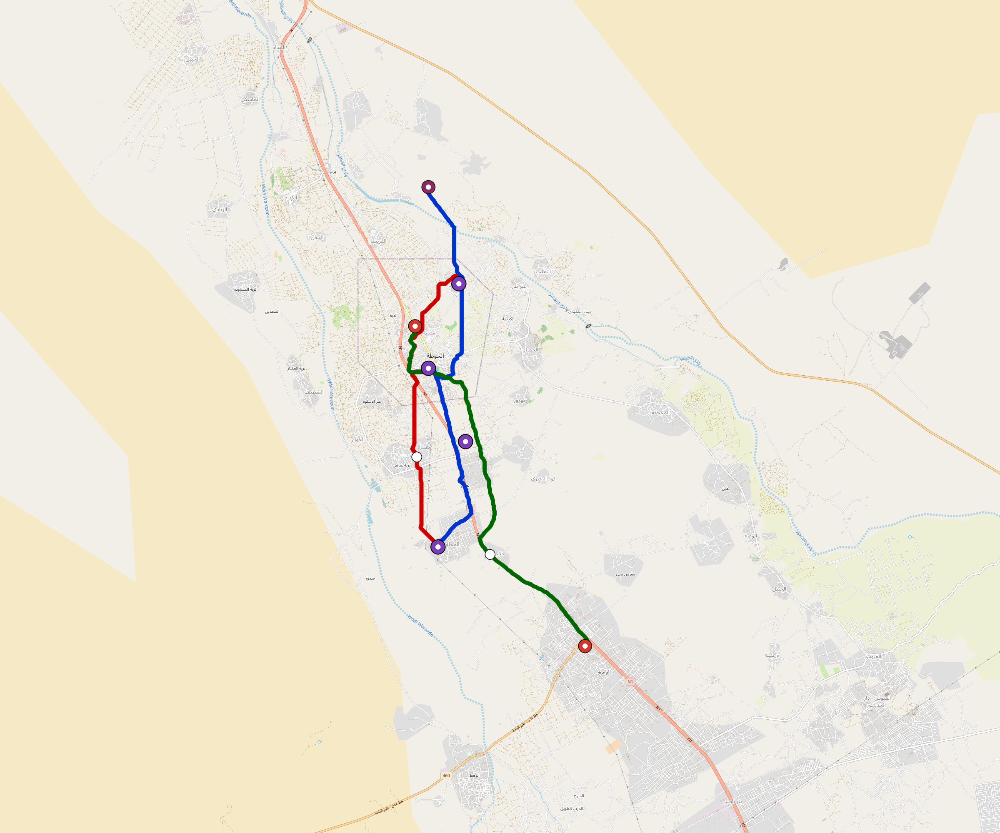

# Lahij — Urban Rail Network

**Country:** YE · **Population:** 250,000 · [National brief](../NATIONAL-BRIEF.md)

This page contains only Lahij-specific results. Shared routing, service, energy, civil, cost, finance, QA and validation methods are defined once in the [deployment planning reference](../../../../../docs/deployment-planning-reference.md).

> [!IMPORTANT]
> **Foreign-capital advantage:** against the default equivalent foreign-turnkey sensitivity, this local plan avoids **$460 M (88.5%) of external capital** and **$594 M of external interest**. Capital plus saved interest totals **$1.05 bn**. See the common reference for interpretation and limitations.

Auto-planned by the OpenSourceRail design pipeline from the controlled city catalogue, source-locked geospatial inputs and shared templates.

## Network



| Local measure | Value |
|---|---:|
| Lines / unique stations / interchanges | 3 / 14 / 4 |
| Route length | 28.9 km double track |
| Coverage / transfer reachability | 82.1% / 100% |
| Estimated station catchment | 205,250 residents |
| Service span / peak headway | 05:30–02:00 / 3 min |
| Fleet | 59 × 2-car `tram-2car` trainsets (53 peak revenue) |
| Peak network throughput | 28,800 passengers/hour |
| Practical service capacity | 267,840 passenger-trips/day |
| Annual paid-trip planning range | 48.9–78.2 M |

### Lines

| Line | Length | Stations | Trainsets | Termini |
|---|---:|---:|---:|---|
| line-1 | 10.4 km | 5 | 21 | S Mid ↔ N Outer |
| line-2 |  8.2 km | 4 | 17 | N Mid ↔ S Mid |
| line-3 | 10.3 km | 5 | 21 | SE Outer ↔ NW Mid |
| **Total** | **28.9 km** | **14 unique** | **59** | |

## Energy

| Local measure | Value |
|---|---:|
| Scheduled service | 1,395 one-way journeys / 13,452 train-km/day |
| Annual traction demand | 42.4 GWh |
| Station/depot PV / storage | 8.9 MW / 46.5 MWh |
| Aggregate charging power | 7.0 MW |
| Dedicated solar plant | 12.0 MW |
| Residual grid/PPA import | 0.0 GWh/yr |
| Worst powered-stop gap | line-2: 3.5 km / 19 kWh |
| Lowest traversal charging margin | line-2: 33 kWh |

## Capital And Funding

| Local CAPEX bucket | Planning value |
|---|---:|
| Civil works | $112 M |
| Stations | $104 M |
| Depots | $8.0 M |
| Rolling stock | $33 M |
| Dedicated solar plant | $9.6 M |
| Residual train control | $1.4 M |
| Charging microgrids | $1.7 M |
| EPC / project services | $18 M |
| **Total city programme** | **$289 M** |

| Local funding measure | Planning value |
|---|---:|
| Imported / external capital | $60 M (20.7%) |
| Domestic / local capital | $229 M (79.3%) |
| Annual public construction commitment | $40 M / yr for 10 years |
| Annual post-grace debt service | $37 M / yr |
| External capital saved vs default turnkey sensitivity | $460 M |
| Capital + lifetime external interest saved | $1.05 bn |
| Annual OPEX | $6.4 M / yr |

## Local Evidence

**Evidence refresh required.** Retained passing results below are unverified.
The strict README generator rejected the evidence: engineering/simulation/validation-summary.json describes scenario SHA-256 c168424403f9287e82da524f2036a26e3cd9b989ca4cda35a3213f54bf0e5a4c, but lahij.toml is 3af3a1ff154dd526b8c0ea8e6e6ae40f022ab17c37ed208297e332153037cba9; rerun and update the validation evidence. This audit view does not accept or replace the retained solver results.

| Package | Current status | Evidence |
|---|---|---|
| Finance | unverified | [`summary.json`](engineering/finance/summary.json) |
| Native simulation + degraded cases | unverified | [`validation-summary.json`](engineering/simulation/validation-summary.json) |
| SUMO timetable | unverified | [`summary.json`](engineering/sumo/summary.json) |
| Independent OSR/SUMO running-time cross-check | unverified; junction/authority gate open | [`operations-crosscheck.md`](engineering/simulation/operations-crosscheck.md) |
| GIS package | unverified | [`summary.json`](engineering/gis/summary.json) |
| Solar/storage snapshot (operating duty unverified) | unverified; 0 findings; 2 grid-only diagnostics | [`summary.json`](engineering/energy/summary.json) |
| Operations, QA and maintenance | 144 assets / 787 tasks | [`lahij-operations-manifest.json`](operations/lahij-operations-manifest.json) |

## Local Files And Regeneration

| File | Local role |
|---|---|
| [`design.toml`](design.toml) | Authoritative generated city design |
| [`lahij.toml`](lahij.toml) | Expanded simulator scenario |
| [`lahij.corridor.geojson`](lahij.corridor.geojson) | GIS corridor and stations |
| [`lahij.design-quality.yaml`](lahij.design-quality.yaml) | Coverage, source and civil-quality gates |

```bash
tools/automation/regenerate-city.sh lahij
```
