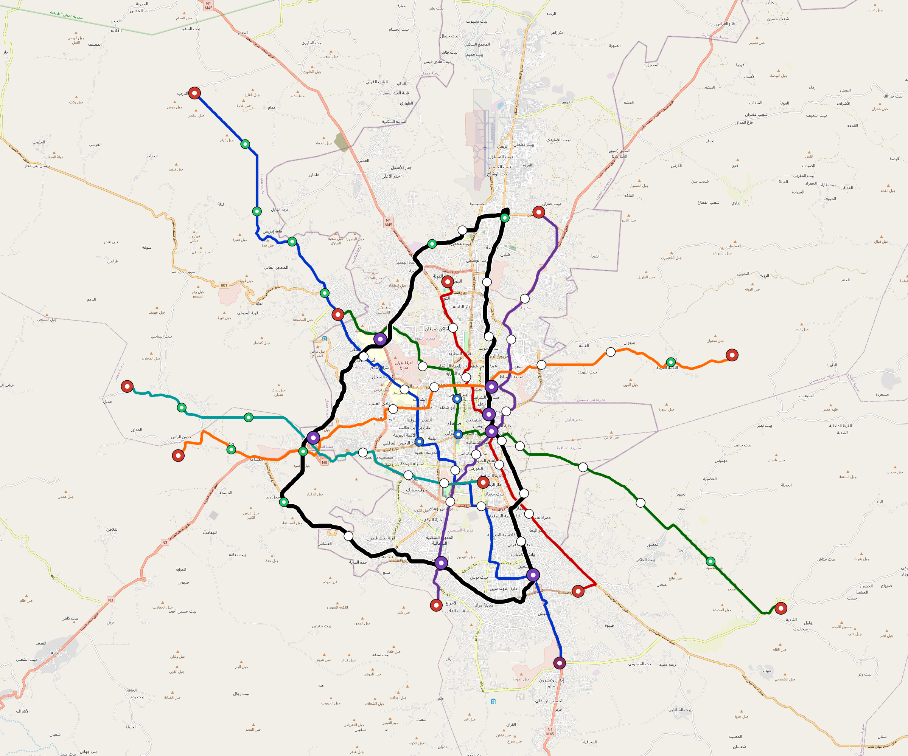

# Sanaa — Urban Rail Network

**Country:** YE · **Population:** 3,937,500 · [National brief](../NATIONAL-BRIEF.md)

This page contains only Sanaa-specific results. Shared routing, service, energy, civil, cost, finance, QA and validation methods are defined once in the [deployment planning reference](../../../../../docs/deployment-planning-reference.md).

> [!IMPORTANT]
> **Foreign-capital advantage:** against the default equivalent foreign-turnkey sensitivity, this local plan avoids **$3.30 bn (85.2%) of external capital** and **$4.26 bn of external interest**. Capital plus saved interest totals **$7.55 bn**. See the common reference for interpretation and limitations.

Auto-planned by the OpenSourceRail design pipeline from the controlled city catalogue, source-locked geospatial inputs and shared templates.

## Network



| Local measure | Value |
|---|---:|
| Lines / unique stations / interchanges | 7 / 75 / 7 |
| Route length | 233.1 km double track |
| Coverage / transfer reachability | 72.8% / 43% |
| Estimated station catchment | 2,866,500 residents |
| Service span / peak headway | 05:30–02:00 / 3 min |
| Fleet | 358 × 6-car `metro-6car` trainsets (323 peak revenue) |
| Peak network throughput | 201,600 passengers/hour |
| Practical service capacity | 1,740,960 passenger-trips/day |
| Annual paid-trip planning range | 317.7–508.4 M |

### Lines

| Line | Length | Stations | Trainsets | Termini |
|---|---:|---:|---:|---|
| line-1 | 41.5 km | 12 | 76 | NW Outer ↔ SE Outer |
| line-2 | 20.9 km | 7 | 41 | N Inner ↔ SE Mid |
| line-3 | 32.0 km | 11 | 61 | NW Mid ↔ SE Outer |
| line-4 | 24.7 km | 10 | 48 | S Mid ↔ NE Mid |
| line-5 | 33.8 km | 11 | 63 | E Outer ↔ W Mid |
| line-6 | 20.9 km | 8 | 41 | W Outer ↔ SE Inner |
| line-7 | 59.1 km | 16 | 28 | N Mid ↔ N Mid |
| **Total** | **233.1 km** | **75 unique** | **358** | |

## Energy

| Local measure | Value |
|---|---:|
| Scheduled service | 3,022 one-way journeys / 94,645 train-km/day |
| Annual traction demand | 895.4 GWh |
| Station/depot PV / storage | 23.3 MW / 162.0 MWh |
| Aggregate charging power | 124.0 MW |
| Dedicated solar plant | 428.2 MW |
| Residual grid/PPA import | 0.0 GWh/yr |
| Worst powered-stop gap | line-1: 17.9 km / 258 kWh |
| Lowest traversal charging margin | line-6: 191 kWh |

## Capital And Funding

| Local CAPEX bucket | Planning value |
|---|---:|
| Civil works | $696 M |
| Stations | $345 M |
| Depots | $8.0 M |
| Rolling stock | $601 M |
| Dedicated solar plant | $343 M |
| Residual train control | $12 M |
| Charging microgrids | $27 M |
| EPC / project services | $118 M |
| **Total city programme** | **$2.15 bn** |

| Local funding measure | Planning value |
|---|---:|
| Imported / external capital | $574 M (26.7%) |
| Domestic / local capital | $1.58 bn (73.3%) |
| Annual public construction commitment | $284 M / yr for 10 years |
| Annual post-grace debt service | $264 M / yr |
| External capital saved vs default turnkey sensitivity | $3.30 bn |
| Capital + lifetime external interest saved | $7.55 bn |
| Annual OPEX | $52 M / yr |

## Local Evidence

| Package | Current status | Evidence |
|---|---|---|
| Finance | pass | [`summary.json`](engineering/finance/summary.json) |
| Native simulation + degraded cases | pass | [`validation-summary.json`](engineering/simulation/validation-summary.json) |
| SUMO timetable | pass | [`summary.json`](engineering/sumo/summary.json) |
| GIS package | pass | [`summary.json`](engineering/gis/summary.json) |
| Grid/charging/solar | pass | [`summary.json`](engineering/energy/summary.json) |
| Operations, QA and maintenance | 782 assets / 3,631 tasks | [`sanaa-operations-manifest.json`](operations/sanaa-operations-manifest.json) |

## Local Files And Regeneration

| File | Local role |
|---|---|
| [`design.toml`](design.toml) | Authoritative generated city design |
| [`sanaa.toml`](sanaa.toml) | Expanded simulator scenario |
| [`sanaa.corridor.geojson`](sanaa.corridor.geojson) | GIS corridor and stations |
| [`sanaa.design-quality.yaml`](sanaa.design-quality.yaml) | Coverage, source and civil-quality gates |

```bash
tools/automation/regenerate-city.sh sanaa
```
