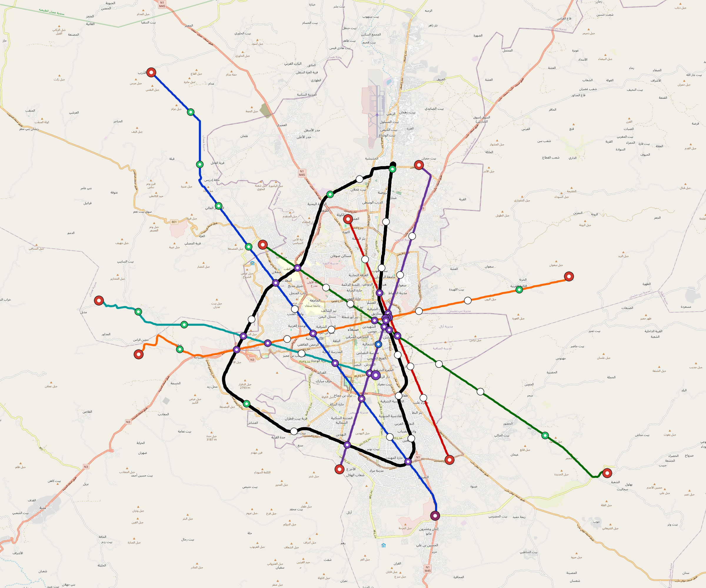

# Sanaa — Urban Rail Network

**Country:** YE · **Population:** 3,937,500 · [National brief](../NATIONAL-BRIEF.md)

This page contains only Sanaa-specific results. Shared routing, service, energy, civil, cost, finance, QA and validation methods are defined once in the [deployment planning reference](../../../../../docs/deployment-planning-reference.md).

> [!IMPORTANT]
> **Foreign-capital advantage:** against the default equivalent foreign-turnkey sensitivity, this local plan avoids **$8.16 bn (87.6%) of external capital** and **$10.54 bn of external interest**. Capital plus saved interest totals **$18.70 bn**. See the common reference for interpretation and limitations.

**Population-led network revision (2026-10-09).** The controlled planning inventory contains **13 lines**, including **6 additional residential lines**. **81.9%** of retained 2020 bbox residents are within a 1 km circle of the actual emitted station coordinates. The working target is 80%; remaining areas and station/access alternatives remain in the review. These are distance screens, not current census, surveyed walksheds or fare demand. New common corridor cells have identified junction/structure and access design requirements; no track switch or site approval is inferred. Country fleet, depot, civil, energy, staffing and financing models use the regenerated inventory, with installed quotations and operating acceptance still open. [Line additions and priorities](engineering/alignment/residential-line-expansion.json) · [Actual station coverage and source receipts](engineering/alignment/residential-expansion-evaluation.json).

**Current alignment, depot and production basis.** Core corridors change from **192.451 km to 222.078 km**, with elevated land sections, water-aware radial routes and separately engineered bridge candidates at short water crossings. 0 core fragments retain raster geometry for further curve review. The centre is a design-centroid screen; survey, property, obstacles, foundations and geometry releases remain open. All **183 platform points** pass the retained water-mask screen; footprints, bank stability and access remain open. [Alignment controls](engineering/alignment/core-realignment.json) · [Before/after map](engineering/alignment/core-alignment-comparison.png) · [Water screen](engineering/alignment/station-water-screen.json).

**13 line-local depots** provide **566 full-fleet storage slots**, separate from workshop bays. Fleet length and workload set quantities; PV/storage is included once in depot capital. Site acceptance and installed/land/utility quotations remain open. [Depot costs](engineering/line-depots/README.md). The factory requires **566 metro-6car trainsets / 3396 cars**, with **18-month facility readiness**, then qualification and manufacture. Integrated openings wait for fleet readiness where production or test paths constrain them. Shared factory capital is counted once; concurrent national loading and supplier commitments remain open. [Factory and dates](engineering/factory/README.md).

Station staffing uses two posts, two normal eight-hour shifts, plus service-window, leave and training cover. Basic wages start at 1.5 times the retained country income proxy, with higher technical/management grades and employer allowances. [Staff](engineering/delivery/README.md) · [Finance](engineering/finance/summary.json). Finance retains country-specific fixed-price, steady-state assumptions; Baghdad’s indexed cashflows are separate.

Auto-planned by the OpenSourceRail design pipeline from the controlled city catalogue, source-locked geospatial inputs and shared templates. Population is counted once within the union of station circles; this is potential radial access, not a verified walkshed or fare-demand estimate. Reachable line pairs include transfers through intermediate lines. [Population radii, denominator and transfer paths](engineering/access/README.md) · [Viaduct beam, foundation and terrain checks](engineering/clearance/README.md). Capital figures are base planning allowances: route-search scores are excluded from money, while special structures and installed-price gaps remain open. [Cost boundary](../../../../../docs/finance/civil-allowance-boundary.md).

## Network



| Local measure | Value |
|---|---:|
| Lines / unique stations / interchanges | 13 / 183 / 35 |
| Route length | 257.5 km double track |
| Direct transfers / reachable line pairs | 47.4% / 100.0% |
| Residents within 800 m radial station catchments | 1,902,553 (2020 raster; 67.9% of bbox) |
| Service span / peak headway | 05:30–02:00 / 3 min |
| Fleet | 566 × 6-car `metro-6car` trainsets (508 peak revenue) |
| Peak network throughput | 374,400 passengers/hour |
| Practical service capacity | 3,348,000 passenger-trips/day |
| Annual paid-trip planning range | 611.0–977.6 M |

### Lines

| Line | Length | Stations | Trainsets | Termini |
|---|---:|---:|---:|---|
| line-1 | 37.3 km | 22 | 79 | NW Outer ↔ SE Mid |
| line-2 | 18.0 km | 13 | 49 | N Mid ↔ SE Mid |
| line-3 | 29.3 km | 21 | 73 | NW Mid ↔ SE Outer |
| line-4 | 22.1 km | 16 | 59 | S Mid ↔ NE Mid |
| line-5 | 31.0 km | 20 | 73 | E Outer ↔ W Mid |
| line-6 | 20.4 km | 15 | 51 | W Outer ↔ SE Inner |
| line-7 | 56.0 km | 35 | 34 | N Mid ↔ N Mid |
| line-8 |  7.5 km | 9 | 30 | S Mid ↔ SE Inner |
| line-9 |  5.7 km | 5 | 19 | SW Inner ↔ S Inner |
| line-10 |  8.8 km | 8 | 29 | S Inner ↔ N Inner |
| line-11 |  6.3 km | 7 | 25 | NW Inner ↔ N Inner |
| line-12 |  5.5 km | 4 | 16 | SE Inner ↔ SE Mid |
| line-13 |  9.7 km | 8 | 29 | NE Inner ↔ N Mid |
| **Total** | **257.5 km** | **183 unique** | **566** | |

## Energy

| Local measure | Value |
|---|---:|
| Scheduled service | 5,812 one-way journeys / 106,712 train-km/day |
| Annual traction demand | 1,009.6 GWh |
| Station/depot PV / storage | 106.4 MW / 796.0 MWh |
| Aggregate charging power | 302.0 MW |
| Dedicated solar plant | 390.7 MW |
| Residual grid/PPA import | 0.0 GWh/yr |
| Worst powered-stop gap | line-1: 15.2 km / 219 kWh |
| Lowest traversal charging margin | line-12: 240 kWh |

## Capital And Funding

| Local CAPEX bucket | Planning value |
|---|---:|
| Civil works | $2.27 bn |
| Stations | $948 M |
| Depots | $300 M |
| Rolling stock | $951 M |
| Dedicated solar plant | $313 M |
| Residual train control | $13 M |
| Charging microgrids | $61 M |
| EPC / project services | $318 M |
| **Total city programme** | **$5.18 bn** |

| Local funding measure | Planning value |
|---|---:|
| Imported / external capital | $1.16 bn (22.4%) |
| Domestic / local capital | $4.02 bn (77.6%) |
| Annual public construction commitment | $711 M / yr for 10 years |
| Annual post-grace debt service | $654 M / yr |
| External capital saved vs default turnkey sensitivity | $8.16 bn |
| Capital + lifetime external interest saved | $18.70 bn |
| Annual OPEX | $121 M / yr |

## Local Evidence

| Package | Current status | Evidence |
|---|---|---|
| Finance | pass | [`summary.json`](engineering/finance/summary.json) |
| Native simulation + degraded cases | pass | [`validation-summary.json`](engineering/simulation/validation-summary.json) |
| SUMO timetable | pass | [`summary.json`](engineering/sumo/summary.json) |
| Independent OSR/SUMO running-time cross-check | pass; junction/authority gate open | [`operations-crosscheck.md`](engineering/simulation/operations-crosscheck.md) |
| GIS package | pass | [`summary.json`](engineering/gis/summary.json) |
| Solar/storage snapshot (operating duty unverified) | pass; 0 findings; 34 grid-only diagnostics | [`summary.json`](engineering/energy/summary.json) |
| Operations, QA and maintenance | 1,559 assets / 8,304 tasks | [`sanaa-operations-manifest.json`](operations/sanaa-operations-manifest.json) |

## Local Files And Regeneration

| File | Local role |
|---|---|
| [`design.toml`](design.toml) | Authoritative generated city design |
| [`sanaa.toml`](sanaa.toml) | Expanded simulator scenario |
| [`sanaa.corridor.geojson`](sanaa.corridor.geojson) | GIS corridor and stations |
| [`sanaa.design-quality.yaml`](sanaa.design-quality.yaml) | Coverage, source and civil-quality gates |

```bash
tools/automation/regenerate-city.sh sanaa
```
