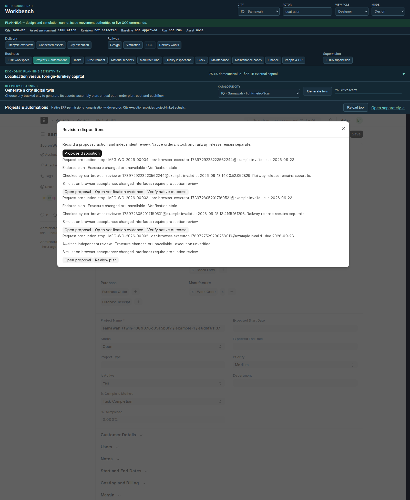
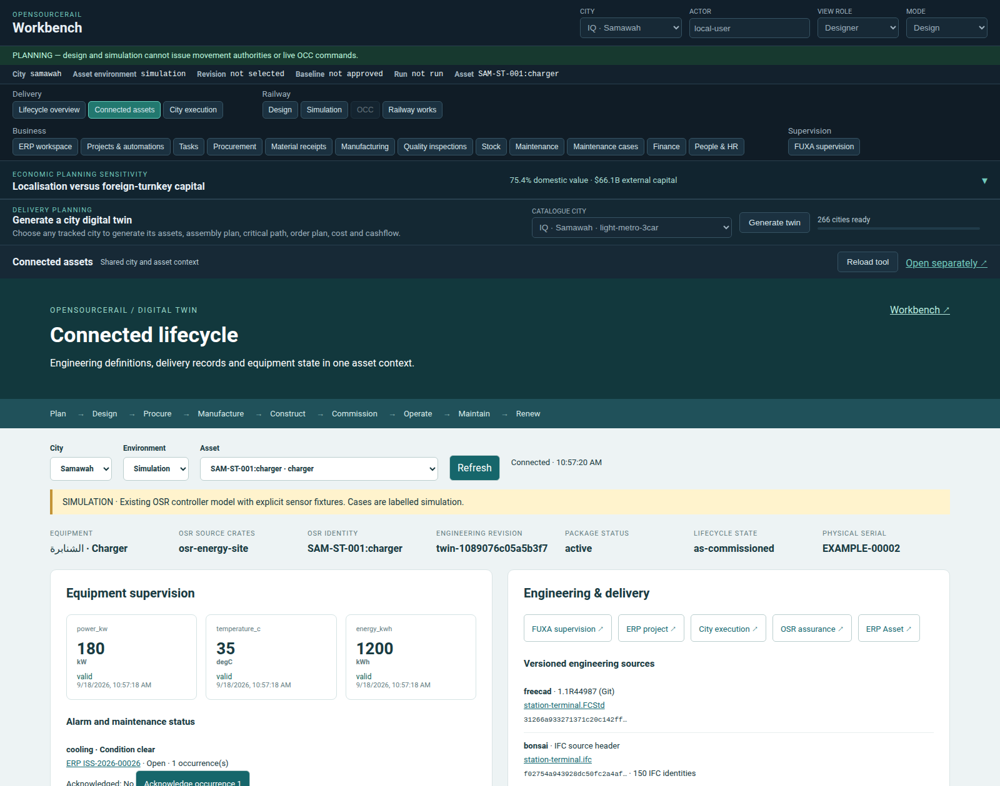
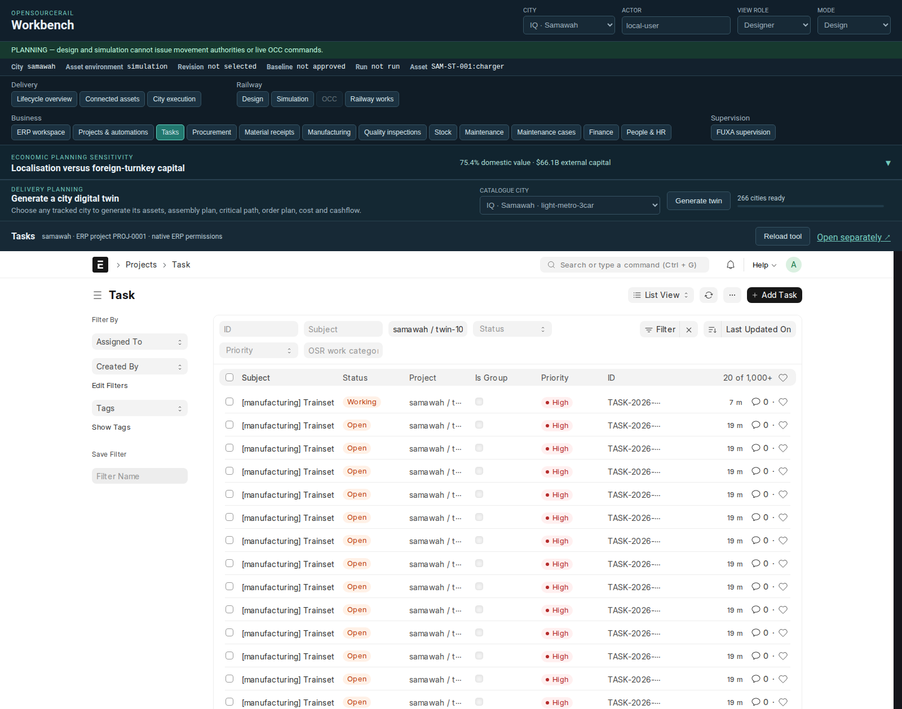
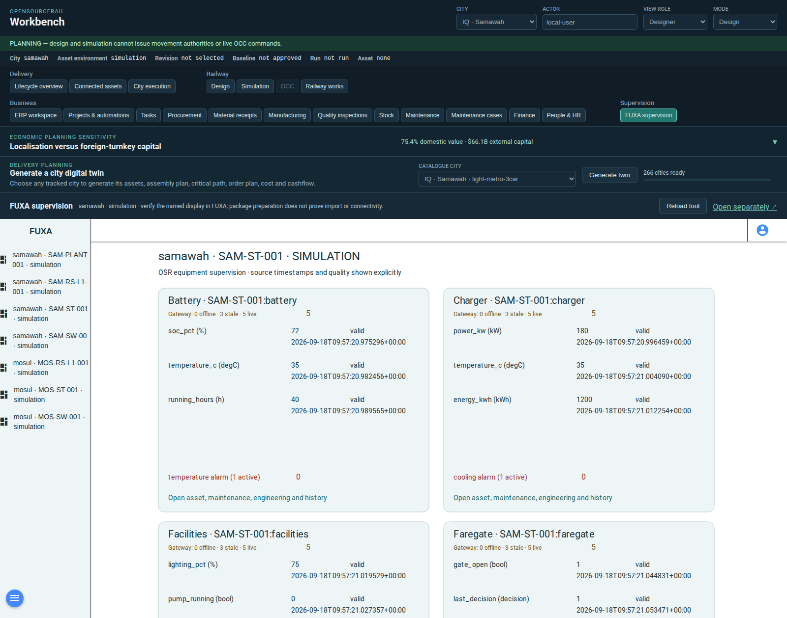
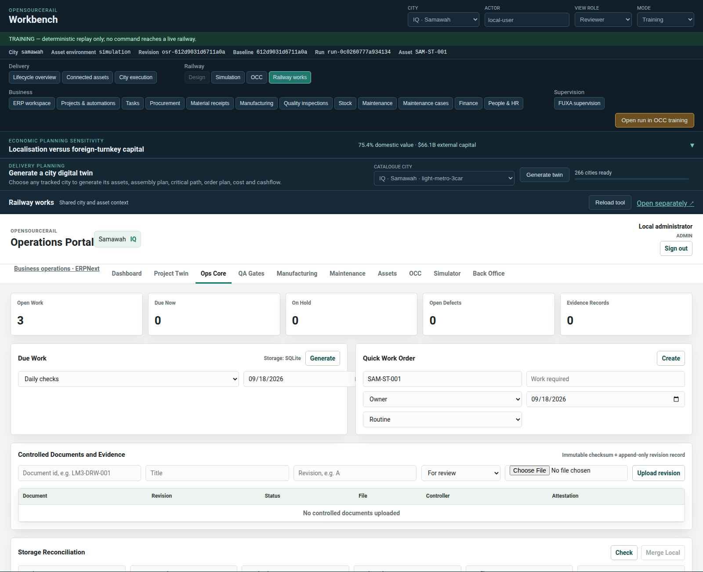

# Reproducible example-city acceptance

This scenario builds a separate **Samawah simulation deployment**, with Mosul as
an independent control city. It runs actual ERPNext, Frappe HR, FUXA, the integration
gateway, the native Rust controller bridge and the shared Workbench. Business
records are retained for inspection after a successful run.

## Run

Use the repository's pinned Docker, Rust, Node/Playwright and Trunk prerequisites
in the [ERP deployment guide](../erpnext/README.md) and [Workbench guide](../../docs/workbench/README.md). Docker must be running.
The first ERP build and city imports can take tens of minutes.

```sh
npm ci
npm run frontend:build
cargo build -p osr-sim --example operating_bridge
PLAYWRIGHT_BROWSERS_PATH="$HOME/.local/share/opensource-rail/toolchains/playwright" npx playwright install chromium
./osr example-city setup
./osr example-city run
./osr example-city restart-check
./osr example-city expand-check
./osr example-city business-check
./osr example-city disposition-check
./osr example-city coverage
```

Open **http://127.0.0.1:8190** after success. The report, native record identifiers,
source hashes, full-network contract observations, before/after settings observations, browser screenshots and phase
logs are under `build/city-example/`. Open `report.html` for the readable summary.
The final `report.json` must contain
`"passed": true`; an incomplete or failed run is never reported as a pass.

| Service | Example port |
|---|---:|
| Workbench | 8190 |
| City Studio | 8191 |
| ERPNext / Frappe HR | 8180 |
| Integration gateway | 8192 |
| FUXA | 1981 |

Private credentials are generated under `var/city-example/` with restricted file
permissions. ERP uses `Administrator` and the generated `ADMIN_PASSWORD` in
`local.env`; FUXA uses `operator` and `operator_password` in `fuxa.json`.
Integration roles are in `integration.json`. These files are not test artifacts.

```sh
./osr example-city stop    # stop only example services; retain records
./osr example-city start   # reopen the retained successful example
./osr example-city reset   # remove only example services, volumes and local outputs
./osr example-city setup
./osr example-city run     # repeat from a clean city deployment
```

Save reports/screenshots before reset. A run refuses to reuse an existing run
marker: this avoids treating records left by a previous attempt as fresh evidence.
Setup is repeat-safe and reapplies the source configuration. The regular deployment
on ports 8080/8090/8092/1881 has different Compose projects, volumes and credentials.

## Connected lifecycle

1. Import the full generic-plus-city planning baselines for Samawah and Mosul.
   Sweep every configured Samawah equipment position and measurement through the
   native evaluator/declared fixtures and production historian; save a separate
   full-network contract report, lower/upper boundary checks for every measurement
   and a clock-controlled retention change using the production historian.
2. Reopen and hash tracked FreeCAD, IFC, GIS and analysis artifacts. Bind the
   exact engineering revision to a native Item, production BOM and equipment Asset.
3. Purchase ten cooling modules, receive six, invoice the receipt and observe four
   outstanding. Manufacture two serialized chargers against a three-unit Work
   Order, consuming two cooling modules per charger; record an accepted inspection.
4. Transfer a produced serial into the native installed-equipment warehouse,
   install it at the modeled charger position and record separate
   design, execution, inspection and simulation commissioning evidence.
5. Inject a controller cooling fault. Observe the alarm, scoped acknowledgement,
   durable event and native ERP Issue. Complete an Asset Repair consuming a spare.
6. Close the ERP Issue, clear the fault and record maintenance. Replace the serial,
   transfer the removed unit back to workshop stock, retain its history, reject reuse of the old commissioning test and
   require fresh independent simulation evidence. Reconcile remaining raw stock
   and both finished serials against the receipt, production and repair quantities.
7. Inspect these same records in Workbench and native ERP/FUXA without browser
   request mocks. Send a lighting request and observe controller completion and
   measured feedback. Seal a City Studio simulation baseline, run the native
   simulator, hand the run to OCC replay and persist a linked OSR railway work
   record through the same Workbench.
8. Stop ERP during another fault, recover its queued event without duplication,
   then restart the gateway and check retained serial history and resumed telemetry.
   Run `restart-check` to stop/start all example services and verify serial history,
   OSR work, the retained City Studio configuration and newly received telemetry.

## Findings addressed

The expanded checks led to five integration changes: accepted sampling intervals
now control native simulator publication; clearing a maintenance-disabled alarm
does not create an ERP case; alarm priority and response reach native ERP triage
without overwriting later operator decisions; and separate Workbench deployments
can select their own data, gateway and trusted ERP parent origins. Generated
FUXA asset links also use the configured Workbench origin, with that choice bound
into the reviewed project hash.

## Expanded function and variable coverage

After a successful base run, `./osr example-city expand-check` can be repeated
against the retained example. It pauses the example simulator, changes reviewed
Samawah configurations, checks actual HTTP effects and restores the baseline and
fresh telemetry in a `finally` block. It runs native ERP variations inside a
rolled-back transaction and independently compares record counts, the original
invoice balance and Item inspection settings before/after. Run this in the isolated
example, without another operator editing its configuration during the check.

The recorded expansion passed **389 assertions**: 342 live HTTP observations,
three explicit HTTP controller-result fixtures, 43 native ERP/rollback observations
and one schema-suite summary. The separate generated schema suite passed **230
checks**. Schema validation and controller-result fixtures are not physical or
native-controller acceptance.

Added variations include:

- Exact minimum, maximum and outside-range readings for all 56 selected measurement
  contracts; 72 combinations of three positive scales, two offsets, three raw
  values and four source qualities. Zero/negative scales are rejected.
- Null measurements, malformed sequences, timestamp regression, duplicate concurrent
  ingestion, five unauthorized roles and competing configuration reviews.
- Pending-command configuration blockers, illegal result transitions, terminal
  retries, missing permissives and expiry while the source is paused.
- Invalid quality interrupting alarm persistence, inability to clear an active
  fault with invalid readings, repeated occurrences and stale acknowledgements.
- All eight native maintenance intervals and their expected dates; both assignment
  strategies across five categories; three production/reorder quantities; all
  three service priorities; training text changes; both submitted budget policies.
- Native receipt/invoice inspection references with accepted and rejected readings;
  partial supplier payment, settlement and cancellation, with balanced GL entries
  and restored outstanding amounts. These temporary transactions are rolled back.

### The coverage register is the acceptance boundary

[`coverage-register.md`](coverage-register.md) is the recorded readable register.
`./osr example-city coverage` regenerates current evidence under
`build/city-example/coverage.json` and `coverage.md`, plus the discovered contracts
in `coverage-inventory-current.json`. It inventories **517** registered functions,
inputs, shared settings, route prefixes and named workflows. It explicitly excludes
an exhaustive inventory of upstream ERPNext/FUXA, every city's override, desktop
tool parameters and internal Rust functions.

The recorded classification is **36 scenario**, **64 varied**, **135 partial** and
**282 gap** entries. These are inventory entries, not counts of broken features or
an overall coverage percentage. A gap means no qualifying mapped evidence; partial
coverage never counts as a finished workflow. Native budget enforcement, enabled
assignment and scheduled replenishment now have varied outcome evidence. The register
lists remaining payroll, independent training competence, SLA, capitalization, tax,
desktop engineering, load, backup restoration
and physical acceptance work explicitly.

`coverage-plan.json` binds each entry to named evidence and a reviewed contract
signature. New entries, removed entries and changed defaults/options fail the
inventory check. Review the source change and its tests, then update only the
reviewed IDs, signatures and evidence rules using `coverage-inventory-current.json`.
Do not regenerate the review list just to silence a failure. Failed/incomplete
scenario reports provide no passing coverage credit. After reviewing a new recorded
run, refresh this checked-in register with:

```sh
cp build/city-example/coverage.md deployment/example-city/coverage-register.md
```

The push/PR/manual CI workflow runs the expansion and always generates the coverage report,
including on failure. Regular Python CI guards the reviewed inventory and verifies
that missing evidence and newly changed contracts cannot be reported as covered.
Local verification does not imply the GitHub workflow has run.

### Native business outcomes and independent browser disposition

`business-check` executes **24 checks**, including rollback verification: native
Stop/Warn budgets at 50/100/101 against a 100 limit; enabled Round Robin and Load
Balancing assignment; scheduler-generated purchase requests at stock 3/2/1 against
level 2; preserved city/project identity; conflicting/stale replenishment rules;
submitted training events, attendance, Pass/Fail results and invalid time periods.
These are simulation fixtures. Training completion does not grant competence.

`disposition-check` executes **9 unmocked browser checks** through Workbench's real
ERP frame. Three independent native accounts propose, endorse, perform and verify
a Work Order stop. Self-endorsement, self-verification and verification before action
are rejected. Resuming the Work Order makes its prior verification visibly stale.
Fixture accounts and records remain in the isolated example; passwords remain private.




### Commit-bound release evidence

After all checks, `./osr example-city release-evidence` binds the required reports to
the clean commit recorded at scenario start. Dirty local demonstrations and reports
from an earlier commit are rejected. CI publishes `city-evidence.json`, and release
packaging downloads the artifact from the exact successful candidate run. Missing,
failed, changed or empty reports fail the gate. This is a software release gate;
the [review follow-through](../../docs/operating/review-follow-through.md) records
the remaining engineering, formal, operating and physical work.

## Configuration coverage

| Area | Variations and observed effects |
|---|---|
| Planning | Five task-family switches in generated plans; changed calendar start, working weekdays, holiday, programme offsets, department and warehouse in actual ERP; repeat import preserves edited progress |
| Business execution | Ordered/received/outstanding quantities, invoice actuals, BOM ratio, planned/produced quantity, native serials, accepted inspection, spare consumption and downtime |
| Native reusable components | Transactional native component, procurement and lifecycle regression suites, including HR/training, budgets, quality, replenishment, maintenance and independent disposition verification |
| Telemetry | Every measurement in the selected equipment package at an in-range value and above maximum; scale/offset, unit, future clock, duplicate sequence, stale/disconnected quality and configured sampling interval |
| Native controllers and factory | Station, BMS, auxiliaries, HVAC, CBM, points and faregate fault inputs through Rust; all nine deployed factory methods with changed cycle progress, availability and quality holds, separate ERP cases and restoration |
| Alarms | Trigger/clear thresholds, persistence, repeat suppression, hysteresis, disabled maintenance routing and changed priority/response in native ERP triage |
| Commands | Several lighting levels with actual measured feedback; configured minimum, maximum, expiry, local-enable rejection, role and environment restrictions |
| Scope and revisions | Restricted city reader, independent Mosul package, stale review rejection and immutable serial/evidence history |
| Browser and recovery | Native login, city navigation, engineering download, ERP records, FUXA live values, UI controller command, ERP outage and gateway restart |

This is a complete **representative software lifecycle**, with full city planning
and selected live station, vehicle, wayside and factory equipment. It does not
exercise every possible setting combination or every city equipment instance
through the live HTTP/ERP/FUXA path.
The whole-city contract sweep is sequential and does not establish full-network
real-time throughput or FUXA load capacity. Artifact parsing/hashes do not execute
desktop FreeCAD, Bonsai or QGIS editors.
Simulator fixtures, ERP sample inspections and simulation releases are explicitly
separate from physical controller, manufacturing, site and railway acceptance.
Restarting the simulator resets its volatile controller outputs to fixture defaults;
ERP records, equipment history and the retained City Studio workspace persist.

The scenario sources are [`scenario.py`](scenario.py), [`matrix.py`](matrix.py),
[`erp-scenario.py`](erp-scenario.py), [`network.py`](network.py),
[`restart.py`](restart.py), [`verify-ui.mjs`](verify-ui.mjs) and
[`engineering.json`](engineering.json). The expansion and coverage sources are
[`expansion.py`](expansion.py), [`erp-expansion.py`](erp-expansion.py),
[`contracts.py`](contracts.py), [`coverage.py`](coverage.py) and
[`coverage-plan.json`](coverage-plan.json). They reuse the production adapters;
fixture setup and assertions are kept in this directory.

## Recorded run and screenshots

The local run on **18 September 2026** passed all **98 lifecycle, configuration
and recovery checks**, including ten real-service browser assertions and a full
stop/start. The regression suite also passed 186 Python tests, 27 frontend browser
tests and ten frontend unit tests. It imported 3,254 Samawah tasks and 8,310
Mosul tasks. The whole-city contract sweep checked 573 equipment positions,
1,610 measurements and 6,440 native/boundary sample attempts. The live deployment
used 19 Samawah and 10 Mosul equipment positions. Its browser checks used real
services without intercepted responses, including FUXA-to-Workbench navigation.
The configuration and lifecycle observations are saved with before/after values
in `build/city-example/report.html` and `report.json`.

The native capital Asset is a seeded evaluation fixture; this scenario does not
demonstrate accounting capitalization of the manufactured serial, tax filing or
payroll execution. Supplier payment is now covered by the additional rolled-back
native payment sequence above. Fault-recovery cases remain open for inspection:
clearing telemetry does not automatically close ERP maintenance work.

**Installed replacement serial and engineering context**



**Native ERP tasks scoped to the example city**



**Live FUXA supervision in the same UI**



**OSR railway work with the simulation revision and run**


