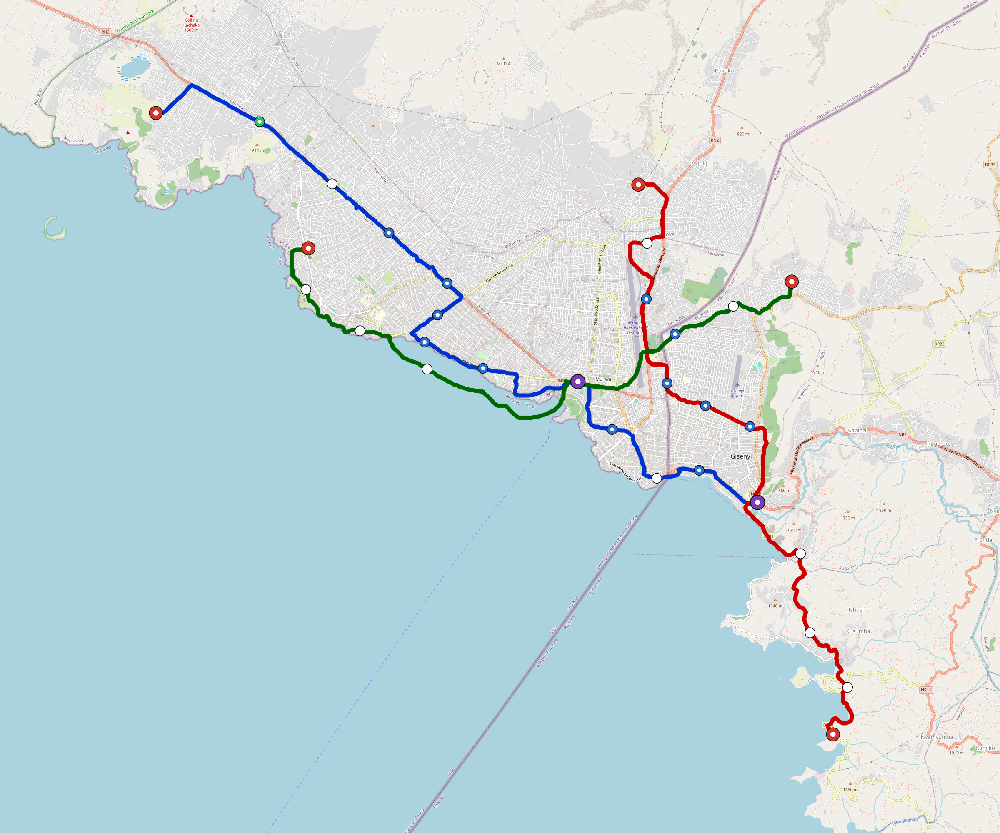

# Goma — Urban Rail Network

**Country:** CD · **Population:** 1,000,000 · [National brief](../NATIONAL-BRIEF.md)

This page contains only Goma-specific results. Shared routing, service, energy, civil, cost, finance, QA and validation methods are defined once in the [deployment planning reference](../../../../docs/deployment-planning-reference.md).

> [!IMPORTANT]
> **Foreign-capital advantage:** against the default equivalent foreign-turnkey sensitivity, this local plan avoids **$776 M (86.3%) of external capital** and **$1.00 bn of external interest**. Capital plus saved interest totals **$1.78 bn**. See the common reference for interpretation and limitations.

Auto-planned by the OpenSourceRail design pipeline from the controlled city catalogue, source-locked geospatial inputs and shared templates.

## Network



| Local measure | Value |
|---|---:|
| Lines / unique stations / interchanges | 3 / 24 / 3 |
| Route length | 59.9 km double track |
| Coverage / transfer reachability | 53.3% / 100% |
| Estimated station catchment | 533,000 residents |
| Service span / peak headway | 05:30–02:00 / 3 min |
| Fleet | 125 × 3-car `light-metro-3car` trainsets (112 peak revenue) |
| Peak network throughput | 43,200 passengers/hour |
| Practical service capacity | 401,760 passenger-trips/day |
| Annual paid-trip planning range | 73.3–117.3 M |

### Lines

| Line | Length | Stations | Trainsets | Termini |
|---|---:|---:|---:|---|
| line-1 | 23.1 km | 9 | 48 | NW Outer ↔ SE Mid |
| line-2 | 20.0 km | 8 | 41 | SE Outer ↔ N Mid |
| line-3 | 16.8 km | 7 | 36 | NE Mid ↔ NW Mid |
| **Total** | **59.9 km** | **24 unique** | **125** | |

## Energy

| Local measure | Value |
|---|---:|
| Scheduled service | 1,395 one-way journeys / 27,866 train-km/day |
| Annual traction demand | 131.8 GWh |
| Station/depot PV / storage | 11.9 MW / 51.5 MWh |
| Aggregate charging power | 12.0 MW |
| Dedicated solar plant | 72.8 MW |
| Residual grid/PPA import | 0.0 GWh/yr |
| Worst powered-stop gap | line-1: 6.1 km / 45 kWh |
| Lowest traversal charging margin | line-3: 62 kWh |

## Capital And Funding

| Local CAPEX bucket | Planning value |
|---|---:|
| Civil works | $170 M |
| Stations | $116 M |
| Depots | $8.0 M |
| Rolling stock | $112 M |
| Dedicated solar plant | $58 M |
| Residual train control | $3.0 M |
| Charging microgrids | $2.6 M |
| EPC / project services | $29 M |
| **Total city programme** | **$500 M** |

| Local funding measure | Planning value |
|---|---:|
| Imported / external capital | $123 M (24.7%) |
| Domestic / local capital | $376 M (75.3%) |
| Annual public construction commitment | $52 M / yr for 10 years |
| Annual post-grace debt service | $48 M / yr |
| External capital saved vs default turnkey sensitivity | $776 M |
| Capital + lifetime external interest saved | $1.78 bn |
| Annual OPEX | $12 M / yr |

## Local Evidence

| Package | Current status | Evidence |
|---|---|---|
| Finance | pass | [`summary.json`](engineering/finance/summary.json) |
| Native simulation + degraded cases | pass | [`validation-summary.json`](engineering/simulation/validation-summary.json) |
| SUMO timetable | pass | [`summary.json`](engineering/sumo/summary.json) |
| GIS package | pass | [`summary.json`](engineering/gis/summary.json) |
| Grid/charging/solar | pass | [`summary.json`](engineering/energy/summary.json) |
| Operations, QA and maintenance | 268 assets / 1,247 tasks | [`goma-operations-manifest.json`](operations/goma-operations-manifest.json) |

## Local Files And Regeneration

| File | Local role |
|---|---|
| [`design.toml`](design.toml) | Authoritative generated city design |
| [`goma.toml`](goma.toml) | Expanded simulator scenario |
| [`goma.corridor.geojson`](goma.corridor.geojson) | GIS corridor and stations |
| [`goma.design-quality.yaml`](goma.design-quality.yaml) | Coverage, source and civil-quality gates |

```bash
scripts/regenerate-city.sh goma
```
