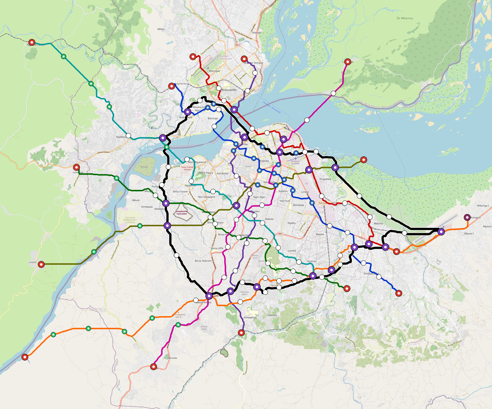

# Kinshasa — Urban Rail Network

**Country:** CD · **Population:** 17,178,000 · [National brief](../NATIONAL-BRIEF.md)

This page contains only Kinshasa-specific results. Shared routing, service, energy, civil, cost, finance, QA and validation methods are defined once in the [deployment planning reference](../../../../docs/deployment-planning-reference.md).

> [!IMPORTANT]
> **Foreign-capital advantage:** against the default equivalent foreign-turnkey sensitivity, this local plan avoids **$6.69 bn (85.1%) of external capital** and **$8.64 bn of external interest**. Capital plus saved interest totals **$15.33 bn**. See the common reference for interpretation and limitations.

Auto-planned by the OpenSourceRail design pipeline from the controlled city catalogue, source-locked geospatial inputs and shared templates.

## Network



| Local measure | Value |
|---|---:|
| Lines / unique stations / interchanges | 9 / 147 / 20 |
| Route length | 402.1 km double track |
| Coverage / transfer reachability | 56.9% / 44% |
| Estimated station catchment | 9,774,282 residents |
| Service span / peak headway | 05:30–02:00 / 3 min |
| Fleet | 643 × 6-car `metro-6car` trainsets (580 peak revenue) |
| Peak network throughput | 259,200 passengers/hour |
| Practical service capacity | 2,276,640 passenger-trips/day |
| Annual paid-trip planning range | 415.5–664.8 M |

### Lines

| Line | Length | Stations | Trainsets | Termini |
|---|---:|---:|---:|---|
| line-1 | 39.7 km | 17 | 79 | NW Mid ↔ SE Mid |
| line-2 | 36.3 km | 15 | 70 | E Mid ↔ N Mid |
| line-3 | 33.9 km | 11 | 63 | SE Mid ↔ W Mid |
| line-4 | 35.5 km | 13 | 64 | S Mid ↔ N Mid |
| line-5 | 52.8 km | 19 | 98 | SW Outer ↔ E Outer |
| line-6 | 42.3 km | 14 | 82 | SE Mid ↔ NW Outer |
| line-7 | 41.6 km | 14 | 79 | NE Mid ↔ SW Outer |
| line-8 | 35.9 km | 11 | 68 | E Mid ↔ W Outer |
| line-9 | 84.0 km | 33 | 40 | NW Mid ↔ NW Mid |
| **Total** | **402.1 km** | **147 unique** | **643** | |

## Energy

| Local measure | Value |
|---|---:|
| Scheduled service | 3,952 one-way journeys / 167,460 train-km/day |
| Annual traction demand | 1,584.3 GWh |
| Station/depot PV / storage | 45.2 MW / 308.0 MWh |
| Aggregate charging power | 270.0 MW |
| Dedicated solar plant | 987.9 MW |
| Residual grid/PPA import | 0.0 GWh/yr |
| Worst powered-stop gap | line-5: 18.8 km / 282 kWh |
| Lowest traversal charging margin | line-3: 290 kWh |

## Capital And Funding

| Local CAPEX bucket | Planning value |
|---|---:|
| Civil works | $1.35 bn |
| Stations | $825 M |
| Depots | $8.0 M |
| Rolling stock | $1.08 bn |
| Dedicated solar plant | $790 M |
| Residual train control | $20 M |
| Charging microgrids | $59 M |
| EPC / project services | $234 M |
| **Total city programme** | **$4.37 bn** |

| Local funding measure | Planning value |
|---|---:|
| Imported / external capital | $1.17 bn (26.8%) |
| Domestic / local capital | $3.20 bn (73.2%) |
| Annual public construction commitment | $449 M / yr for 10 years |
| Annual post-grace debt service | $413 M / yr |
| External capital saved vs default turnkey sensitivity | $6.69 bn |
| Capital + lifetime external interest saved | $15.33 bn |
| Annual OPEX | $103 M / yr |

## Local Evidence

| Package | Current status | Evidence |
|---|---|---|
| Finance | pass | [`summary.json`](engineering/finance/summary.json) |
| Native simulation + degraded cases | pass | [`validation-summary.json`](engineering/simulation/validation-summary.json) |
| SUMO timetable | pass | [`summary.json`](engineering/sumo/summary.json) |
| GIS package | pass | [`summary.json`](engineering/gis/summary.json) |
| Grid/charging/solar | pass | [`summary.json`](engineering/energy/summary.json) |
| Operations, QA and maintenance | 1,484 assets / 6,759 tasks | [`kinshasa-operations-manifest.json`](operations/kinshasa-operations-manifest.json) |

## Local Files And Regeneration

| File | Local role |
|---|---|
| [`design.toml`](design.toml) | Authoritative generated city design |
| [`kinshasa.toml`](kinshasa.toml) | Expanded simulator scenario |
| [`kinshasa.corridor.geojson`](kinshasa.corridor.geojson) | GIS corridor and stations |
| [`kinshasa.design-quality.yaml`](kinshasa.design-quality.yaml) | Coverage, source and civil-quality gates |

```bash
scripts/regenerate-city.sh kinshasa
```
