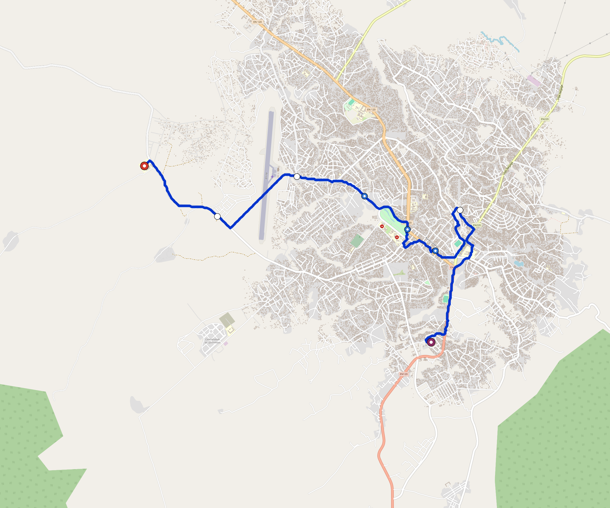

# Uige — Urban Rail Network

**Country:** AO · **Population:** 400,000 · [National brief](../NATIONAL-BRIEF.md)

This page contains only Uige-specific results. Shared routing, service, energy, civil, cost, finance, QA and validation methods are defined once in the [deployment planning reference](../../../../docs/deployment-planning-reference.md).

> [!IMPORTANT]
> **Foreign-capital advantage:** against the default equivalent foreign-turnkey sensitivity, this local plan avoids **$152 M (86.3%) of external capital** and **$187 M of external interest**. Capital plus saved interest totals **$340 M**. See the common reference for interpretation and limitations.

Auto-planned by the OpenSourceRail design pipeline from the controlled city catalogue, source-locked geospatial inputs and shared templates.

## Network



| Local measure | Value |
|---|---:|
| Lines / unique stations / interchanges | 1 / 6 / 0 |
| Route length | 12.0 km double track |
| Coverage / transfer reachability | 47.0% / 100% |
| Estimated station catchment | 188,000 residents |
| Service span / peak headway | 05:30–02:00 / 3 min |
| Fleet | 27 × 3-car `light-metro-3car` trainsets (24 peak revenue) |
| Peak network throughput | 14,400 passengers/hour |
| Practical service capacity | 133,920 passenger-trips/day |
| Annual paid-trip planning range | 24.4–39.1 M |

### Lines

| Line | Length | Stations | Trainsets | Termini |
|---|---:|---:|---:|---|
| line-1 | 12.0 km | 6 | 27 | W Outer ↔ SE Mid |
| **Total** | **12.0 km** | **6 unique** | **27** | |

## Energy

| Local measure | Value |
|---|---:|
| Scheduled service | 465 one-way journeys / 5,592 train-km/day |
| Annual traction demand | 26.5 GWh |
| Station/depot PV / storage | 6.5 MW / 42.5 MWh |
| Aggregate charging power | 3.0 MW |
| Dedicated solar plant | 9.9 MW |
| Residual grid/PPA import | 0.0 GWh/yr |
| Worst powered-stop gap | line-1: 3.0 km / 23 kWh |
| Lowest traversal charging margin | line-1: 56 kWh |

## Capital And Funding

| Local CAPEX bucket | Planning value |
|---|---:|
| Civil works | $31 M |
| Stations | $20 M |
| Depots | $8.0 M |
| Rolling stock | $24 M |
| Dedicated solar plant | $7.9 M |
| Residual train control | $601 k |
| Charging microgrids | $750 k |
| EPC / project services | $5.9 M |
| **Total city programme** | **$98 M** |

| Local funding measure | Planning value |
|---|---:|
| Imported / external capital | $24 M (24.6%) |
| Domestic / local capital | $74 M (75.4%) |
| Annual public construction commitment | $11 M / yr for 5 years |
| Annual post-grace debt service | $8.3 M / yr |
| External capital saved vs default turnkey sensitivity | $152 M |
| Capital + lifetime external interest saved | $340 M |
| Annual OPEX | $2.7 M / yr |

## Local Evidence

| Package | Current status | Evidence |
|---|---|---|
| Finance | pass | [`summary.json`](engineering/finance/summary.json) |
| Native simulation + degraded cases | pass | [`validation-summary.json`](engineering/simulation/validation-summary.json) |
| SUMO timetable | pass | [`summary.json`](engineering/sumo/summary.json) |
| GIS package | pass | [`summary.json`](engineering/gis/summary.json) |
| Grid/charging/solar | pass | [`summary.json`](engineering/energy/summary.json) |
| Operations, QA and maintenance | 65 assets / 282 tasks | [`uige-operations-manifest.json`](operations/uige-operations-manifest.json) |

## Local Files And Regeneration

| File | Local role |
|---|---|
| [`design.toml`](design.toml) | Authoritative generated city design |
| [`uige.toml`](uige.toml) | Expanded simulator scenario |
| [`uige.corridor.geojson`](uige.corridor.geojson) | GIS corridor and stations |
| [`uige.design-quality.yaml`](uige.design-quality.yaml) | Coverage, source and civil-quality gates |

```bash
scripts/regenerate-city.sh uige
```
