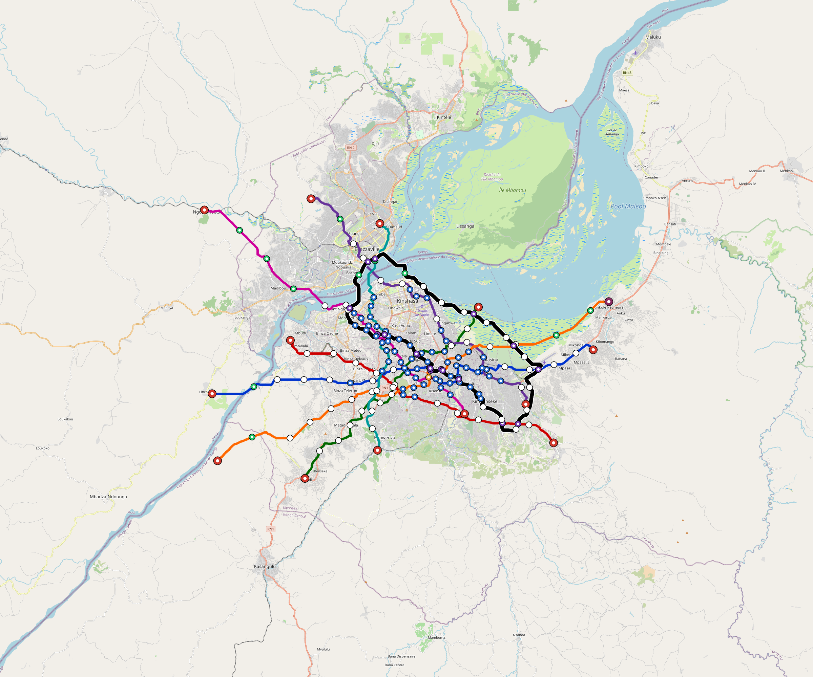

# Kinshasa — Urban Rail Network

**Country:** CD · **Population:** 17,178,000

Auto-planned by the OpenSourceRail design pipeline: [`osr_geo`](../../../../design-py/src/osr_geo/) rasterises Overpass-verified OpenStreetMap features (arterial road graph, buildings, water, protected land, demand-anchor POIs) onto a 20 m cost / demand / buildability grid; [`osr-design`](../../../../crates/osr-design/) (rust) runs a demand-rewarded Dijkstra on that grid to synthesise corridors, places stations against the demand surface, and classifies every segment (at-grade / elevated / bridge — no tunnels per [RFC 0011](../../../../docs/rfcs/0011-civil-infrastructure-design-standard.md)). Population, country, and bbox are read from the canonical city catalog at [`lib/city-batches/world-sample.toml`](../../../../lib/city-batches/world-sample.toml).

## Network map



*Every line visible end-to-end — radials out to the city edge, forced-coverage suburbs, and the ring line if present. Auto-fit zoom based on the network's actual bounding box.*

Corridor polylines + stations as GeoJSON for GIS / alignment tooling: [`kinshasa.corridor.geojson`](kinshasa.corridor.geojson).

## At a glance

| Metric | Value |
|---|---|
| Lines | 8 |
| Unique stations | 182 |
| Interchange stations | 35 |
| Multi-line transfer reachability | 0% (line-pairs sharing ≥ 1 station) |
| Anchor-weighted coverage | 49.4% |
| Route length (double track) | 384.8 km |
| Revenue fleet | 278 × 6-car trainsets |
| Spare + cold-reserve | 32 × 6-car trainsets |
| Peak headway | 5 min |
| Service hours | 05:30 – 02:00 (≈ 20 h/day) |

## Lines

*Termini are tagged by compass quadrant + radial band (Inner < 0.33 R, Mid 0.33–0.67 R, Outer > 0.67 R, where R is the network's outermost station-to-centre distance).*

| Line | Length | Stations | Trainsets | Termini |
|---|---|---|---|---|
| line-1 | 54.1 km | 27 | 43 | W Outer ↔ E Outer |
| line-2 | 37.3 km | 15 | 30 | W Mid ↔ SE Mid |
| line-3 | 35.6 km | 17 | 29 | NE Inner ↔ SW Mid |
| line-4 | 45.7 km | 20 | 37 | NW Outer ↔ SE Mid |
| line-5 | 57.3 km | 23 | 46 | SW Outer ↔ E Outer |
| line-6 | 35.1 km | 17 | 29 | S Mid ↔ N Mid |
| line-7 | 45.2 km | 21 | 37 | NW Outer ↔ SE Inner |
| line-8 | 74.3 km | 43 | 59 | NW Inner ↔ NW Inner |
| **Total** | **384.8 km** | **182 unique** | **310** | |

## Rolling stock

| Property | Value |
|---|---|
| Consist | 6-car, 138 m |
| Max speed | 90 km/h |
| Onboard battery | 720 kWh per trainset |
| Nominal capacity | 900 pax (seated + standing, `metro-6car` per RFC 0008 §1) |

## Ridership capacity

- **Per-train capacity:** 900 passengers (`metro-6car`)
- **Peak frequency:** 12 trains/hour/direction (5-min headway)
- **Peak capacity per line per direction:** 900 × 12 = **10,800 pphpd**
- **Network peak throughput (all lines, both directions):** 8 lines × 2 directions × 10,800 = **172,800 passengers/hour**
- **Daily theoretical capacity (peak × 10):** ≈ **1,728,000 passenger-trips/day**
- **Practical daily ridership estimate** (10–15 % of catchment): ≈ **848,593 – 1,272,889 trips/day**

## Catchment

- City population: **17,178,000**
- Anchor-weighted coverage: 49.4%
- Catchment population: **≈ 8,485,932** (within ~800 m walk of a station)

## Energy infrastructure (solar + battery)

On-site trackside + depot PV and battery storage. Per-tier sizing (from [`../../../../lib/templates/energy-sites.toml`](../../../../lib/templates/energy-sites.toml)):

| Tier | Sites | PV each | Battery each |
|---|---|---|---|
| Depot-Main | 1 | 5000 kW | 40000 kWh |
| Interchange | 35 | 500 kW | 3000 kWh |
| Major | 64 | 400 kW | 2500 kWh |
| Standard | 59 | 300 kW | 2000 kWh |
| Terminal | 13 | 500 kW | 3000 kWh |
| **Total installed** | **172** | **72,300 kW** | **462,000 kWh** |

Aggregate station-rail charging power: **63,500 kW**. Trains opportunity-charge during station dwell per RFC 0002; onboard 720 kWh battery covers running.

## CAPEX (planning grade)

All figures come from the `[costs]` block in `design.toml` — emitted by the `osr-design` Rust planner per RFC 0011 §9. **OSR-discipline unit costs**: prefab portal-frame canopies (no bespoke architectural cladding), at-grade depots without overhead bridge cranes, commodity Na-ion cells + tier-2 PMSM motors + DIY SiC inverters in rolling stock, open-source CBTC on commodity SBCs (no proprietary signalling vendor), no overhead catenary, and self-EPC overhead. Conventional metro budgets land 2–3× higher because of the line items OSR has architected away. `country-costs.toml` applies the per-country labour/material multiplier downstream.

### Civil works

| Bucket | Value |
|---|---|
| At-grade (355.8 km @ €3.5 M/km) | €1.25 bn |
| Elevated (22.9 km @ €18 M/km) | €413 M |
| Elevated-interchange premium (16 sites @ €20 M) | €320 M |
| **Civil subtotal** | **€1.98 bn** |

### Stations

Prefab portal-frame canopy + factory-bonded PV sandwich panel (RFC 0010 §3, ~11 t / 13-bay canopy delivered on two lorries, 3–5 day erection). Precast L-unit platform edge. Vertical circulation per archetype.

| Archetype | Count | Unit | Subtotal |
|---|---|---|---|
| `halt` | 11 | €0.4 M | €4.4 M |
| `standard` | 59 | €1.5 M | €88 M |
| `major` | 64 | €3.0 M | €192 M |
| `terminal` | 13 | €2.5 M | €32 M |
| `depot-terminal` | 1 | €3.0 M | €3.0 M |
| `interchange` | 3 | €4.5 M | €14 M |
| `interchange-elevated` | 32 | €4.5 M | €144 M |
| **Stations subtotal** | | | **€478 M** |

### Depots

At-grade portal-frame workshop sheds; pit tracks with stinger + portable wheel lathe (no overhead bridge crane); on-site PV array; Na-ion stationary storage; no traction substation.

| Archetype | Count | Unit | Subtotal |
|---|---|---|---|
| `main-heavy` | 1 | €25 M | €25 M |
| `layup-minimal` | 13 | €3.0 M | €39 M |
| **Depots subtotal** | | | **€64 M** |

### Rolling stock

Per-trainset BOM at OSR-discipline pricing: **onboard** Na-ion traction battery (~$80/kWh, RFC 0021 §3 — distinct from the trackside stationary battery in the *Systems* section below), tier-2 PMSM motors + SiC inverters (RFC 0022 §10, RFC 0008 §3.2), DIY safety electronics (~$5 680/trainset, RFC 0019), aluminium-extrusion or steel space-frame body. Motors and onboard batteries appear here ONLY — never re-billed elsewhere in the cost stack.

| Item | Count | Unit | Subtotal |
|---|---|---|---|
| `metro-6car` (revenue + spare + cold reserve) | 310 | €4.5 M | €1.40 bn |

### Systems

| Item | Basis | Subtotal |
|---|---|---|
| Signalling (open-source CBTC on commodity SBCs, RFC 0019) | 384.8 km × €0.4 M/km | €151 M |
| Traction power (**trackside** stationary PV + Na-ion + grid-tie at every station, no OCS, RFC 0002 §6) | 384.8 km × €0.8 M/km | €303 M |
| EPC integration + project management (7%) | on subtotal | €306 M |

### Total

| Bucket | Value |
|---|---|
| Civil works | €1.98 bn |
| Stations | €478 M |
| Depots | €64 M |
| Rolling stock | €1.40 bn |
| Signalling + power | €454 M |
| EPC overhead (7%) | €306 M |
| **CAPEX total** | **€4.68 bn** |
| Per-route-km | €12 M / km |
| Per-capita (city pop) | €272 / person |

## Funding & affordability

Planning-grade financing model anchored to country financial parameters from [`lib/templates/country-finance.toml`](../../../../lib/templates/country-finance.toml). Pure function of the [costs] block above + the country code — regenerate by re-running `scripts/regenerate-city.sh kinshasa`.

### CAPEX funding stack

| Tranche | Share | Principal | Rate | Tenor | Annual debt service (post-grace) |
|---|---|---|---|---|---|
| Multilateral concessional loan (IBRD / AfDB / ADB class) | 60% | €2.81 bn | 3.0% | 40 y, 10 y grace | €143 M / yr |
| Sovereign bonds (10-y benchmark + project) | 25% | €1.17 bn | 13.0% | 40 y, 10 y grace | €156 M / yr |
| Government equity (no debt service) | 15% | €701 M | — | — | — |
| **Total** | **100%** | **€4.68 bn** | | | **€299 M / yr** |

### Annual OPEX (steady state)

| Component | Basis | Annual cost |
|---|---|---|
| Rolling-stock maintenance | 4 % of rolling-stock CAPEX | €56 M |
| Civil + station + depot maintenance | 2 % of fixed-asset CAPEX | €50 M |
| Signalling + comms maintenance | 5 % of signalling CAPEX | €7.6 M |
| Traction energy (1310.5 GWh / yr) | trackside PV + Na-ion (RFC 0002) — **self-generated, €0 / yr** | €0 k |
| Labour (2,321 FTE) | ~6 FTE/route-km + 12 admin core × country median × 12 × engineer-premium 1.4 | €3.9 M |
| **OPEX subtotal** | | **€118 M / yr** |

_Annual fleet utilisation: 278 revenue trainsets × 20.5 h/day × 365 d/yr × 35 km/h commercial × 75% revenue factor = 54.6 M train-km / yr (~196 k km / trainset / yr)._

### Ticket pricing anchored to median income

Country median monthly income: **$110 USD** (per [`lib/templates/country-finance.toml`](../../../../lib/templates/country-finance.toml)). Target affordability: monthly unlimited pass at 5 % of median income → single-trip price set by the 30:1 pass / trip ratio used by every operator in the affordability literature (STIB, Delhi Metro, Cairo Metro).

| Product | Price target |
|---|---|
| Single-trip fare | €0.17 (~$0.18 USD) |
| Day pass (3 trips) | €0.43 (15 % bulk discount) |
| Monthly unlimited pass | €5.06 (~5 % of median monthly income) |
| Annual pass | €55.66 (10 × monthly = ~1 free month) |

### Farebox & operating subsidy

Practical-ridership bracket = 5–10 % of urban population × 365 service-days. At the affordability-anchored fare:

| | Low scenario | High scenario |
|---|---|---|
| Annual paid trips | 313.5 M | 627.0 M |
| Farebox revenue | €53 M / yr | €106 M / yr |
| Farebox / OPEX recovery | 45% | 90% |
| Country policy-target recovery (diagnostic) | 30% | 30% |
| Operating shortfall (gov subsidy required) | €65 M / yr | €12 M / yr |
| **Total annual government burden** (debt service + OPEX shortfall) | **€364 M / yr** | **€311 M / yr** |

**Caveats:** The funding-stack 60/25/15 split, the 5 % income-share affordability target, and the 5–10 % daily-pax bracket are project-level defaults. Real deployments will negotiate the share with the financing institutions and will tune fares iteratively from boarding data. Treat the numbers above as a first-iteration sanity check, not as a bid-ready financial close.

## Files

| File | Role |
|---|---|
| [`design.toml`](design.toml) | Authoritative design |
| [`kinshasa.toml`](kinshasa.toml) | Expanded simulation scenario (input to `osr-sim`) |
| [`kinshasa-network-map.png`](kinshasa-network-map.png) | Auto-fit network map (rendered by `osr_scenario.render_map`) |
| [`kinshasa.corridor.geojson`](kinshasa.corridor.geojson) | Line polylines + stations (GeoJSON) |
| [`kinshasa.stations.json`](kinshasa.stations.json) | Machine-readable station list |
| [`kinshasa.design-quality.yaml`](kinshasa.design-quality.yaml) | Coverage / anchor-hit / civil-mix metrics + auto-gate result |

## Reproducibility

```bash
# 1. raster bundle from OpenStreetMap (cached by query hash)
python -m osr_geo.cli --slug kinshasa

# 2. design.toml + corridor.geojson + design-quality.yaml
#    (population + country pulled from lib/city-batches/world-sample.toml)
cargo run --release --bin osr-design -- --slug kinshasa \
    --sidecar .cache/osr-pipeline/rasters/kinshasa.grid.json \
    --out-dir designs/.../Kinshasa

# 3. scenario.toml + map PNGs + this README
python -m osr_scenario --design designs/.../design.toml
python -m osr_scenario.render_map --design designs/.../design.toml
python -m osr_scenario.network_readme \
    --design designs/.../design.toml \
    --scenario designs/.../kinshasa.toml \
    --out designs/.../README.md
```

`scripts/regenerate-kinshasa.sh` chains steps 3 + drift tests into a single command.
