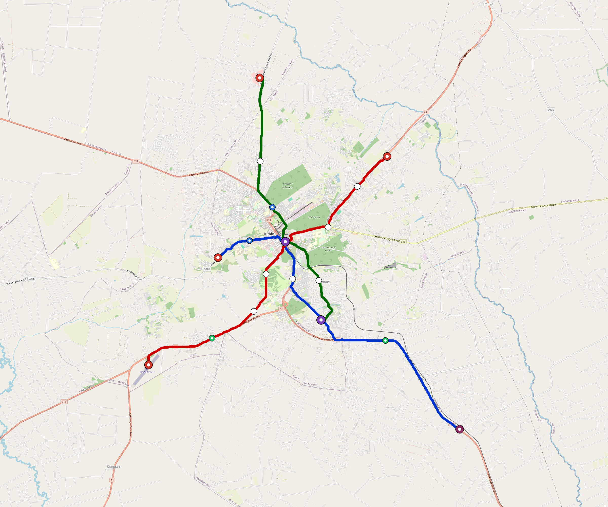

# Kitale — Urban Rail Network

**Country:** KE · **Population:** 300,000 · [National brief](../NATIONAL-BRIEF.md)

This page contains only Kitale-specific results. Shared routing, service, energy, civil, cost, finance, QA and validation methods are defined once in the [deployment planning reference](../../../../docs/deployment-planning-reference.md).

> [!IMPORTANT]
> **Foreign-capital advantage:** against the default equivalent foreign-turnkey sensitivity, this local plan avoids **$474 M (87.6%) of external capital** and **$594 M of external interest**. Capital plus saved interest totals **$1.07 bn**. See the common reference for interpretation and limitations.

Auto-planned by the OpenSourceRail design pipeline from the controlled city catalogue, source-locked geospatial inputs and shared templates.

## Network



| Local measure | Value |
|---|---:|
| Lines / unique stations / interchanges | 3 / 15 / 1 |
| Route length | 39.9 km double track |
| Coverage / transfer reachability | 77.6% / 100% |
| Estimated station catchment | 232,800 residents |
| Service span / peak headway | 05:30–02:00 / 3 min |
| Fleet | 84 × 2-car `tram-2car` trainsets (75 peak revenue) |
| Peak network throughput | 28,800 passengers/hour |
| Practical service capacity | 267,840 passenger-trips/day |
| Annual paid-trip planning range | 48.9–78.2 M |

### Lines

| Line | Length | Stations | Trainsets | Termini |
|---|---:|---:|---:|---|
| line-1 | 14.6 km | 5 | 30 | W Mid ↔ SE Outer |
| line-2 | 13.9 km | 5 | 29 | SW Outer ↔ NE Mid |
| line-3 | 11.3 km | 5 | 25 | S Inner ↔ N Outer |
| **Total** | **39.9 km** | **15 unique** | **84** | |

## Energy

| Local measure | Value |
|---|---:|
| Scheduled service | 1,395 one-way journeys / 18,539 train-km/day |
| Annual traction demand | 58.5 GWh |
| Station/depot PV / storage | 8.9 MW / 46.5 MWh |
| Aggregate charging power | 7.0 MW |
| Dedicated solar plant | 28.1 MW |
| Residual grid/PPA import | 0.0 GWh/yr |
| Worst powered-stop gap | line-1: 9.4 km / 47 kWh |
| Lowest traversal charging margin | line-1: 38 kWh |

## Capital And Funding

| Local CAPEX bucket | Planning value |
|---|---:|
| Civil works | $125 M |
| Stations | $77 M |
| Depots | $8.0 M |
| Rolling stock | $47 M |
| Dedicated solar plant | $23 M |
| Residual train control | $2.0 M |
| Charging microgrids | $1.6 M |
| EPC / project services | $18 M |
| **Total city programme** | **$301 M** |

| Local funding measure | Planning value |
|---|---:|
| Imported / external capital | $67 M (22.3%) |
| Domestic / local capital | $234 M (77.7%) |
| Annual public construction commitment | $31 M / yr for 7 years |
| Annual post-grace debt service | $26 M / yr |
| External capital saved vs default turnkey sensitivity | $474 M |
| Capital + lifetime external interest saved | $1.07 bn |
| Annual OPEX | $7.5 M / yr |

## Local Evidence

| Package | Current status | Evidence |
|---|---|---|
| Finance | pass | [`summary.json`](engineering/finance/summary.json) |
| Native simulation + degraded cases | pass | [`validation-summary.json`](engineering/simulation/validation-summary.json) |
| SUMO timetable | pass | [`summary.json`](engineering/sumo/summary.json) |
| GIS package | pass | [`summary.json`](engineering/gis/summary.json) |
| Grid/charging/solar | pass | [`summary.json`](engineering/energy/summary.json) |
| Operations, QA and maintenance | 175 assets / 816 tasks | [`kitale-operations-manifest.json`](operations/kitale-operations-manifest.json) |

## Local Files And Regeneration

| File | Local role |
|---|---|
| [`design.toml`](design.toml) | Authoritative generated city design |
| [`kitale.toml`](kitale.toml) | Expanded simulator scenario |
| [`kitale.corridor.geojson`](kitale.corridor.geojson) | GIS corridor and stations |
| [`kitale.design-quality.yaml`](kitale.design-quality.yaml) | Coverage, source and civil-quality gates |

```bash
scripts/regenerate-city.sh kitale
```
