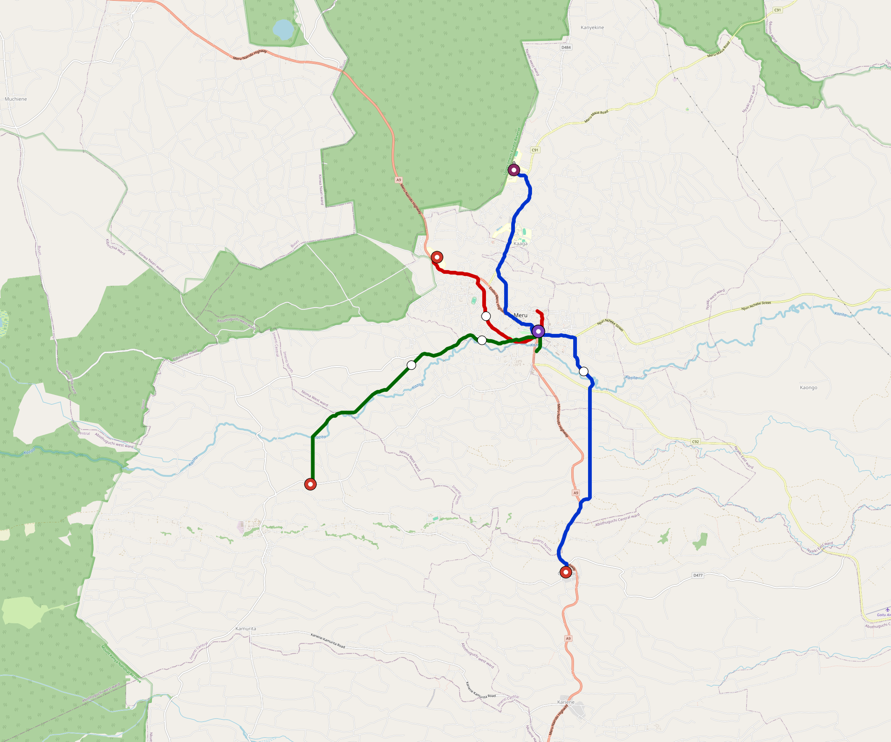

# Meru-Ke — Urban Rail Network

**Country:** KE · **Population:** 250,000 · [National brief](../NATIONAL-BRIEF.md)

This page contains only Meru-Ke-specific results. Shared routing, service, energy, civil, cost, finance, QA and validation methods are defined once in the [deployment planning reference](../../../../docs/deployment-planning-reference.md).

> [!IMPORTANT]
> **Foreign-capital advantage:** against the default equivalent foreign-turnkey sensitivity, this local plan avoids **$376 M (88.1%) of external capital** and **$472 M of external interest**. Capital plus saved interest totals **$848 M**. See the common reference for interpretation and limitations.

Auto-planned by the OpenSourceRail design pipeline from the controlled city catalogue, source-locked geospatial inputs and shared templates.

## Network



| Local measure | Value |
|---|---:|
| Lines / unique stations / interchanges | 3 / 11 / 1 |
| Route length | 28.0 km double track |
| Coverage / transfer reachability | 78.5% / 100% |
| Estimated station catchment | 196,250 residents |
| Service span / peak headway | 05:30–02:00 / 3 min |
| Fleet | 61 × 2-car `tram-2car` trainsets (54 peak revenue) |
| Peak network throughput | 28,800 passengers/hour |
| Practical service capacity | 267,840 passenger-trips/day |
| Annual paid-trip planning range | 48.9–78.2 M |

### Lines

| Line | Length | Stations | Trainsets | Termini |
|---|---:|---:|---:|---|
| line-1 | 13.6 km | 4 | 28 | S Outer ↔ N Outer |
| line-2 |  5.2 km | 3 | 13 | NE Inner ↔ NW Mid |
| line-3 |  9.2 km | 4 | 20 | E Inner ↔ SW Outer |
| **Total** | **28.0 km** | **11 unique** | **61** | |

## Energy

| Local measure | Value |
|---|---:|
| Scheduled service | 1,395 one-way journeys / 13,008 train-km/day |
| Annual traction demand | 41.0 GWh |
| Station/depot PV / storage | 8.0 MW / 45.0 MWh |
| Aggregate charging power | 5.5 MW |
| Dedicated solar plant | 17.7 MW |
| Residual grid/PPA import | 0.0 GWh/yr |
| Worst powered-stop gap | line-1: 5.9 km / 29 kWh |
| Lowest traversal charging margin | line-2: 37 kWh |

## Capital And Funding

| Local CAPEX bucket | Planning value |
|---|---:|
| Civil works | $114 M |
| Stations | $50 M |
| Depots | $8.0 M |
| Rolling stock | $34 M |
| Dedicated solar plant | $14 M |
| Residual train control | $1.4 M |
| Charging microgrids | $1.3 M |
| EPC / project services | $15 M |
| **Total city programme** | **$237 M** |

| Local funding measure | Planning value |
|---|---:|
| Imported / external capital | $51 M (21.4%) |
| Domestic / local capital | $187 M (78.6%) |
| Annual public construction commitment | $25 M / yr for 7 years |
| Annual post-grace debt service | $21 M / yr |
| External capital saved vs default turnkey sensitivity | $376 M |
| Capital + lifetime external interest saved | $848 M |
| Annual OPEX | $5.9 M / yr |

## Local Evidence

| Package | Current status | Evidence |
|---|---|---|
| Finance | pass | [`summary.json`](engineering/finance/summary.json) |
| Native simulation + degraded cases | pass | [`validation-summary.json`](engineering/simulation/validation-summary.json) |
| SUMO timetable | pass | [`summary.json`](engineering/sumo/summary.json) |
| GIS package | pass | [`summary.json`](engineering/gis/summary.json) |
| Grid/charging/solar | pass | [`summary.json`](engineering/energy/summary.json) |
| Operations, QA and maintenance | 130 assets / 595 tasks | [`meru-ke-operations-manifest.json`](operations/meru-ke-operations-manifest.json) |

## Local Files And Regeneration

| File | Local role |
|---|---|
| [`design.toml`](design.toml) | Authoritative generated city design |
| [`meru-ke.toml`](meru-ke.toml) | Expanded simulator scenario |
| [`meru-ke.corridor.geojson`](meru-ke.corridor.geojson) | GIS corridor and stations |
| [`meru-ke.design-quality.yaml`](meru-ke.design-quality.yaml) | Coverage, source and civil-quality gates |

```bash
scripts/regenerate-city.sh meru-ke
```
