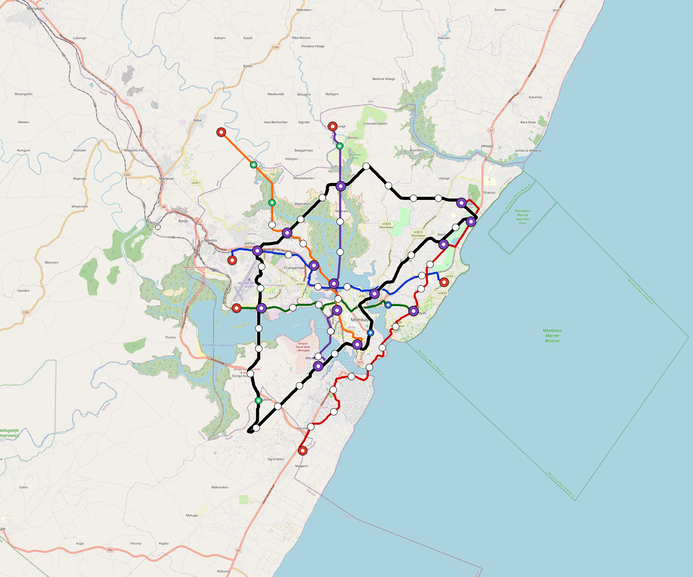

# Mombasa — Urban Rail Network

**Country:** KE · **Population:** 1,350,000 · [National brief](../NATIONAL-BRIEF.md)

This page contains only Mombasa-specific results. Shared routing, service, energy, civil, cost, finance, QA and validation methods are defined once in the [deployment planning reference](../../../../docs/deployment-planning-reference.md).

> [!IMPORTANT]
> **Foreign-capital advantage:** against the default equivalent foreign-turnkey sensitivity, this local plan avoids **$2.27 bn (87.0%) of external capital** and **$2.85 bn of external interest**. Capital plus saved interest totals **$5.12 bn**. See the common reference for interpretation and limitations.

Auto-planned by the OpenSourceRail design pipeline from the controlled city catalogue, source-locked geospatial inputs and shared templates.

## Network



| Local measure | Value |
|---|---:|
| Lines / unique stations / interchanges | 6 / 58 / 13 |
| Route length | 156.7 km double track |
| Coverage / transfer reachability | 58.6% / 47% |
| Estimated station catchment | 791,100 residents |
| Service span / peak headway | 05:30–02:00 / 3 min |
| Fleet | 190 × 4-car `metro-4car` trainsets (170 peak revenue) |
| Peak network throughput | 115,200 passengers/hour |
| Practical service capacity | 982,080 passenger-trips/day |
| Annual paid-trip planning range | 179.2–286.8 M |

### Lines

| Line | Length | Stations | Trainsets | Termini |
|---|---:|---:|---:|---|
| line-1 | 18.7 km | 10 | 37 | E Mid ↔ W Mid |
| line-2 | 27.2 km | 9 | 41 | S Outer ↔ NE Outer |
| line-3 | 14.5 km | 8 | 29 | W Mid ↔ SE Mid |
| line-4 | 18.6 km | 6 | 28 | S Mid ↔ N Outer |
| line-5 | 19.9 km | 8 | 32 | NW Outer ↔ S Mid |
| line-6 | 57.9 km | 17 | 23 | W Mid ↔ W Mid |
| **Total** | **156.7 km** | **58 unique** | **190** | |

## Energy

| Local measure | Value |
|---|---:|
| Scheduled service | 2,558 one-way journeys / 59,420 train-km/day |
| Annual traction demand | 374.8 GWh |
| Station/depot PV / storage | 21.8 MW / 124.0 MWh |
| Aggregate charging power | 85.5 MW |
| Dedicated solar plant | 220.9 MW |
| Residual grid/PPA import | 0.0 GWh/yr |
| Worst powered-stop gap | line-5: 7.0 km / 70 kWh |
| Lowest traversal charging margin | line-4: 139 kWh |

## Capital And Funding

| Local CAPEX bucket | Planning value |
|---|---:|
| Civil works | $572 M |
| Stations | $373 M |
| Depots | $8.0 M |
| Rolling stock | $213 M |
| Dedicated solar plant | $177 M |
| Residual train control | $7.8 M |
| Charging microgrids | $19 M |
| EPC / project services | $83 M |
| **Total city programme** | **$1.45 bn** |

| Local funding measure | Planning value |
|---|---:|
| Imported / external capital | $340 M (23.4%) |
| Domestic / local capital | $1.11 bn (76.6%) |
| Annual public construction commitment | $149 M / yr for 7 years |
| Annual post-grace debt service | $125 M / yr |
| External capital saved vs default turnkey sensitivity | $2.27 bn |
| Capital + lifetime external interest saved | $5.12 bn |
| Annual OPEX | $34 M / yr |

## Local Evidence

| Package | Current status | Evidence |
|---|---|---|
| Finance | pass | [`summary.json`](engineering/finance/summary.json) |
| Native simulation + degraded cases | pass | [`validation-summary.json`](engineering/simulation/validation-summary.json) |
| SUMO timetable | pass | [`summary.json`](engineering/sumo/summary.json) |
| GIS package | pass | [`summary.json`](engineering/gis/summary.json) |
| Grid/charging/solar | pass | [`summary.json`](engineering/energy/summary.json) |
| Operations, QA and maintenance | 522 assets / 2,220 tasks | [`mombasa-operations-manifest.json`](operations/mombasa-operations-manifest.json) |

## Local Files And Regeneration

| File | Local role |
|---|---|
| [`design.toml`](design.toml) | Authoritative generated city design |
| [`mombasa.toml`](mombasa.toml) | Expanded simulator scenario |
| [`mombasa.corridor.geojson`](mombasa.corridor.geojson) | GIS corridor and stations |
| [`mombasa.design-quality.yaml`](mombasa.design-quality.yaml) | Coverage, source and civil-quality gates |

```bash
scripts/regenerate-city.sh mombasa
```
