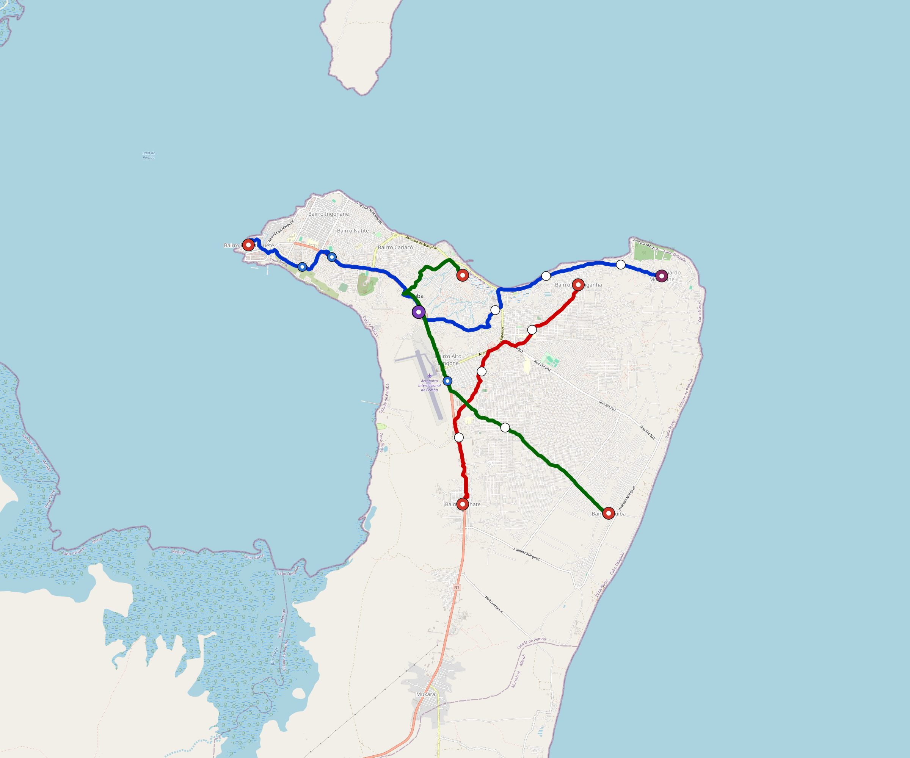

# Pemba-Mz — Urban Rail Network

**Country:** MZ · **Population:** 250,000 · [National brief](../NATIONAL-BRIEF.md)

This page contains only Pemba-Mz-specific results. Shared routing, service, energy, civil, cost, finance, QA and validation methods are defined once in the [deployment planning reference](../../../../docs/deployment-planning-reference.md).

> [!IMPORTANT]
> **Foreign-capital advantage:** against the default equivalent foreign-turnkey sensitivity, this local plan avoids **$431 M (87.9%) of external capital** and **$556 M of external interest**. Capital plus saved interest totals **$987 M**. See the common reference for interpretation and limitations.

Auto-planned by the OpenSourceRail design pipeline from the controlled city catalogue, source-locked geospatial inputs and shared templates.

## Network



| Local measure | Value |
|---|---:|
| Lines / unique stations / interchanges | 3 / 15 / 2 |
| Route length | 32.4 km double track |
| Coverage / transfer reachability | 63.6% / 67% |
| Estimated station catchment | 159,000 residents |
| Service span / peak headway | 05:30–02:00 / 3 min |
| Fleet | 69 × 2-car `tram-2car` trainsets (61 peak revenue) |
| Peak network throughput | 28,800 passengers/hour |
| Practical service capacity | 267,840 passenger-trips/day |
| Annual paid-trip planning range | 48.9–78.2 M |

### Lines

| Line | Length | Stations | Trainsets | Termini |
|---|---:|---:|---:|---|
| line-1 | 14.0 km | 6 | 29 | NW Outer ↔ E Outer |
| line-2 |  7.8 km | 4 | 17 | S Mid ↔ NE Mid |
| line-3 | 10.6 km | 5 | 23 | N Inner ↔ SE Outer |
| **Total** | **32.4 km** | **15 unique** | **69** | |

## Energy

| Local measure | Value |
|---|---:|
| Scheduled service | 1,395 one-way journeys / 15,073 train-km/day |
| Annual traction demand | 47.5 GWh |
| Station/depot PV / storage | 8.9 MW / 46.5 MWh |
| Aggregate charging power | 7.0 MW |
| Dedicated solar plant | 21.0 MW |
| Residual grid/PPA import | 0.0 GWh/yr |
| Worst powered-stop gap | line-3: 5.5 km / 27 kWh |
| Lowest traversal charging margin | line-3: 32 kWh |

## Capital And Funding

| Local CAPEX bucket | Planning value |
|---|---:|
| Civil works | $108 M |
| Stations | $81 M |
| Depots | $8.0 M |
| Rolling stock | $39 M |
| Dedicated solar plant | $17 M |
| Residual train control | $1.6 M |
| Charging microgrids | $1.6 M |
| EPC / project services | $17 M |
| **Total city programme** | **$272 M** |

| Local funding measure | Planning value |
|---|---:|
| Imported / external capital | $59 M (21.8%) |
| Domestic / local capital | $213 M (78.2%) |
| Annual public construction commitment | $30 M / yr for 10 years |
| Annual post-grace debt service | $27 M / yr |
| External capital saved vs default turnkey sensitivity | $431 M |
| Capital + lifetime external interest saved | $987 M |
| Annual OPEX | $6.4 M / yr |

## Local Evidence

| Package | Current status | Evidence |
|---|---|---|
| Finance | pass | [`summary.json`](engineering/finance/summary.json) |
| Native simulation + degraded cases | pass | [`validation-summary.json`](engineering/simulation/validation-summary.json) |
| SUMO timetable | pass | [`summary.json`](engineering/sumo/summary.json) |
| GIS package | pass | [`summary.json`](engineering/gis/summary.json) |
| Grid/charging/solar | pass | [`summary.json`](engineering/energy/summary.json) |
| Operations, QA and maintenance | 159 assets / 710 tasks | [`pemba-mz-operations-manifest.json`](operations/pemba-mz-operations-manifest.json) |

## Local Files And Regeneration

| File | Local role |
|---|---|
| [`design.toml`](design.toml) | Authoritative generated city design |
| [`pemba-mz.toml`](pemba-mz.toml) | Expanded simulator scenario |
| [`pemba-mz.corridor.geojson`](pemba-mz.corridor.geojson) | GIS corridor and stations |
| [`pemba-mz.design-quality.yaml`](pemba-mz.design-quality.yaml) | Coverage, source and civil-quality gates |

```bash
scripts/regenerate-city.sh pemba-mz
```
