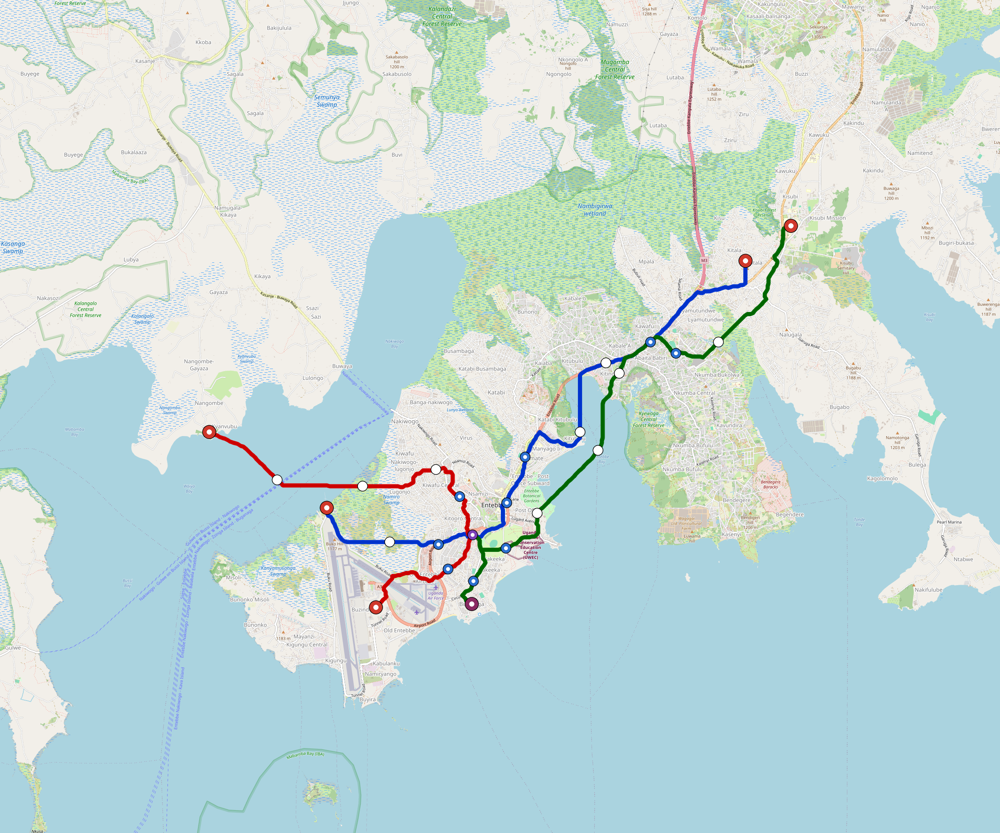

# Entebbe — Urban Rail Network

**Country:** UG · **Population:** 250,000

Auto-planned by the OpenSourceRail design pipeline: [`osr_geo`](../../../../design-py/src/osr_geo/) rasterises Overpass-verified OpenStreetMap features (arterial road graph, buildings, water, protected land, demand-anchor POIs) onto a 20 m cost / demand / buildability grid; [`osr-design`](../../../../crates/osr-design/) (rust) runs a demand-rewarded Dijkstra on that grid to synthesise corridors, places stations against the demand surface, and classifies every segment (at-grade / elevated / bridge — no tunnels per [RFC 0011](../../../../docs/rfcs/0011-civil-infrastructure-design-standard.md)). Population, country, and bbox are read from the canonical city catalog at [`lib/city-batches/world-sample.toml`](../../../../lib/city-batches/world-sample.toml).

## Network map



*Every line visible end-to-end — radials out to the city edge, forced-coverage suburbs, and the ring line if present. Auto-fit zoom based on the network's actual bounding box.*

Corridor polylines + stations as GeoJSON for GIS / alignment tooling: [`entebbe.corridor.geojson`](entebbe.corridor.geojson).

## At a glance

| Metric | Value |
|---|---|
| Lines | 3 |
| Unique stations | 28 |
| Interchange stations | 3 |
| Multi-line transfer reachability | 0% (line-pairs sharing ≥ 1 station) |
| Anchor-weighted coverage | 69.6% |
| Route length (double track) | 43.2 km |
| Revenue fleet | 53 × 2-car trainsets |
| Spare + cold-reserve | 6 × 2-car trainsets |
| Peak headway | 5 min |
| Service hours | 05:30 – 02:00 (≈ 20 h/day) |

## Lines

*Termini are tagged by compass quadrant + radial band (Inner < 0.33 R, Mid 0.33–0.67 R, Outer > 0.67 R, where R is the network's outermost station-to-centre distance).*

| Line | Length | Stations | Trainsets | Termini |
|---|---|---|---|---|
| line-1 | 15.5 km | 10 | 21 | W Mid ↔ NE Outer |
| line-2 | 12.2 km | 8 | 17 | W Outer ↔ SW Mid |
| line-3 | 15.5 km | 10 | 21 | NE Outer ↔ S Mid |
| **Total** | **43.2 km** | **28 unique** | **59** | |

## Rolling stock

| Property | Value |
|---|---|
| Consist | 2-car, 39 m |
| Max speed | 70 km/h |
| Onboard battery | 240 kWh per trainset |
| Seats | 40 longitudinal seats |
| Nominal capacity (AW2) | 210 pax (seated + standing, `tram-2car` per RFC 0008 §1) |
| Crush capacity (AW3) | 260 pax, short-duration structural/egress reference |

## Ridership capacity

- **Per-train planning capacity:** 210 AW2 passengers (`tram-2car`)
- **Peak frequency:** 12 trains/hour/direction (5-min headway)
- **Peak capacity per line per direction:** 210 × 12 = **2,520 pphpd**
- **Network peak throughput (all lines, both directions):** 3 lines × 2 directions × 2,520 = **15,120 passengers/hour**
- **Daily theoretical capacity (peak × 10):** ≈ **151,200 passenger-trips/day**
- **Practical daily ridership estimate** (10–15 % of catchment): ≈ **17,400 – 26,100 trips/day**

## Catchment

- City population: **250,000**
- Anchor-weighted coverage: 69.6%
- Catchment population: **≈ 174,000** (within ~800 m walk of a station)

## Energy infrastructure (solar + battery)

On-site trackside + depot PV and battery storage. Per-tier sizing (from [`../../../../lib/templates/energy-sites.toml`](../../../../lib/templates/energy-sites.toml)):

| Tier | Sites | PV each | Battery each |
|---|---|---|---|
| Depot-Main | 1 | 5000 kW | 40000 kWh |
| Interchange | 3 | 500 kW | 3000 kWh |
| Major | 9 | 400 kW | 2500 kWh |
| Standard | 10 | 300 kW | 2000 kWh |
| Terminal | 5 | 500 kW | 3000 kWh |
| **Total installed** | **28** | **15,600 kW** | **106,500 kWh** |

Aggregate station-rail charging power: **17,000 kW**. Trains opportunity-charge during station dwell per RFC 0002; onboard 240 kWh battery covers running.

### Energy Feasibility Check

| Check | Value | Interpretation |
|---|---:|---|
| Trainset line-haul intensity | 8.0 kWh/km | 2 cars × 4 kWh/car-km planning basis |
| Average one-way line energy | 115 kWh | 14.4 km average line length |
| Onboard battery coverage | 2.1× average line run | 240 kWh usable pack |
| Average 60 s dwell charge | 10.1 kWh/stop | 607 kW average charger across stops |
| Stops to refill one trainset pack | 24 stops | Opportunity charging supplements, not replaces, onboard reserve |
| PV daily yield proxy | 78 MWh/day | 5 peak-sun-hour planning proxy before local derates |
| Station/depot stationary storage | 106 MWh | Distributed Na-ion buffer for charging peaks and grid outages |

## CAPEX (planning grade)

All figures come from the `[costs]` block in `design.toml` — emitted by the `osr-design` Rust planner per RFC 0011 §9. **OSR-discipline unit costs**: prefab portal-frame canopies (no bespoke architectural cladding), at-grade depots without overhead bridge cranes, **€1.0 M per self-contained car** rolling stock, commodity Na-ion cells + tier-2 PMSM motors + DIY SiC inverters, **onboard-first train control with only residual wayside** (no trackside fibre backbone, no proprietary CBTC vendor stack, no trackside computer interlockings — the function moves into the trainset, already counted in rolling-stock CAPEX), no overhead catenary, and self-EPC overhead. Conventional metro budgets land 2–3× higher because of the line items OSR has architected away. `country-costs.toml` applies the per-country labour/material multiplier downstream.

### Civil works

| Bucket | Value |
|---|---|
| At-grade (40.7 km @ €3.5 M/km) | €142 M |
| Elevated (2.3 km @ €18 M/km) | €42 M |
| Elevated-interchange premium (2 sites @ €20 M) | €40 M |
| **Civil subtotal** | **€225 M** |

### Stations

Prefab portal-frame canopy + factory-bonded PV sandwich panel (RFC 0010 §3, ~11 t / 13-bay canopy delivered on two lorries, 3–5 day erection). Precast L-unit platform edge. Vertical circulation per archetype.

| Archetype | Count | Unit | Subtotal |
|---|---|---|---|
| `standard` | 10 | €1.5 M | €15 M |
| `major` | 9 | €3.0 M | €27 M |
| `terminal` | 5 | €2.5 M | €12 M |
| `depot-terminal` | 1 | €3.0 M | €3.0 M |
| `interchange-elevated` | 3 | €4.5 M | €14 M |
| **Stations subtotal** | | | **€71 M** |

### Depots

At-grade portal-frame workshop sheds; pit tracks with stinger + portable wheel lathe (no overhead bridge crane); on-site PV array; Na-ion stationary storage; no traction substation.

| Archetype | Count | Unit | Subtotal |
|---|---|---|---|
| `main-heavy` | 1 | €25 M | €25 M |
| `layup-minimal` | 5 | €3.0 M | €15 M |
| **Depots subtotal** | | | **€40 M** |

### Rolling stock

Rolling stock is costed at **€1.0 M per self-contained car (wagon)**. Each car carries one powered bogie, one trailer bogie, under-seat Na-ion battery, traction inverter, onboard sensor/control stack, doors, HVAC, interior, and aluminium body. Motors, sensors, train-control computers, and onboard batteries appear here ONLY — never re-billed elsewhere in the cost stack.

| Per-car cost bucket | Basis | Cost |
|---|---|---|
| Body shell + interior + doors | Aluminium extrusion body, glazing, seats, PRM zone, plug doors | €300 k |
| Bogies + brakes | One powered bogie + one trailer bogie, wheelsets, suspension, discs | €220 k |
| Traction package | PMSM motors, gearbox, SiC inverter, cooling, HV contactors | €180 k |
| Battery + BMS | 120 kWh usable under-seat Na-ion pack, BMS, fire containment | €120 k |
| Driverless onboard stack | T-ECU/S, T-ECU/A, T-OBS sensors, radios, cameras, event recorder | €90 k |
| HVAC, auxiliaries, fit-out margin | HVAC, lighting, PIS, wiring, assembly QA | €90 k |
| **Total per car** | | **€1.0 M** |

| Item | Count | Unit | Subtotal |
|---|---|---|---|
| `tram-2car` (revenue + spare + cold reserve) | 59 | €2.0 M | €118 M |

### Systems

| Item | Basis | Subtotal |
|---|---|---|
| Residual signalling / train-control wayside (onboard ATP/ATO + T-OBS carries the function; W-Nodes, balises, LoRa gateways, OCC interfaces remain) | 43.2 km × €0.015 M/km | €0.6 M |
| Station/depot charging microgrids (conductive charger, switchgear, inverter interface, local PV/battery tie-in; no continuous wayside supply) | per-stop allowance by station archetype | €11 M |
| EPC integration + project management (7%) | on subtotal | €33 M |

### Total

| Bucket | Value |
|---|---|
| Civil works | €225 M |
| Stations | €71 M |
| Depots | €40 M |
| Rolling stock | €118 M |
| Residual train-control wayside + charging microgrids | €11 M |
| EPC overhead (7%) | €33 M |
| **CAPEX total** | **€498 M** |
| Per-route-km | €12 M / km |
| Per-capita (city pop) | €1,990 / person |

## Funding & affordability

Planning-grade financing model anchored to country financial parameters from [`lib/templates/country-finance.toml`](../../../../lib/templates/country-finance.toml). Pure function of the [costs] block above + the country code — regenerate by re-running `scripts/regenerate-city.sh entebbe`.

### Government commitment summary (budgetable)

Bottom line for next year's budget submission. Construction phase runs **years 1–7** (equity drawdown + interest-only grace on multilateral + bonds); steady-state operation begins **year 8** and runs for **23 years** until the loans amortise.

| Phase | Annual gov / municipal commitment | Per resident / yr |
|---|---|---|
| Construction (years 1–7) | **€39 M / yr** | €158 |
| Steady-state, low-ridership (year 8+) | **€49 M / yr** | €196 |
| Steady-state, high-ridership (year 8+) | **€48 M / yr** | €192 |
| Lifecycle envelope (yr 1–30, low scenario) | **€1.40 bn cumulative** | €5,618 |
| Lifecycle envelope (yr 1–30, high scenario) | **€1.38 bn cumulative** | €5,525 |

_Population basis: 250,000 (catchment per `lib/city-batches/world-sample.toml`). After year 30, debt service drops to zero and only the OPEX shortfall remains — ~€11 M / yr (low) → €10 M / yr (high)._

### CAPEX funding stack

| Tranche | Share | Principal | Rate | Tenor | Annual debt service (post-grace) |
|---|---|---|---|---|---|
| Multilateral concessional loan (IBRD / AfDB / ADB class) | 60% | €299 M | 3.8% | 30 y, 7 y grace | €20 M / yr |
| Sovereign bonds (10-y benchmark + project) | 25% | €124 M | 14.0% | 30 y, 7 y grace | €18 M / yr |
| Government equity (no debt service) | 15% | €75 M | — | — | — |
| **Total** | **100%** | **€498 M** | | | **€38 M / yr** |

_During the 7-year grace period the operator pays interest only — multilateral €11 M / yr + bonds €17 M / yr = **€29 M / yr** total — plus the equity tranche amortised across construction (€11 M / yr × 7 yr). Principal repayment begins in year 8 on a 23-year amortisation schedule._

### Annual OPEX (steady state)

| Component | Basis | Annual cost |
|---|---|---|
| Rolling-stock maintenance | 4 % of rolling-stock CAPEX | €4.7 M |
| Civil + station + depot maintenance | 2 % of fixed-asset CAPEX | €6.7 M |
| Residual train-control wayside maintenance | 5 % of residual signalling CAPEX | €32 k |
| Traction energy (52.3 GWh / yr) | trackside PV + Na-ion (RFC 0002) — **self-generated, €0 / yr** | €0 k |
| Labour (271 FTE) | ~6 FTE/route-km + 12 admin core × country median × 12 × engineer-premium 1.4 | €607 k |
| **OPEX subtotal** | | **€12 M / yr** |

_Annual fleet utilisation: 53 revenue trainsets × 20.5 h/day × 365 d/yr × 22 km/h commercial × 75% revenue factor = 6.5 M train-km / yr (~123 k km / trainset / yr)._

### Ticket pricing anchored to median income

Country median monthly income: **$145 USD** (per [`lib/templates/country-finance.toml`](../../../../lib/templates/country-finance.toml)). Affordability target: a monthly unlimited-ride pass costs **5 % of median monthly income**. Single-trip fare set so that 30 single trips equal one monthly pass — a frequent commuter averaging ~50 trips / month then pays an effective ~40 % bulk discount on the pass, matching the structure used by Delhi Metro, Cairo Metro, and STIB.

| Product | Price target |
|---|---|
| Single-trip fare | €0.22 (~$0.24 USD) |
| Day pass (3 trips) | €0.57 (15 % bulk discount) |
| Monthly unlimited pass | €6.67 (~5 % of median monthly income) |
| Annual pass | €73.37 (10 × monthly = ~1 free month) |

### Farebox & operating subsidy

Practical-ridership bracket = 5–10 % of urban population × 365 service-days. At the affordability-anchored fare:

| | Low scenario | High scenario |
|---|---|---|
| Annual paid trips | 4.6 M | 9.1 M |
| Farebox revenue | €1.0 M / yr | €2.0 M / yr |
| Farebox / OPEX recovery | 8% | 17% |
| Country policy-target recovery (diagnostic) | 40% | 40% |
| Operating shortfall (gov subsidy required) | €11 M / yr | €10 M / yr |
| **Steady-state government commitment** (debt service + OPEX shortfall) | **€49 M / yr** | **€48 M / yr** |

**Caveats:** The funding-stack 60/25/15 split, the 5 % income-share affordability target, and the 5–10 % daily-pax bracket are project-level defaults. Real deployments will negotiate the share with the financing institutions and will tune fares iteratively from boarding data. Treat the numbers above as a first-iteration sanity check, not as a bid-ready financial close.

## Files

| File | Role |
|---|---|
| [`design.toml`](design.toml) | Authoritative design |
| [`entebbe.toml`](entebbe.toml) | Expanded simulation scenario (input to `osr-sim`) |
| [`entebbe-network-map.png`](entebbe-network-map.png) | Auto-fit network map (rendered by `osr_scenario.render_map`) |
| [`entebbe.corridor.geojson`](entebbe.corridor.geojson) | Line polylines + stations (GeoJSON) |
| [`entebbe.stations.json`](entebbe.stations.json) | Machine-readable station list |
| [`entebbe.design-quality.yaml`](entebbe.design-quality.yaml) | Coverage / anchor-hit / civil-mix metrics + auto-gate result |

## Reproducibility

```bash
# 1. raster bundle from OpenStreetMap (cached by query hash)
python -m osr_geo.cli --slug entebbe

# 2. design.toml + corridor.geojson + design-quality.yaml
#    (population + country pulled from lib/city-batches/world-sample.toml)
cargo run --release --bin osr-design -- --slug entebbe \
    --sidecar .cache/osr-pipeline/rasters/entebbe.grid.json \
    --out-dir designs/.../Entebbe

# 3. scenario.toml + map PNGs + this README
python -m osr_scenario --design designs/.../design.toml
python -m osr_scenario.render_map --design designs/.../design.toml
python -m osr_scenario.network_readme \
    --design designs/.../design.toml \
    --scenario designs/.../entebbe.toml \
    --out designs/.../README.md
```

`scripts/regenerate-entebbe.sh` chains steps 3 + drift tests into a single command.
