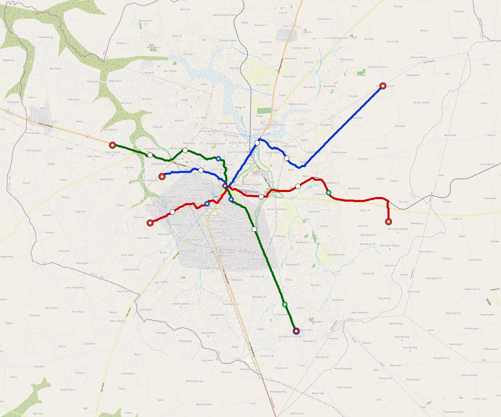

# Lira — Urban Rail Network

**Country:** UG · **Population:** 250,000 · [National brief](../NATIONAL-BRIEF.md)

This page contains only Lira-specific results. Shared routing, service, energy, civil, cost, finance, QA and validation methods are defined once in the [deployment planning reference](../../../../docs/deployment-planning-reference.md).

> [!IMPORTANT]
> **Foreign-capital advantage:** against the default equivalent foreign-turnkey sensitivity, this local plan avoids **$506 M (87.5%) of external capital** and **$634 M of external interest**. Capital plus saved interest totals **$1.14 bn**. See the common reference for interpretation and limitations.

Auto-planned by the OpenSourceRail design pipeline from the controlled city catalogue, source-locked geospatial inputs and shared templates.

## Network



| Local measure | Value |
|---|---:|
| Lines / unique stations / interchanges | 3 / 16 / 1 |
| Route length | 45.3 km double track |
| Coverage / transfer reachability | 64.5% / 100% |
| Estimated station catchment | 161,250 residents |
| Service span / peak headway | 05:30–02:00 / 3 min |
| Fleet | 92 × 2-car `tram-2car` trainsets (83 peak revenue) |
| Peak network throughput | 28,800 passengers/hour |
| Practical service capacity | 267,840 passenger-trips/day |
| Annual paid-trip planning range | 48.9–78.2 M |

### Lines

| Line | Length | Stations | Trainsets | Termini |
|---|---:|---:|---:|---|
| line-1 | 14.7 km | 6 | 31 | W Mid ↔ NE Outer |
| line-2 | 14.9 km | 5 | 30 | E Outer ↔ W Mid |
| line-3 | 15.7 km | 5 | 31 | W Outer ↔ S Outer |
| **Total** | **45.3 km** | **16 unique** | **92** | |

## Energy

| Local measure | Value |
|---|---:|
| Scheduled service | 1,395 one-way journeys / 21,085 train-km/day |
| Annual traction demand | 66.5 GWh |
| Station/depot PV / storage | 9.2 MW / 47.0 MWh |
| Aggregate charging power | 7.5 MW |
| Dedicated solar plant | 33.1 MW |
| Residual grid/PPA import | 0.0 GWh/yr |
| Worst powered-stop gap | line-2: 6.9 km / 35 kWh |
| Lowest traversal charging margin | line-2: 41 kWh |

## Capital And Funding

| Local CAPEX bucket | Planning value |
|---|---:|
| Civil works | $131 M |
| Stations | $81 M |
| Depots | $8.0 M |
| Rolling stock | $52 M |
| Dedicated solar plant | $26 M |
| Residual train control | $2.3 M |
| Charging microgrids | $1.7 M |
| EPC / project services | $19 M |
| **Total city programme** | **$321 M** |

| Local funding measure | Planning value |
|---|---:|
| Imported / external capital | $72 M (22.6%) |
| Domestic / local capital | $249 M (77.4%) |
| Annual public construction commitment | $38 M / yr for 7 years |
| Annual post-grace debt service | $32 M / yr |
| External capital saved vs default turnkey sensitivity | $506 M |
| Capital + lifetime external interest saved | $1.14 bn |
| Annual OPEX | $7.7 M / yr |

## Local Evidence

| Package | Current status | Evidence |
|---|---|---|
| Finance | pass | [`summary.json`](engineering/finance/summary.json) |
| Native simulation + degraded cases | pass | [`validation-summary.json`](engineering/simulation/validation-summary.json) |
| SUMO timetable | pass | [`summary.json`](engineering/sumo/summary.json) |
| GIS package | pass | [`summary.json`](engineering/gis/summary.json) |
| Grid/charging/solar | pass | [`summary.json`](engineering/energy/summary.json) |
| Operations, QA and maintenance | 189 assets / 888 tasks | [`lira-operations-manifest.json`](operations/lira-operations-manifest.json) |

## Local Files And Regeneration

| File | Local role |
|---|---|
| [`design.toml`](design.toml) | Authoritative generated city design |
| [`lira.toml`](lira.toml) | Expanded simulator scenario |
| [`lira.corridor.geojson`](lira.corridor.geojson) | GIS corridor and stations |
| [`lira.design-quality.yaml`](lira.design-quality.yaml) | Coverage, source and civil-quality gates |

```bash
scripts/regenerate-city.sh lira
```
