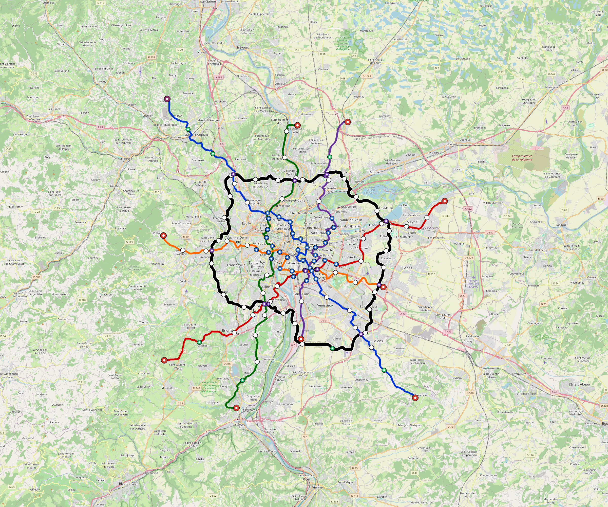

# Lyon — Urban Rail Network

**Country:** FR · **Population:** 1,436,354

Auto-planned by the OpenSourceRail design pipeline: [`osr_geo`](../../../../design-py/src/osr_geo/) rasterises Overpass-verified OpenStreetMap features (arterial road graph, buildings, water, protected land, demand-anchor POIs) onto a 20 m cost / demand / buildability grid; [`osr-design`](../../../../crates/osr-design/) (rust) runs a demand-rewarded Dijkstra on that grid to synthesise corridors, places stations against the demand surface, and classifies every segment (at-grade / elevated / bridge — no tunnels per [RFC 0011](../../../../docs/rfcs/0011-civil-infrastructure-design-standard.md)). Population, country, and bbox are read from the canonical city catalog at [`lib/city-batches/world-sample.toml`](../../../../lib/city-batches/world-sample.toml).

## Network map



*Every line visible end-to-end — radials out to the city edge, forced-coverage suburbs, and the ring line if present. Auto-fit zoom based on the network's actual bounding box.*

Corridor polylines + stations as GeoJSON for GIS / alignment tooling: [`lyon.corridor.geojson`](lyon.corridor.geojson).

## At a glance

| Metric | Value |
|---|---|
| Lines | 6 |
| Unique stations | 121 |
| Interchange stations | 18 |
| Multi-line transfer reachability | 0% (line-pairs sharing ≥ 1 station) |
| Anchor-weighted coverage | 44.8% |
| Route length (double track) | 286.9 km |
| Revenue fleet | 208 × 4-car trainsets |
| Spare + cold-reserve | 24 × 4-car trainsets |
| Peak headway | 5 min |
| Service hours | 05:30 – 02:00 (≈ 20 h/day) |

## Lines

*Termini are tagged by compass quadrant + radial band (Inner < 0.33 R, Mid 0.33–0.67 R, Outer > 0.67 R, where R is the network's outermost station-to-centre distance).*

| Line | Length | Stations | Trainsets | Termini |
|---|---|---|---|---|
| line-1 | 56.6 km | 23 | 46 | SE Outer ↔ NW Outer |
| line-2 | 41.2 km | 15 | 34 | SW Outer ↔ E Mid |
| line-3 | 39.9 km | 17 | 32 | S Outer ↔ N Mid |
| line-4 | 36.3 km | 17 | 30 | S Mid ↔ N Outer |
| line-5 | 32.6 km | 16 | 27 | W Mid ↔ E Mid |
| line-6 | 80.4 km | 34 | 63 | NW Mid ↔ NW Mid |
| **Total** | **286.9 km** | **121 unique** | **232** | |

## Rolling stock

| Property | Value |
|---|---|
| Consist | 4-car, 90 m |
| Max speed | 90 km/h |
| Onboard battery | 460 kWh per trainset |
| Nominal capacity | 540 pax (seated + standing, `metro-4car` per RFC 0008 §1) |

## Ridership capacity

- **Per-train capacity:** 540 passengers (`metro-4car`)
- **Peak frequency:** 12 trains/hour/direction (5-min headway)
- **Peak capacity per line per direction:** 540 × 12 = **6,480 pphpd**
- **Network peak throughput (all lines, both directions):** 6 lines × 2 directions × 6,480 = **77,760 passengers/hour**
- **Daily theoretical capacity (peak × 10):** ≈ **777,600 passenger-trips/day**
- **Practical daily ridership estimate** (10–15 % of catchment): ≈ **64,348 – 96,522 trips/day**

## Catchment

- City population: **1,436,354**
- Anchor-weighted coverage: 44.8%
- Catchment population: **≈ 643,486** (within ~800 m walk of a station)

## Energy infrastructure (solar + battery)

On-site trackside + depot PV and battery storage. Per-tier sizing (from [`../../../../lib/templates/energy-sites.toml`](../../../../lib/templates/energy-sites.toml)):

| Tier | Sites | PV each | Battery each |
|---|---|---|---|
| Depot-Main | 1 | 5000 kW | 40000 kWh |
| Interchange | 18 | 500 kW | 3000 kWh |
| Major | 28 | 400 kW | 2500 kWh |
| Standard | 59 | 300 kW | 2000 kWh |
| Terminal | 9 | 500 kW | 3000 kWh |
| **Total installed** | **115** | **47,400 kW** | **309,000 kWh** |

Aggregate station-rail charging power: **33,000 kW**. Trains opportunity-charge during station dwell per RFC 0002; onboard 460 kWh battery covers running.

## CAPEX (planning grade)

All figures come from the `[costs]` block in `design.toml` — emitted by the `osr-design` Rust planner per RFC 0011 §9. **OSR-discipline unit costs**: prefab portal-frame canopies (no bespoke architectural cladding), at-grade depots without overhead bridge cranes, commodity Na-ion cells + tier-2 PMSM motors + DIY SiC inverters in rolling stock, **onboard-first train control with a sparse LoRa-linked wayside** (no trackside fibre backbone, no proprietary CBTC vendor stack, no trackside computer interlockings — the function moves into the trainset, already counted in rolling-stock CAPEX), no overhead catenary, and self-EPC overhead. Conventional metro budgets land 2–3× higher because of the line items OSR has architected away. `country-costs.toml` applies the per-country labour/material multiplier downstream.

### Civil works

| Bucket | Value |
|---|---|
| At-grade (271.2 km @ €3.5 M/km) | €949 M |
| Elevated (13.7 km @ €18 M/km) | €247 M |
| Elevated-interchange premium (9 sites @ €20 M) | €180 M |
| **Civil subtotal** | **€1.38 bn** |

### Stations

Prefab portal-frame canopy + factory-bonded PV sandwich panel (RFC 0010 §3, ~11 t / 13-bay canopy delivered on two lorries, 3–5 day erection). Precast L-unit platform edge. Vertical circulation per archetype.

| Archetype | Count | Unit | Subtotal |
|---|---|---|---|
| `halt` | 7 | €0.4 M | €2.8 M |
| `standard` | 59 | €1.5 M | €88 M |
| `major` | 28 | €3.0 M | €84 M |
| `terminal` | 9 | €2.5 M | €22 M |
| `depot-terminal` | 1 | €3.0 M | €3.0 M |
| `interchange-elevated` | 18 | €4.5 M | €81 M |
| **Stations subtotal** | | | **€282 M** |

### Depots

At-grade portal-frame workshop sheds; pit tracks with stinger + portable wheel lathe (no overhead bridge crane); on-site PV array; Na-ion stationary storage; no traction substation.

| Archetype | Count | Unit | Subtotal |
|---|---|---|---|
| `main-heavy` | 1 | €25 M | €25 M |
| `layup-minimal` | 9 | €3.0 M | €27 M |
| **Depots subtotal** | | | **€52 M** |

### Rolling stock

Per-trainset BOM at OSR-discipline pricing: **onboard** Na-ion traction battery (~$80/kWh, RFC 0021 §3 — distinct from the trackside stationary battery in the *Systems* section below), tier-2 PMSM motors + SiC inverters (RFC 0022 §10, RFC 0008 §3.2), DIY safety electronics (~$5 680/trainset, RFC 0019), aluminium-extrusion or steel space-frame body. Motors and onboard batteries appear here ONLY — never re-billed elsewhere in the cost stack.

| Item | Count | Unit | Subtotal |
|---|---|---|---|
| `metro-4car` (revenue + spare + cold reserve) | 232 | €3.0 M | €696 M |

### Systems

| Item | Basis | Subtotal |
|---|---|---|
| Signalling (onboard ATC + LoRa-linked wayside W-Nodes, RFC 0019/0001) | 286.9 km × €0.1 M/km | €28 M |
| Traction power (**trackside** stationary PV + Na-ion + grid-tie at every station, no OCS, RFC 0002 §6) | 286.9 km × €0.8 M/km | €228 M |
| EPC integration + project management (7%) | on subtotal | €186 M |

### Total

| Bucket | Value |
|---|---|
| Civil works | €1.38 bn |
| Stations | €282 M |
| Depots | €52 M |
| Rolling stock | €696 M |
| Signalling + power | €256 M |
| EPC overhead (7%) | €186 M |
| **CAPEX total** | **€2.85 bn** |
| Per-route-km | €9.9 M / km |
| Per-capita (city pop) | €1,983 / person |

## Funding & affordability

Planning-grade financing model anchored to country financial parameters from [`lib/templates/country-finance.toml`](../../../../lib/templates/country-finance.toml). Pure function of the [costs] block above + the country code — regenerate by re-running `scripts/regenerate-city.sh lyon`.

### Government commitment summary (budgetable)

Bottom line for next year's budget submission. Construction phase runs **years 1–3** (equity drawdown + interest-only grace on multilateral + bonds); steady-state operation begins **year 4** and runs for **27 years** until the loans amortise.

| Phase | Annual gov / municipal commitment | Per resident / yr |
|---|---|---|
| Construction (years 1–3) | **€215 M / yr** | €150 |
| Steady-state, low-ridership (year 4+) | **€159 M / yr** | €110 |
| Steady-state, high-ridership (year 4+) | **€132 M / yr** | €92 |
| Lifecycle envelope (yr 1–30, low scenario) | **€4.93 bn cumulative** | €3,433 |
| Lifecycle envelope (yr 1–30, high scenario) | **€4.21 bn cumulative** | €2,933 |

_Population basis: 1,436,354 (catchment per `lib/city-batches/world-sample.toml`). After year 30, debt service drops to zero and only the OPEX shortfall remains — ~€27 M / yr (low) → €0 k / yr (high)._

### CAPEX funding stack

| Tranche | Share | Principal | Rate | Tenor | Annual debt service (post-grace) |
|---|---|---|---|---|---|
| Multilateral concessional loan (IBRD / AfDB / ADB class) | 60% | €1.71 bn | 3.0% | 30 y, 3 y grace | €93 M / yr |
| Sovereign bonds (10-y benchmark + project) | 25% | €712 M | 3.0% | 30 y, 3 y grace | €39 M / yr |
| Government equity (no debt service) | 15% | €427 M | — | — | — |
| **Total** | **100%** | **€2.85 bn** | | | **€132 M / yr** |

_During the 3-year grace period the operator pays interest only — multilateral €51 M / yr + bonds €21 M / yr = **€73 M / yr** total — plus the equity tranche amortised across construction (€142 M / yr × 3 yr). Principal repayment begins in year 4 on a 27-year amortisation schedule._

### Annual OPEX (steady state)

| Component | Basis | Annual cost |
|---|---|---|
| Rolling-stock maintenance | 4 % of rolling-stock CAPEX | €28 M |
| Civil + station + depot maintenance | 2 % of fixed-asset CAPEX | €34 M |
| Signalling + comms maintenance | 5 % of signalling CAPEX | €1.4 M |
| Traction energy (653.7 GWh / yr) | trackside PV + Na-ion (RFC 0002) — **self-generated, €0 / yr** | €0 k |
| Labour (1,733 FTE) | ~6 FTE/route-km + 12 admin core × country median × 12 × engineer-premium 1.4 | €74 M |
| **OPEX subtotal** | | **€137 M / yr** |

_Annual fleet utilisation: 208 revenue trainsets × 20.5 h/day × 365 d/yr × 35 km/h commercial × 75% revenue factor = 40.9 M train-km / yr (~196 k km / trainset / yr)._

### Ticket pricing anchored to median income

Country median monthly income: **$2,750 USD** (per [`lib/templates/country-finance.toml`](../../../../lib/templates/country-finance.toml)). Affordability target: a monthly unlimited-ride pass costs **5 % of median monthly income**. Single-trip fare set so that 30 single trips equal one monthly pass — a frequent commuter averaging ~50 trips / month then pays an effective ~40 % bulk discount on the pass, matching the structure used by Delhi Metro, Cairo Metro, and STIB.

| Product | Price target |
|---|---|
| Single-trip fare | €4.22 (~$4.58 USD) |
| Day pass (3 trips) | €10.75 (15 % bulk discount) |
| Monthly unlimited pass | €126.50 (~5 % of median monthly income) |
| Annual pass | €1391.50 (10 × monthly = ~1 free month) |

### Farebox & operating subsidy

Practical-ridership bracket = 5–10 % of urban population × 365 service-days. At the affordability-anchored fare:

| | Low scenario | High scenario |
|---|---|---|
| Annual paid trips | 26.2 M | 52.4 M |
| Farebox revenue | €111 M / yr | €221 M / yr |
| Farebox / OPEX recovery | 81% | 161% |
| Country policy-target recovery (diagnostic) | 65% | 65% |
| Operating shortfall (gov subsidy required) | €27 M / yr | €0 k / yr |
| Operating surplus (operator retained → capex sinking fund) | €0 k / yr | €84 M / yr |
| **Steady-state government commitment** (debt service + OPEX shortfall) | **€159 M / yr** | **€132 M / yr** |

**Caveats:** The funding-stack 60/25/15 split, the 5 % income-share affordability target, and the 5–10 % daily-pax bracket are project-level defaults. Real deployments will negotiate the share with the financing institutions and will tune fares iteratively from boarding data. Treat the numbers above as a first-iteration sanity check, not as a bid-ready financial close.

## Files

| File | Role |
|---|---|
| [`design.toml`](design.toml) | Authoritative design |
| [`lyon.toml`](lyon.toml) | Expanded simulation scenario (input to `osr-sim`) |
| [`lyon-network-map.png`](lyon-network-map.png) | Auto-fit network map (rendered by `osr_scenario.render_map`) |
| [`lyon.corridor.geojson`](lyon.corridor.geojson) | Line polylines + stations (GeoJSON) |
| [`lyon.stations.json`](lyon.stations.json) | Machine-readable station list |
| [`lyon.design-quality.yaml`](lyon.design-quality.yaml) | Coverage / anchor-hit / civil-mix metrics + auto-gate result |

## Reproducibility

```bash
# 1. raster bundle from OpenStreetMap (cached by query hash)
python -m osr_geo.cli --slug lyon

# 2. design.toml + corridor.geojson + design-quality.yaml
#    (population + country pulled from lib/city-batches/world-sample.toml)
cargo run --release --bin osr-design -- --slug lyon \
    --sidecar .cache/osr-pipeline/rasters/lyon.grid.json \
    --out-dir designs/.../Lyon

# 3. scenario.toml + map PNGs + this README
python -m osr_scenario --design designs/.../design.toml
python -m osr_scenario.render_map --design designs/.../design.toml
python -m osr_scenario.network_readme \
    --design designs/.../design.toml \
    --scenario designs/.../lyon.toml \
    --out designs/.../README.md
```

`scripts/regenerate-lyon.sh` chains steps 3 + drift tests into a single command.
