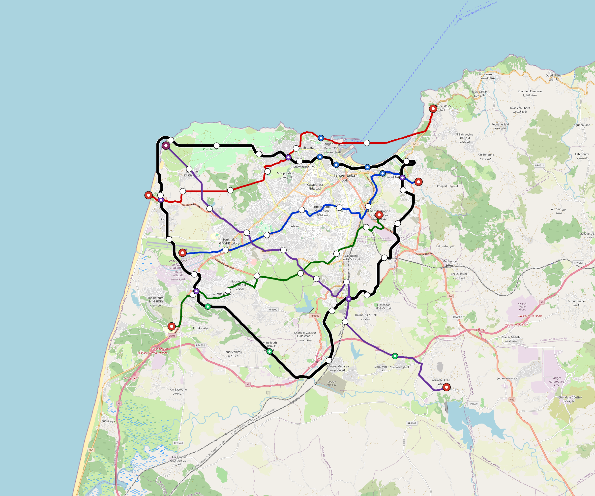

# Tangier — Urban Rail Network

**Country:** MA · **Population:** 1,200,000 · [National brief](../NATIONAL-BRIEF.md)

This page contains only Tangier-specific results. Shared routing, service, energy, civil, cost, finance, QA and validation methods are defined once in the [deployment planning reference](../../../../docs/deployment-planning-reference.md).

> [!IMPORTANT]
> **Foreign-capital advantage:** against the default equivalent foreign-turnkey sensitivity, this local plan avoids **$1.97 bn (86.9%) of external capital** and **$2.42 bn of external interest**. Capital plus saved interest totals **$4.39 bn**. See the common reference for interpretation and limitations.

Auto-planned by the OpenSourceRail design pipeline from the controlled city catalogue, source-locked geospatial inputs and shared templates.

## Network



| Local measure | Value |
|---|---:|
| Lines / unique stations / interchanges | 5 / 52 / 9 |
| Route length | 156.6 km double track |
| Coverage / transfer reachability | 58.1% / 40% |
| Estimated station catchment | 697,200 residents |
| Service span / peak headway | 05:30–02:00 / 3 min |
| Fleet | 181 × 4-car `metro-4car` trainsets (162 peak revenue) |
| Peak network throughput | 96,000 passengers/hour |
| Practical service capacity | 803,520 passenger-trips/day |
| Annual paid-trip planning range | 146.6–234.6 M |

### Lines

| Line | Length | Stations | Trainsets | Termini |
|---|---:|---:|---:|---|
| line-1 | 22.3 km | 9 | 38 | W Mid ↔ E Mid |
| line-2 | 24.2 km | 9 | 39 | W Mid ↔ NE Outer |
| line-3 | 20.5 km | 7 | 32 | SW Outer ↔ E Mid |
| line-4 | 29.9 km | 9 | 48 | SE Outer ↔ NW Outer |
| line-5 | 59.7 km | 18 | 24 | NW Mid ↔ NW Outer |
| **Total** | **156.6 km** | **52 unique** | **181** | |

## Energy

| Local measure | Value |
|---|---:|
| Scheduled service | 2,092 one-way journeys / 58,928 train-km/day |
| Annual traction demand | 371.7 GWh |
| Station/depot PV / storage | 19.1 MW / 110.5 MWh |
| Aggregate charging power | 72.0 MW |
| Dedicated solar plant | 190.9 MW |
| Residual grid/PPA import | 0.0 GWh/yr |
| Worst powered-stop gap | line-5: 10.9 km / 105 kWh |
| Lowest traversal charging margin | line-3: 175 kWh |

## Capital And Funding

| Local CAPEX bucket | Planning value |
|---|---:|
| Civil works | $522 M |
| Stations | $276 M |
| Depots | $8.0 M |
| Rolling stock | $203 M |
| Dedicated solar plant | $153 M |
| Residual train control | $7.8 M |
| Charging microgrids | $16 M |
| EPC / project services | $72 M |
| **Total city programme** | **$1.26 bn** |

| Local funding measure | Planning value |
|---|---:|
| Imported / external capital | $296 M (23.6%) |
| Domestic / local capital | $962 M (76.4%) |
| Annual public construction commitment | $86 M / yr for 5 years |
| Annual post-grace debt service | $61 M / yr |
| External capital saved vs default turnkey sensitivity | $1.97 bn |
| Capital + lifetime external interest saved | $4.39 bn |
| Annual OPEX | $32 M / yr |

## Local Evidence

| Package | Current status | Evidence |
|---|---|---|
| Finance | pass | [`summary.json`](engineering/finance/summary.json) |
| Native simulation + degraded cases | pass | [`validation-summary.json`](engineering/simulation/validation-summary.json) |
| SUMO timetable | pass | [`summary.json`](engineering/sumo/summary.json) |
| GIS package | pass | [`summary.json`](engineering/gis/summary.json) |
| Grid/charging/solar | pass | [`summary.json`](engineering/energy/summary.json) |
| Operations, QA and maintenance | 475 assets / 2,056 tasks | [`tangier-operations-manifest.json`](operations/tangier-operations-manifest.json) |

## Local Files And Regeneration

| File | Local role |
|---|---|
| [`design.toml`](design.toml) | Authoritative generated city design |
| [`tangier.toml`](tangier.toml) | Expanded simulator scenario |
| [`tangier.corridor.geojson`](tangier.corridor.geojson) | GIS corridor and stations |
| [`tangier.design-quality.yaml`](tangier.design-quality.yaml) | Coverage, source and civil-quality gates |

```bash
scripts/regenerate-city.sh tangier
```
