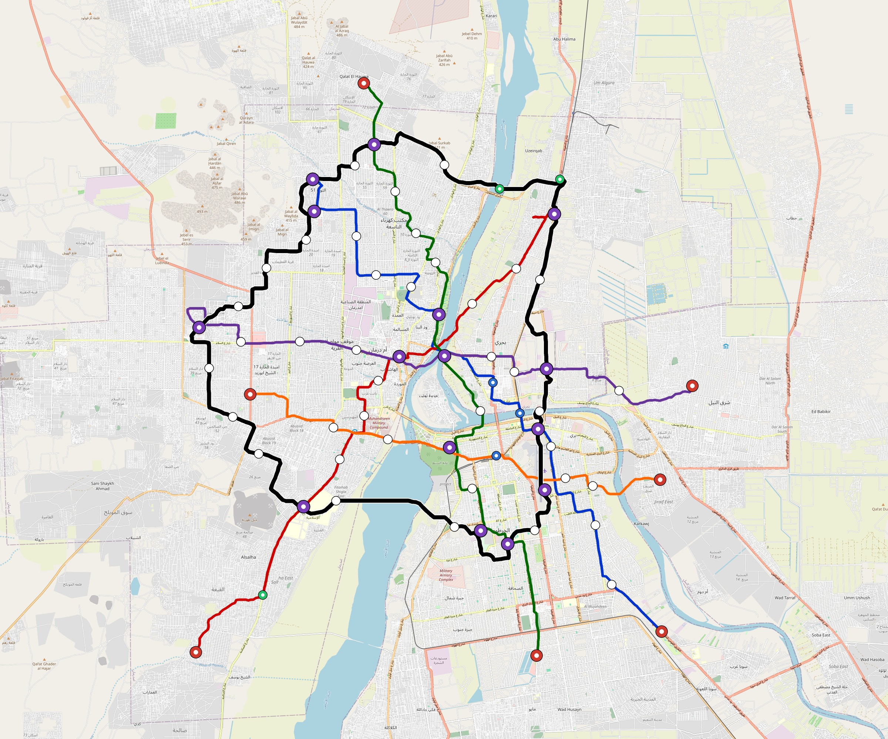

# Omdurman — Urban Rail Network

**Country:** SD · **Population:** 2,800,000 · [National brief](../NATIONAL-BRIEF.md)

This page contains only Omdurman-specific results. Shared routing, service, energy, civil, cost, finance, QA and validation methods are defined once in the [deployment planning reference](../../../../docs/deployment-planning-reference.md).

> [!IMPORTANT]
> **Foreign-capital advantage:** against the default equivalent foreign-turnkey sensitivity, this local plan avoids **$3.36 bn (87.0%) of external capital** and **$4.34 bn of external interest**. Capital plus saved interest totals **$7.70 bn**. See the common reference for interpretation and limitations.

Auto-planned by the OpenSourceRail design pipeline from the controlled city catalogue, source-locked geospatial inputs and shared templates.

## Network



| Local measure | Value |
|---|---:|
| Lines / unique stations / interchanges | 6 / 85 / 15 |
| Route length | 256.1 km double track |
| Coverage / transfer reachability | 52.6% / 87% |
| Estimated station catchment | 1,472,800 residents |
| Service span / peak headway | 05:30–02:00 / 3 min |
| Fleet | 312 × 4-car `metro-4car` trainsets (281 peak revenue) |
| Peak network throughput | 115,200 passengers/hour |
| Practical service capacity | 982,080 passenger-trips/day |
| Annual paid-trip planning range | 179.2–286.8 M |

### Lines

| Line | Length | Stations | Trainsets | Termini |
|---|---:|---:|---:|---|
| line-1 | 39.5 km | 15 | 65 | SE Outer ↔ NW Mid |
| line-2 | 35.8 km | 11 | 58 | NE Mid ↔ SW Outer |
| line-3 | 39.3 km | 13 | 61 | N Outer ↔ S Outer |
| line-4 | 32.9 km | 11 | 52 | W Mid ↔ E Outer |
| line-5 | 25.1 km | 9 | 41 | SE Outer ↔ W Mid |
| line-6 | 83.5 km | 26 | 35 | W Mid ↔ W Mid |
| **Total** | **256.1 km** | **85 unique** | **312** | |

## Energy

| Local measure | Value |
|---|---:|
| Scheduled service | 2,558 one-way journeys / 99,666 train-km/day |
| Annual traction demand | 628.6 GWh |
| Station/depot PV / storage | 29.3 MW / 161.5 MWh |
| Aggregate charging power | 123.0 MW |
| Dedicated solar plant | 296.4 MW |
| Residual grid/PPA import | 0.0 GWh/yr |
| Worst powered-stop gap | line-2: 10.8 km / 116 kWh |
| Lowest traversal charging margin | line-5: 194 kWh |

## Capital And Funding

| Local CAPEX bucket | Planning value |
|---|---:|
| Civil works | $867 M |
| Stations | $518 M |
| Depots | $8.0 M |
| Rolling stock | $349 M |
| Dedicated solar plant | $237 M |
| Residual train control | $13 M |
| Charging microgrids | $27 M |
| EPC / project services | $125 M |
| **Total city programme** | **$2.14 bn** |

| Local funding measure | Planning value |
|---|---:|
| Imported / external capital | $501 M (23.3%) |
| Domestic / local capital | $1.64 bn (76.7%) |
| Annual public construction commitment | $253 M / yr for 10 years |
| Annual post-grace debt service | $231 M / yr |
| External capital saved vs default turnkey sensitivity | $3.36 bn |
| Capital + lifetime external interest saved | $7.70 bn |
| Annual OPEX | $48 M / yr |

## Local Evidence

| Package | Current status | Evidence |
|---|---|---|
| Finance | pass | [`summary.json`](engineering/finance/summary.json) |
| Native simulation + degraded cases | pass | [`validation-summary.json`](engineering/simulation/validation-summary.json) |
| SUMO timetable | pass | [`summary.json`](engineering/sumo/summary.json) |
| GIS package | pass | [`summary.json`](engineering/gis/summary.json) |
| Grid/charging/solar | pass | [`summary.json`](engineering/energy/summary.json) |
| Operations, QA and maintenance | 797 assets / 3,493 tasks | [`omdurman-operations-manifest.json`](operations/omdurman-operations-manifest.json) |

## Local Files And Regeneration

| File | Local role |
|---|---|
| [`design.toml`](design.toml) | Authoritative generated city design |
| [`omdurman.toml`](omdurman.toml) | Expanded simulator scenario |
| [`omdurman.corridor.geojson`](omdurman.corridor.geojson) | GIS corridor and stations |
| [`omdurman.design-quality.yaml`](omdurman.design-quality.yaml) | Coverage, source and civil-quality gates |

```bash
scripts/regenerate-city.sh omdurman
```
