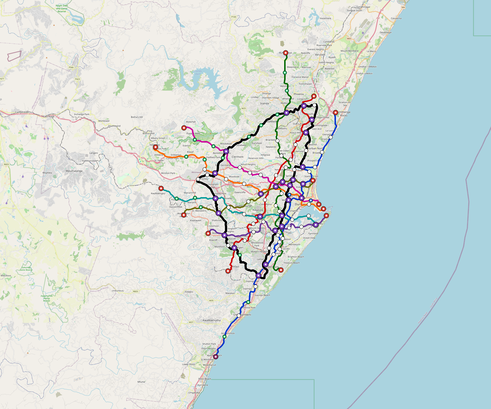

# Durban — Urban Rail Network

**Country:** ZA · **Population:** 3,900,000 · [National brief](../NATIONAL-BRIEF.md)

This page contains only Durban-specific results. Shared routing, service, energy, civil, cost, finance, QA and validation methods are defined once in the [deployment planning reference](../../../../docs/deployment-planning-reference.md).

> [!IMPORTANT]
> **Foreign-capital advantage:** against the default equivalent foreign-turnkey sensitivity, this local plan avoids **$6.94 bn (85.4%) of external capital** and **$8.53 bn of external interest**. Capital plus saved interest totals **$15.46 bn**. See the common reference for interpretation and limitations.

Auto-planned by the OpenSourceRail design pipeline from the controlled city catalogue, source-locked geospatial inputs and shared templates.

## Network



| Local measure | Value |
|---|---:|
| Lines / unique stations / interchanges | 9 / 139 / 26 |
| Route length | 401.0 km double track |
| Coverage / transfer reachability | 79.9% / 56% |
| Estimated station catchment | 3,116,100 residents |
| Service span / peak headway | 05:30–02:00 / 3 min |
| Fleet | 616 × 6-car `metro-6car` trainsets (555 peak revenue) |
| Peak network throughput | 259,200 passengers/hour |
| Practical service capacity | 2,276,640 passenger-trips/day |
| Annual paid-trip planning range | 415.5–664.8 M |

### Lines

| Line | Length | Stations | Trainsets | Termini |
|---|---:|---:|---:|---|
| line-1 | 57.2 km | 22 | 104 | NE Mid ↔ S Outer |
| line-2 | 44.1 km | 13 | 80 | SW Mid ↔ NE Mid |
| line-3 | 48.9 km | 16 | 90 | N Outer ↔ S Mid |
| line-4 | 26.4 km | 9 | 47 | SW Mid ↔ E Mid |
| line-5 | 37.9 km | 13 | 71 | E Mid ↔ NW Outer |
| line-6 | 32.3 km | 12 | 62 | W Mid ↔ SE Mid |
| line-7 | 32.9 km | 12 | 63 | NW Mid ↔ E Inner |
| line-8 | 29.0 km | 10 | 56 | W Mid ↔ E Inner |
| line-9 | 92.3 km | 32 | 43 | W Mid ↔ W Inner |
| **Total** | **401.0 km** | **139 unique** | **616** | |

## Energy

| Local measure | Value |
|---|---:|
| Scheduled service | 3,952 one-way journeys / 165,013 train-km/day |
| Annual traction demand | 1,561.2 GWh |
| Station/depot PV / storage | 41.6 MW / 284.0 MWh |
| Aggregate charging power | 246.0 MW |
| Dedicated solar plant | 976.9 MW |
| Residual grid/PPA import | 0.0 GWh/yr |
| Worst powered-stop gap | line-9: 14.4 km / 216 kWh |
| Lowest traversal charging margin | line-4: 218 kWh |

## Capital And Funding

| Local CAPEX bucket | Planning value |
|---|---:|
| Civil works | $1.45 bn |
| Stations | $914 M |
| Depots | $8.0 M |
| Rolling stock | $1.03 bn |
| Dedicated solar plant | $782 M |
| Residual train control | $20 M |
| Charging microgrids | $56 M |
| EPC / project services | $244 M |
| **Total city programme** | **$4.51 bn** |

| Local funding measure | Planning value |
|---|---:|
| Imported / external capital | $1.19 bn (26.3%) |
| Domestic / local capital | $3.33 bn (73.7%) |
| Annual public construction commitment | $466 M / yr for 5 years |
| Annual post-grace debt service | $356 M / yr |
| External capital saved vs default turnkey sensitivity | $6.94 bn |
| Capital + lifetime external interest saved | $15.46 bn |
| Annual OPEX | $118 M / yr |

## Local Evidence

| Package | Current status | Evidence |
|---|---|---|
| Finance | pass | [`summary.json`](engineering/finance/summary.json) |
| Native simulation + degraded cases | pass | [`validation-summary.json`](engineering/simulation/validation-summary.json) |
| SUMO timetable | pass | [`summary.json`](engineering/sumo/summary.json) |
| GIS package | pass | [`summary.json`](engineering/gis/summary.json) |
| Grid/charging/solar | pass | [`summary.json`](engineering/energy/summary.json) |
| Operations, QA and maintenance | 1,415 assets / 6,440 tasks | [`durban-operations-manifest.json`](operations/durban-operations-manifest.json) |

## Local Files And Regeneration

| File | Local role |
|---|---|
| [`design.toml`](design.toml) | Authoritative generated city design |
| [`durban.toml`](durban.toml) | Expanded simulator scenario |
| [`durban.corridor.geojson`](durban.corridor.geojson) | GIS corridor and stations |
| [`durban.design-quality.yaml`](durban.design-quality.yaml) | Coverage, source and civil-quality gates |

```bash
scripts/regenerate-city.sh durban
```
