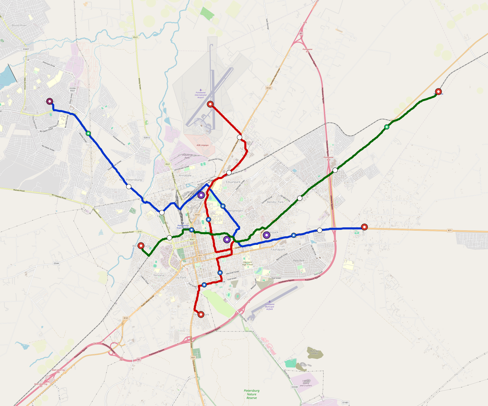

# Polokwane — Urban Rail Network

**Country:** ZA · **Population:** 600,000 · [National brief](../NATIONAL-BRIEF.md)

This page contains only Polokwane-specific results. Shared routing, service, energy, civil, cost, finance, QA and validation methods are defined once in the [deployment planning reference](../../../../docs/deployment-planning-reference.md).

> [!IMPORTANT]
> **Foreign-capital advantage:** against the default equivalent foreign-turnkey sensitivity, this local plan avoids **$596 M (86.4%) of external capital** and **$733 M of external interest**. Capital plus saved interest totals **$1.33 bn**. See the common reference for interpretation and limitations.

Auto-planned by the OpenSourceRail design pipeline from the controlled city catalogue, source-locked geospatial inputs and shared templates.

## Network



| Local measure | Value |
|---|---:|
| Lines / unique stations / interchanges | 3 / 20 / 1 |
| Route length | 51.3 km double track |
| Coverage / transfer reachability | 61.7% / 100% |
| Estimated station catchment | 370,200 residents |
| Service span / peak headway | 05:30–02:00 / 3 min |
| Fleet | 110 × 3-car `light-metro-3car` trainsets (99 peak revenue) |
| Peak network throughput | 43,200 passengers/hour |
| Practical service capacity | 401,760 passenger-trips/day |
| Annual paid-trip planning range | 73.3–117.3 M |

### Lines

| Line | Length | Stations | Trainsets | Termini |
|---|---:|---:|---:|---|
| line-1 | 19.6 km | 8 | 42 | E Mid ↔ NW Outer |
| line-2 | 14.6 km | 6 | 31 | N Mid ↔ S Mid |
| line-3 | 17.1 km | 6 | 37 | SW Mid ↔ NE Outer |
| **Total** | **51.3 km** | **20 unique** | **110** | |

## Energy

| Local measure | Value |
|---|---:|
| Scheduled service | 1,395 one-way journeys / 23,857 train-km/day |
| Annual traction demand | 112.9 GWh |
| Station/depot PV / storage | 10.1 MW / 48.5 MWh |
| Aggregate charging power | 9.0 MW |
| Dedicated solar plant | 43.1 MW |
| Residual grid/PPA import | 0.0 GWh/yr |
| Worst powered-stop gap | line-3: 8.1 km / 67 kWh |
| Lowest traversal charging margin | line-2: 38 kWh |

## Capital And Funding

| Local CAPEX bucket | Planning value |
|---|---:|
| Civil works | $134 M |
| Stations | $81 M |
| Depots | $8.0 M |
| Rolling stock | $99 M |
| Dedicated solar plant | $34 M |
| Residual train control | $2.6 M |
| Charging microgrids | $1.9 M |
| EPC / project services | $23 M |
| **Total city programme** | **$384 M** |

| Local funding measure | Planning value |
|---|---:|
| Imported / external capital | $94 M (24.5%) |
| Domestic / local capital | $290 M (75.5%) |
| Annual public construction commitment | $40 M / yr for 5 years |
| Annual post-grace debt service | $30 M / yr |
| External capital saved vs default turnkey sensitivity | $596 M |
| Capital + lifetime external interest saved | $1.33 bn |
| Annual OPEX | $12 M / yr |

## Local Evidence

| Package | Current status | Evidence |
|---|---|---|
| Finance | pass | [`summary.json`](engineering/finance/summary.json) |
| Native simulation + degraded cases | pass | [`validation-summary.json`](engineering/simulation/validation-summary.json) |
| SUMO timetable | pass | [`summary.json`](engineering/sumo/summary.json) |
| GIS package | pass | [`summary.json`](engineering/gis/summary.json) |
| Grid/charging/solar | pass | [`summary.json`](engineering/energy/summary.json) |
| Operations, QA and maintenance | 228 assets / 1,073 tasks | [`polokwane-operations-manifest.json`](operations/polokwane-operations-manifest.json) |

## Local Files And Regeneration

| File | Local role |
|---|---|
| [`design.toml`](design.toml) | Authoritative generated city design |
| [`polokwane.toml`](polokwane.toml) | Expanded simulator scenario |
| [`polokwane.corridor.geojson`](polokwane.corridor.geojson) | GIS corridor and stations |
| [`polokwane.design-quality.yaml`](polokwane.design-quality.yaml) | Coverage, source and civil-quality gates |

```bash
scripts/regenerate-city.sh polokwane
```
