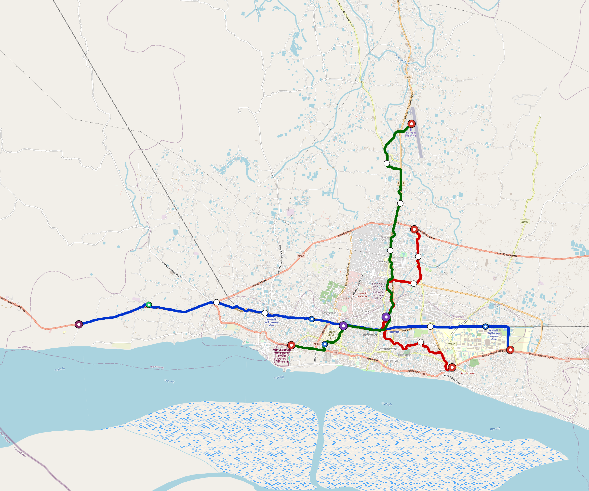

# Rajshahi — Urban Rail Network

**Country:** BD · **Population:** 950,000 · [National brief](../NATIONAL-BRIEF.md)

This page contains only Rajshahi-specific results. Shared routing, service, energy, civil, cost, finance, QA and validation methods are defined once in the [deployment planning reference](../../../../docs/deployment-planning-reference.md).

> [!IMPORTANT]
> **Foreign-capital advantage:** against the default equivalent foreign-turnkey sensitivity, this local plan avoids **$642 M (86.8%) of external capital** and **$805 M of external interest**. Capital plus saved interest totals **$1.45 bn**. See the common reference for interpretation and limitations.

Auto-planned by the OpenSourceRail design pipeline from the controlled city catalogue, source-locked geospatial inputs and shared templates.

## Network



| Local measure | Value |
|---|---:|
| Lines / unique stations / interchanges | 3 / 18 / 2 |
| Route length | 42.4 km double track |
| Coverage / transfer reachability | 66.1% / 100% |
| Estimated station catchment | 627,950 residents |
| Service span / peak headway | 05:30–02:00 / 3 min |
| Fleet | 93 × 3-car `light-metro-3car` trainsets (83 peak revenue) |
| Peak network throughput | 43,200 passengers/hour |
| Practical service capacity | 401,760 passenger-trips/day |
| Annual paid-trip planning range | 73.3–117.3 M |

### Lines

| Line | Length | Stations | Trainsets | Termini |
|---|---:|---:|---:|---|
| line-1 | 18.0 km | 6 | 38 | E Mid ↔ W Outer |
| line-2 | 10.3 km | 6 | 24 | SE Mid ↔ NE Inner |
| line-3 | 14.1 km | 6 | 31 | N Mid ↔ SW Inner |
| **Total** | **42.4 km** | **18 unique** | **93** | |

## Energy

| Local measure | Value |
|---|---:|
| Scheduled service | 1,395 one-way journeys / 19,706 train-km/day |
| Annual traction demand | 93.2 GWh |
| Station/depot PV / storage | 9.8 MW / 48.0 MWh |
| Aggregate charging power | 8.5 MW |
| Dedicated solar plant | 49.9 MW |
| Residual grid/PPA import | 0.0 GWh/yr |
| Worst powered-stop gap | line-1: 8.9 km / 67 kWh |
| Lowest traversal charging margin | line-2: 46 kWh |

## Capital And Funding

| Local CAPEX bucket | Planning value |
|---|---:|
| Civil works | $146 M |
| Stations | $105 M |
| Depots | $8.0 M |
| Rolling stock | $84 M |
| Dedicated solar plant | $40 M |
| Residual train control | $2.1 M |
| Charging microgrids | $2.0 M |
| EPC / project services | $24 M |
| **Total city programme** | **$411 M** |

| Local funding measure | Planning value |
|---|---:|
| Imported / external capital | $98 M (23.8%) |
| Domestic / local capital | $313 M (76.2%) |
| Annual public construction commitment | $35 M / yr for 7 years |
| Annual post-grace debt service | $29 M / yr |
| External capital saved vs default turnkey sensitivity | $642 M |
| Capital + lifetime external interest saved | $1.45 bn |
| Annual OPEX | $10 M / yr |

## Local Evidence

| Package | Current status | Evidence |
|---|---|---|
| Finance | pass | [`summary.json`](engineering/finance/summary.json) |
| Native simulation + degraded cases | pass | [`validation-summary.json`](engineering/simulation/validation-summary.json) |
| SUMO timetable | pass | [`summary.json`](engineering/sumo/summary.json) |
| GIS package | pass | [`summary.json`](engineering/gis/summary.json) |
| Grid/charging/solar | pass | [`summary.json`](engineering/energy/summary.json) |
| Operations, QA and maintenance | 201 assets / 926 tasks | [`rajshahi-operations-manifest.json`](operations/rajshahi-operations-manifest.json) |

## Local Files And Regeneration

| File | Local role |
|---|---|
| [`design.toml`](design.toml) | Authoritative generated city design |
| [`rajshahi.toml`](rajshahi.toml) | Expanded simulator scenario |
| [`rajshahi.corridor.geojson`](rajshahi.corridor.geojson) | GIS corridor and stations |
| [`rajshahi.design-quality.yaml`](rajshahi.design-quality.yaml) | Coverage, source and civil-quality gates |

```bash
scripts/regenerate-city.sh rajshahi
```
