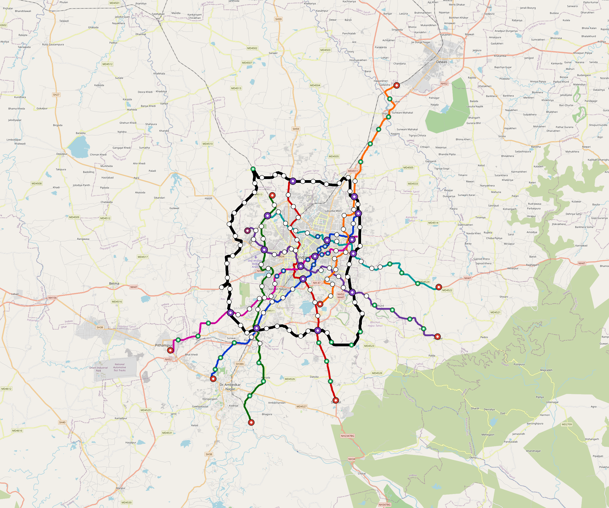

# Indore — Urban Rail Network

**Country:** IN · **Population:** 3,200,000 · [National brief](../NATIONAL-BRIEF.md)

This page contains only Indore-specific results. Shared routing, service, energy, civil, cost, finance, QA and validation methods are defined once in the [deployment planning reference](../../../../docs/deployment-planning-reference.md).

> [!IMPORTANT]
> **Foreign-capital advantage:** against the default equivalent foreign-turnkey sensitivity, this local plan avoids **$5.32 bn (85.2%) of external capital** and **$6.54 bn of external interest**. Capital plus saved interest totals **$11.87 bn**. See the common reference for interpretation and limitations.

Auto-planned by the OpenSourceRail design pipeline from the controlled city catalogue, source-locked geospatial inputs and shared templates.

## Network



| Local measure | Value |
|---|---:|
| Lines / unique stations / interchanges | 8 / 111 / 14 |
| Route length | 369.4 km double track |
| Coverage / transfer reachability | 56.4% / 54% |
| Estimated station catchment | 1,804,799 residents |
| Service span / peak headway | 05:30–02:00 / 3 min |
| Fleet | 571 × 6-car `metro-6car` trainsets (515 peak revenue) |
| Peak network throughput | 230,400 passengers/hour |
| Practical service capacity | 2,008,800 passenger-trips/day |
| Annual paid-trip planning range | 366.6–586.6 M |

### Lines

| Line | Length | Stations | Trainsets | Termini |
|---|---:|---:|---:|---|
| line-1 | 38.1 km | 11 | 72 | NE Mid ↔ SW Outer |
| line-2 | 38.2 km | 14 | 74 | S Mid ↔ N Mid |
| line-3 | 41.7 km | 14 | 81 | NW Mid ↔ S Outer |
| line-4 | 42.7 km | 16 | 82 | SE Outer ↔ NW Mid |
| line-5 | 41.7 km | 10 | 79 | SE Inner ↔ NE Outer |
| line-6 | 34.6 km | 11 | 67 | NW Inner ↔ E Mid |
| line-7 | 39.2 km | 12 | 74 | SW Outer ↔ NE Inner |
| line-8 | 93.3 km | 23 | 42 | NW Mid ↔ NW Mid |
| **Total** | **369.4 km** | **111 unique** | **571** | |

## Energy

| Local measure | Value |
|---|---:|
| Scheduled service | 3,488 one-way journeys / 150,074 train-km/day |
| Annual traction demand | 1,419.8 GWh |
| Station/depot PV / storage | 32.0 MW / 220.0 MWh |
| Aggregate charging power | 182.0 MW |
| Dedicated solar plant | 708.8 MW |
| Residual grid/PPA import | 0.0 GWh/yr |
| Worst powered-stop gap | line-5: 19.9 km / 321 kWh |
| Lowest traversal charging margin | line-6: 268 kWh |

## Capital And Funding

| Local CAPEX bucket | Planning value |
|---|---:|
| Civil works | $1.17 bn |
| Stations | $518 M |
| Depots | $8.0 M |
| Rolling stock | $959 M |
| Dedicated solar plant | $567 M |
| Residual train control | $18 M |
| Charging microgrids | $39 M |
| EPC / project services | $190 M |
| **Total city programme** | **$3.47 bn** |

| Local funding measure | Planning value |
|---|---:|
| Imported / external capital | $926 M (26.7%) |
| Domestic / local capital | $2.55 bn (73.3%) |
| Annual public construction commitment | $290 M / yr for 5 years |
| Annual post-grace debt service | $214 M / yr |
| External capital saved vs default turnkey sensitivity | $5.32 bn |
| Capital + lifetime external interest saved | $11.87 bn |
| Annual OPEX | $88 M / yr |

## Local Evidence

| Package | Current status | Evidence |
|---|---|---|
| Finance | pass | [`summary.json`](engineering/finance/summary.json) |
| Native simulation + degraded cases | pass | [`validation-summary.json`](engineering/simulation/validation-summary.json) |
| SUMO timetable | pass | [`summary.json`](engineering/sumo/summary.json) |
| GIS package | pass | [`summary.json`](engineering/gis/summary.json) |
| Grid/charging/solar | pass | [`summary.json`](engineering/energy/summary.json) |
| Operations, QA and maintenance | 1,206 assets / 5,676 tasks | [`indore-operations-manifest.json`](operations/indore-operations-manifest.json) |

## Local Files And Regeneration

| File | Local role |
|---|---|
| [`design.toml`](design.toml) | Authoritative generated city design |
| [`indore.toml`](indore.toml) | Expanded simulator scenario |
| [`indore.corridor.geojson`](indore.corridor.geojson) | GIS corridor and stations |
| [`indore.design-quality.yaml`](indore.design-quality.yaml) | Coverage, source and civil-quality gates |

```bash
scripts/regenerate-city.sh indore
```
