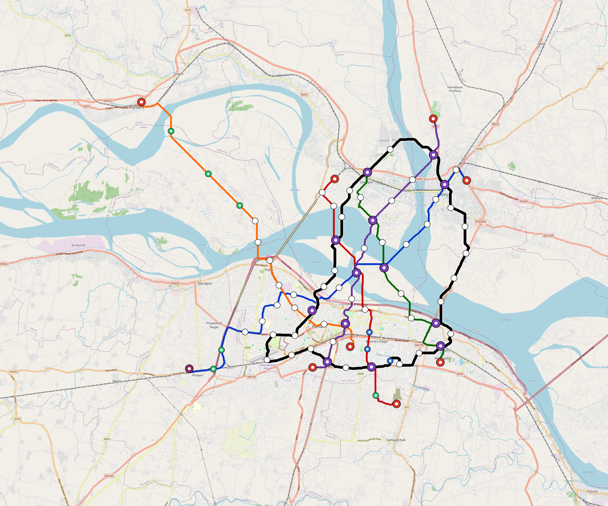

# Patna — Urban Rail Network

**Country:** IN · **Population:** 2,520,000 · [National brief](../NATIONAL-BRIEF.md)

This page contains only Patna-specific results. Shared routing, service, energy, civil, cost, finance, QA and validation methods are defined once in the [deployment planning reference](../../../../docs/deployment-planning-reference.md).

> [!IMPORTANT]
> **Foreign-capital advantage:** against the default equivalent foreign-turnkey sensitivity, this local plan avoids **$2.76 bn (87.4%) of external capital** and **$3.39 bn of external interest**. Capital plus saved interest totals **$6.15 bn**. See the common reference for interpretation and limitations.

Auto-planned by the OpenSourceRail design pipeline from the controlled city catalogue, source-locked geospatial inputs and shared templates.

## Network



| Local measure | Value |
|---|---:|
| Lines / unique stations / interchanges | 6 / 62 / 11 |
| Route length | 171.3 km double track |
| Coverage / transfer reachability | 64.8% / 53% |
| Estimated station catchment | 1,632,960 residents |
| Service span / peak headway | 05:30–02:00 / 3 min |
| Fleet | 215 × 4-car `metro-4car` trainsets (192 peak revenue) |
| Peak network throughput | 115,200 passengers/hour |
| Practical service capacity | 982,080 passenger-trips/day |
| Annual paid-trip planning range | 179.2–286.8 M |

### Lines

| Line | Length | Stations | Trainsets | Termini |
|---|---:|---:|---:|---|
| line-1 | 31.0 km | 11 | 48 | NE Mid ↔ SW Outer |
| line-2 | 19.5 km | 8 | 34 | S Mid ↔ N Mid |
| line-3 | 17.9 km | 7 | 30 | N Mid ↔ SE Mid |
| line-4 | 22.0 km | 10 | 39 | NE Mid ↔ SW Mid |
| line-5 | 26.0 km | 9 | 41 | S Inner ↔ NW Outer |
| line-6 | 54.8 km | 17 | 23 | NE Mid ↔ N Mid |
| **Total** | **171.3 km** | **62 unique** | **215** | |

## Energy

| Local measure | Value |
|---|---:|
| Scheduled service | 2,558 one-way journeys / 66,895 train-km/day |
| Annual traction demand | 421.9 GWh |
| Station/depot PV / storage | 22.1 MW / 125.5 MWh |
| Aggregate charging power | 87.0 MW |
| Dedicated solar plant | 251.5 MW |
| Residual grid/PPA import | 0.0 GWh/yr |
| Worst powered-stop gap | line-5: 13.0 km / 130 kWh |
| Lowest traversal charging margin | line-5: 168 kWh |

## Capital And Funding

| Local CAPEX bucket | Planning value |
|---|---:|
| Civil works | $800 M |
| Stations | $375 M |
| Depots | $8.0 M |
| Rolling stock | $241 M |
| Dedicated solar plant | $201 M |
| Residual train control | $8.6 M |
| Charging microgrids | $19 M |
| EPC / project services | $102 M |
| **Total city programme** | **$1.75 bn** |

| Local funding measure | Planning value |
|---|---:|
| Imported / external capital | $399 M (22.7%) |
| Domestic / local capital | $1.36 bn (77.3%) |
| Annual public construction commitment | $150 M / yr for 5 years |
| Annual post-grace debt service | $108 M / yr |
| External capital saved vs default turnkey sensitivity | $2.76 bn |
| Capital + lifetime external interest saved | $6.15 bn |
| Annual OPEX | $40 M / yr |

## Local Evidence

| Package | Current status | Evidence |
|---|---|---|
| Finance | pass | [`summary.json`](engineering/finance/summary.json) |
| Native simulation + degraded cases | pass | [`validation-summary.json`](engineering/simulation/validation-summary.json) |
| SUMO timetable | pass | [`summary.json`](engineering/sumo/summary.json) |
| GIS package | pass | [`summary.json`](engineering/gis/summary.json) |
| Grid/charging/solar | pass | [`summary.json`](engineering/energy/summary.json) |
| Operations, QA and maintenance | 565 assets / 2,447 tasks | [`patna-operations-manifest.json`](operations/patna-operations-manifest.json) |

## Local Files And Regeneration

| File | Local role |
|---|---|
| [`design.toml`](design.toml) | Authoritative generated city design |
| [`patna.toml`](patna.toml) | Expanded simulator scenario |
| [`patna.corridor.geojson`](patna.corridor.geojson) | GIS corridor and stations |
| [`patna.design-quality.yaml`](patna.design-quality.yaml) | Coverage, source and civil-quality gates |

```bash
scripts/regenerate-city.sh patna
```
