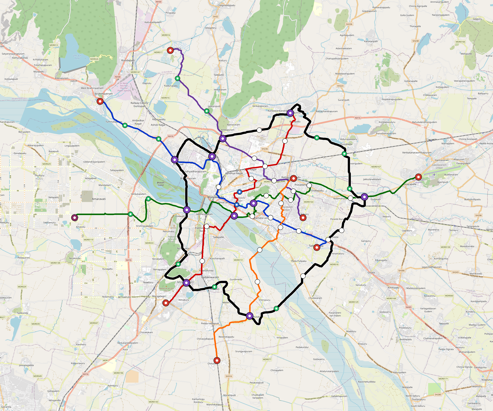

# Vijayawada — Urban Rail Network

**Country:** IN · **Population:** 1,500,000 · [National brief](../NATIONAL-BRIEF.md)

This page contains only Vijayawada-specific results. Shared routing, service, energy, civil, cost, finance, QA and validation methods are defined once in the [deployment planning reference](../../../../docs/deployment-planning-reference.md).

> [!IMPORTANT]
> **Foreign-capital advantage:** against the default equivalent foreign-turnkey sensitivity, this local plan avoids **$2.82 bn (86.5%) of external capital** and **$3.47 bn of external interest**. Capital plus saved interest totals **$6.29 bn**. See the common reference for interpretation and limitations.

Auto-planned by the OpenSourceRail design pipeline from the controlled city catalogue, source-locked geospatial inputs and shared templates.

## Network



| Local measure | Value |
|---|---:|
| Lines / unique stations / interchanges | 6 / 67 / 10 |
| Route length | 228.3 km double track |
| Coverage / transfer reachability | 82.8% / 47% |
| Estimated station catchment | 1,242,000 residents |
| Service span / peak headway | 05:30–02:00 / 3 min |
| Fleet | 266 × 4-car `metro-4car` trainsets (239 peak revenue) |
| Peak network throughput | 115,200 passengers/hour |
| Practical service capacity | 982,080 passenger-trips/day |
| Annual paid-trip planning range | 179.2–286.8 M |

### Lines

| Line | Length | Stations | Trainsets | Termini |
|---|---:|---:|---:|---|
| line-1 | 33.1 km | 11 | 52 | NW Outer ↔ SE Mid |
| line-2 | 28.8 km | 10 | 45 | NE Mid ↔ SW Outer |
| line-3 | 43.4 km | 13 | 65 | E Outer ↔ W Outer |
| line-4 | 25.0 km | 8 | 41 | E Mid ↔ NW Outer |
| line-5 | 23.3 km | 7 | 34 | NE Inner ↔ S Outer |
| line-6 | 74.7 km | 18 | 29 | NW Mid ↔ W Mid |
| **Total** | **228.3 km** | **67 unique** | **266** | |

## Energy

| Local measure | Value |
|---|---:|
| Scheduled service | 2,558 one-way journeys / 88,781 train-km/day |
| Annual traction demand | 560.0 GWh |
| Station/depot PV / storage | 21.2 MW / 121.0 MWh |
| Aggregate charging power | 82.5 MW |
| Dedicated solar plant | 343.2 MW |
| Residual grid/PPA import | 0.0 GWh/yr |
| Worst powered-stop gap | line-6: 15.1 km / 151 kWh |
| Lowest traversal charging margin | line-5: 136 kWh |

## Capital And Funding

| Local CAPEX bucket | Planning value |
|---|---:|
| Civil works | $760 M |
| Stations | $342 M |
| Depots | $8.0 M |
| Rolling stock | $298 M |
| Dedicated solar plant | $275 M |
| Residual train control | $11 M |
| Charging microgrids | $18 M |
| EPC / project services | $101 M |
| **Total city programme** | **$1.81 bn** |

| Local funding measure | Planning value |
|---|---:|
| Imported / external capital | $440 M (24.3%) |
| Domestic / local capital | $1.37 bn (75.7%) |
| Annual public construction commitment | $154 M / yr for 5 years |
| Annual post-grace debt service | $112 M / yr |
| External capital saved vs default turnkey sensitivity | $2.82 bn |
| Capital + lifetime external interest saved | $6.29 bn |
| Annual OPEX | $42 M / yr |

## Local Evidence

| Package | Current status | Evidence |
|---|---|---|
| Finance | pass | [`summary.json`](engineering/finance/summary.json) |
| Native simulation + degraded cases | pass | [`validation-summary.json`](engineering/simulation/validation-summary.json) |
| SUMO timetable | pass | [`summary.json`](engineering/sumo/summary.json) |
| GIS package | pass | [`summary.json`](engineering/gis/summary.json) |
| Grid/charging/solar | pass | [`summary.json`](engineering/energy/summary.json) |
| Operations, QA and maintenance | 639 assets / 2,861 tasks | [`vijayawada-operations-manifest.json`](operations/vijayawada-operations-manifest.json) |

## Local Files And Regeneration

| File | Local role |
|---|---|
| [`design.toml`](design.toml) | Authoritative generated city design |
| [`vijayawada.toml`](vijayawada.toml) | Expanded simulator scenario |
| [`vijayawada.corridor.geojson`](vijayawada.corridor.geojson) | GIS corridor and stations |
| [`vijayawada.design-quality.yaml`](vijayawada.design-quality.yaml) | Coverage, source and civil-quality gates |

```bash
scripts/regenerate-city.sh vijayawada
```
