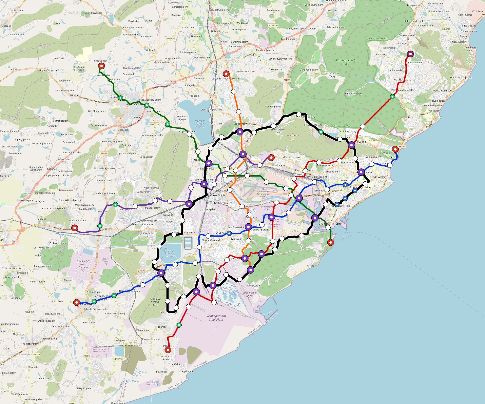

# Visakhapatnam — Urban Rail Network

**Country:** IN · **Population:** 2,300,000 · [National brief](../NATIONAL-BRIEF.md)

This page contains only Visakhapatnam-specific results. Shared routing, service, energy, civil, cost, finance, QA and validation methods are defined once in the [deployment planning reference](../../../../docs/deployment-planning-reference.md).

> [!IMPORTANT]
> **Foreign-capital advantage:** against the default equivalent foreign-turnkey sensitivity, this local plan avoids **$3.19 bn (86.7%) of external capital** and **$3.93 bn of external interest**. Capital plus saved interest totals **$7.12 bn**. See the common reference for interpretation and limitations.

Auto-planned by the OpenSourceRail design pipeline from the controlled city catalogue, source-locked geospatial inputs and shared templates.

## Network



| Local measure | Value |
|---|---:|
| Lines / unique stations / interchanges | 6 / 76 / 12 |
| Route length | 236.8 km double track |
| Coverage / transfer reachability | 49.5% / 40% |
| Estimated station catchment | 1,138,500 residents |
| Service span / peak headway | 05:30–02:00 / 3 min |
| Fleet | 286 × 4-car `metro-4car` trainsets (257 peak revenue) |
| Peak network throughput | 115,200 passengers/hour |
| Practical service capacity | 982,080 passenger-trips/day |
| Annual paid-trip planning range | 179.2–286.8 M |

### Lines

| Line | Length | Stations | Trainsets | Termini |
|---|---:|---:|---:|---|
| line-1 | 41.7 km | 14 | 62 | E Outer ↔ SW Outer |
| line-2 | 45.9 km | 14 | 71 | SW Outer ↔ NE Outer |
| line-3 | 32.5 km | 10 | 51 | NW Outer ↔ SE Mid |
| line-4 | 25.7 km | 8 | 41 | W Outer ↔ NE Inner |
| line-5 | 21.5 km | 8 | 35 | N Mid ↔ S Inner |
| line-6 | 69.6 km | 22 | 26 | N Inner ↔ N Inner |
| **Total** | **236.8 km** | **76 unique** | **286** | |

## Energy

| Local measure | Value |
|---|---:|
| Scheduled service | 2,558 one-way journeys / 93,946 train-km/day |
| Annual traction demand | 592.5 GWh |
| Station/depot PV / storage | 25.4 MW / 142.0 MWh |
| Aggregate charging power | 103.5 MW |
| Dedicated solar plant | 359.7 MW |
| Residual grid/PPA import | 0.0 GWh/yr |
| Worst powered-stop gap | line-3: 14.0 km / 140 kWh |
| Lowest traversal charging margin | line-3: 158 kWh |

## Capital And Funding

| Local CAPEX bucket | Planning value |
|---|---:|
| Civil works | $861 M |
| Stations | $420 M |
| Depots | $8.0 M |
| Rolling stock | $320 M |
| Dedicated solar plant | $288 M |
| Residual train control | $12 M |
| Charging microgrids | $23 M |
| EPC / project services | $115 M |
| **Total city programme** | **$2.05 bn** |

| Local funding measure | Planning value |
|---|---:|
| Imported / external capital | $489 M (23.9%) |
| Domestic / local capital | $1.56 bn (76.1%) |
| Annual public construction commitment | $174 M / yr for 5 years |
| Annual post-grace debt service | $126 M / yr |
| External capital saved vs default turnkey sensitivity | $3.19 bn |
| Capital + lifetime external interest saved | $7.12 bn |
| Annual OPEX | $47 M / yr |

## Local Evidence

| Package | Current status | Evidence |
|---|---|---|
| Finance | pass | [`summary.json`](engineering/finance/summary.json) |
| Native simulation + degraded cases | pass | [`validation-summary.json`](engineering/simulation/validation-summary.json) |
| SUMO timetable | pass | [`summary.json`](engineering/sumo/summary.json) |
| GIS package | pass | [`summary.json`](engineering/gis/summary.json) |
| Grid/charging/solar | pass | [`summary.json`](engineering/energy/summary.json) |
| Operations, QA and maintenance | 715 assets / 3,157 tasks | [`visakhapatnam-operations-manifest.json`](operations/visakhapatnam-operations-manifest.json) |

## Local Files And Regeneration

| File | Local role |
|---|---|
| [`design.toml`](design.toml) | Authoritative generated city design |
| [`visakhapatnam.toml`](visakhapatnam.toml) | Expanded simulator scenario |
| [`visakhapatnam.corridor.geojson`](visakhapatnam.corridor.geojson) | GIS corridor and stations |
| [`visakhapatnam.design-quality.yaml`](visakhapatnam.design-quality.yaml) | Coverage, source and civil-quality gates |

```bash
scripts/regenerate-city.sh visakhapatnam
```
