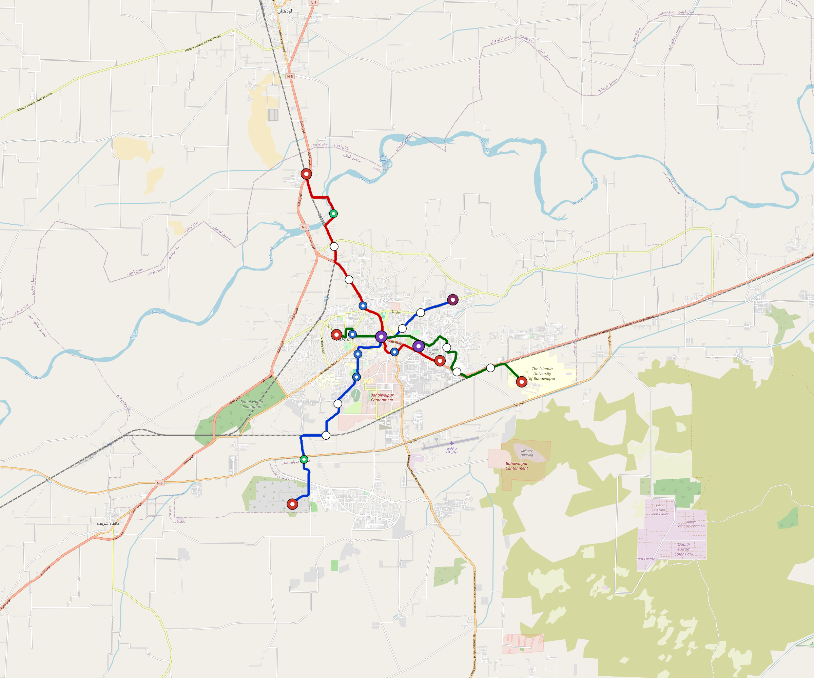
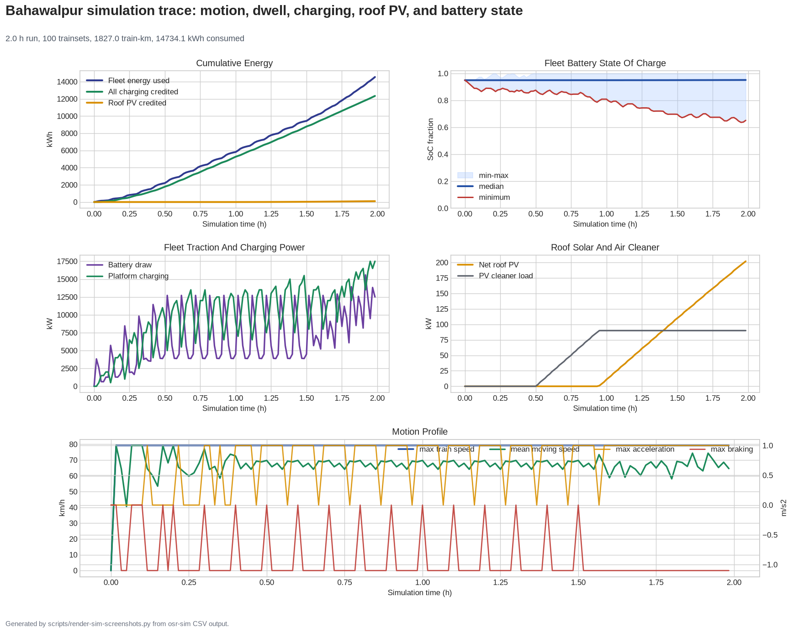
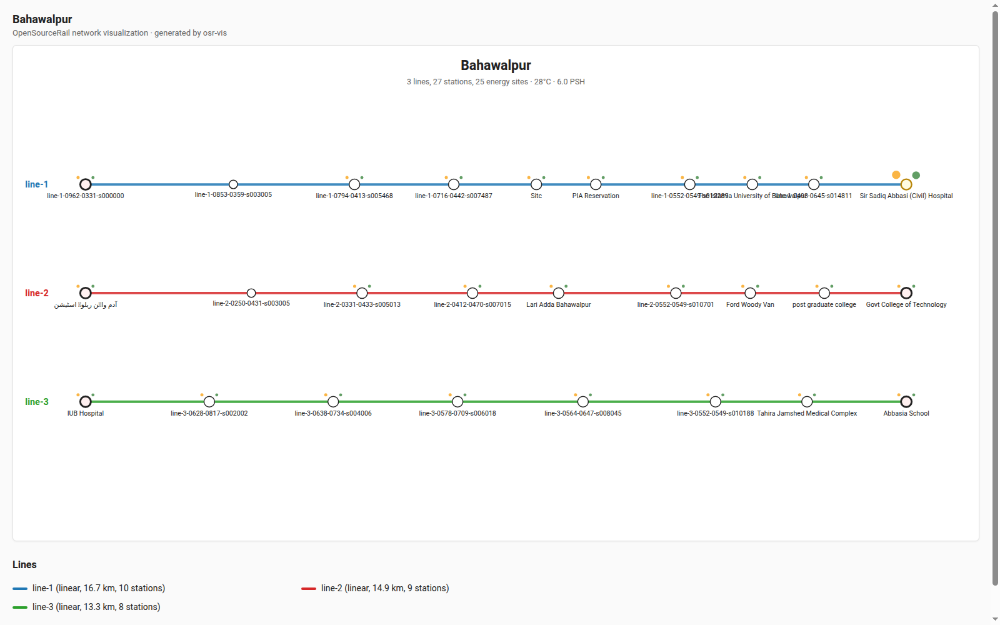
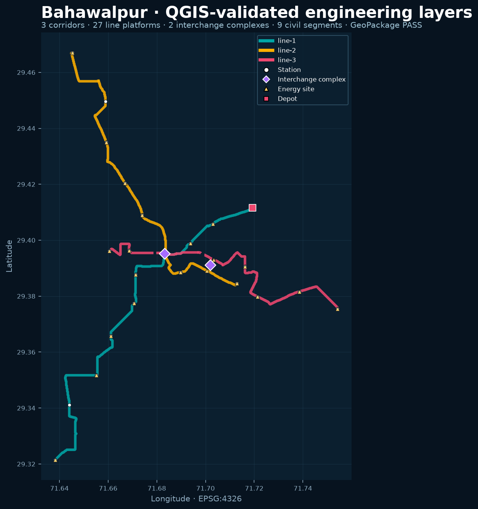
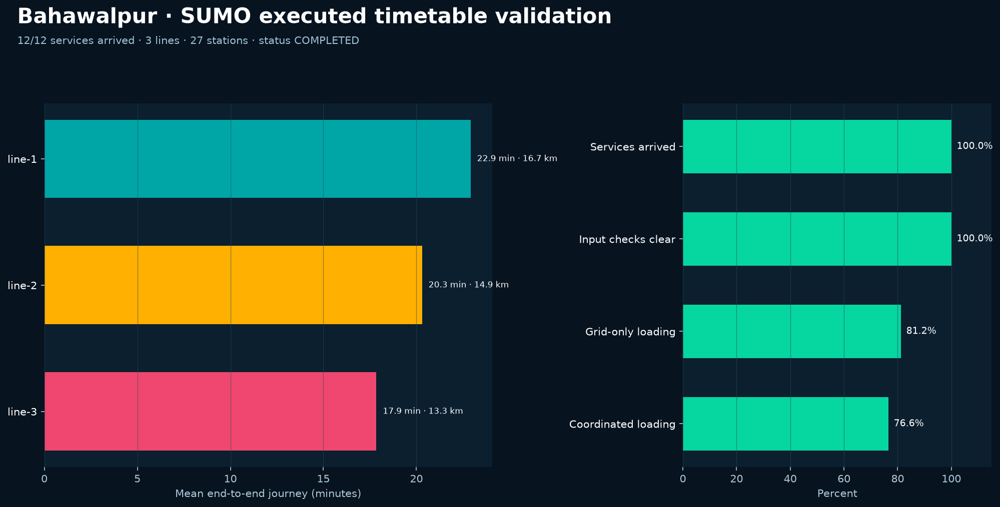

# Bahawalpur — Urban Rail Network

**Country:** PK · **Population:** 900,000

Auto-planned by the OpenSourceRail design pipeline: [`osr_geo`](../../../../design-py/src/osr_geo/) rasterises Overpass-verified OpenStreetMap features (arterial road graph, buildings, water, protected land, demand-anchor POIs) onto a 20 m cost / demand / buildability grid; [`osr-design`](../../../../crates/osr-design/) (rust) runs a demand-rewarded Dijkstra on that grid to synthesise corridors, places stations against the demand surface, and classifies every segment (at-grade / elevated / bridge — no tunnels per [RFC 0011](../../../../docs/rfcs/0011-civil-infrastructure-design-standard.md)). Population, country, and bbox are read from the canonical city catalog at [`lib/city-batches/world-sample.toml`](../../../../lib/city-batches/world-sample.toml).

## Network map



*Every line visible end-to-end — radials out to the city edge, forced-coverage suburbs, and the ring line if present. Auto-fit zoom based on the network's actual bounding box.*

Corridor polylines + stations as GeoJSON for GIS / alignment tooling: [`bahawalpur.corridor.geojson`](bahawalpur.corridor.geojson).

## At a glance

| Metric | Value |
|---|---|
| Lines | 3 |
| Unique stations | 18 |
| Interchange-class stations | 2 |
| Multi-line transfer reachability | 100% (line-pairs sharing ≥ 1 station) |
| Anchor-weighted coverage | 58.1% |
| Route length (double track) | 44.8 km |
| Revenue fleet | 89 × 3-car trainsets |
| Revenue fleet passenger capacity | 32,040 AW2 pax (42,720 AW3 crush) |
| Dedicated depot-service rotation fleet | 0 (off-peak service uses peak-fleet surplus) |
| Spare + cold-reserve | 11 × 3-car trainsets |
| Peak headway | 3 min |
| Station spacing policy | 1.6 km central / 3 km urban / up to 7 km on suburban approaches and the lowest-demand outer fringe |
| City-centre consolidation | Cross-line platforms within the 600 m station-complex envelope are emitted as one interchange |
| Service hours | 05:30 – 02:00 (20.5 h/day) |

## Turnaround inspection and recharge

During the 07:00–09:00 and 15:00–17:00 peaks, trains make the normal quick terminal turnback: no depot-service hold is inserted, allowing more battery depletion while the 20% dispatch-reserve gate remains mandatory. In the 6- and 12-minute lower-frequency windows, each line's deterministic energy controller may widen the published headway when actual charging delivery leaves a departing set below the 40% normal-service SoC target (up to 3× the published headway). This automatically matches offered off-peak service to available traction energy without buying a separate service-rotation fleet. In those lower-frequency windows, each train receives a **12-minute service slot** at its designated powered service point. This may be a staffed terminal platform or the main depot; only defects and maintenance require a depot move. Interior cleaning, exterior and running-gear walk-around, door/coupler/emergency-equipment checks, fault-log download, and a 150 kW low-C recharge run concurrently. A red defect holds the set for maintenance; a clear inspection returns it to the revenue rotation.

The fleet is sized for the 3-minute peaks; when service relaxes to 6 or 12 minutes, the same peak fleet provides enough idle cover for service-point work. Therefore **0 additional trainsets** are required for depot service; only the existing 8 planned-maintenance spares and 3 cold-reserve sets are included in the rolling-stock, production-plant, maintenance, labour, and total CAPEX/OPEX figures below.

## Distributed overnight stabling

At service close, telemetry-healthy trainsets remain at selected powered passenger stations near their first morning departures. Every occupied station must provide at least 150 kW low-C charging, CCTV, remote traction isolation, protected emergency access, and an OCC-assigned train/track slot. Sets with red defects, overdue heavy maintenance, failed isolation, or failed security return to the main-heavy depot. OCC verifies charge completion and remote self-test before releasing all station-stabled sets together at service start. The generated default therefore builds one maintenance-focused main depot, not a parking depot at every terminus.

## Lines

*Termini are tagged by compass quadrant + radial band (Inner < 0.33 R, Mid 0.33–0.67 R, Outer > 0.67 R, where R is the network's outermost station-to-centre distance).*

| Line | Length | Stations | Trainsets | Termini |
|---|---|---|---|---|
| line-1 | 16.7 km | 7 | 37 | SW Outer ↔ NE Mid |
| line-2 | 14.9 km | 6 | 34 | NW Outer ↔ E Mid |
| line-3 | 13.3 km | 5 | 29 | E Outer ↔ W Inner |
| **Total** | **44.8 km** | **18 unique** | **100** | |

## Rolling stock

| Property | Value |
|---|---|
| Consist | 3-car, 49 m |
| Max speed | 90 km/h |
| Onboard battery | 540 kWh usable / 675 kWh nameplate per trainset |
| Seats | 60 longitudinal seats |
| Nominal capacity (AW2) | 360 pax (seated + standing, `light-metro-3car` per RFC 0008 §1) |
| Crush capacity (AW3) | 480 pax, short-duration structural/egress reference |
| Revenue fleet capacity | 32,040 AW2 pax (42,720 AW3 crush) |
| Total fleet capacity | 36,000 AW2 pax (48,000 AW3 crush, incl. service rotation + spare + reserve) |

## Ridership capacity

- **Per-train planning capacity:** 360 AW2 passengers (`light-metro-3car`)
- **Revenue fleet simultaneous capacity:** 89 × 360 = **32,040 AW2 passengers** (42,720 AW3 crush)
- **Total fleet passenger capacity:** 100 × 360 = **36,000 AW2 passengers** (48,000 AW3 crush, incl. service rotation + spare + reserve)
- **Peak frequency:** 20 trains/hour/direction (3-min headway)
- **Peak capacity per line per direction:** 360 × 20 = **7,200 pphpd**
- **Network peak throughput (all lines, both directions):** 3 lines × 2 directions × 7,200 = **43,200 passengers/hour**
- **Scheduled one-way train journeys:** **1,395/day**
- **Daily theoretical capacity from timetable:** 1,395 scheduled one-way train journeys/day × 360 AW2 pax = **502,200 passenger-trips/day**
- **Practical daily service capacity** (80% load factor): ≈ **401,760 passenger-trips/day**
- **Planning annual paid-trip scenario** (capacity-led): ≈ **73.3 – 117.3 M paid trips/year** at 50%–80% practical capacity utilisation

## Catchment

- City population: **900,000**
- Anchor-weighted coverage: 58.1%
- Catchment population: **≈ 522,899** (within ~800 m walk of a station)

## Energy infrastructure (solar + battery)

On-site trackside + depot PV and battery storage. Per-tier sizing (from [`../../../../lib/templates/energy-sites.toml`](../../../../lib/templates/energy-sites.toml)):

| Tier | Sites | PV each | Battery each |
|---|---|---|---|
| Depot-Main | 1 | 5000 kW | 40000 kWh |
| Interchange | 5 | 300 kW | 500 kWh |
| Major | 1 | 300 kW | 500 kWh |
| Standard | 4 | 300 kW | 500 kWh |
| Terminal | 5 | 300 kW | 500 kWh |
| **Total installed** | **16** | **9,500 kW** | **47,500 kWh** |

Aggregate station-rail charging power: **8,000 kW**. Trains opportunity-charge during station dwell per RFC 0002; onboard 540 kWh usable (675 kWh nameplate) battery covers running.

Dedicated utility-scale solar plant / contracted offsite PPA asset: **40.9 MW** sized to cover the generated timetable traction-energy gap after station/depot PV, including a 115% planning coverage margin. This is carried as infrastructure CAPEX below.

### Energy Feasibility Check

| Check | Value | Interpretation |
|---|---:|---|
| Trainset line-haul intensity | 12.0 kWh/km | 3 cars × 4.0 kWh/car-km planning basis |
| Onboard battery adequacy | 9.5× worst inter-charge run | OK: 675 kWh nameplate, 135 kWh protected reserve, and 483 kWh usable margin across the worst powered-stop gap (line-2) |
| Lowest traversal charging margin | 46 kWh | line-3 after climate load, 98% conversion, and the required 10% operating margin |
| PV daily yield proxy | 57 MWh/day | 6.0 peak-sun-hour planning proxy before local derates |
| Scheduled one-way train journeys | 1,395 / day | Train departures across both directions and all lines |
| Scheduled train journey-km | 20,853 train-km/day | One-way train journeys × route length |
| Annual service work | 8.2 M train-km/yr | Includes 108% depot/deadhead factor |
| Scheduled traction demand | 270 MWh/day | 24.7 M car-km/yr × 4.0 kWh/car-km |
| On-site PV shortfall before solar plant | 213 MWh/day | Gap used to size the dedicated plant / offsite solar PPA asset |
| Dedicated solar plant | 40.9 MW / 245 MWh/day | Utility PV + interconnection with 115% planning coverage margin |
| Residual grid/PPA top-up need | 0 MWh/day | Backup import after on-site PV plus the dedicated solar plant |
| Station/depot stationary storage | 48 MWh | Distributed LFP buffer for charging peaks and grid outages |

Opportunity charging is checked line by line; ring trains remain in service while receiving the longer planned dwell at every powered platform.

| Line | Powered stops | Climate-adjusted traversal | Delivered per traversal | Required-margin surplus | Worst powered-stop gap |
|---|---:|---:|---:|---:|---:|
| line-1 | 6 | 135 kWh | 196 kWh | 48 kWh | 7.0 km / 57 kWh |
| line-2 | 5 | 120 kWh | 184 kWh | 52 kWh | 7.0 km / 57 kWh |
| line-3 | 5 | 107 kWh | 163 kWh | 46 kWh | 5.5 km / 45 kWh |

## CAPEX (planning grade)

Base figures come from the `[costs]` block in `design.toml` — emitted by the `osr-design` Rust planner per RFC 0011 §9. Full generated bundles add the scenario-dependent dedicated solar plant and finance reconciliation under `build/`. The procurement basis is **USD direct-supplier planning pricing**; `*_eur` fields are explicit converted reporting views at 0.92 USD→EUR. **OSR-discipline unit costs**: prefab portal-frame canopies (no bespoke architectural cladding), distributed overnight stabling that reduces depot parking and local commissioning-bay scope, at-grade depots without overhead bridge cranes, **trainset-family rolling-stock units** (for example $900 k per 3-car light-metro trainset, with the raw marketplace BOM retained only as an audit floor), commodity LFP packs + heavy-vehicle PMSM motors + matched commercial traction controllers, **onboard-first train control with only residual wayside** (no trackside fibre backbone, no proprietary CBTC vendor stack, no trackside computer interlockings — the function moves into the trainset, already counted in rolling-stock CAPEX), no overhead catenary, a dedicated solar plant when the generated timetable exceeds station/depot PV, and self-EPC overhead. The rolling-stock line includes direct material, local assembly/labour, nominal per-train QA/acceptance, and modest local handover logistics. Fixtures, tooling, and production-readiness live in one shared national railway production plant at $60 k per supported vehicle/car module, with $120 k retained as the high sensitivity check. That national asset is excluded from city CAPEX and costed once in the country brief; warranty, spares, and routine commissioning support are OPEX rather than repeated train CAPEX. `country-costs.toml` applies the per-country labour/material multiplier downstream where a local tender view is needed.

### Civil works

| Bucket | Value |
|---|---|
| At-grade (42.7 km @ $3.0 M/km) | $128 M |
| Elevated (2.2 km @ $12.0 M/km) | $26 M |
| Elevated-interchange premium (2 sites @ $4.50 M) | $9.0 M |
| **Civil subtotal** | **$163 M** |

### Stations

Prefab portal-frame canopy + factory-bonded PV sandwich panel (RFC 0010 §3, ~9 t / 11-bay light-metro canopy delivered on two lorries, 3–5 day erection). Ground-level platform slab with controlled pedestrian approaches; the rail datum drops through the station bay for level boarding. Overbridges, lifts, and stairs are only for elevated/stacked interchanges or site-specific road barriers.

| Archetype | Count | Unit | Subtotal |
|---|---|---|---|
| `halt` | 2 | $600 k | $1.2 M |
| `standard` | 4 | $2.50 M | $10 M |
| `major` | 1 | $4.50 M | $4.5 M |
| `terminal` | 5 | $4.50 M | $22 M |
| `depot-terminal` | 1 | $5.0 M | $5.0 M |
| `interchange-elevated` | 5 | $12.0 M | $60 M |
| **Stations subtotal** | | | **$103 M** |

### Depots

At-grade workshop and inspection facilities sized for maintenance, not fleet-wide parking. Healthy trainsets stable and recharge at powered passenger stations overnight; depot roads retain defect, wheel, wash, inspection, and heavy-maintenance functions.

| Archetype | Count | Unit | Subtotal |
|---|---|---|---|
| `main-heavy` | 1 | $8.0 M | $8.0 M |
| **Depots subtotal** | | | **$8.0 M** |

### Rolling stock

Rolling stock is costed by **local-owner trainset-family unit**, not by multiplying an inflated per-car price. The anchor 3-car light-metro BOM floor is 662,590 USD direct material plus 28 % local assembly/labour allowance = 848,115 USD per 3-car consist. City CAPEX rounds this to a $900 k local-owner unit for a 3-car light-metro trainset, leaving only nominal QA/acceptance evidence and handover inside the trainset line. Fixtures, tooling, and production-readiness are carried in the railway production plant line below. Warranty, initial spares, and routine commissioning support are treated as operating costs. Motors, sensors, train-control computers, onboard batteries, roof PV, and charge hardware appear here ONLY — never re-billed elsewhere in the city cost stack.

| 3-car light-metro anchor bucket | Basis | Cost |
|---|---|---|
| Direct material BOM floor | Welded frame, panels, glazing, doors, articulation/gangways, end couplers, bogies, suspension air supply, traction, batteries, HVAC, electronics, interiors | $663 k |
| Local assembly/labour allowance | 28% BOM allowance after one-shift clip-on body installation; includes fit-out, harnessing, paint, shop supervision, utilities, and rework reserve | $186 k |
| Nominal QA + handover allowance | Acceptance evidence, test dossier, local movement, manuals/training handover; warranty/spares stay in OPEX | $52 k |
| **Total per 3-car trainset** | Local-owner production planning unit | **$900 k** |

| Item | Count | Unit | Subtotal |
|---|---|---|---|
| `light-metro-3car` (revenue + service rotation + spare + cold reserve) | 100 | $900 k | $90 M |

#### 800 V procurement basis

The following RFC 0021 commodity-component reconciliation is already included in the delivered rolling-stock and charging-site planning units; it is shown for auditability and is not additive.

| Component | Current design basis |
|---|---:|
| Onboard architecture | 800 V-class; 650-700 V nominal traction DC bus |
| Gross traction battery | 225 kWh/car; 24,167 USD/car |
| PMSM motor + controller sets | 2/car @ 10,000 USD/set |
| Core electrical subtotal | 51,000 USD/car; 153,000 USD/trainset |
| Normal 500 kWh / 500 kW station equipment | 65,000 USD; 100,000 USD integrated allowance |

### Shared national railway production plant

This city does **not** carry a separate trainset factory. One national plant supplies every city through a phased production programme, while rails, viaducts, stations, and depots remain city/regional delivery scope. The national plant includes tooling, fixtures, plant services, production-readiness, and commissioning-bay setup. Standard 1 m fiberglass body moulds, dry clips, and compact gauges replace a full-length body mould and adhesive cure hall. It is costed per vehicle/car module, not per trainset, and the factory is sized to the largest single-city fleet programme rather than duplicated for every network. See [`../NATIONAL-BRIEF.md`](../NATIONAL-BRIEF.md).

| City treatment | Indicative modules | National sizing unit | City CAPEX |
|---|---:|---:|---:|
| Fleet demand passed to national production plan | 300 | $60 k | **$0 k** |
| National high sensitivity (shown for scale, not added here) | 300 | $120 k | $0 |

### Dedicated solar power plant

Station/depot PV is counted in the charging microgrid and depot asset lines. When the generated timetable still has a traction-energy shortfall, the README adds a separate utility-scale solar plant or contracted offsite PPA asset sized from that gap.

| Item | Basis | Value |
|---|---|---:|
| Utility-scale PV field | 40,873 kW @ $700/kW | $29 M |
| Grid interconnection / PPA tie-in | 40,873 kW @ $100/kW | $4.1 M |
| Annual generation proxy | 40.9 MW × 6.0 peak-sun-h/day × 365 d/yr | 89.5 GWh/yr |
| **Dedicated solar plant subtotal** | | **$33 M** |

### Systems

| Item | Basis | Subtotal |
|---|---|---|
| Residual signalling / train-control wayside (onboard ATP/ATO + T-OBS carries the function; W-Nodes, balises, LoRa gateways, OCC interfaces remain) | 44.8 km × $0.050 M/km | $2.2 M |
| Station/depot charging microgrids (conductive charger, switchgear, inverter interface, local PV/battery tie-in; no continuous wayside supply) | per-stop allowance by station archetype | $1.9 M |
| EPC integration + project management (7%) | on subtotal | $26 M |

### Total

| Bucket | Value |
|---|---|
| Civil works | $163 M |
| Stations | $103 M |
| Depots | $8.0 M |
| Rolling stock | $90 M |
| Shared national railway production plant (outside city CAPEX) | $0 k |
| Dedicated solar power plant | $33 M |
| Residual train-control wayside + charging microgrids | $4.1 M |
| EPC overhead (7%) | $26 M |
| **CAPEX total** | **$427 M** |
| Per-route-km | $9.5 M / km |
| Per-capita (city pop) | $474 / person |


### Procurement origin and foreign-capital exposure

| Bucket | Total | Imported share | Imported / external capital | Local content / local funding |
|---|---:|---:|---:|---:|
| Civil works | $163 M | 35% | $57 M | $106 M |
| Stations | $103 M | 40% | $41 M | $62 M |
| Depots | $8.0 M | 40% | $3.2 M | $4.8 M |
| Rolling stock | $90 M | 55% | $50 M | $40 M |
| Dedicated solar plant | $33 M | 70% | $23 M | $9.8 M |
| Residual signalling / train control | $2.2 M | 80% | $1.8 M | $448 k |
| Charging microgrids | $1.9 M | 55% | $1.0 M | $844 k |
| EPC / project services | $26 M | 45% | $12 M | $14 M |
| **Total city CAPEX** | **$427 M** | **44.1%** | **$188 M** | **$239 M** |

## Construction QA system

Every locally built trainset and every fixed-asset package moves through owner-controlled hold points before the next construction stage starts. The machine-readable gate list is in [`lib/templates/construction-qa.toml`](../../../../lib/templates/construction-qa.toml); the governing doctrine is [RFC 0028](../../../../docs/rfcs/0028-construction-quality-assurance.md).

| Gate | Domain | Asset coverage | Hold point / evidence |
|---|---|---|---|
| `qa-00-design-freeze` | system | whole railway | design freeze: approved drawing register, interface control document, hazard-log snapshot, inspection/test plan, material and supplier register |
| `qa-10-carbody-structure` | rolling-stock | carbody, underframe, crash structure, coupler pockets | fabrication: EN 15085 weld pack, welder qualifications, material certificates, dimensional report, NDT report, coating record |
| `qa-11-bogie-wheelset` | rolling-stock | bogies, wheelsets, suspension, brake rigging | subassembly: bogie frame NDT, wheel profile and axle UT/MT, bearing certificate, brake static test, torque/fastener log |
| `qa-12-traction-brake-battery` | rolling-stock | traction motors, inverters, brake blending, onboard battery, thermal system | systems integration: motor/inverter factory test, insulation resistance, BMS cell map, contactor test, thermal soak, brake-rate test |
| `qa-13-passenger-systems` | rolling-stock | doors, HVAC, lighting, interiors, accessibility, passenger information | fit-out: door cycle log, HVAC performance test, saloon inspection, PRM checklist, emergency equipment inventory |
| `qa-14-onboard-control` | rolling-stock | TCN-E, onboard ATP/ATO computers, odometry, radios, sensor suite | software/hardware acceptance: hardware serial register, firmware hash register, cybersecurity checklist, simulator replay, trainline continuity test |
| `qa-15-first-article-trainset` | rolling-stock | complete trainset | first article and batch release: first-article inspection report, 1,000 km fault-free run, braking curves, charging logs, rescue/coupling drill, maintainability demonstration |
| `qa-20-survey-geotech` | infrastructure | alignment, ROW, geotechnical and utilities | pre-construction: topographic survey, utility scan, borehole/test-pit log, flood/drainage map, ROW constraint register |
| `qa-21-earthworks-drainage` | infrastructure | earthworks, subgrade, drainage, fencing | civil works: compaction test, material gradation, drainage as-built, culvert inspection, fence/gate punch list |
| `qa-22-trackform-rail` | infrastructure | slab track, rail, fasteners, welds, turnouts, level crossings | track installation: track geometry run, weld NDT, fastener torque log, turnout detection test, crossing functional test |
| `qa-23-structures` | infrastructure | viaducts, bridges, bearings, expansion joints, parapets, walkways | structures: concrete/rebar records, bearing survey, load/test certificate where required, expansion-joint record, walkway inspection |
| `qa-24-stations-depots-plant` | infrastructure | stations, depots, railway production plant, public realm | building works: platform gauge survey, canopy inspection, fire/life-safety signoff, accessibility audit, tool calibration, depot bay test |
| `qa-25-power-energy` | infrastructure | PV, stationary storage, chargers, grid/PPA interconnection, earthing | energy commissioning: PV string test, BESS commissioning record, charger load test, protection relay settings, earthing test, isolation drill |
| `qa-26-wayside-comms-safety` | infrastructure | wayside nodes, switches, intrusion sensors, comms, fare and passenger systems | systems commissioning: W-SBC identity register, radio coverage, switch proof test, sensor calibration, CCTV/fare-system test, penetration-test closeout |
| `qa-30-integrated-trial-running` | system | whole railway | trial running and handover: trial-running log, timetable reliability report, emergency exercise, possession/handback records, open-defect register, safety-case release note |

## Funding & affordability

Planning-grade procurement-origin and financing model anchored to country financial parameters from [`lib/templates/country-finance.toml`](../../../../lib/templates/country-finance.toml). Imported content defines the minimum foreign-currency / international capital requirement; locally supplied content can be financed with domestic-currency bonds, public equity, or other local sources. It is a pure function of the [costs] block above + the country code — regenerate by re-running `scripts/regenerate-city.sh bahawalpur`.

### Imported value and construction capital requirement

The import percentage is calculated bucket by bucket from the controlled procurement-origin assumptions in [`lib/templates/capex-costs.toml`](../../../../lib/templates/capex-costs.toml). It is not a tariff estimate: it identifies the value that must be paid in foreign currency or backed by an international financing source. The shared national trainset factory is outside this city CAPEX and appears once in the country `NATIONAL-BRIEF.md`.

| Capital boundary | Share of city CAPEX | Total requirement | Annual draw during construction |
|---|---:|---:|---:|
| **External capital for imported components / machinery** | **44.1%** | **$188 M** | **$27 M / yr** |
| **Local capital for domestic procurement / payroll** | **55.9%** | **$239 M** | **$34 M / yr** |
| of which planned local bond issuance | 44.7% of total CAPEX | $191 M | $27 M / yr |
| **Total city programme** | **100.0%** | **$427 M** | **$61 M / yr** |

### Government commitment summary (budgetable)

Bottom line for next year's budget submission. Construction phase runs **years 1–7** (local public-equity drawdown + interest-only grace on external import finance and local bonds; capital-raising draws are shown above; no climate-development grant assumed); steady-state operation begins **year 8** and runs for **33 years** until the loans amortise.

| Phase | Annual gov / municipal commitment | Per resident / yr |
|---|---|---|
| Construction (years 1–7) | **$47 M / yr** | $52 |
| Steady-state, low capacity-use (year 8+) | **$20 M / yr** | $22 |
| Steady-state, high capacity-use (year 8+) | **$459 k / yr** | $1 |
| Steady-state, operating-neutral revenue case | **$43 M / yr** | $48 |
| Lifecycle envelope (yr 1–40, low scenario) | **$981 M cumulative** | $1,091 |
| Lifecycle envelope (yr 1–40, high scenario) | **$343 M cumulative** | $381 |
| Lifecycle envelope (yr 1–40, operating-neutral after opening) | **$1.74 bn cumulative** | $1,932 |

_Population basis: 900,000 (city population per `lib/city-batches/world-sample.toml`). After year 40, debt service drops to zero; steady-state commitments below are net of any operating surplus applied to repayable-debt support. The operating-neutral case already covers steady-state OPEX from fares, station shops, and advertising. Low/high residual OPEX shortfall before debt is $0 k / yr → $0 k / yr; surplus applied to debt support is $23 M / yr → $42 M / yr._

### CAPEX funding sources

| Tranche | Share | Principal | Rate | Tenor | Annual debt service (post-grace) |
|---|---|---|---|---|---|
| External climate/MDB debt for imported content (unconfirmed) | 44% | $188 M | 4.5% | 40 y, 7 y grace | $11 M / yr |
| Local-currency sovereign / project bonds for local content | 45% | $191 M | 16.5% | 40 y, 7 y grace | $32 M / yr |
| Local government equity / other domestic funding (no debt service) | 11% | $48 M | — | — | — |
| **Total** | **100%** | **$427 M** | | | **$43 M / yr** |

_During the 7-year grace period the public sponsor pays interest only on repayable debt — external import-finance debt $8.5 M / yr + local bonds $31 M / yr = **$40 M / yr** total. The base case assumes no climate-development grant. Local public equity is drawn across construction ($6.8 M / yr × 7 yr). Principal repayment begins in year 8 on a 33-year amortisation schedule._

_Loan availability note: this is a finance placeholder, not a committed lender offer. Plausible providers would be a national government borrowing through an MDB or a climate fund accredited entity, such as the World Bank/IBRD, Islamic Development Bank, Climate Investment Funds, or Green Climate Fund channels. Official GCF policy allows grants and concessional loans, and World Bank/CIF material documents below-market climate finance, but this project still needs a lender mandate, eligibility screen, and signed term sheet before the 4.5% / 40-year assumption can be treated as real. Evidence anchors: [GCF financial instruments](https://www.greenclimate.fund/about/policies/financial-instruments), [GCF concessional-loan terms decision](https://www.greenclimate.fund/decision/b09-04), [World Bank concessional-finance explainer](https://www.worldbank.org/en/news/feature/2021/09/16/what-you-need-to-know-about-concessional-finance-for-climate-action), [CIF funding instruments](https://www.cif.org/cif-funding), and [IsDB GCF accreditation](https://www.greenclimate.fund/ae/isdb)._

### Annual OPEX (steady state)

| Component | Basis | Annual cost |
|---|---|---|
| Rolling-stock maintenance | 4 % of rolling-stock CAPEX | $3.6 M |
| Civil + station + depot maintenance | 2 % of fixed-asset CAPEX | $5.5 M |
| Residual train-control wayside maintenance | 5 % of residual signalling CAPEX | $112 k |
| Traction energy (98.6 GWh / yr) | 20,853 scheduled train-km/day × 365 d/yr × 108% depot/deadhead factor; 3 cars × 4.0 kWh/car-km; on-site PV 20.8 GWh/yr + dedicated solar plant 40.9 MW / 89.5 GWh/yr (100% coverage); residual grid/PPA top-up 0.0 GWh/yr @ $0.10/kWh; solar plant O&M 1.5%/yr | $490 k |
| Labour (318 FTE) | driverless roster: OCC/remote 69, station/platform 81, passenger service 49, fleet maintenance 58, infrastructure/energy 40, admin/training 21; no train drivers × country median × 12 × engineer-premium 1.4 | $881 k |
| **OPEX subtotal** | | **$11 M / yr** |

_Annual service work: 20,853 scheduled train-km/day × 365 d/yr × 108% depot/deadhead factor = 8.2 M train-km / yr (24.7 M car-km / yr). On-site PV covers 20.8 GWh/yr and the dedicated solar plant adds 89.5 GWh/yr against 98.6 GWh/yr traction demand before residual grid/PPA top-up (0.0 GWh/yr). Driverless labour follows RFC 0015: train drivers are not counted, but OCC remote-assist, platform presence, passenger service, and fleet/energy maintenance scale with the larger service._

## Maintenance schedule system

Baseline scheduled work covers 100 trainsets, 18 stations, 44.8 route-km, 3 lines, and 20,853 scheduled train-km/day. Intervals are defined in [`lib/templates/maintenance-schedule.toml`](../../../../lib/templates/maintenance-schedule.toml) and governed by [RFC 0029](../../../../docs/rfcs/0029-maintenance-schedule-system.md).

| Asset group | Cadence / trigger | Scope | Evidence owner |
|---|---|---|---|
| rolling-stock | daily / each depot return; calendar | walk-around, wheel/tread visual, doors, HVAC, coupler face, saloon damage, emergency equipment, fault-log download | daily inspection work order; fleet maintenance |
| rolling-stock | 7 days; calendar | wheel wear, brake pad thickness, BMS cell spread, under-car chafe, roof/PV cleaner, door obstruction sensors | weekly inspection measurements; fleet maintenance |
| rolling-stock | 30 days; calendar | BMS deep scan, motor-bearing vibration, inverter thermal log, HVAC filters, passenger information, CCTV, firmware inventory | monthly A-class service report; fleet maintenance |
| rolling-stock | 150,000 km or wear limit; km / condition | wheel profile measurement, lathe reprofiling, post-lathe inspection | wheel profile before/after record; main-heavy depot |
| rolling-stock | 600,000 km; km | bogie strip, frame inspection, bearing renewal, suspension check, brake rigging overhaul | bogie overhaul dossier; main-heavy depot |
| rolling-stock | 10 years; calendar | corrosion inspection, interior refurbishment, cable replacement, HVAC renewal, paint/body repairs | body overhaul acceptance record; main-heavy depot |
| stations | daily; calendar | cleaning, lighting, platform edge inspection, PA/PIS/fare equipment check, CCTV status, emergency equipment check | station opening/closing checklist; station operations |
| stations | 7 days; calendar | canopy/fixing visual, platform drainage, ramps/tactiles, charger cabinet visual, fire extinguishers, signage | weekly station inspection; station maintenance |
| stations | 30 days; calendar | emergency lighting, fire alarm, UPS, lift/escalator where fitted, access control, public Wi-Fi/comms cabinets | monthly station systems test; station maintenance |
| stations | 12 months; calendar | structural survey, canopy PV fixings, drainage capacity, accessibility audit, passenger-flow and wayfinding review | annual station condition report; owner engineer |
| track-civil | 7 days; calendar | visual walk for rail damage, fasteners, slab cracking, drainage blockages, fence/gate damage, vegetation | track walk log; maintenance of way |
| track-civil | 60-90 days by preset; calendar | geometry recording run, trend comparison, gauge/cant/alignment/twist defect classification | geometry report and defect register; maintenance of way |
| track-civil | 30 days; calendar | point closure, detection, lubrication, bolt torque, weld cracks, stretcher/drive inspection | switch inspection and functional test; maintenance of way |
| structures | 12 months; calendar | visual structure inspection, bearing/joint survey, parapets, walkways, drainage, scour check for water crossings | annual structures inspection; civil structures engineer |
| energy | daily remote; calendar / telemetry | SCADA alarm review, charger availability, battery SOC/temperature, PV yield anomaly, grid import/export | daily energy dashboard signoff; energy operations |
| energy | 30 days; calendar | charger load test sample, BESS thermal inspection, PV soiling/cleaning, cabinet seals, protection status | monthly energy maintenance report; energy maintenance |
| energy | 12 months; calendar | protection relay test, earthing resistance, emergency isolation drill, battery capacity sample, PV string insulation | annual electrical safety certificate; energy systems lead |
| signalling-comms | daily remote; calendar / telemetry | health dashboard, radio coverage alarms, time sync, message-authentication failures, CCTV/fare/PIS fault queue | daily systems health report; systems operations |
| signalling-comms | 30 days; calendar | switch proof test, sensor calibration sample, comms cabinet inspection, backup link test, UPS test | monthly systems maintenance report; systems maintenance |
| signalling-comms | 90 days; calendar | firmware inventory, vulnerability review, backup restore test, degraded-mode drill, simulator replay of safety scenarios | quarterly assurance report; systems assurance |
| depots-production | 30-180 days by tool criticality; calendar / usage | tool calibration, lifting equipment inspection, pit/stinger checks, wheel-lathe calibration, welding fixture survey | tool calibration and workshop safety register; depot workshop manager |

_Amber defects are scheduled within 7 days; red defects hold the asset out of service or isolate the affected railway section until rectified. Every task produces a signed work order, asset id, date/time, finding code, defect severity, parts used, and return-to-service authority._

### Ticket pricing anchored to median income

Country median monthly income: **$165 USD** (per [`lib/templates/country-finance.toml`](../../../../lib/templates/country-finance.toml)). The revenue-forward case sets the monthly unlimited pass at **8 % of median monthly income** and pairs it with higher service uptake, more frequent trains, station retail, and advertising. Single-trip fare is set so that 30 single trips equal one monthly pass — a frequent commuter averaging ~50 trips / month still receives an effective ~40 % bulk discount.

| Product | Price target |
|---|---|
| Operating-neutral single-trip fare (8 % pass) | $0.44 |
| Day pass (3 trips) | $1.12 (15 % bulk discount) |
| Monthly unlimited pass | $13.20 (~8 % of median monthly income) |
| Annual pass | $145.20 (11 × monthly = ~1 free month) |

### Revenue & operating neutrality

Planning revenue is capacity-led: annual paid trips are calculated from practical daily service capacity (401,760 trips/day) × 365 service-days × capacity utilisation. The low/high bracket uses 50%–80% of that practical capacity. The operating-neutral column solves the capacity utilisation needed so **farebox + station-shop leases + advertising = steady-state OPEX**. Gross post-grace repayable-debt service remains visible in the external/local CAPEX funding sources, while any operating surplus is netted from the budgetable government support line.

| | Low scenario | High scenario | Operating-neutral target |
|---|---|---|---|
| Practical service capacity used | 50% | 80% | 14% |
| Annual paid trips | 73.3 M | 117.3 M | 21.2 M |
| Annual paid trips / city resident | 81 | 130 | 24 |
| Farebox revenue | $32 M / yr | $52 M / yr | $9.3 M / yr |
| Station shop leases | $488 k / yr | $488 k / yr | $488 k / yr |
| Advertising boards | $773 k / yr | $773 k / yr | $773 k / yr |
| **Total revenue** | **$34 M / yr** | **$53 M / yr** | **$11 M / yr** |
| Revenue / OPEX recovery | 317% | 500% | 100% |
| Country farebox-only policy target (diagnostic) | 45% | 45% | 45% |
| Gross repayable-debt service + residual OPEX subsidy | $43 M / yr | $43 M / yr | **$43 M / yr** |
| Operating surplus applied to debt support | -$23 M / yr | -$42 M / yr | **$0 k / yr** |
| **Net gov repayable-debt support + residual OPEX subsidy** | $20 M / yr | $459 k / yr | **$43 M / yr** |
| Operating surplus after OPEX (before debt support) | $23 M / yr | $42 M / yr | $0 / yr |

_Commercial-revenue assumptions: 3,504 m² of station shop/kiosk leases at $13/m²/month and 656 advertising boards at $115/board/month, with occupancy derates applied._

**Caveats:** The grant-free procurement-origin funding boundary, the 8 % operating-neutral fare target, the 50%–80% capacity-utilisation bracket, and the station-commercial assumptions are project-level defaults. Real deployments will negotiate the capital split with financing institutions and tune fares, retail mix, advertising inventory, and service frequency iteratively from boarding data. Treat the numbers above as a first-iteration sanity check, not as a bid-ready financial close.

## Broad economic benefits (planning proxy)

This is a broad-benefit screen, not a bankable benefit-cost analysis. The rows quantify useful channels for discussion — travel time, road externalities, access to essential services, station-area activity, and local CAPEX recirculation — but some channels overlap and should not be treated as audited fiscal revenue. Assumptions are loaded from [`lib/templates/economic-benefits.toml`](../../../../lib/templates/economic-benefits.toml).

### Annual benefit / activity proxy

| Channel | Low scenario | High scenario | Basis |
|---|---:|---:|---|
| Travel time + reliability dividend | $9.3 M / yr | $15 M / yr | 16 min/trip × $0.48/h value-of-time proxy |
| Avoided road congestion | $12 M / yr | $19 M / yr | 148 M - 237 M vehicle-km/yr avoided × $0.08/vehicle-km |
| Avoided CO2e | $2.1 M / yr | $3.4 M / yr | 26.6–42.6 ktCO2e/yr after rail residual-grid emissions × $80/t |
| Local air / noise / safety externalities | $5.9 M / yr | $9.5 M / yr | avoided road vehicle-km × $0.04/vehicle-km |
| Station-area commerce turnover supported | $25 M / yr | $40 M / yr | 23% of paid trips × $1.50 local spend proxy |
| Entertainment / community activity supported | $12 M / yr | $19 M / yr | 11% of paid trips × $1.50 local spend proxy |
| **Annual quantified benefit / activity proxy** | **$66 M / yr** | **$106 M / yr** | sum of rows above; use as a screening envelope, not audited revenue |

### Access to education, healthcare, commerce, and entertainment

| Access channel | Anchored stations / signal | Low scenario | High scenario |
|---|---:|---:|---:|
| Education | 3 education anchors | 16,171 trips/school day; 3.6 M access-events/yr | 25,873 trips/school day; 5.7 M access-events/yr |
| Healthcare | 2 healthcare anchors | 16,271 trips/day; 5.9 M access-events/yr | 26,034 trips/day; 9.5 M access-events/yr |
| Commerce | 12 major/terminal/interchange nodes | 46,202 trips/trading day; 15.2 M access-events/yr | 73,924 trips/trading day; 24.4 M access-events/yr |
| Entertainment / community | 20.5 h/day service span | 21,293 trips/activity day; 6.4 M access-events/yr | 34,069 trips/activity day; 10.2 M access-events/yr |

### Local recirculation of initial CAPEX

| Channel | Value | Basis |
|---|---:|---|
| CAPEX retained in local procurement / payroll | $239 M | 56% of $427 M CAPEX using bucket local-content shares |
| Construction-phase local economic activity | $382 M | retained CAPEX × 1.6 local supplier / wage multiplier |
| Annualised during construction | $55 M / yr | spread across 7 construction / grace years |
| Construction employment supported | 30,124 job-years | retained CAPEX ÷ (4.0 × median annual income) |
| Annual paid-trip capacity used in revenue model | 73.3 M - 117.3 M trips/yr | 50%-80% of practical service capacity |

_Interpretation: the strongest fiscal result remains the farebox + commercial revenue table above. The broader rows here capture welfare, access, avoided external costs, and local supplier circulation that usually matter to a finance ministry, city authority, or development bank even when they do not appear as railway revenue._

## Financial validation

The machine-readable finance check reconciles the design-base CAPEX with the scenario-dependent solar plant and records deterministic cash-flow sensitivities. It is a planning screen, not financial close.

| Check | Result |
|---|---:|
| Authoritative design-base CAPEX | $394 M |
| Timetable-sized dedicated solar CAPEX | $33 M |
| **Reconciled project CAPEX** | **$427 M** |
| Imported / external-capital requirement | $188 M (44.1%) |
| Local-content / local-funding requirement | $239 M (55.9%) |
| 15%–25% planning risk envelope | $491 M–$534 M |
| Annual OPEX | $11 M / yr |
| Low/high project NPV at 8% | $-163403 k / $-33359 k |
| Low/high project IRR | 3.1% / 7.2% |
| Low/high steady-state DSCR | 0.54 / 0.99 |

Evidence and limitations: [`engineering/finance/summary.json`](engineering/finance/summary.json).

## Simulation validation

The results below are measured `osr-sim` outputs for the scenario hash recorded in the city-local validation file, not timetable or spreadsheet projections.

| Local time | Headway | Operating treatment |
|---|---:|---|
| 05:30–07:00 | 6 min | off-peak depot service enabled |
| 07:00–09:00 | 3 min | peak quick turnaround |
| 09:00–15:00 | 6 min | off-peak depot service enabled |
| 15:00–17:00 | 3 min | peak quick turnaround |
| 17:00–23:30 | 6 min | off-peak depot service enabled |
| 23:30–02:00 | 12 min | off-peak depot service enabled |

| Verified run | Result |
|---|---|
| 2-hour screenshot trace | 1,826.97 train-km; 14,734.12 kWh consumed; 12,467.76 kWh charged; 33 depot services completed; minimum SoC 64%; 0 onboard emergencies; 0 invariant violations |
| Full 05:30–02:00 service plus run-out | 20,597.57 train-km; 166,110.84 kWh consumed; 159,960.58 kWh charged; 478 depot services completed (6 active at cutoff); minimum SoC 20%; 0 onboard emergencies; 0 invariant violations; 98.8% of scheduled train-km delivered; 153 SoC warnings; 23 energy-adapted off-peak departures, maximum 15 min headway |

### Mandatory degraded-energy cases

| Case | Minimum SoC | Service delivered / required | Result |
|---|---:|---:|---:|
| 80% end-of-life battery capacity | 20.0% | 98.7% / 90% | pass |
| maximum planning climate/HVAC duty | 20.0% | 95.9% / 90% | pass |
| 50% charging-contact availability | 20.0% | 98.8% / 90% | pass |
| ten-hour all-site grid outage | 20.0% | 83.9% / 60% | pass |
| ten-hour single charging-pad outage | 20.0% | 97.7% / 90% | pass |

**Simulation acceptance:** passed — The full-window run includes 4.5 hours after the 02:00 service close so long ring and charging cycles can finish. Nominal and N-1/degraded screens protect 20% SoC and at least 90% of scheduled train-km. The ten-hour all-site grid outage is an emergency reduced-service case with a 60% floor. Energy-adaptive control may widen off-peak headways; calibrated timetable acceptance remains an operator gate.

Full evidence and provenance: [`engineering/simulation/validation-summary.json`](engineering/simulation/validation-summary.json).

| Simulation dashboard | Network visualizer |
|---|---|
|  |  |

## SUMO, QGIS, and energy screening

These are executed city-specific screening runs. They establish model consistency and expose planning findings; they are not a calibrated operational or construction acceptance.

| Package | Current result |
|---|---|
| SUMO | 12/12 screening services arrived; 0 input findings; status `completed` |
| QGIS/GDAL | GeoPackage generated with 3 corridors, 18 line platforms, 2 interchange complexes, 9 civil segments, and 0 input findings |
| pandapower/pvlib | Solver passed; grid-only max transformer loading 81.2%; coordinated-daylight max 76.6%; 0 open screening findings |

Evidence: [`engineering/sumo/summary.json`](engineering/sumo/summary.json), [`engineering/gis/summary.json`](engineering/gis/summary.json), and [`engineering/energy/summary.json`](engineering/energy/summary.json).

| QGIS engineering-layer review | SUMO executed timetable review |
|---|---|
|  |  |

## Files

| File | Role |
|---|---|
| [`design.toml`](design.toml) | Authoritative design |
| [`bahawalpur.toml`](bahawalpur.toml) | Expanded simulation scenario (input to `osr-sim`) |
| [`bahawalpur-network-map.png`](bahawalpur-network-map.png) | Auto-fit network map (rendered by `osr_scenario.render_map`) |
| [`bahawalpur.corridor.geojson`](bahawalpur.corridor.geojson) | Line polylines + stations (GeoJSON) |
| [`bahawalpur.stations.json`](bahawalpur.stations.json) | Machine-readable station list |
| [`bahawalpur.design-quality.yaml`](bahawalpur.design-quality.yaml) | Coverage / anchor-hit / civil-mix metrics + auto-gate result |


Run the city regeneration command below to refresh the full engineering and operations bundle in this city folder.

## Reproducibility

```bash
# 1. raster bundle from OpenStreetMap (cached by query hash)
python -m osr_geo.cli --slug bahawalpur

# 2. full generated design, scenario, engineering, and operations bundle
scripts/regenerate-city.sh bahawalpur
```

The generated design, scenario, engineering, and operations evidence share this canonical city directory.
