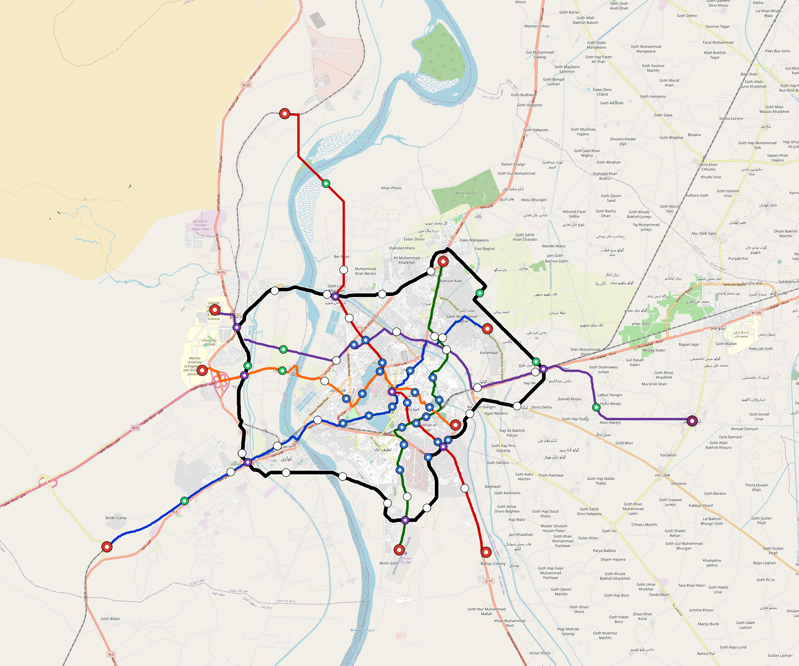

# Hyderabad-Pk — Urban Rail Network

**Country:** PK · **Population:** 1,900,000 · [National brief](../NATIONAL-BRIEF.md)

This page contains only Hyderabad-Pk-specific results. Shared routing, service, energy, civil, cost, finance, QA and validation methods are defined once in the [deployment planning reference](../../../../docs/deployment-planning-reference.md).

> [!IMPORTANT]
> **Foreign-capital advantage:** against the default equivalent foreign-turnkey sensitivity, this local plan avoids **$2.52 bn (87.3%) of external capital** and **$3.16 bn of external interest**. Capital plus saved interest totals **$5.68 bn**. See the common reference for interpretation and limitations.

Auto-planned by the OpenSourceRail design pipeline from the controlled city catalogue, source-locked geospatial inputs and shared templates.

## Network



| Local measure | Value |
|---|---:|
| Lines / unique stations / interchanges | 6 / 58 / 13 |
| Route length | 180.0 km double track |
| Coverage / transfer reachability | 66.3% / 73% |
| Estimated station catchment | 1,259,700 residents |
| Service span / peak headway | 05:30–02:00 / 3 min |
| Fleet | 216 × 4-car `metro-4car` trainsets (193 peak revenue) |
| Peak network throughput | 115,200 passengers/hour |
| Practical service capacity | 982,080 passenger-trips/day |
| Annual paid-trip planning range | 179.2–286.8 M |

### Lines

| Line | Length | Stations | Trainsets | Termini |
|---|---:|---:|---:|---|
| line-1 | 18.5 km | 7 | 30 | E Mid ↔ SW Mid |
| line-2 | 20.8 km | 8 | 35 | W Mid ↔ SE Mid |
| line-3 | 19.5 km | 7 | 31 | S Mid ↔ NE Mid |
| line-4 | 29.4 km | 9 | 46 | SE Mid ↔ N Outer |
| line-5 | 31.6 km | 10 | 50 | W Mid ↔ E Outer |
| line-6 | 60.2 km | 17 | 24 | W Mid ↔ W Mid |
| **Total** | **180.0 km** | **58 unique** | **216** | |

## Energy

| Local measure | Value |
|---|---:|
| Scheduled service | 2,558 one-way journeys / 69,676 train-km/day |
| Annual traction demand | 439.5 GWh |
| Station/depot PV / storage | 21.2 MW / 121.0 MWh |
| Aggregate charging power | 82.5 MW |
| Dedicated solar plant | 206.4 MW |
| Residual grid/PPA import | 0.0 GWh/yr |
| Worst powered-stop gap | line-5: 11.6 km / 125 kWh |
| Lowest traversal charging margin | line-3: 162 kWh |

## Capital And Funding

| Local CAPEX bucket | Planning value |
|---|---:|
| Civil works | $682 M |
| Stations | $384 M |
| Depots | $8.0 M |
| Rolling stock | $242 M |
| Dedicated solar plant | $165 M |
| Residual train control | $9.0 M |
| Charging microgrids | $19 M |
| EPC / project services | $94 M |
| **Total city programme** | **$1.60 bn** |

| Local funding measure | Planning value |
|---|---:|
| Imported / external capital | $366 M (22.8%) |
| Domestic / local capital | $1.24 bn (77.2%) |
| Annual public construction commitment | $215 M / yr for 7 years |
| Annual post-grace debt service | $186 M / yr |
| External capital saved vs default turnkey sensitivity | $2.52 bn |
| Capital + lifetime external interest saved | $5.68 bn |
| Annual OPEX | $36 M / yr |

## Local Evidence

| Package | Current status | Evidence |
|---|---|---|
| Finance | pass | [`summary.json`](engineering/finance/summary.json) |
| Native simulation + degraded cases | pass | [`validation-summary.json`](engineering/simulation/validation-summary.json) |
| SUMO timetable | pass | [`summary.json`](engineering/sumo/summary.json) |
| GIS package | pass | [`summary.json`](engineering/gis/summary.json) |
| Grid/charging/solar | pass | [`summary.json`](engineering/energy/summary.json) |
| Operations, QA and maintenance | 550 assets / 2,400 tasks | [`hyderabad-pk-operations-manifest.json`](operations/hyderabad-pk-operations-manifest.json) |

## Local Files And Regeneration

| File | Local role |
|---|---|
| [`design.toml`](design.toml) | Authoritative generated city design |
| [`hyderabad-pk.toml`](hyderabad-pk.toml) | Expanded simulator scenario |
| [`hyderabad-pk.corridor.geojson`](hyderabad-pk.corridor.geojson) | GIS corridor and stations |
| [`hyderabad-pk.design-quality.yaml`](hyderabad-pk.design-quality.yaml) | Coverage, source and civil-quality gates |

```bash
scripts/regenerate-city.sh hyderabad-pk
```
