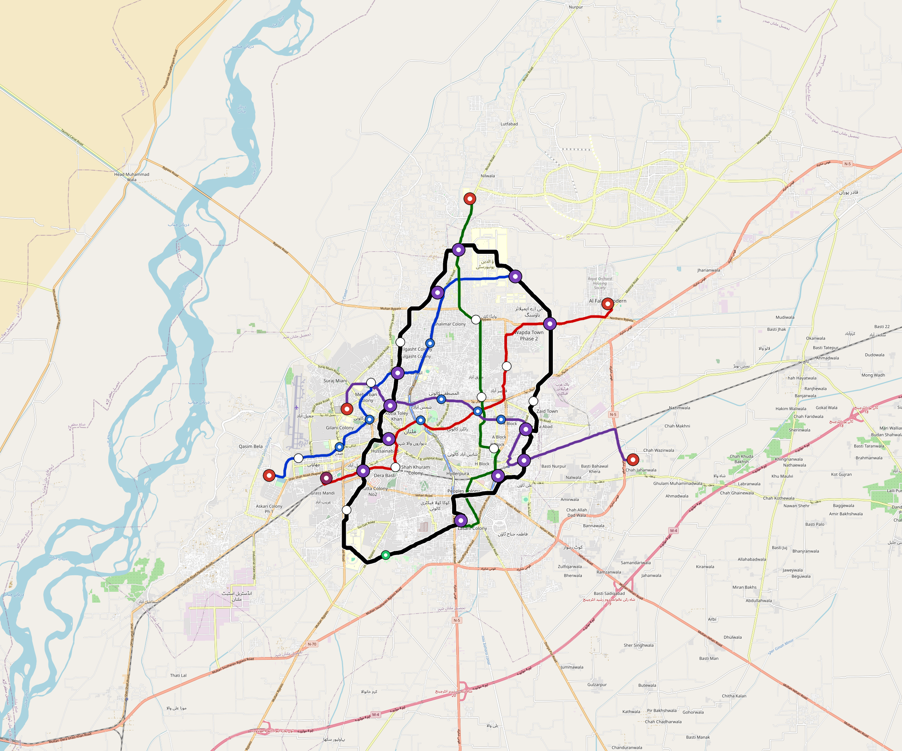

# Multan — Urban Rail Network

**Country:** PK · **Population:** 2,197,000

Auto-planned by the OpenSourceRail design pipeline: [`osr_geo`](../../../../design-py/src/osr_geo/) rasterises Overpass-verified OpenStreetMap features (arterial road graph, buildings, water, protected land, demand-anchor POIs) onto a 20 m cost / demand / buildability grid; [`osr-design`](../../../../crates/osr-design/) (rust) runs a demand-rewarded Dijkstra on that grid to synthesise corridors, places stations against the demand surface, and classifies every segment (at-grade / elevated / bridge — no tunnels per [RFC 0011](../../../../docs/rfcs/0011-civil-infrastructure-design-standard.md)). Population, country, and bbox are read from the canonical city catalog at [`lib/city-batches/world-sample.toml`](../../../../lib/city-batches/world-sample.toml).

## Network map



*Every line visible end-to-end — radials out to the city edge, forced-coverage suburbs, and the ring line if present. Auto-fit zoom based on the network's actual bounding box.*

Corridor polylines + stations as GeoJSON for GIS / alignment tooling: [`multan.corridor.geojson`](multan.corridor.geojson).

## At a glance

| Metric | Value |
|---|---|
| Lines | 4 |
| Unique stations | 63 |
| Interchange stations | 11 |
| Multi-line transfer reachability | 0% (line-pairs sharing ≥ 1 station) |
| Anchor-weighted coverage | 41.8% |
| Route length (double track) | 115.4 km |
| Revenue fleet | 142 × 4-car trainsets |
| Revenue fleet passenger capacity | 68,160 AW2 pax (90,880 AW3 crush) |
| Spare + cold-reserve | 16 × 4-car trainsets |
| Peak headway | 3 min |
| Service hours | 05:30 – 02:00 (20.5 h/day) |

## Lines

*Termini are tagged by compass quadrant + radial band (Inner < 0.33 R, Mid 0.33–0.67 R, Outer > 0.67 R, where R is the network's outermost station-to-centre distance).*

| Line | Length | Stations | Trainsets | Termini |
|---|---|---|---|---|
| line-1 | 30.6 km | 16 | 41 | SW Outer ↔ NE Outer |
| line-2 | 23.2 km | 13 | 32 | SW Mid ↔ N Outer |
| line-3 | 19.5 km | 14 | 28 | E Mid ↔ W Mid |
| line-4 | 42.1 km | 21 | 57 | N Mid ↔ N Mid |
| **Total** | **115.4 km** | **63 unique** | **158** | |

## Rolling stock

| Property | Value |
|---|---|
| Consist | 4-car, 75 m |
| Max speed | 90 km/h |
| Onboard battery | 480 kWh per trainset |
| Seats | 80 longitudinal seats |
| Nominal capacity (AW2) | 480 pax (seated + standing, `metro-4car` per RFC 0008 §1) |
| Crush capacity (AW3) | 640 pax, short-duration structural/egress reference |
| Revenue fleet capacity | 68,160 AW2 pax (90,880 AW3 crush) |
| Total fleet capacity | 75,840 AW2 pax (101,120 AW3 crush, incl. spare + reserve) |

## Ridership capacity

- **Per-train planning capacity:** 480 AW2 passengers (`metro-4car`)
- **Revenue fleet simultaneous capacity:** 142 × 480 = **68,160 AW2 passengers** (90,880 AW3 crush)
- **Total fleet passenger capacity:** 158 × 480 = **75,840 AW2 passengers** (101,120 AW3 crush, incl. spare + reserve)
- **Peak frequency:** 20 trains/hour/direction (3-min headway)
- **Peak capacity per line per direction:** 480 × 20 = **9,600 pphpd**
- **Network peak throughput (all lines, both directions):** 4 lines × 2 directions × 9,600 = **76,800 passengers/hour**
- **Daily theoretical capacity (peak × 10):** ≈ **768,000 passenger-trips/day**
- **Practical daily service capacity** (80% load factor): ≈ **614,400 passenger-trips/day**
- **Planning daily ridership scenario** (25-45% of catchment): ≈ **229,586 – 413,255 trips/day**

## Catchment

- City population: **2,197,000**
- Anchor-weighted coverage: 41.8%
- Catchment population: **≈ 918,346** (within ~800 m walk of a station)

## Energy infrastructure (solar + battery)

On-site trackside + depot PV and battery storage. Per-tier sizing (from [`../../../../lib/templates/energy-sites.toml`](../../../../lib/templates/energy-sites.toml)):

| Tier | Sites | PV each | Battery each |
|---|---|---|---|
| Depot-Main | 1 | 5000 kW | 40000 kWh |
| Interchange | 11 | 500 kW | 3000 kWh |
| Major | 32 | 400 kW | 2500 kWh |
| Standard | 15 | 300 kW | 2000 kWh |
| Terminal | 5 | 500 kW | 3000 kWh |
| **Total installed** | **64** | **30,300 kW** | **198,000 kWh** |

Aggregate station-rail charging power: **35,000 kW**. Trains opportunity-charge during station dwell per RFC 0002; onboard 480 kWh battery covers running.

### Energy Feasibility Check

| Check | Value | Interpretation |
|---|---:|---|
| Trainset line-haul intensity | 16.0 kWh/km | 4 cars × 4 kWh/car-km planning basis |
| Average one-way line energy | 462 kWh | 28.9 km average line length |
| Onboard battery coverage | 1.0× average line run | 480 kWh usable pack |
| Average 60 s dwell charge | 9.3 kWh/stop | 556 kW average charger across stops |
| Stops to refill one trainset pack | 52 stops | Opportunity charging supplements, not replaces, onboard reserve |
| PV daily yield proxy | 152 MWh/day | 5 peak-sun-hour planning proxy before local derates |
| Station/depot stationary storage | 198 MWh | Distributed Na-ion buffer for charging peaks and grid outages |

## CAPEX (planning grade)

All figures come from the `[costs]` block in `design.toml` — emitted by the `osr-design` Rust planner per RFC 0011 §9. The procurement basis is **USD direct-supplier planning pricing**; `*_eur` fields remain in `design.toml` only as compatibility mirrors at 0.92 USD→EUR. **OSR-discipline unit costs**: prefab portal-frame canopies (no bespoke architectural cladding), at-grade depots without overhead bridge cranes, **delivered rolling stock at about $1.4 M per self-contained car** (raw marketplace BOM retained only as an audit floor), commodity Na-ion cells + tier-2 PMSM motors + DIY SiC inverters, **onboard-first train control with only residual wayside** (no trackside fibre backbone, no proprietary CBTC vendor stack, no trackside computer interlockings — the function moves into the trainset, already counted in rolling-stock CAPEX), no overhead catenary, and self-EPC overhead. The rolling-stock line now includes production labour, shop overhead, fixtures/tool amortisation, rail QA and homologation evidence, freight, duty, warranty, initial spares, training, commissioning, and acceptance testing. A separate lean railway production-plant setup line adds $100 k per vehicle/car module, with $200 k retained as the high sensitivity check. `country-costs.toml` applies the per-country labour/material multiplier downstream where a local tender view is needed.

### Civil works

| Bucket | Value |
|---|---|
| At-grade (109.4 km @ $3.0 M/km) | $328 M |
| Elevated (5.5 km @ $12.0 M/km) | $66 M |
| Elevated-interchange premium (5 sites @ $4.50 M) | $22 M |
| **Civil subtotal** | **$417 M** |

### Stations

Prefab portal-frame canopy + factory-bonded PV sandwich panel (RFC 0010 §3, ~9 t / 11-bay light-metro canopy delivered on two lorries, 3–5 day erection). Ground-level platform slab with controlled pedestrian approaches; the rail datum drops through the station bay for level boarding. Overbridges, lifts, and stairs are only for elevated/stacked interchanges or site-specific road barriers.

| Archetype | Count | Unit | Subtotal |
|---|---|---|---|
| `standard` | 15 | $2.50 M | $38 M |
| `major` | 32 | $4.50 M | $144 M |
| `terminal` | 5 | $4.50 M | $22 M |
| `depot-terminal` | 1 | $5.0 M | $5.0 M |
| `interchange-elevated` | 11 | $12.0 M | $132 M |
| **Stations subtotal** | | | **$341 M** |

### Depots

At-grade portal-frame workshop sheds; pit tracks with stinger + portable wheel lathe (no overhead bridge crane); on-site PV array; Na-ion stationary storage; no traction substation.

| Archetype | Count | Unit | Subtotal |
|---|---|---|---|
| `main-heavy` | 1 | $12.0 M | $12 M |
| `layup-minimal` | 5 | $2.0 M | $10 M |
| **Depots subtotal** | | | **$22 M** |

### Rolling stock

Rolling stock is costed at the **delivered production planning unit: $1.4 M per self-contained car**. The raw 3-car light-metro BOM floor remains 592,840 USD direct material plus 35 % assembly allowance = 800,334 USD per consist, but city CAPEX now adds production labour, shop overhead, fixtures/tool amortisation, rail QA and homologation evidence, freight, duty, warranty, initial spares, training, commissioning, and acceptance testing. Motors, sensors, train-control computers, onboard batteries, roof PV, and charge hardware appear here ONLY — never re-billed elsewhere in the city cost stack.

| Per-car cost bucket | Basis | Cost |
|---|---|---|
| Direct material BOM floor | Welded frame, panels, glazing, doors, bogies, traction, batteries, HVAC, electronics, interiors | $267 k |
| Production labour + shop overhead | Cut/bend/weld, fit-out, harnessing, paint, factory supervision, utilities, rework reserve | $420 k |
| Fixtures, tooling, QA, certification evidence | Jigs/fixtures, dimensional QA, EN 15085/45545 evidence, supplier audits, homologation dossier amortisation | $310 k |
| Logistics, warranty, spares, commissioning | Freight, duty, insurance, initial spares/tools, manuals/training, site testing, acceptance runs | $403 k |
| **Total per car** | Delivered production planning unit | **$1.4 M** |

| Item | Count | Unit | Subtotal |
|---|---|---|---|
| `metro-4car` (revenue + spare + cold reserve) | 158 | $5.60 M | $885 M |

### Railway production plant

Each city carries a lean local railway production-plant setup allowance for tooling, basic fixtures, plant services, and commissioning bay setup. It is costed per vehicle/car module, not per trainset, and stays separate from the delivered rolling-stock procurement line.

| Item | Count | Unit | Subtotal |
|---|---:|---:|---:|
| Vehicle/car modules supported by city fleet | 632 | $100 k | $63 M |
| High sensitivity check | 632 | $200 k | $126 M |

### Systems

| Item | Basis | Subtotal |
|---|---|---|
| Residual signalling / train-control wayside (onboard ATP/ATO + T-OBS carries the function; W-Nodes, balises, LoRa gateways, OCC interfaces remain) | 115.4 km × $0.050 M/km | $5.7 M |
| Station/depot charging microgrids (conductive charger, switchgear, inverter interface, local PV/battery tie-in; no continuous wayside supply) | per-stop allowance by station archetype | $31 M |
| EPC integration + project management (7%) | on subtotal | $124 M |

### Total

| Bucket | Value |
|---|---|
| Civil works | $417 M |
| Stations | $341 M |
| Depots | $22 M |
| Rolling stock | $885 M |
| Railway production plant | $63 M |
| Residual train-control wayside + charging microgrids | $37 M |
| EPC overhead (7%) | $124 M |
| **CAPEX total** | **$1.89 bn** |
| Per-route-km | $16 M / km |
| Per-capita (city pop) | $859 / person |

## Funding & affordability

Planning-grade financing model anchored to country financial parameters from [`lib/templates/country-finance.toml`](../../../../lib/templates/country-finance.toml). Pure function of the [costs] block above + the country code — regenerate by re-running `scripts/regenerate-city.sh multan`.

### Government commitment summary (budgetable)

Bottom line for next year's budget submission. Construction phase runs **years 1–7** (public equity drawdown + interest-only grace on repayable debt; grant disbursements are non-repayable); steady-state operation begins **year 8** and runs for **33 years** until the loans amortise.

| Phase | Annual gov / municipal commitment | Per resident / yr |
|---|---|---|
| Construction (years 1–7) | **$46 M / yr** | $21 |
| Steady-state, low-ridership (year 8+) | **$51 M / yr** | $23 |
| Steady-state, high-ridership (year 8+) | **$22 M / yr** | $10 |
| Steady-state, operating-neutral revenue case | **$39 M / yr** | $18 |
| Lifecycle envelope (yr 1–40, low scenario) | **$2.01 bn cumulative** | $915 |
| Lifecycle envelope (yr 1–40, high scenario) | **$1.04 bn cumulative** | $472 |
| Lifecycle envelope (yr 1–40, operating-neutral after opening) | **$1.62 bn cumulative** | $737 |

_Population basis: 2,197,000 (catchment per `lib/city-batches/world-sample.toml`). After year 40, debt service drops to zero; steady-state commitments below are net of any operating surplus applied to repayable-debt support. The operating-neutral case already covers steady-state OPEX from fares, station shops, and advertising. Low/high residual OPEX shortfall before debt is $12 M / yr → $0 k / yr; surplus applied to debt support is $0 k / yr → $18 M / yr._

### CAPEX funding stack

| Tranche | Share | Principal | Rate | Tenor | Annual debt service (post-grace) |
|---|---|---|---|---|---|
| Climate / development grant (non-repayable) | 40% | $755 M | — | — | — |
| Green concessional loan (World Bank / AfDB / ADB / GCF class) | 50% | $944 M | 2.0% | 40 y, 7 y grace | $39 M / yr |
| Sovereign / project bonds (fallback only) | 0% | $0 k | 16.5% | 40 y, 7 y grace | $0 k / yr |
| Government equity (no debt service) | 10% | $189 M | — | — | — |
| **Total** | **100%** | **$1.89 bn** | | | **$39 M / yr** |

_During the 7-year grace period the public sponsor pays interest only on repayable debt — concessional loan $19 M / yr + fallback bonds $0 k / yr = **$19 M / yr** total. The $755 M grant tranche carries no repayment or coupon. Government equity is drawn across construction ($27 M / yr × 7 yr). Principal repayment begins in year 8 on a 33-year amortisation schedule._

### Annual OPEX (steady state)

| Component | Basis | Annual cost |
|---|---|---|
| Rolling-stock maintenance | 4 % of rolling-stock CAPEX | $35 M |
| Civil + station + depot maintenance | 2 % of fixed-asset CAPEX | $16 M |
| Residual train-control wayside maintenance | 5 % of residual signalling CAPEX | $287 k |
| Traction energy (446.3 GWh / yr) | trackside PV + Na-ion (RFC 0002) — **self-generated, $0 / yr** | $0 k |
| Labour (704 FTE) | ~6 FTE/route-km + 12 admin core × country median × 12 × engineer-premium 1.4 | $2.0 M |
| **OPEX subtotal** | | **$53 M / yr** |

_Annual fleet utilisation: 142 revenue trainsets × 20.5 h/day × 365 d/yr × 35 km/h commercial × 75% revenue factor = 27.9 M train-km / yr (~196 k km / trainset / yr)._

### Ticket pricing anchored to median income

Country median monthly income: **$165 USD** (per [`lib/templates/country-finance.toml`](../../../../lib/templates/country-finance.toml)). The revenue-forward case sets the monthly unlimited pass at **8 % of median monthly income** and pairs it with higher service uptake, more frequent trains, station retail, and advertising. Single-trip fare is set so that 30 single trips equal one monthly pass — a frequent commuter averaging ~50 trips / month still receives an effective ~40 % bulk discount.

| Product | Price target |
|---|---|
| Operating-neutral single-trip fare (8 % pass) | $0.44 |
| Day pass (3 trips) | $1.12 (15 % bulk discount) |
| Monthly unlimited pass | $13.20 (~8 % of median monthly income) |
| Annual pass | $145.20 (11 × monthly = ~1 free month) |

### Revenue & operating neutrality

Planning ridership bracket = 25-45% of catchment × 365 service-days at the operating-neutral fare, capped by practical service capacity (614,400 trips/day). The operating-neutral column solves annual paid trips so **farebox + station-shop leases + advertising = steady-state OPEX**. Gross post-grace repayable-debt service remains visible in the CAPEX funding stack, while any operating surplus is netted from the budgetable government support line.

| | Low scenario | High scenario | Operating-neutral target |
|---|---|---|---|
| Daily paid trips | 229,586 | 413,255 | 303,281 |
| Daily paid trips / catchment | 25% | 45% | 33% |
| Daily paid trips / city population | 10% | 19% | 14% |
| Annual paid trips | 83.8 M | 150.8 M | 110.7 M |
| Farebox revenue | $37 M / yr | $66 M / yr | $49 M / yr |
| Station shop leases | $1.8 M / yr | $1.8 M / yr | $1.8 M / yr |
| Advertising boards | $2.7 M / yr | $2.7 M / yr | $2.7 M / yr |
| **Total revenue** | **$41 M / yr** | **$71 M / yr** | **$53 M / yr** |
| Revenue / OPEX recovery | 78% | 133% | 100% |
| Country farebox-only policy target (diagnostic) | 45% | 45% | 45% |
| Gross repayable-debt service + residual OPEX subsidy | $51 M / yr | $39 M / yr | **$39 M / yr** |
| Operating surplus applied to debt support | $0 k / yr | -$18 M / yr | **$0 k / yr** |
| **Net gov repayable-debt support + residual OPEX subsidy** | $51 M / yr | $22 M / yr | **$39 M / yr** |
| Operating surplus after OPEX (before debt support) | $0 k / yr | $18 M / yr | $0 / yr |

_Commercial-revenue assumptions: 12,784 m² of station shop/kiosk leases at $13/m²/month and 2,324 advertising boards at $115/board/month, with occupancy derates applied._

**Caveats:** The grant-first funding stack, the 8 % operating-neutral fare target, the 25-45% daily-pax bracket, and the station-commercial assumptions are project-level defaults. Real deployments will negotiate the capital split with financing institutions and tune fares, retail mix, advertising inventory, and service frequency iteratively from boarding data. Treat the numbers above as a first-iteration sanity check, not as a bid-ready financial close.

## Files

| File | Role |
|---|---|
| [`design.toml`](design.toml) | Authoritative design |
| [`multan.toml`](multan.toml) | Expanded simulation scenario (input to `osr-sim`) |
| [`multan-network-map.png`](multan-network-map.png) | Auto-fit network map (rendered by `osr_scenario.render_map`) |
| [`multan.corridor.geojson`](multan.corridor.geojson) | Line polylines + stations (GeoJSON) |
| [`multan.stations.json`](multan.stations.json) | Machine-readable station list |
| [`multan.design-quality.yaml`](multan.design-quality.yaml) | Coverage / anchor-hit / civil-mix metrics + auto-gate result |

## Reproducibility

```bash
# 1. raster bundle from OpenStreetMap (cached by query hash)
python -m osr_geo.cli --slug multan

# 2. design.toml + corridor.geojson + design-quality.yaml
#    (population + country pulled from lib/city-batches/world-sample.toml)
cargo run --release --bin osr-design -- --slug multan \
    --sidecar .cache/osr-pipeline/rasters/multan.grid.json \
    --out-dir designs/.../Multan

# 3. scenario.toml + map PNGs + this README
python -m osr_scenario --design designs/.../design.toml
python -m osr_scenario.render_map --design designs/.../design.toml
python -m osr_scenario.network_readme \
    --design designs/.../design.toml \
    --scenario designs/.../multan.toml \
    --out designs/.../README.md
```

`scripts/regenerate-multan.sh` chains steps 3 + drift tests into a single command.
