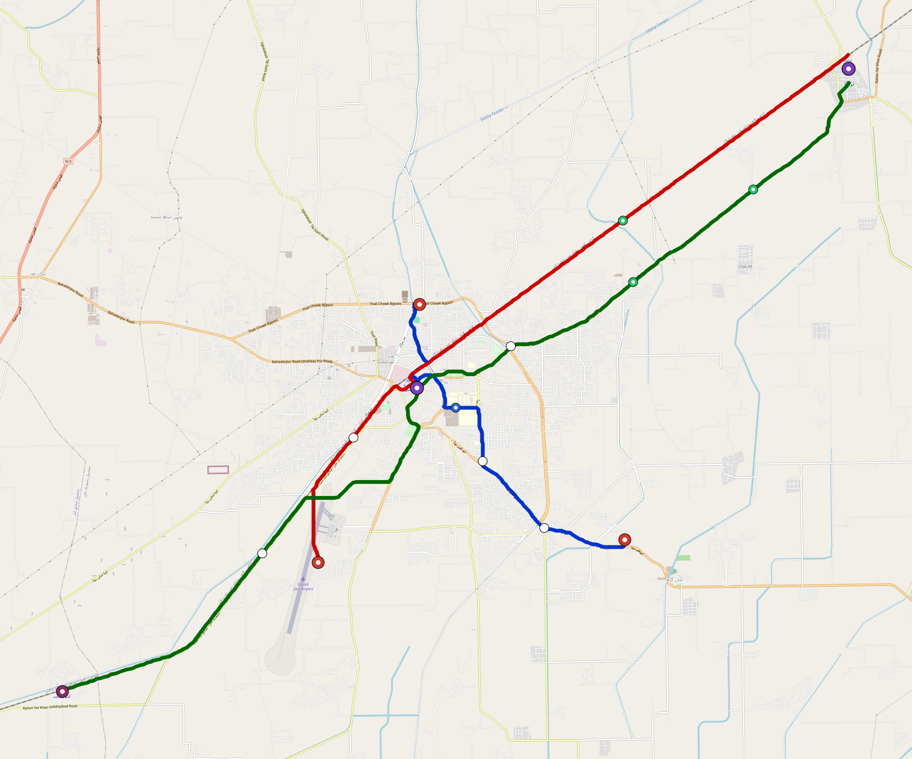

# Rahim-Yar-Khan — Urban Rail Network

**Country:** PK · **Population:** 500,000

Auto-planned by the OpenSourceRail design pipeline: [`osr_geo`](../../../../design-py/src/osr_geo/) rasterises Overpass-verified OpenStreetMap features (arterial road graph, buildings, water, protected land, demand-anchor POIs) onto a 20 m cost / demand / buildability grid; [`osr-design`](../../../../crates/osr-design/) (rust) runs a demand-rewarded Dijkstra on that grid to synthesise corridors, places stations against the demand surface, and classifies every segment (at-grade / elevated / bridge — no tunnels per [RFC 0011](../../../../docs/rfcs/0011-civil-infrastructure-design-standard.md)). Population, country, and bbox are read from the canonical city catalog at [`lib/city-batches/world-sample.toml`](../../../../lib/city-batches/world-sample.toml).

## Network map



*Every line visible end-to-end — radials out to the city edge, forced-coverage suburbs, and the ring line if present. Auto-fit zoom based on the network's actual bounding box.*

Corridor polylines + stations as GeoJSON for GIS / alignment tooling: [`rahim-yar-khan.corridor.geojson`](rahim-yar-khan.corridor.geojson).

## At a glance

| Metric | Value |
|---|---|
| Lines | 3 |
| Unique stations | 24 |
| Interchange stations | 2 |
| Multi-line transfer reachability | 0% (line-pairs sharing ≥ 1 station) |
| Anchor-weighted coverage | 36.7% |
| Route length (double track) | 46.0 km |
| Revenue fleet | 69 × 3-car trainsets |
| Revenue fleet passenger capacity | 24,840 AW2 pax (33,120 AW3 crush) |
| Spare + cold-reserve | 8 × 3-car trainsets |
| Peak headway | 3 min |
| Service hours | 05:30 – 02:00 (20.5 h/day) |

## Lines

*Termini are tagged by compass quadrant + radial band (Inner < 0.33 R, Mid 0.33–0.67 R, Outer > 0.67 R, where R is the network's outermost station-to-centre distance).*

| Line | Length | Stations | Trainsets | Termini |
|---|---|---|---|---|
| line-1 | 19.6 km | 9 | 32 | NE Outer ↔ SW Outer |
| line-2 |  9.7 km | 7 | 17 | W Mid ↔ S Mid |
| line-3 | 16.7 km | 8 | 28 | NE Outer ↔ S Mid |
| **Total** | **46.0 km** | **24 unique** | **77** | |

## Rolling stock

| Property | Value |
|---|---|
| Consist | 3-car, 51 m |
| Max speed | 90 km/h |
| Onboard battery | 360 kWh per trainset |
| Seats | 60 longitudinal seats |
| Nominal capacity (AW2) | 360 pax (seated + standing, `light-metro-3car` per RFC 0008 §1) |
| Crush capacity (AW3) | 480 pax, short-duration structural/egress reference |
| Revenue fleet capacity | 24,840 AW2 pax (33,120 AW3 crush) |
| Total fleet capacity | 27,720 AW2 pax (36,960 AW3 crush, incl. spare + reserve) |

## Ridership capacity

- **Per-train planning capacity:** 360 AW2 passengers (`light-metro-3car`)
- **Revenue fleet simultaneous capacity:** 69 × 360 = **24,840 AW2 passengers** (33,120 AW3 crush)
- **Total fleet passenger capacity:** 77 × 360 = **27,720 AW2 passengers** (36,960 AW3 crush, incl. spare + reserve)
- **Peak frequency:** 20 trains/hour/direction (3-min headway)
- **Peak capacity per line per direction:** 360 × 20 = **7,200 pphpd**
- **Network peak throughput (all lines, both directions):** 3 lines × 2 directions × 7,200 = **43,200 passengers/hour**
- **Daily theoretical capacity (peak × 10):** ≈ **432,000 passenger-trips/day**
- **Practical daily service capacity** (80% load factor): ≈ **345,600 passenger-trips/day**
- **Planning annual paid-trip scenario** (capacity-led): ≈ **63.1 – 100.9 M paid trips/year** at 50%–80% practical capacity utilisation

## Catchment

- City population: **500,000**
- Anchor-weighted coverage: 36.7%
- Catchment population: **≈ 183,500** (within ~800 m walk of a station)

## Energy infrastructure (solar + battery)

On-site trackside + depot PV and battery storage. Per-tier sizing (from [`../../../../lib/templates/energy-sites.toml`](../../../../lib/templates/energy-sites.toml)):

| Tier | Sites | PV each | Battery each |
|---|---|---|---|
| Depot-Main | 1 | 5000 kW | 40000 kWh |
| Interchange | 2 | 500 kW | 3000 kWh |
| Major | 5 | 400 kW | 2500 kWh |
| Standard | 9 | 300 kW | 2000 kWh |
| Terminal | 5 | 500 kW | 3000 kWh |
| **Total installed** | **22** | **13,200 kW** | **91,500 kWh** |

Aggregate station-rail charging power: **14,500 kW**. Trains opportunity-charge during station dwell per RFC 0002; onboard 360 kWh battery covers running.

Dedicated utility-scale solar plant / contracted offsite PPA asset: **54.0 MW** sized to cover the generated timetable traction-energy gap after station/depot PV, including a 115% planning coverage margin. This is carried as infrastructure CAPEX below.

### Energy Feasibility Check

| Check | Value | Interpretation |
|---|---:|---|
| Trainset line-haul intensity | 12.0 kWh/km | 3 cars × 4.0 kWh/car-km planning basis |
| Average one-way line energy | 184 kWh | 15.3 km average line length |
| Onboard battery coverage | 2.0× average line run | 360 kWh usable pack |
| Average 60 s dwell charge | 10.1 kWh/stop | 604 kW average charger across stops |
| Stops to refill one trainset pack | 36 stops | Opportunity charging supplements, not replaces, onboard reserve |
| PV daily yield proxy | 66 MWh/day | 5.0 peak-sun-hour planning proxy before local derates |
| Scheduled traction demand | 301 MWh/day | 23,211 scheduled train-km/day × 108% depot/deadhead factor |
| On-site PV shortfall before solar plant | 235 MWh/day | Gap used to size the dedicated plant / offsite solar PPA asset |
| Dedicated solar plant | 54.0 MW / 270 MWh/day | Utility PV + interconnection with 115% planning coverage margin |
| Residual grid/PPA top-up need | 0 MWh/day | Backup import after on-site PV plus the dedicated solar plant |
| Station/depot stationary storage | 92 MWh | Distributed Na-ion buffer for charging peaks and grid outages |

## CAPEX (planning grade)

All figures come from the `[costs]` block in `design.toml` — emitted by the `osr-design` Rust planner per RFC 0011 §9. The procurement basis is **USD direct-supplier planning pricing**; `*_eur` fields remain in `design.toml` only as compatibility mirrors at 0.92 USD→EUR. **OSR-discipline unit costs**: prefab portal-frame canopies (no bespoke architectural cladding), at-grade depots without overhead bridge cranes, **delivered rolling stock at about $1.4 M per self-contained car** (raw marketplace BOM retained only as an audit floor), commodity Na-ion cells + tier-2 PMSM motors + DIY SiC inverters, **onboard-first train control with only residual wayside** (no trackside fibre backbone, no proprietary CBTC vendor stack, no trackside computer interlockings — the function moves into the trainset, already counted in rolling-stock CAPEX), no overhead catenary, a dedicated solar plant when the generated timetable exceeds station/depot PV, and self-EPC overhead. The rolling-stock line now includes production labour, shop overhead, fixtures/tool amortisation, rail QA and homologation evidence, freight, duty, warranty, initial spares, training, commissioning, and acceptance testing. A separate lean railway production-plant setup line adds $100 k per vehicle/car module, with $200 k retained as the high sensitivity check. `country-costs.toml` applies the per-country labour/material multiplier downstream where a local tender view is needed.

### Civil works

| Bucket | Value |
|---|---|
| At-grade (45.1 km @ $3.0 M/km) | $135 M |
| Elevated (0.8 km @ $12.0 M/km) | $9.6 M |
| **Civil subtotal** | **$145 M** |

### Stations

Prefab portal-frame canopy + factory-bonded PV sandwich panel (RFC 0010 §3, ~9 t / 11-bay light-metro canopy delivered on two lorries, 3–5 day erection). Ground-level platform slab with controlled pedestrian approaches; the rail datum drops through the station bay for level boarding. Overbridges, lifts, and stairs are only for elevated/stacked interchanges or site-specific road barriers.

| Archetype | Count | Unit | Subtotal |
|---|---|---|---|
| `halt` | 2 | $600 k | $1.2 M |
| `standard` | 9 | $2.50 M | $22 M |
| `major` | 5 | $4.50 M | $22 M |
| `terminal` | 5 | $4.50 M | $22 M |
| `depot-terminal` | 1 | $5.0 M | $5.0 M |
| `interchange` | 2 | $8.0 M | $16 M |
| **Stations subtotal** | | | **$90 M** |

### Depots

At-grade portal-frame workshop sheds; pit tracks with stinger + portable wheel lathe (no overhead bridge crane); on-site PV array; Na-ion stationary storage; no traction substation.

| Archetype | Count | Unit | Subtotal |
|---|---|---|---|
| `main-heavy` | 1 | $12.0 M | $12 M |
| `layup-minimal` | 5 | $2.0 M | $10 M |
| **Depots subtotal** | | | **$22 M** |

### Rolling stock

Rolling stock is costed at the **delivered production planning unit: $1.4 M per self-contained car**. The raw 3-car light-metro BOM floor remains 592,840 USD direct material plus 35 % assembly allowance = 800,334 USD per consist, but city CAPEX now adds production labour, shop overhead, fixtures/tool amortisation, rail QA and homologation evidence, freight, duty, warranty, initial spares, training, commissioning, and acceptance testing. Motors, sensors, train-control computers, onboard batteries, roof PV, and charge hardware appear here ONLY — never re-billed elsewhere in the city cost stack.

| Per-car cost bucket | Basis | Cost |
|---|---|---|
| Direct material BOM floor | Welded frame, panels, glazing, doors, bogies, traction, batteries, HVAC, electronics, interiors | $267 k |
| Production labour + shop overhead | Cut/bend/weld, fit-out, harnessing, paint, factory supervision, utilities, rework reserve | $420 k |
| Fixtures, tooling, QA, certification evidence | Jigs/fixtures, dimensional QA, EN 15085/45545 evidence, supplier audits, homologation dossier amortisation | $310 k |
| Logistics, warranty, spares, commissioning | Freight, duty, insurance, initial spares/tools, manuals/training, site testing, acceptance runs | $403 k |
| **Total per car** | Delivered production planning unit | **$1.4 M** |

| Item | Count | Unit | Subtotal |
|---|---|---|---|
| `light-metro-3car` (revenue + spare + cold reserve) | 77 | $4.20 M | $323 M |

### Railway production plant

Each city carries a lean local railway production-plant setup allowance for tooling, basic fixtures, plant services, and commissioning bay setup. It is costed per vehicle/car module, not per trainset, and stays separate from the delivered rolling-stock procurement line.

| Item | Count | Unit | Subtotal |
|---|---:|---:|---:|
| Vehicle/car modules supported by city fleet | 231 | $100 k | $23 M |
| High sensitivity check | 231 | $200 k | $46 M |

### Dedicated solar power plant

Station/depot PV is counted in the charging microgrid and depot asset lines. When the generated timetable still has a traction-energy shortfall, the README adds a separate utility-scale solar plant or contracted offsite PPA asset sized from that gap.

| Item | Basis | Value |
|---|---|---:|
| Utility-scale PV field | 54,007 kW @ $700/kW | $38 M |
| Grid interconnection / PPA tie-in | 54,007 kW @ $100/kW | $5.4 M |
| Annual generation proxy | 54.0 MW × 5.0 peak-sun-h/day × 365 d/yr | 98.6 GWh/yr |
| **Dedicated solar plant subtotal** | | **$43 M** |

### Systems

| Item | Basis | Subtotal |
|---|---|---|
| Residual signalling / train-control wayside (onboard ATP/ATO + T-OBS carries the function; W-Nodes, balises, LoRa gateways, OCC interfaces remain) | 46.0 km × $0.050 M/km | $2.3 M |
| Station/depot charging microgrids (conductive charger, switchgear, inverter interface, local PV/battery tie-in; no continuous wayside supply) | per-stop allowance by station archetype | $9.6 M |
| EPC integration + project management (7%) | on subtotal | $43 M |

### Total

| Bucket | Value |
|---|---|
| Civil works | $145 M |
| Stations | $90 M |
| Depots | $22 M |
| Rolling stock | $323 M |
| Railway production plant | $23 M |
| Dedicated solar power plant | $43 M |
| Residual train-control wayside + charging microgrids | $12 M |
| EPC overhead (7%) | $43 M |
| **CAPEX total** | **$701 M** |
| Per-route-km | $15 M / km |
| Per-capita (city pop) | $1,402 / person |

## Funding & affordability

Planning-grade financing model anchored to country financial parameters from [`lib/templates/country-finance.toml`](../../../../lib/templates/country-finance.toml). Pure function of the [costs] block above + the country code — regenerate by re-running `scripts/regenerate-city.sh rahim-yar-khan`.

### Government commitment summary (budgetable)

Bottom line for next year's budget submission. Construction phase runs **years 1–7** (public equity drawdown + interest-only grace on repayable debt; no climate-development grant assumed); steady-state operation begins **year 8** and runs for **33 years** until the loans amortise.

| Phase | Annual gov / municipal commitment | Per resident / yr |
|---|---|---|
| Construction (years 1–7) | **$31 M / yr** | $63 |
| Steady-state, low capacity-use (year 8+) | **$14 M / yr** | $28 |
| Steady-state, high capacity-use (year 8+) | **$0 k / yr** | $0 |
| Steady-state, operating-neutral revenue case | **$23 M / yr** | $47 |
| Lifecycle envelope (yr 1–40, low scenario) | **$685 M cumulative** | $1,370 |
| Lifecycle envelope (yr 1–40, high scenario) | **$219 M cumulative** | $438 |
| Lifecycle envelope (yr 1–40, operating-neutral after opening) | **$990 M cumulative** | $1,981 |

_Population basis: 500,000 (city population per `lib/city-batches/world-sample.toml`). After year 40, debt service drops to zero; steady-state commitments below are net of any operating surplus applied to repayable-debt support. The operating-neutral case already covers steady-state OPEX from fares, station shops, and advertising. Low/high residual OPEX shortfall before debt is $0 k / yr → $0 k / yr; surplus applied to debt support is $9.3 M / yr → $23 M / yr._

### CAPEX funding stack

| Tranche | Share | Principal | Rate | Tenor | Annual debt service (post-grace) |
|---|---|---|---|---|---|
| Green concessional loan | 80% | $561 M | 2.0% | 40 y, 7 y grace | $23 M / yr |
| Government equity (no debt service) | 20% | $140 M | — | — | — |
| **Total** | **100%** | **$701 M** | | | **$23 M / yr** |

_During the 7-year grace period the public sponsor pays interest only on repayable debt — green concessional loan $11 M / yr = **$11 M / yr** total. The base case assumes no climate-development grant. Government equity is drawn across construction ($20 M / yr × 7 yr). Principal repayment begins in year 8 on a 33-year amortisation schedule._

### Annual OPEX (steady state)

| Component | Basis | Annual cost |
|---|---|---|
| Rolling-stock maintenance | 4 % of rolling-stock CAPEX | $13 M |
| Civil + station + depot maintenance | 2 % of fixed-asset CAPEX | $5.1 M |
| Residual train-control wayside maintenance | 5 % of residual signalling CAPEX | $115 k |
| Traction energy (109.8 GWh / yr) | 23,211 scheduled train-km/day × 365 d/yr × 108% depot/deadhead factor; 3 cars × 4.0 kWh/car-km; on-site PV 24.1 GWh/yr + dedicated solar plant 54.0 MW / 98.6 GWh/yr (100% coverage); residual grid/PPA top-up 0.0 GWh/yr @ $0.10/kWh; solar plant O&M 1.5%/yr | $648 k |
| Labour (338 FTE) | driverless roster: OCC/remote 57, station/platform 84, passenger service 44, fleet maintenance 54, infrastructure/energy 63, admin/training 36; no train drivers × country median × 12 × engineer-premium 1.4 | $937 k |
| **OPEX subtotal** | | **$20 M / yr** |

_Annual service work: 23,211 scheduled train-km/day × 365 d/yr × 108% depot/deadhead factor = 9.1 M train-km / yr (27.4 M car-km / yr). On-site PV covers 24.1 GWh/yr and the dedicated solar plant adds 98.6 GWh/yr against 109.8 GWh/yr traction demand before residual grid/PPA top-up (0.0 GWh/yr). Driverless labour follows RFC 0015: train drivers are not counted, but OCC remote-assist, platform presence, passenger service, and fleet/energy maintenance scale with the larger service._

### Ticket pricing anchored to median income

Country median monthly income: **$165 USD** (per [`lib/templates/country-finance.toml`](../../../../lib/templates/country-finance.toml)). The revenue-forward case sets the monthly unlimited pass at **8 % of median monthly income** and pairs it with higher service uptake, more frequent trains, station retail, and advertising. Single-trip fare is set so that 30 single trips equal one monthly pass — a frequent commuter averaging ~50 trips / month still receives an effective ~40 % bulk discount.

| Product | Price target |
|---|---|
| Operating-neutral single-trip fare (8 % pass) | $0.44 |
| Day pass (3 trips) | $1.12 (15 % bulk discount) |
| Monthly unlimited pass | $13.20 (~8 % of median monthly income) |
| Annual pass | $145.20 (11 × monthly = ~1 free month) |

### Revenue & operating neutrality

Planning revenue is capacity-led: annual paid trips are calculated from practical daily service capacity (345,600 trips/day) × 365 service-days × capacity utilisation. The low/high bracket uses 50%–80% of that practical capacity. The operating-neutral column solves the capacity utilisation needed so **farebox + station-shop leases + advertising = steady-state OPEX**. Gross post-grace repayable-debt service remains visible in the CAPEX funding stack, while any operating surplus is netted from the budgetable government support line.

| | Low scenario | High scenario | Operating-neutral target |
|---|---|---|---|
| Practical service capacity used | 50% | 80% | 33% |
| Annual paid trips | 63.1 M | 100.9 M | 42.0 M |
| Annual paid trips / city resident | 126 | 202 | 84 |
| Farebox revenue | $28 M / yr | $44 M / yr | $18 M / yr |
| Station shop leases | $476 k / yr | $476 k / yr | $476 k / yr |
| Advertising boards | $792 k / yr | $792 k / yr | $792 k / yr |
| **Total revenue** | **$29 M / yr** | **$46 M / yr** | **$20 M / yr** |
| Revenue / OPEX recovery | 147% | 231% | 100% |
| Country farebox-only policy target (diagnostic) | 45% | 45% | 45% |
| Gross repayable-debt service + residual OPEX subsidy | $23 M / yr | $23 M / yr | **$23 M / yr** |
| Operating surplus applied to debt support | -$9.3 M / yr | -$23 M / yr | **$0 k / yr** |
| **Net gov repayable-debt support + residual OPEX subsidy** | $14 M / yr | $0 k / yr | **$23 M / yr** |
| Operating surplus after OPEX (before debt support) | $9.3 M / yr | $26 M / yr | $0 / yr |

_Commercial-revenue assumptions: 3,416 m² of station shop/kiosk leases at $13/m²/month and 672 advertising boards at $115/board/month, with occupancy derates applied._

**Caveats:** The grant-free funding stack, the 8 % operating-neutral fare target, the 50%–80% capacity-utilisation bracket, and the station-commercial assumptions are project-level defaults. Real deployments will negotiate the capital split with financing institutions and tune fares, retail mix, advertising inventory, and service frequency iteratively from boarding data. Treat the numbers above as a first-iteration sanity check, not as a bid-ready financial close.

## Broad economic benefits (planning proxy)

This is a broad-benefit screen, not a bankable benefit-cost analysis. The rows quantify useful channels for discussion — travel time, road externalities, access to essential services, station-area activity, and local CAPEX recirculation — but some channels overlap and should not be treated as audited fiscal revenue. Assumptions are loaded from [`lib/templates/economic-benefits.toml`](../../../../lib/templates/economic-benefits.toml).

### Annual benefit / activity proxy

| Channel | Low scenario | High scenario | Basis |
|---|---:|---:|---|
| Travel time + reliability dividend | $8.0 M / yr | $13 M / yr | 16 min/trip × $0.48/h value-of-time proxy |
| Avoided road congestion | $10 M / yr | $17 M / yr | 131 M - 209 M vehicle-km/yr avoided × $0.08/vehicle-km |
| Avoided CO2e | $1.9 M / yr | $3.0 M / yr | 23.5–37.6 ktCO2e/yr after rail residual-grid emissions × $80/t |
| Local air / noise / safety externalities | $5.2 M / yr | $8.4 M / yr | avoided road vehicle-km × $0.04/vehicle-km |
| Station-area commerce turnover supported | $21 M / yr | $33 M / yr | 22% of paid trips × $1.50 local spend proxy |
| Entertainment / community activity supported | $10 M / yr | $16 M / yr | 11% of paid trips × $1.50 local spend proxy |
| **Annual quantified benefit / activity proxy** | **$56 M / yr** | **$90 M / yr** | sum of rows above; use as a screening envelope, not audited revenue |

### Access to education, healthcare, commerce, and entertainment

| Access channel | Anchored stations / signal | Low scenario | High scenario |
|---|---:|---:|---:|
| Education | 1 education anchors | 9,245 trips/school day; 2.0 M access-events/yr | 14,792 trips/school day; 3.3 M access-events/yr |
| Healthcare | 2 healthcare anchors | 13,997 trips/day; 5.1 M access-events/yr | 22,395 trips/day; 8.2 M access-events/yr |
| Commerce | 13 major/terminal/interchange nodes | 37,476 trips/trading day; 12.4 M access-events/yr | 59,962 trips/trading day; 19.8 M access-events/yr |
| Entertainment / community | 20.5 h/day service span | 18,317 trips/activity day; 5.5 M access-events/yr | 29,307 trips/activity day; 8.8 M access-events/yr |

### Local recirculation of initial CAPEX

| Channel | Value | Basis |
|---|---:|---|
| CAPEX retained in local procurement / payroll | $365 M | 52% of $701 M CAPEX using bucket local-content shares |
| Construction-phase local economic activity | $585 M | retained CAPEX × 1.6 local supplier / wage multiplier |
| Annualised during construction | $84 M / yr | spread across 7 construction / grace years |
| Construction employment supported | 46,139 job-years | retained CAPEX ÷ (4.0 × median annual income) |
| Annual paid-trip capacity used in revenue model | 63.1 M - 100.9 M trips/yr | 50%-80% of practical service capacity |

_Interpretation: the strongest fiscal result remains the farebox + commercial revenue table above. The broader rows here capture welfare, access, avoided external costs, and local supplier circulation that usually matter to a finance ministry, city authority, or development bank even when they do not appear as railway revenue._

## Files

| File | Role |
|---|---|
| [`design.toml`](design.toml) | Authoritative design |
| [`rahim-yar-khan.toml`](rahim-yar-khan.toml) | Expanded simulation scenario (input to `osr-sim`) |
| [`rahim-yar-khan-network-map.png`](rahim-yar-khan-network-map.png) | Auto-fit network map (rendered by `osr_scenario.render_map`) |
| [`rahim-yar-khan.corridor.geojson`](rahim-yar-khan.corridor.geojson) | Line polylines + stations (GeoJSON) |
| [`rahim-yar-khan.stations.json`](rahim-yar-khan.stations.json) | Machine-readable station list |
| [`rahim-yar-khan.design-quality.yaml`](rahim-yar-khan.design-quality.yaml) | Coverage / anchor-hit / civil-mix metrics + auto-gate result |

## Reproducibility

```bash
# 1. raster bundle from OpenStreetMap (cached by query hash)
python -m osr_geo.cli --slug rahim-yar-khan

# 2. design.toml + corridor.geojson + design-quality.yaml
#    (population + country pulled from lib/city-batches/world-sample.toml)
cargo run --release --bin osr-design -- --slug rahim-yar-khan \
    --sidecar .cache/osr-pipeline/rasters/rahim-yar-khan.grid.json \
    --out-dir designs/.../Rahim-Yar-Khan

# 3. scenario.toml + map PNGs + this README
python -m osr_scenario --design designs/.../design.toml
python -m osr_scenario.render_map --design designs/.../design.toml
python -m osr_scenario.network_readme \
    --design designs/.../design.toml \
    --scenario designs/.../rahim-yar-khan.toml \
    --out designs/.../README.md
```

`scripts/regenerate-rahim-yar-khan.sh` chains steps 3 + drift tests into a single command.
